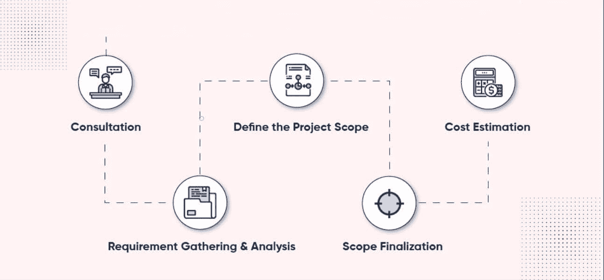
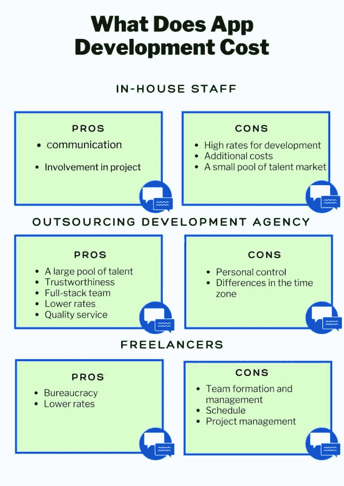
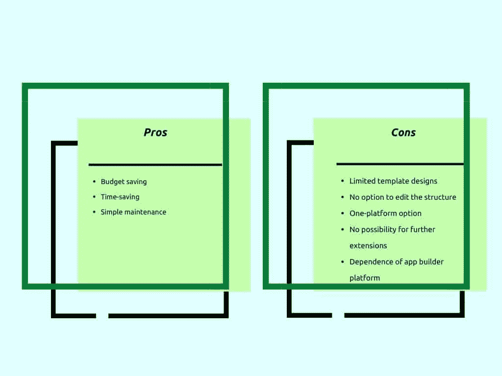
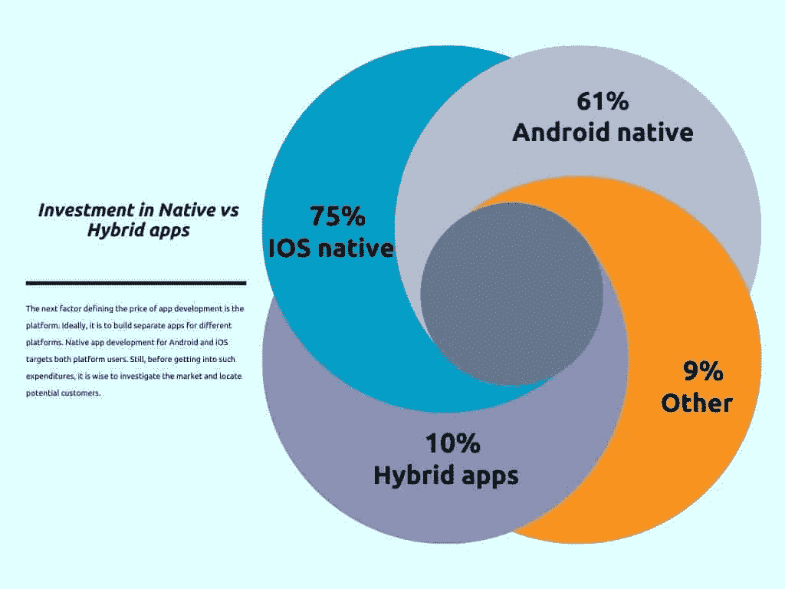

# 2021 年做一个 App 要多少钱

> 原文：<https://simpleprogrammer.com/app-development-pricing-2021/>

你能想象没有智能手机的生活吗？我们不知道这是好事还是坏事，但我们的生活取决于那个小玩意。我们可以用智能手机支付账单，举行会议，看望远在千里之外的朋友和家人。

无论好坏，我们都依赖于移动应用。随着每一次更新，这些应用程序变得更加功能化，没有给物质世界留下空间。从一个普通用户的角度来看，移动应用很棒，故事到此结束。用户并不是真的关心一个 app 是怎么创建的，是不是一个很长的过程，或者构建一个 app 要花多少钱。

然而，事实是成千上万的方面和细节决定了应用程序的定价。如果你的商业计划包括开发一个移动应用程序，制定一个开发预算是很重要的。在这篇文章中，我将与你分享你需要知道的所有细节，这样你就可以很容易地看到在 2021 年开发一个应用程序要花多少钱。这将帮助你实现利润最大化，避免任何不愉快的意外。

## 定义应用成本计算器

app 开发价格查询是开发机构和自由职业者最常问的问题之一。计算应用程序成本的简单公式是

**项目复杂性 x 小时费率=应用开发成本。**

尽管如此，客户要求获得开发的固定价格。首先，应该清楚的是，应用程序的每一个功能都会改变价格。定义价格的对话应该从“你想要什么？”这样的问题开始以及“你的最高预算是多少？”。

计算 app 开发成本的过程要经历几个阶段；

app 成本估算从咨询开始。与客户的密切沟通将有助于定义期望。下一步，开发团队收集和分析需求，并为 UI/UX 设计定义规范。有了更具体的需求，才有可能明确项目范围，最终得到更精准的 app 开发成本。

每个阶段都很复杂，包括数小时的研究、项目规划和分析。测试和部署在应用程序开发之后:这是该过程的两个主要步骤，可确保顺利运行。在最后阶段，该应用程序将获得持续的支持和更新，以满足最终用户的要求。

离成本估算越来越近了，是时候指定定义应用成本的七大因素了:

*   应用开发团队
*   特征
*   平台数量
*   设计的复杂性
*   后端开发
*   第三方集成
*   发布后费用

## 选择您的应用开发团队

App 开发不是一天的过程；它需要专业精神和贡献。结果和成本很大程度上取决于你雇用的开发团队。这里你也有选择。

内部团队。雇佣内部员工是有优势的，尤其是如果你有足够的资源来获得一个全职的开发团队。这也意味着基础设施的成本不会影响应用程序的质量。

**外包开发机构。**外包一家全员开发的公司已经成为获得良好性价比的最有效选择。作为客户，你需要与开发团队分享你的需求，并等待结果。

**自由职业者。**雇佣自由职业者来构建移动应用是另一个可以考虑的选择，有利也有弊。例如，尽管雇佣自由职业者很划算，但也需要客户的贡献:招聘和管理团队，监督工作，[提高生产力](https://simpleprogrammer.com/improve-remote-software-engineers-productivity/)等。

**DIY 手机 app 开发。**如果以上都不是你的选择，还有一条路可以走。你可以投资学习[软件开发](https://simpleprogrammer.com/reasons-to-become-a-software-developer-2021/)，自己开发手机应用。这并不意味着你必须花费数年时间来学习技能。数百个应用程序构建平台有助于通过简单的步骤构建一个无需编码的移动应用程序。当然，这种选择也有其优点…

*   节省预算
*   节省时间
*   简单的维护

…和缺点

*   有限的模板设计
*   没有编辑结构的选项
*   一个平台选项
*   没有进一步延期的可能性
*   对 app builder 平台的依赖

## 选择应用程序的平台

定义应用程序开发价格的下一个因素是平台。理想的情况是为不同的平台构建单独的应用程序。Android 和 iOS 的原生应用开发面向这两个平台的用户。尽管如此，在投入这些开支之前，调查市场和定位潜在客户是明智的。

据 [Statista](https://www.statista.com/statistics/272307/market-share-forecast-for-smartphone-operating-systems/) 统计，Android OS 在全球占有 87%的份额，而 iOS 占有 13%的份额。 [Statista](https://www.statista.com/statistics/266572/market-share-held-by-smartphone-platforms-in-the-united-states/) 的另一项研究也显示，iOS 仍然占据美国市场的最大份额。所以单一平台的选择需要对用户市场进行深入研究。

如果你仍然想为 Android 和 iOS 开发一个应用程序，混合开发技术有助于为这两个平台开发一个应用程序。在这一点上，你可能会问，当你可以为一个平台付费时，为什么有人会为两个平台选择一个原生应用程序。答案是，与混合应用相比，本地应用在技术上更胜一筹，这要归功于开发人员在特定平台上的丰富经验。

## 区分功能的优先级

要定义构建应用程序的成本并减少定义项目范围的时间，您应该通过几个步骤对最小可行产品(MVP)特性进行优先级排序。

**第一步。**明确 app 的用途，锁定潜在用户。

**第二步。**按 ***【必备】*****分类集中 MVP 特点。app 的功能越多，app 开发的成本就越高。**

*   **必备功能——应用程序不具备的功能**
*   **应该具备–应用程序可以不具备的功能**
*   **可能具有–“额外”功能**
*   **没有–不会为应用程序增加价值的功能**

**通过分析产品功能和目标受众，并最终优先考虑 MVP，就有可能抛弃所有价值不大的功能，坚持为你的应用带来价值的杀手级功能。**

## **按复杂性分解成本**

**决定应用价格的主要因素是功能和复杂性。因此，应用程序的功能越多，价格就越高。应用程序成本估算从应用程序复杂性的选择开始。**

*   ****简单/基本应用程序–1 个平台+基本功能。**一个具有基本功能的简单应用程序可能需要 1200 个小时的开发时间，预计成本为 15000-60000 美元。**

*   ****中级/中级应用程序–1-2 个平台+附加功能+复杂设计。**中级 app 需要更多的开发资源，开发过程长达 1800 小时。根据平台、设计和功能的不同，价格可能高达 95，000 美元。**
*   ****大型应用程序–2 个平台+高级功能+高级复杂设计+持续支持。**在持续支持和更新的情况下，大型应用程序的开发可能需要 3000 个小时甚至更多，预计预算为 100，000-300，000 美元。**

**对应用程序的复杂性和相关成本有一个清晰的认识是一个明确的进步，让你更接近创造一个[高利润的应用程序](https://www.amazon.com/dp/0349401373/makithecompsi-20)。**

## **后端开发**

**应用程序不仅是我们看到的设计和界面，也是所有幕后的细节，即管理应用程序用户并由网络管理员运行的后端部分。**

**简单的应用程序不需要后端开发。app 越复杂，获取后端部分越重要。具有跨平台同步的大信息流的应用程序应该具有后端服务器支持，该后端服务器支持用多种编程语言构建的复杂结构。所以后端开发是定义 app 成本的另一个因素。**

## **第三方集成**

**第三方集成的必要性最初可能是在开发过程中设定或出现的。像 SRM 或 API(应用程序接口)这样的服务将帮助构建一个完整的基础设施来支持应用程序。第三方 API 的集成、测试和支持会带来额外的成本。而且添加的 API 越多，最终成本越高。**

## **发布后费用**

**构建一个高水平的应用是一回事，保持它的功能是另一回事。这两个过程是相互关联的，如果没有持续的支持，应用程序就不能“活”下去。为了让应用程序发挥作用，它还需要[推广和有效的营销策略](https://www.amazon.com/dp/1502383829/makithecompsi-20)来获得下载量。**

**定期应用程序更新、错误修复、服务器维护和用户支持都包含在发布后的费用中。此类费用的计算是单独进行的，但它们仍然是应用程序开发的一部分。更常见的是，发布后维护的价格加起来约占最终应用开发成本的 20%。**

## **知道如何计算应用程序的成本会让你成为一个更好的构建者**

****

**Building a mobile app is a complex process with many variables that affect the final outcome. Inevitably, they also affect the development cost. Check out the detailed information about [top factors defining the app costs.](https://addevice.io/blog/how-much-does-it-cost-to-build-a-mobile-app/)

关于应用程序功能及其整体复杂性的决策，以及可能的后端开发或第三方集成等因素，都在决定当今构建应用程序的整体成本方面发挥了作用。

此外，正如我们所看到的，关于开发团队的决策也会影响成本。你应该用内部员工还是自由职业者来开发一个应用程序？还是应该自己开发 app？根据您的个人需求，每个选项都有您应该考虑的优点和缺点。

你掌握的信息越多，你对评估一份工作的准备就越充分。这些定义应用程序成本的主要因素将帮助您获得满足您要求的应用程序的初始轮廓，从而最大化您的利润。**