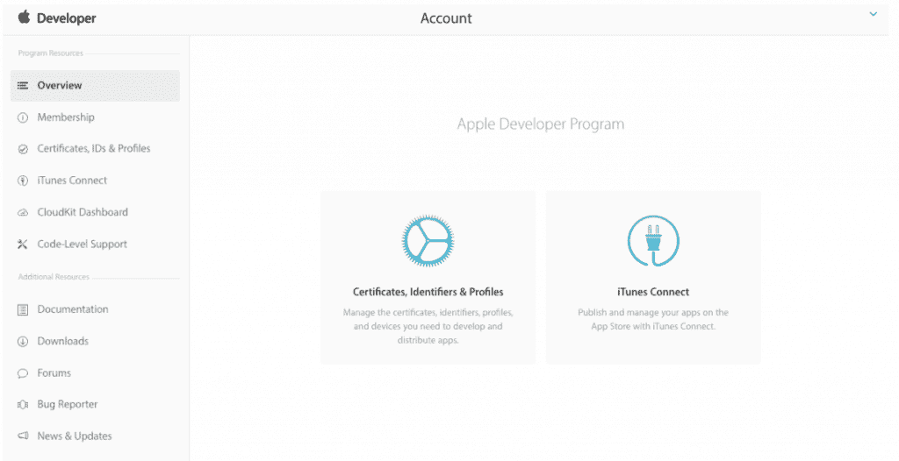
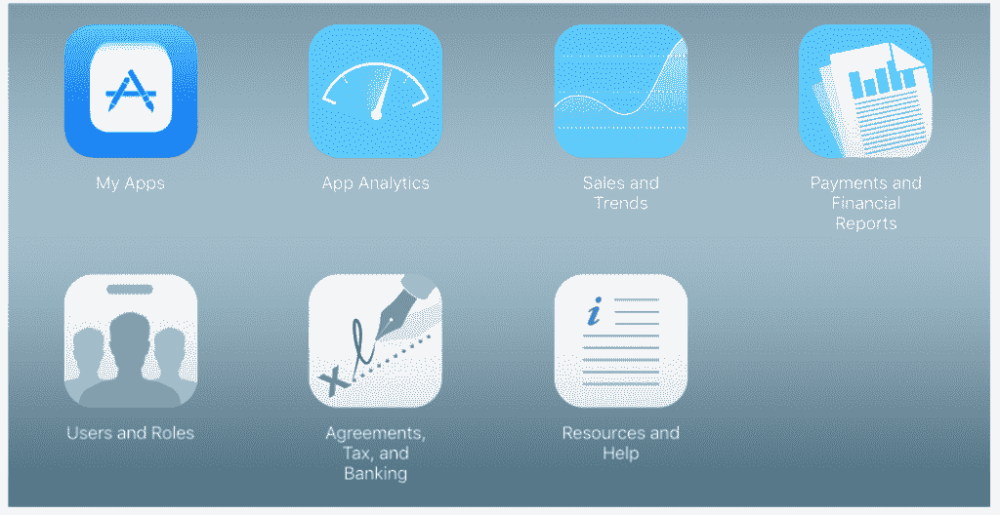
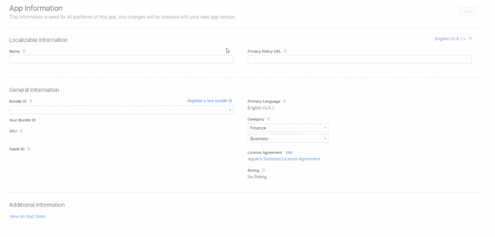

# 在风格部分 1 中发布你的应用到商店

> 原文：<https://simpleprogrammer.com/app-store-style-part-1/>

似乎现在每个人都在制作应用程序，也许你也想成为其中的一员。

也许是为了帮助你建立你一直想要的被动收入，也许是一种爱好，或者你只是想把它从你的遗愿清单上划掉。

很难相信应用商店是从 2008 年才出现的，也就是 2007 年第一款 iPhone 发布一年后。那时，应用商店里只有 800 多个应用程序。现在，仅 App Store 就有超过 220 万个 iOS 应用(截至 2017 年 5 月)。

知道有巨大的竞争，你仍然想继续前进，自己发布一个应用程序。太好了。小小的竞争不会伤害任何人。

你已经完成了设计、开发和测试你的应用程序的艰苦工作，现在你可以上传你的版本了。

那么，在一个一切都在争夺注意力的生态系统中，你如何让你的新的、构建良好、设计良好的应用程序引起注意呢？

首先，做一个非常棒的商店页面，确保当它被看到的时候，它会被下载。一个吸引人的标题并确保它被放在正确的类别中可以让你走得更远，但你还可以做一些事情来提高你的应用被发现的机会。

## 在我们开始之前，请注意一点…

开发应用程序需要对开发人员控制台中的不同领域有全面的了解，因此在将其发布到 App Store 之前，您需要完成以下工作:

*   使用 [XCode](https://developer.apple.com/xcode/) 创建您的构件
*   创建调试、开发、测试和发布版本
*   已签名的版本
*   创建的预置描述文件
*   全面测试您的应用
*   为 iOS 创建了一个[苹果开发者账户](https://developer.apple.com/programs/)(注意这需要每年购买 99 美元)

如果你已经完成了所有这些，那么你就可以开始了。

### 入门指南

你应该从你的应用程序的设计和开发阶段就知道，你的目标是什么设备，因为这将影响设计。因此，你也应该知道创建图像和应用程序图标所需的分辨率和尺寸。如果你不记得具体细节，请查阅你的文档。

在准备发布应用程序时，您需要完成许多配置屏幕。

您还应该知道您的应用程序将在哪些语言和国家可用，因为翻译应该包含在初始版本中，或者在您的生产计划的稍后阶段计划。

## 开发人员控制台

开发人员控制台是设置应用程序信息和管理应用程序商店帐户的仪表板。

开发人员控制台有许多区域。一旦你有了一个账户，确保你探索了所有的领域，熟悉你能做什么和你需要做什么来建立。

发布应用程序时，您通常会在“我的应用程序”部分工作。

你发布到商店的每一款应用都有一个单独的位置。一旦你在这个领域创建了一个新的应用程序，你就可以开始了。

构成您的 App Store 页面的详细信息直接来自您在此处包含的 App Store 信息。而你的 App Store 页面*只有*包含了你在这些屏幕上包含的信息，所以你需要彻底。这些细节可以在你的页面上看到，比如描述、标题和截图，也可以在后台显示，比如关键词。

在你提交你的应用程序进行审核之前，请仔细检查，因为新开发者提交的应用程序可能需要一周时间才能通过审核。如果您必须更改这些信息，您必须从第一天开始重新开始。

## 配置您的应用信息

一旦您熟悉了开发人员控制台，您需要进行配置，然后为您的应用程序添加设置和细节。

应用信息部分中的详细信息将用于此应用服务的所有设备。发布应用后，您对应用信息所做的任何更改都将反映在您发布的应用的下一版本中。

## 本地化信息

这些是你的应用程序的所有细节，可以翻译成你的母语以外的语言。

### 名字

这是买家/消费者/客户将在 App Store 页面上看到的名称。让你的应用程序名称易于拼写，并与应用程序的功能相关联，这意味着你对应用程序的主要功能的解释会更少。Snapchat 就是一个很好的例子。

确保你的应用名称不超过 50 个字符。事实上，有时两个短词比一个长词更好，因为(从您的测试中)您会知道这些词是换行的。总的来说，一个简短的单词是最好的名字。

### 隐私政策 URL

此 URL 链接到您的隐私政策。如果这只是一个爱好或者你做这个是为了好玩，你可能认为你不需要，你可能是对的。但这完全取决于你的应用的目标受众和内容。

如果您有以下任何功能，或者针对这些受众，您需要一个隐私策略:

*   儿童应用程序
*   如果你提供免费订阅
*   如果您提供自动续订的订阅
*   您允许帐户注册
*   您可以访问用户的现有帐户

如果您收集与用户或设备相关的数据，我们只建议您制定隐私政策。

### 主要本地化语言

这个设置非常重要，但是它没有字幕，你的注意力不会像屏幕上的其他部分那样被吸引。

您也可以通过下拉菜单在此设置您的主要本地化语言。

## 总说明

### 捆绑 ID

这是您在 Xcode 中使用的 ID。请注意，在您上传第一个版本后，它将无法更改。所以一定要做好！

您可以选择注册一个新的 ID 或选择 iOS 通配符应用程序 ID 选项。对于不使用应用特定功能的应用，如应用内购买或游戏中心，通常使用通配符选项。你可以在苹果开发者图书馆阅读更多关于[通配符应用 id 的内容。](https://developer.apple.com/library/content/qa/qa1713/_index.html)

### 库存单位

这是你的应用程序的唯一标识符。别担心，它在商店上是看不到的，所以你可以使用任何你想使用的模糊 ID。如果真的那么不寻常，你一定要记下来。

养成以特定格式创建 SKU 的习惯是一个好主意，这样即使你团队以外的人不清楚，你也可以查看你的 SKU ID，不用查找就知道它与什么相关。例如，你可以选择使用你的应用程序名称的前三个字母大写，然后可能是它首次发布的日期。这真的取决于你。

### 苹果 ID

此 ID 会自动生成并分配给你的应用。这是武断的，所以不要试图去理解它。但是你可能想把它记在一个容易拿到的地方。这将节省你重新登录到应用商店，并前往这一页，以找到它。

### 语言

**主要语言**

这只是一个由您已经设置的可本地化的主要语言设置的只读文本字段。我知道在两个地方定义语言会令人困惑，但这就是目前这个屏幕的布局方式。

你需要设置应用程序将使用的主要语言。此外，您必须设置应用程序将被本地化的语言。

如果您的本地化语言不可用，则提供的内容将来自主要语言。

如果您找不到想要使用的支持语言，请参见[常见问题解答](https://itunespartner.apple.com/en/apps/faq/Managing%20Your%20Apps_Localization#64875326)。

### 种类

现在，您必须定义您的应用程序最适合哪个类别。

你的应用程序的主要功能是什么？它提供了娱乐，提高了你的工作效率，还是让你更容易跟上你最喜欢的慈善机构的活动？

你可以尝试将你的应用程序归类到你知道的流行类别中，希望它能被发现，但这种分类可能意味着那些为你的应用程序寻找正确类别的人会错过它。由你来决定什么更重要。

如果你不确定选择什么或者有其他问题，你可以查看 [App Store 类别定义。](https://itunesconnect.apple.com/itc/static/category_definitions)

所以，你正在分析你的应用程序，看看哪一类最适合它。但是如果你认为它可以放入不止一个呢？你很幸运。您可以选择分配一个主要类别和一个可选的次要类别。

主要和次要类别目前如下:

*   书
*   商业
*   目录
*   教育
*   娱乐
*   金融
*   食物和饮料
*   比赛
*   健康与健身
*   生活方式
*   杂志和报纸
*   医学的
*   音乐
*   航行
*   新闻
*   照片和视频
*   生产力
*   参考
*   购物
*   网络社交
*   运动
*   贴纸
*   旅行
*   公用事业
*   天气

### 许可证协议

在这里你可以设置苹果的标准许可协议或者编辑它以最适合你的项目或者团队的目的。许可协议详细说明了从最终用户的角度来看谁拥有产品的所有权，即下载你的应用程序的人。这与隐私政策不同，因为在隐私政策中，作为开发者的你定义了你如何处理你通过应用程序收集的信息，以保护和加强应用程序用户的权利。相比之下，许可协议可以说更能保护应用开发者的利益。

### 评级

需要年龄分级，因为它对可以使用您的应用程序的受众的最小年龄进行了分类。应用程序的年龄评级基于所有设备所需的最成熟评级。

您可以澄清应用程序的当前年龄分级列表如下:

*   没有评级
*   4+
*   9+
*   12+
*   17+

### 附加说明

此部分允许您预览您的应用程序，并查看您设置的详细信息在 App Store 上的外观。

在应用程序上线之前，最好先看看您选择的设置在 App Store 页面上是如何描述和定位的。例如，当您预览它时，您拍摄的图像中的细节看起来要小得多，只有当您打开完整大小的图像时才能看到。这可能不利于吸引那些刚刚在智能手机上浏览新应用的人的目光。

如果你发现一些看起来不正确的东西，你可以随时返回并更新细节，即使在你提交你的应用程序进行审查之后。

## 你的下一步是什么？

T2】

那么，现在你已经了解了苹果开发者仪表板。您已基本了解如何在“我的应用程序”部分配置应用程序信息屏幕，以便开始构建一个有吸引力且信息丰富的 App Store 页面。

那么现在你用这些关于应用商店的初步知识做什么呢？为什么不在此基础上发展呢？

在您提交应用程序进行审核之前，还有两个屏幕需要填写信息。

在我的下一篇文章中，我将分享你需要在下一个屏幕上提供什么信息来构建一个优秀的应用商店页面。