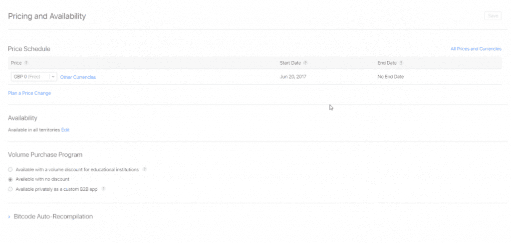
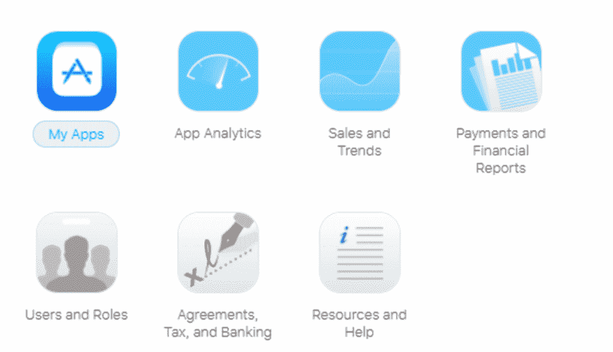
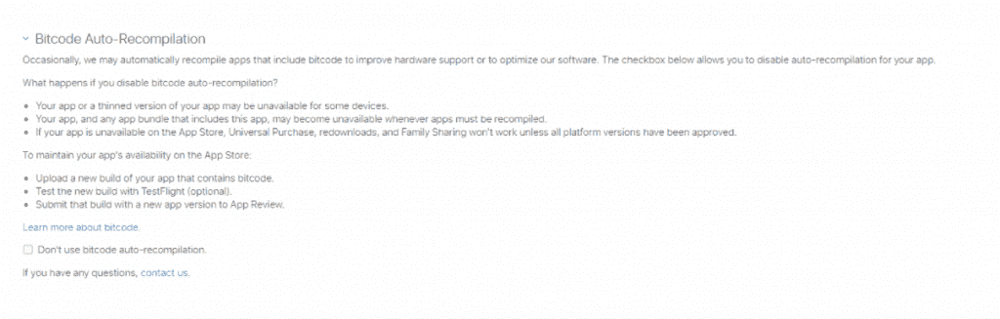

# 以风格第 2 部分的形式将您的应用发布到商店

> 原文：<https://simpleprogrammer.com/app-store-style-part-2/>

配置一个优秀的应用商店页面通常是应用开发生命周期的最后阶段之一。因为它出现在最后，所以有时会被忽略，或者信息是以一种草率的方式添加的，没有太多的时间或注意力放在内容上。

然而，即使你已经创建了一个很棒的应用程序，如果你不把一些想法和注意力放在开发人员仪表板上构成你的应用程序商店页面的屏幕上，没有人会发现它。即使运气好，一些人设法找到了你的商店页面，如果他们看到和读到的东西不能说服他们下载你的应用程序，[你所有的努力都将白费](https://simpleprogrammer.com/2017/02/24/surviving-the-app-store/)。

配置一个成功的应用商店页面的两个关键方面是获得正确的定价和可用性。

你的应用程序的价格可以或多或少地吸引用户，这取决于你的受众是谁以及你发布到什么平台(iOS 或 Android)。

应用的可用性也会影响你的销售和分析结果。如果你的应用程序没有为所有地方量身定制，你就向太多的受众发布，你可能会阻碍你的应用程序的进展。

你必须找到平衡点，并利用你的发现来指导你如何配置你的应用商店页面。

在本帖中，我们将深入探讨如何设定价格和可用性——如下所示——让你的应用有一个最好的开始。

您将学习设置价格、设置价格变化计划(如有必要)，以及设置应用程序的可用性。

## 设定您的价格

从你选择的商业模式中，你应该已经知道你是想以固定成本出售你的应用还是免费定价。你可以从[创意验证和研发阶段](https://www.junction5studios.com/easy-app-development-beginners/)以及观众反馈和竞争分析中获得所有这些信息。

我们倾向于将价格等同于质量，所以你最初的直觉可能是以固定成本定价。众所周知，这种策略在苹果应用商店上很有效，因为 iOS 设备的典型用户更喜欢高质量。但如果你尝试在 Google Play 上使用同样的技术，你可能会发现用户不太可能购买你的应用。这是因为 Play Store 中的应用程序通常售价较低或免费，这并不表明它们的质量。

请注意，如果您决定[出售您的应用](http://www.amazon.com/exec/obidos/ASIN/1502383829/makithecompsi-20)，您必须拥有付费应用协议。

### 什么是付费应用协议？

付费应用程序协议是一份合同，你必须审查才能出售应用程序。为了遵守本协议，您不需要向 Apple 提交任何东西。这只是一个在线表格，你需要填写必要的银行和税务信息。

要查看协议，请登录苹果开发者账户页面，选择*协议、税务和银行。*

在*请求合同*下，点击 iOS 付费应用合同类型的*请求。一项协议将会出现。*

查看协议后，检查您是否已阅读并同意合同，然后点击*提交*。

iOS 付费应用合同现在将显示在*正在处理的合同*下。然后，您需要设置您的联系信息、银行信息和税务信息，以便将您的销售额支付到您的帐户中。

有关付费应用协议的更多步骤，请[阅读本分步指南](https://help.swiftic.com/hc/en-us/articles/203122052-Create-an-Apple-App-Store-Paid-Applications-Contract)。

### 我的应用程序的最佳价格是多少？

只有你能决定，但是你可以研究一些东西来指导你的决定。看看目前在 App Store 上的类似应用程序，帮助你计算出你的应用程序的合适价格。如果可以的话，试着了解一下这些竞争应用的下载量。在给你的应用程序定价时，考虑你花了多长时间来创建你的应用程序，以及你为创建它付出了多少努力。

从你的目标受众那里获得反馈，收集他们对你的应用愿意支付多少的意见。询问陌生人的意见，而不是直接的朋友或家人。陌生人不会太在意你的感受，更有可能给你他们真实的意见和想法。如果你不是交际花，那就和朋友的朋友、工作中的同事，或者通过脸书群或论坛这样的群体和在线用户交流。向这些人询问一组特定的问题，这将有助于你证明你的价格模型的合理性。

利用你从目标受众那里获得的反馈和竞争分析，提出一个适合你的用户的价格。

## 在你定价之前…

您应该查看一下[所有价格和货币](https://itunesconnect.apple.com/WebObjects/iTunesConnect.woa/ra/ng/app/1236744813/pricingMatrix)链接，它会将您带到定价矩阵，该矩阵详细说明了每个地区的定价等级。区域是 Apple App Store 可以分发应用程序的国家。

定价等级是你用来设置应用价格的。每一层都有不同的价值。最低层是第 0 层。如果您的应用将被定价为免费，这是您选择的层级。

有 87 个定价等级和 7 个备选等级可供您选择。定价等级由苹果公司设定，并且在不同的地区有所不同。

## 你如何定价？

在 Price Schedule 部分，您将看到已经有一个默认值设置为 Tier 0。开始日期将是今天的日期，结束日期将是“无结束日期”

选择*计划价格变化*来改变这些默认值。

然后，您将看到一个表格，您可以在其中设置定价级别、开始日期和结束日期。

开始日期是新价格在 App Store 上生效的日期。价格在一天开始时变化。要立即更改价格，请选择“今天”

结束日期是该价格恢复到先前值的日期(如果您是第一次设置，这将是第 0 层的默认值)。选择“无结束日期”将永久设置此价格。价格在一天开始时变化。一天的销售必须在第二天开始时结束。

## 促销价格

平面风格的矢量折扣和销售概念-网上购物和价格标签

您还可以选择配置任何促销定价周期。例如，如果你有一个 99 便士(或 0.99 美元)的发行价，那么你可以安排它在一个月后涨到 1.99 便士。

价格变化和[促销优惠](https://www.amazon.com/dp/B00N14RSNY/ref=cm_sw_r_cp_dp_T2_MAhuzb97RWGWZ)是在配置你的应用商店页面之前就计划好的事情。

理解如何利用价格变化通过短期降低价格来增加稀缺性是很重要的。但是你必须小心，因为许多用户把价格等同于你的质量水平。确保你的全价反映了你所认为的产品的准确价值。

一个很好的例子就是开展一个夏季促销活动，在一周内将你的应用程序降价 25%。通过广告宣传销售只在很短的时间内进行，但不说明何时结束，你的应用程序可能会获得更多的下载，因为买家不确定原始价格何时会恢复。然而，如果你确实觉得有必要宣传某个时间段，不要说任何超过三天的时间。如果你这样做了，买家会认为他们以后有时间再来买。接下来你知道，三天多过去了，销售结束了，那些热衷于下载你的应用程序的人不再感兴趣，因为他们没有得到销售结束的提醒。同样，请确保您对此进行了仔细规划。

还要记住，太多的价格变动可能会让用户认为你不知道你在做什么，或者你的产品不值得更高的价格。此外，如果你的用户知道你的应用程序经常降价，他们可能会决定[战略性地等待，直到它降价](http://www.amazon.com/exec/obidos/ASIN/B01A0323O2/makithecompsi-20)，以获得便宜。

制定一个计划，说明你计划价格变动的时间和原因。利用你的营销渠道——脸书网页、网站等等——来恰当地传达这些变化。如果像圣诞节这样的特殊场合即将到来，考虑在一段时间内降低价格，并在打折时张贴。

## 有效

可用性是您的应用程序可用的地方。设置此项意味着您可以决定您的应用将在哪些地区可用。您可以从目前支持 App Store 的 155 个地区中选择单个选项，或者选择*全选*，这将突出显示所有地区。

是的，你可能会认为，为了获得最大的流量，你应该让你的应用程序提供给最大数量的用户。但是如果你计划只服务于一个特定的市场，或者发布你的早期版本来获得反馈，你可能想把你的读者限制在某些地区。

众所周知，像 Supercell 这样的公司会执行这种策略。他们经常在加拿大进行试运行，以测试他们的想法，看看他们刚刚创造的东西是成功的，还是失败的，或者需要更多的工作。如果他们成功了，他们就会打开应用程序，向所有其他地区开放。如果没有，他们会继续下一个想法。它们的软发布时间长短不同，是否同时发布到 iOS 和 Android，或者如果最初的发布获得足够好的结果，则一个接一个地发布。

## 批量采购计划

该计划为学术机构等特定群体提供了在购买大量和多份应用程序时获得折扣的选项。

如果您的应用程序面向拥有多个设备的客户端，您可能希望拥有此选项。像学校和企业这样的地方有多部智能手机和便携式设备；因此，每台设备都会有一个单独的应用程序。给予折扣可以鼓励你的客户购买你的产品。

您可以在此部分选择以下选项:

*   教育机构可享受批量折扣
*   没有折扣
*   可作为定制 B2B 应用程序私下使用

## 位代码自动重新编译

位代码是指发送到 iTunes Connect 的代码类型。它的全称是“LLVM 位代码”。有时，苹果会自动重建包含位代码的应用程序，以改善硬件支持或优化苹果的软件——例如，缩小可执行文件的大小。如果苹果需要改变你的可执行文件，那么他们可以不上传新的版本。

如果你想保持对你的应用程序的完全控制，你可以选择不使用位代码。为此，选择选项:“不要使用位代码自动重新编译。”选中该框意味着您已经选择不自动重新编译应用程序。

但是，您可能需要考虑授予此功能的权限。如果禁用位代码自动重新编译，可能会发生一些事情:

*   您的应用可能在某些设备上不可用。
*   每当必须重新编译应用程序时，您的应用程序(包括应用程序捆绑包中的应用程序)可能会变得不可用。
*   如果您的应用程序在 App Store 上不可用，那么通用购买、重新下载和家庭共享将不起作用，除非所有平台版本都已获得批准。

为了确保您的应用程序在 App Store 上仍然可用，您需要上传包含位代码的应用程序的新版本，对其进行测试，并将该版本与新的应用程序版本一起提交给 App Review。

要了解更多关于 bitcode 的信息，请访问苹果的支持页面。

## 接下来去哪里？

现在，您已经对如何设置价格和确定您的应用程序在哪里可用有了全面的了解。

在这篇文章中，我将带你了解:

*   定价层级以及如何为您的应用定价
*   你可能选择让你的应用程序免费或以固定价格出售的原因
*   付费应用协议
*   促销价格
*   苹果区域和供货情况
*   批量采购计划
*   位代码自动重新编译

你的应用商店页面开始成形了。