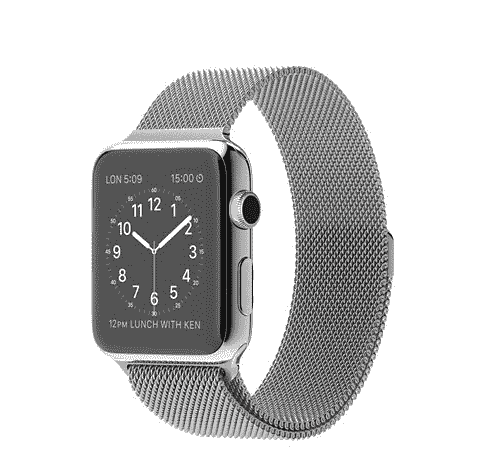
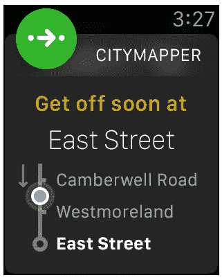
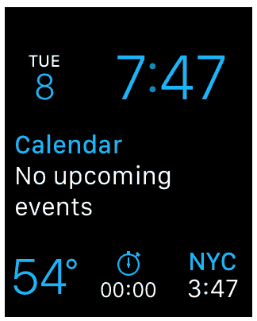
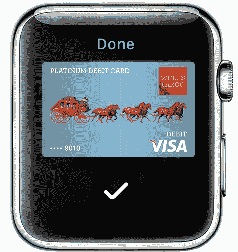
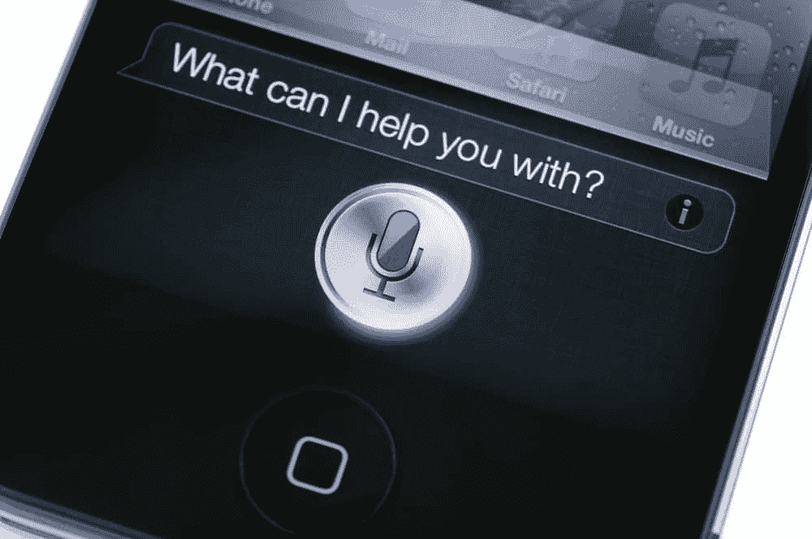
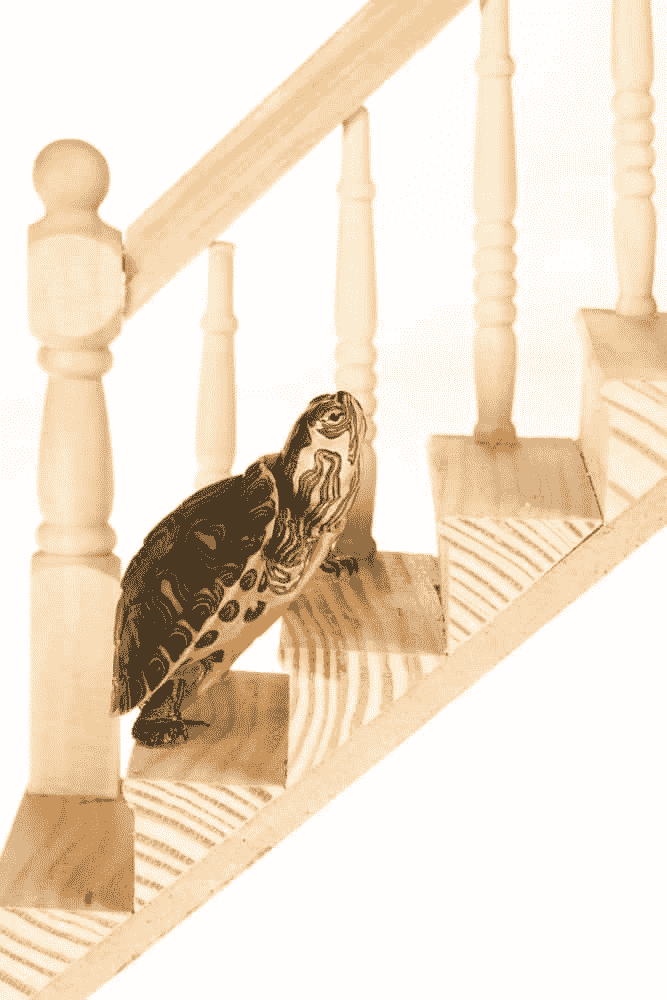
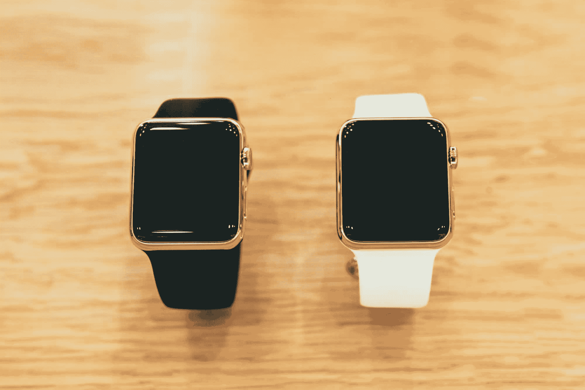

# 苹果手表评论:带着苹果手表旅行了 3 个月后，我是这样想的

> 原文：<https://simpleprogrammer.com/apple-watch-review-after-3-months-travelling-with-an-apple-watch-heres-what-i-think/>

当我第一次听说 [Apple Watch](http://www.amazon.com/exec/obidos/ASIN/B00WUKULAC/makithecompsi-20) 的时候，我不太确定该怎么想。

这似乎是一个非常酷的想法，但我不确定我是否真的想深入苹果的生态系统，或者我是否想考虑 Android wear 并获得一个 [Moto 360](http://www.amazon.com/exec/obidos/ASIN/B00NC8PMUK/makithecompsi-20) 。

但是当[我决定扔掉我的台式电脑，去“全 Mac”](https://simpleprogrammer.com/2015/05/04/my-journey-to-finally-ditching-my-desktop-pc/)买一个 [iPhone 6 Plus](http://www.amazon.com/exec/obidos/ASIN/B00NQGOO4I/makithecompsi-20) 的时候，我几乎已经决定，如果我要买一个智能手表，那就买一个[苹果手表](http://www.amazon.com/exec/obidos/ASIN/B00WUKULAC/makithecompsi-20)。

不幸的是，当我决定买一个的时候，得到一个已经不那么容易了。

事实上，我最终在巴黎四处寻找苹果手表。我很高兴地说，我终于在今年 6 月拿到了一款 42 毫米的苹果手表。

实际上，这是我最后得到的型号:[Apple Watch 42 毫米不锈钢表壳搭配米兰尼斯环](http://www.amazon.com/exec/obidos/ASIN/B00WVJWDYO/makithecompsi-20)，部分原因是那是我唯一的选择，部分原因是我最喜欢那一款。

所以，我带着这个东西在欧洲旅行了三个多月，我肯定有一些想法。

先说好的……(排名不分先后)

## 苹果地图

**苹果地图刚出来的时候，我很讨厌。**谷歌地图要好得多。谷歌地图仍然比 T2 好，但是现在很难做出判断。

不过，苹果地图真正的亮点在于它与苹果手表的结合。

当然，我的测试场景不是你日常生活中的典型场景，但我可以说，对于在你不知道如何四处走动的随机欧洲主要城市旅行来说， [Apple Watch](http://www.amazon.com/exec/obidos/ASIN/B00WUKULAC/makithecompsi-20) 上的苹果地图太棒了。

你可能会问，为什么？

嗯，**手腕上的逐圈导航有多牛逼？**

在我欧洲旅行的大部分时间里，我会简单地把我想去的地方输入 iPhone 上的苹果地图，然后让我的手表指引我。

我的苹果手表会自动开始在上面运行苹果地图配套应用程序，突然间我就能非常清楚地知道该走哪条街，走多远，什么时候转弯。

它实际上非常光滑。

通常情况下，它只是告诉你该往哪个方向走，以及在下一次转弯之前你还有多远(这本身就很棒)。但你也可以滑动一次来查看地图视图，显示你当前所在的路线。

它还显示你的预计到达时间，可以点击显示你还剩下多少分钟的步行时间。

另一个非常酷的功能是**你的手腕会在你需要转弯**时振动，这样你就不会看起来像一个十足的傻瓜一样走来走去，一直低头看着你的手腕。

考虑到我在欧洲进行了为期 3 个月的旅行，走遍了许多大城市，这个功能本身就值这块手表的价格。比一直掏出我的 iPhone 容易多了。

## 城市地图

[Citimapper](https://itunes.apple.com/app/id469463298?mt=8&&referrer=click%3D67cba726-751b-4f13-ab7a-6c5b4ca66c54) 实际上是一个应用程序，而不是内置的 [Apple Watch](http://www.amazon.com/exec/obidos/ASIN/B00WUKULAC/makithecompsi-20) 功能，但对于这篇评论，我不会区分两者，因为对我来说本质上是一回事。

我感兴趣的是我可以用苹果手表做什么，我不在乎这些功能是否来自应用程序。

也就是说，Citimapper 本身就非常棒，但结合 Apple Watch，它甚至更好。

Citimapper 没有世界上的每个城市，但它有主要的城市，它使到达某个地方变得轻而易举-特别是通过公共交通。

Citimapper 基本上给你提供最佳路线，告诉你在哪里换乘公共汽车、火车、地铁等。

有了[苹果手表](http://www.amazon.com/exec/obidos/ASIN/B00WUKULAC/makithecompsi-20)，你可以开始你的旅行，启动苹果手表上的应用程序，然后你就可以访问到你到达目的地所需的每一步。

然而，最令人惊叹的是，只要看看你的手腕，你就能准确地看到你在公共汽车或地铁的哪个站。

该应用程序还会在您即将到站时提醒您，让您不要忘记下车。

我甚至无法开始向你解释，当去你完全不熟悉的大城市旅行时，这有多棒。

在 T1 之前，我从未去过伦敦，但我可以跳上地铁，去我想去的地方。我甚至给当地人指路。

## 表盘

这可能看起来不像是一个杀手级的功能——老实说，它可以使用一些改进——但我发现，能够定制我通过看一眼我的手腕可以看到的信息确实非常有价值。

watch faces 与 Apple Watch 的工作方式是，你可以选择一种布局，然后用所谓的复杂功能对其进行定制。(这其实是一个钟表行业术语——我查了一下。)

以下是我目前的手表表面:

你可以看到我有日期和当前时间。很简单。

我的下一个预约出现了。现在它是空白的，但如果不是，它会告诉我一天中接下来会发生什么，这非常有用。

我有我目前所在城市的当前温度。我可以点击它来查看更详细的预报。

然后，你可以看到在底部中间我有一个秒表。我用这个来计算我在健身房的休息时间。

最后，在右下角，我有纽约时间，所以我可以看到美国的时间，知道我打扰人们的时间有多早。

您可以定制许多其他选项和不同的表盘。结果非常有用。

尽管如此，我还是希望看到它有所改进，给我更多的选项和数据供我选择。**我希望能够拥有自己的服务或端点，我可以从中获取数据并显示在表盘上**，但现在只能这样了。

## Apple Pay

这是我用我的苹果手表发现的最大的惊喜。

iPhone 上的 Apple Pay 有点不方便，而且很傻。

当你拿出你的 iPhone，笨拙地试图把它压在信用卡读卡器上，让它读取你的指纹时，你看起来像个十足的傻瓜，而其他人都在排队等待，希望你死了。

但是当我双击 Apple Watch 上的侧边按钮，漫步走到柜台前，**拉起我的袖子，用拳头击打收银员**，而我的 Apple Watch 在读卡器上停留一秒钟，为我的可乐 Zero 付款时，我感觉自己就像来自真人快打的[约翰尼·凯奇](http://mortalkombat.wikia.com/wiki/Johnny_Cage)。

不，说真的，这简直太棒了。

我甚至无法告诉你，不用从口袋里掏出任何东西就能付款是多么令人难以置信的方便。

到目前为止，我旅途中最棒的一次使用是在伦敦公共交通系统中使用它。

伦敦的公共汽车和地铁线路都使用 Apple Pay，所以你基本上只需挥动手腕，就可以像老板一样乘坐公共交通工具。

如果 Apple Pay 在任何有信用卡读卡器的地方都能实现，光是这个功能就值这块手表的价格了。直到你真正使用它，你才意识到这有多方便。

**我从来没有在我的 iPhone 上用过 Apple Pay，但是在我的****[Apple Watch](http://www.amazon.com/exec/obidos/ASIN/B00WUKULAC/makithecompsi-20)****上，我一有机会就用。**

## 我银行的信用卡应用程序

我知道这是银行特有的，但我把它放在评论中，因为我假设其他信用卡也有类似的应用程序，它显示了什么是可能的。

我有一张[花旗银行双现金卡](https://www.citi.com/credit-card-details/citi.action?ID=citi-double-cash-credit-card)，它给我购物时 2%的返现。相当棒。

我发现我的信用卡有一个 iPhone 应用程序，它有一个 Apple Watch 伴侣应用程序。

起初我认为这很蹩脚，他们只是实现了这一点，以拥有一个 Apple Watch 应用程序，但在我第一次购买并打开通知后，我看到了**立即知道我的信用卡**上的东西何时被收费以及确切金额是多少的好处。

当然，这更棒，因为我在国际旅行，我用外币买东西，但总的来说这仍然是一个很酷的功能。

我已经养成了一个习惯，每次我买东西的时候，我都会看一眼我手腕上的小通知，上面准确地告诉我我被收取了多少美元。

当你在冰岛与克朗打交道，或者想知道柏林那个阴暗的邮局是否真的向你收取了正确的金额时，这真是太棒了。

知道我什么时候被收取一些经常性的费用，或者我的妻子什么时候出去购物，这也是非常有用的，可以立即知道我会受到多大的伤害。

## iPhone4S 上的语音控制功能

我不得不承认，我总是忘记我的苹果手表上有 Siri。

也许我需要让 Siri 给我设置一个提醒，让我记住我可以使用 Siri。

尽管如此，当我使用 Siri 时，它还是非常棒。

你可以在你的 Apple Watch 上进行设置，这样当你激活屏幕时，你所要做的就是说“你好 Siri ”, Siri 就会活过来听你的请求。

现在，功能仍然有点有限——这很糟糕——但仍然非常好。我尝试做的第一件事是导航到某个地方，但是，唉，你不能从你的苹果手表上做到这一点——至少现在还不行。

我用 Siri 设置过定时器。这很方便。还可以设置闹钟，也方便。但是，我忘记了它能做的所有其他事情。

我确实找到了这个相当大的列表。我将不得不开始训练自己利用这些功能。

因此，虽然这个功能很酷，但我认为它仍然需要一些改进。我希望它能够处理我能想到的任何事情，但目前它相当有限。

(对了，其实还有一本关于[掌握 Siri](http://www.amazon.com/exec/obidos/ASIN/0789752980/makithecompsi-20) 的书。多疯狂啊。)

## 锻炼和计步器

现在这仍然很糟糕，但是没关系。

我用它就够了，但只是因为它用起来太简单了。

基本上，Apple Watch 会跟踪你的脚步和运动，并试图确定你站了多少小时，走了多少步，锻炼了多少分钟。

站着看起来很傻，因为这算不上什么成就。

这些步骤非常准确，跟踪这些很好，这样我就不用再戴另外一个设备了。

锻炼的时间也是无用的。

该应用程序为你设定了一天燃烧多少卡路里、站立时间和体育锻炼分钟数的目标，但它不是很容易定制。你唯一能改变的是你的“移动目标”，也就是你燃烧了多少卡路里。剩下的就是从那里想出来的。

**我希望看到这一点更加可定制，或者看到一些第三方应用程序可以接管这一功能并做得更好**，但目前这将不得不做。

还有一个锻炼应用程序，当你去跑步或做其他事情时，你可以启动它，但它也非常有限。

我一直用它来跑步，但我希望它足够智能，能够知道我在跑步，而不是让我打开应用程序告诉它。

它似乎也没有任何办法来处理举重，所以我觉得我没有得到举重的荣誉。

有一些蹩脚的徽章，你可以得到锻炼和满足你的移动目标，但它们不是很有动力。

所以，就像我说的，我使用这个功能是因为它使用起来非常简单，但是我真的希望看到它有很大的改进。

但是，它肯定会取代我的 Fitbit。

## 抗水性

手表基本上是防水的，尽管它说它只是防水的。

我不打算带着它游泳——但我打赌你可以。

我通常不用它洗澡，但我偶尔会用。

但是…

我经常最终在雨中奔跑。

当我在雨中奔跑时，知道我昂贵的手表不会坏并继续工作真好。

当然，当它全湿的时候，你不能真正使用触摸屏，但它仍然是一个非常好的设计功能。

然而，当我跑步时，我仍然必须带着我的 iPhone，因为我不能把我的有声读物或播客放在 [Apple Watch](http://www.amazon.com/exec/obidos/ASIN/B00WUKULAC/makithecompsi-20) 上，但我一会儿会谈到这一点。

## 电池

不是很好，但是比我想象的好多了。

两天很轻松，对我来说已经足够了。

如果它能持续一周就好了，这样我就可以有某种睡眠监测应用程序，戴着它睡觉，但除此之外，每天晚上充电很容易，如果我错过了一个晚上，也没什么大不了的。

它还有省电模式，我没怎么用过，不知道有多好。

充电易如反掌。你基本上有这个小磁环，你把它贴在手表的下面。

## 通知

多亏了 taptic 引擎，通知功能非常棒。

当收到通知时，你的手腕会振动一秒钟以引起你的注意。

如果你有很多通知，这可能会很快变得令人讨厌，但幸运的是，你可以在你的苹果手表上选择你想要的通知。

我没有很多激活的，所以我得到的那些是非常有用的。

当有人给你发短信或者你的信用卡刚刚被扣了 4000 美元时，知道这一点很好。

知道你 10 分钟后有个约会也是非常有用的。

如果你错过了一个通知，表盘顶部会有一个小红点，告诉你你错过了一个通知，你只需向下滑动即可查看。

它非常直观，没有干扰，所以我喜欢它。

但我不得不说，我没有在手机上配置邮件应用程序，所以我不会在每次有人给我发邮件时都收到通知。如果发生这种情况，我可能会把我的苹果手表扔出地铁车厢。

## 信息发送

我不是一个喜欢发信息的人。

但是，当我收到某人的短信时，在我的苹果手表上收到它，并且能够用简短的回复或者能够快速撰写自动转录的语音信息，这是非常好的。

您也可以非常轻松地与某人开始对话，只需触摸一次侧边按钮，从您联系最多的联系人中选择一个，然后选择向他们发送消息。

**如果你是个变态，可以给人发你的心跳** …诡异。或者你可以写一条语音信息，用拳头碰他们，或者给他们发送十亿个表情符号中的一个。

对于像我这样讨厌发短信的人来说，这真是太棒了，因为我不用掏出手机就可以告诉别人“F & amp！@关了，别再给我发消息了。”相反，我可以直接说“F&！@关了，别再给我发信息了”在拥挤的地铁上，当人们奇怪地看着我的时候。

一个奇怪的怪癖。如果消息由于某种原因未能传递，它不会重试。

## 坏事

苹果手表并不全是神奇的瞬间。

老实说，我喜欢 Apple Watch，但我肯定感觉它还没有完全到位。似乎还缺少相当多的东西。

以下是我目前的一些抱怨。

### 

慢得要命。

太慢了。

当你在上面加载应用程序时，做好等待的准备。

我猜这是因为在当前版本的 Apple Watch 上，所有的应用程序都可以在你的 iPhone 上加载和运行，显示屏会显示在 Apple Watch 上。

我真的不在乎它为什么慢，但它太烦人了，我从来没有真正发现值得努力在手机上打开一个应用程序。

还有一个名为 Glances 的功能，可以让你通过 Apple Watch 上的应用程序访问某些数据，只需向下滑动，然后向左或向右移动，但因为它太慢了，所以不值得使用。

我真的只使用这个功能来停止我的音频，因为那部分不是很慢，但任何拉数据的东西都非常慢。

我希望苹果解决这个问题，因为几乎所有实际的 Apple Watch 应用程序都无法使用，因为拿出你的 iPhone 会更快。

### 没有 iPhone 就不能跑步或健身。

这是最让我生气的一个。

在得到我的苹果手表[后，我最期待的事情之一就是终于可以在健身时扔掉我的 iPhone 了。](http://www.amazon.com/exec/obidos/ASIN/B00WUKULAC/makithecompsi-20)

我讨厌跑步的时候带着 iPhone。我必须在口袋里带一个塑料袋，以防下雨。

我希望 Apple Watch 能够解决这个问题，因为它能够与蓝牙耳机配对，但不幸的是，它没有。

有一种方法可以从你的 Apple Watch 上听音乐，但它需要你将一个特殊的播放列表同步到你的 Apple Watch 上。

目前，播客应用程序和像 [Audible](http://www.amazon.com/exec/obidos/ASIN/B00NB86OYE/makithecompsi-20) 这样的应用程序不能在 Apple Watch 上本地存储文件，所以我不能在跑步时听我的播客或[有声读物](http://www.amazon.com/exec/obidos/ASIN/B00NB86OYE/makithecompsi-20)，除非我也带上我的 iPhone。

所以，现在我跑步的时候不是少带一件东西，而是多带了一件。

我相信苹果会解决这个问题，因为它真的很糟糕，但现在我不得不忍受它。

### 大多数配套应用都是垃圾。

我的苹果手表上有一大堆小应用程序，大部分都没什么用。

我意识到 Apple Watch 是新的，每个公司都希望在 Apple Watch 上有一个配套的应用程序，这样他们就可以说他们支持它，但目前它们大多没有用。

有几个有用的——大部分是苹果公司的内置软件——但几乎所有其他的软件都很慢，一点帮助都没有。

事实上，一些配套应用程序什么也不做，只是告诉你在 iPhone 上打开应用程序。

这很大一部分是苹果的错，因为他们不允许配套应用程序实际上利用 Apple Watch 的大部分功能，但我听说这应该会随着 2.0 Apple Watch 操作系统而改变，所以希望我们很快就会看到一些像样的应用程序。

### 皇冠没用。

边上那个带刺的旋钮？

它基本上只是为了好看。我不知道为什么你会想旋转那个转盘，而不是仅仅使用触摸界面。

我相信它可能会有很好的用途，但现在，我基本上不碰它。

### 苹果手表很贵。

我意识到我本可以以更低的价格购买运动版，但我为我的苹果手表支付了近 1000 美元，因为我想要一个更好的表带和更耐用的表盘。

事实证明，中档版本，手表版，实际上比更便宜的运动版更耐用，但它们都相当昂贵。

考虑到有些人在手表上花了几十万美元，我想这对一只手表来说不算贵，但考虑到苹果公司不断发布新版本的设备，我觉得每次都必须升级，这是一项新的支出，可能会继续让我花钱。

### 杂项投诉。

我还希望设备中能有更多的传感器。如果有一个温度传感器就好了，这样我就可以跟踪我的体温，知道我什么时候开始发烧，并获得更准确的卡路里读数。

室外温度也不错。

换乐队有点痛苦，所以我并不经常换，尽管我有一个运动乐队。

## 苹果手表 2.0

我评测了现在的 Apple Watch，但是有一个更新即将推出，我非常期待，它将解决我的许多问题——至少我希望如此。

首先，在 Watch 2.0 中，应该会有一些**新的手表面孔和新的复杂功能。**还应该有能力添加全新的自定义复杂功能。(最后，我每次看手腕就能看到 Simple Programmer 有多少次访问。)

他们将尝试通过这种时间旅行功能使皇冠变得有用，这样你就可以看到时间的向前或向后，但我不是 100%赞成这个想法。

**床头柜模式看起来很酷**，因为它让手表能够像一个小闹钟一样工作，你可以在充电时放在床头柜上。

显然，新的操作系统版本将允许应用程序实际上在苹果手表上运行，而不是像现在一样从 iPhone 上运行。

因此，苹果承诺这些应用将会更快、更强大。

我希望我最终能够不带手机去跑步，并通过这次升级实际使用一些 Apple Watch 伴侣应用程序，但时间会证明一切。

手表还应该有回复电子邮件的功能，但我认为这在大多数情况下并没有多大用处，因为我已经可以用我的 iPhone 做到这一点，但我没有。

但是地图升级到显示公共交通的运输时间是非常令人兴奋的。看起来这可能会取代我之前提到的 Citimapper 应用。

Siri 也应该更强大一点，但我也不抱太大希望。

## 最终总结

总而言之，我喜欢 [Apple Watch](http://www.amazon.com/exec/obidos/ASIN/B00WUKULAC/makithecompsi-20) ，但没有我希望的那么多。

无论如何，如果你打算买一块手表，我觉得它是值得买的，但它不会完全改变你的生活——或者至少现在不会。

我期待着操作系统的更新，这可能会使这款手表更加有用，但我认为它真正开始发光还需要几代人的时间。

关于苹果手表的一个巨大优势，我可以说的是它已经变得多么平凡。

这基本上已经成为我生活和时间表的一部分，以至于我都没怎么注意到它。

这是一件好事，因为我经常使用它，却很少注意到它。

这意味着它悄悄地给我的生活增加了一些价值。

我有很多设备，起初看起来都是好主意，但我从来没有真正使用过它们，因为它们太烦人了。对于 Apple Watch，我不能这么说。

如果我必须给它一个星级，我想我现在会给它打 7 分，但我认为一旦 Apple Pay 无处不在，手表应用程序可以本地运行并在本地存储数据，它有可能打 9 分。