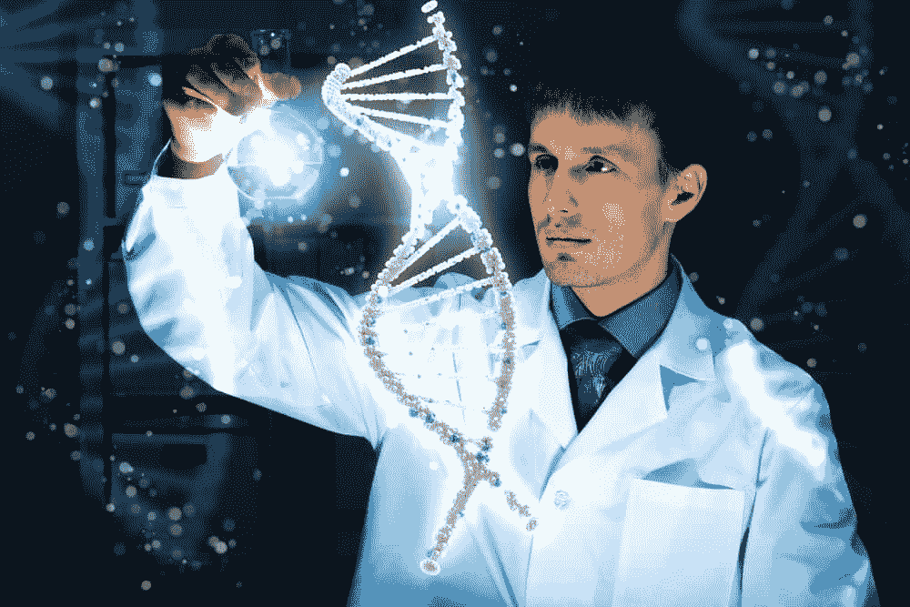

# 领导力:领导者是天生的吗？还是他们做出来的？

> 原文:[https://simple programmer . com/are-leaders-born-or-are-they-made/](https://simpleprogrammer.com/are-leaders-born-or-are-they-made/)

领导力是我们社会中一个永恒的话题，我们不停地谈论、思考和写作。

在谷歌上搜索[会出现超过 400，000，000 个结果；在亚马逊](https://www.google.com/search?sclient=psy-ab&biw=1536&bih=1227&q=leadership&oq=leadership&gs_l=hp.3..35i39l2j0i20j0.901.2185.0.2422.11.11.0.0.0.0.211.1215.5j5j1.11.0....0...1.1.64.psy-ab..1.10.1122.0.MjANjqrr484&pbx=1&bav=on.2,or.r_cp.&bvm=bv.99804247,d.eXY)上搜索[会返回超过 70，000 本关于这个主题的书。每天都有更多的书被创作，更多的文章被撰写，更多的播客被录制，更多的培训课程被设计来教我们成为(更好的)领导者。](http://www.amazon.com/s/ref=sr_nr_n_0?fst=as%3Aoff&rh=n%3A283155%2Ck%3Aleadership&keywords=leadership&ie=UTF8&qid=1439937623&rnid=2941120011)

Yet, despite this influx of material, only a handful of people stand out as truly exceptional leaders. Throughout our lives and careers, we can identify with people that have inspired us with a vision and motivated us beyond our limits.

我想到了像圣雄甘地这样的人，他领导了一场反对英国的非暴力革命，赢得了印度的独立。我想到了领导美国民权运动的马丁·路德·金，以及帮助领导妇女选举权运动的苏珊·b·安东尼。伟大的领袖不仅存在于社会运动中，也存在于商业、科技、教会和大学中。伟大的领导者无处不在，但是是什么让这些人变得伟大呢？

领导力是与生俱来的自然品质吗？有些人天生就具备成为领导者的基因吗？或者说领导力是一个人在成熟过程中学习的技能？

虽然这篇文章不会是最终的答案，但它的目的是让关于领导力起源的讨论更加清晰。

## 领导…是一种关系。

为了成为一个领导者，一个人必须具备两样东西。

First, and foremost, a person must have a group of people who are following his lead. When we see someone described as a leader, rarely do we get accurate information about the people this person is leading. A group of people, even united behind a common leader, are rarely homogenous. Everyone has his own reasons for following the person, but in many cases, these people are whitewashed by some common elements, like religion, political affiliations, or social class. The elements also tend to enhance the leader’s image, and not the followers’.

亲密的细节很少被检查。他的追随者对他有什么看法？他们追随这个人是因为不得不，因为没有别的，还是因为他们想？这些人是被授权独立行动，还是需要由他们的领导管理一切？很多关于追随者的问题都没有答案。

这很奇怪，因为没有追随者，没有人能成为领导者。

一个人被称为领导者必须具备的第二个要素是目标。为了领导人们，一个人必须有一些*的东西*来带领他们走向。这可能是一个称之为家的新地方，一个推动销售的动力，或者仅仅是一个对美好明天的憧憬。除非有目标，否则就没有领导。

一个朝着一个目标努力而没有追随者的人是一个有远见的人(或思想领袖)，跟随一个没有目标的人的人只是一群没有目标的人。

## 领导…是一种技能。

当领导人们时，最好的追随者是那些受到鼓舞和激励的人，因为这些人几乎不需要指导或方向。领导者不在时，他们也更容易承担责任。被强迫跟随某人的人会对领导的指示产生怨恨和抵触。

然而，即使在人们被要求跟随某人的领导的情况下，也有一些领导者能够鼓舞人心。对一些人来说，鼓舞和激励的能力可能是“天生的”，但归根结底，这些是技能。这本身就是一个值得讨论的话题，但它需要一个人有远见，充满自信，并能够与人沟通，倾听和授权。

灵感和激励经常被吹捧为最有效的领导风格。这意味着领导力需要一些机制、技巧和艺术。事实上，根据《哈佛商业评论》,有 6 种领导风格,每种都有优点和缺点。

一个好的领导者能够在正确的时间使用正确的风格，而一个伟大的领导者能够将两者融合在一起。这需要时间，但任何人都可以学习、实践和掌握领导技能。

## 领导力…是天生的。也许吧。

研究人员发现，拥有 DAT1 基因 [10 重复等位基因](http://www.sciencedirect.com/science/article/pii/S1048984315000028)版本的人更有可能在年轻时犯下适度的违规行为。这些都是像未成年喝酒，逃课等活动。虽然这些活动本身没有价值，但它们代表了[一个人打破界限、挑战权威并最终学到更多东西的意愿](https://simpleprogrammer.com/2015/08/17/you-have-to-master-the-rules-before-you-can-break-the-rules/)——所有这些都是优秀领导者的特质。

On the flip side, however, these individuals tend to lack a proactive personality, meaning they often don’t go after their goals. Genetics can give people a head start in being a leader, but ultimately it depends on the person’s actions and habits. It’s easier to make a pot from a lump of clay than a stone, but, in the end, unless the clay is shaped into a pot, the sculptor patiently chipping away at the stone will produce the desired effect.

此外，在 2013 年，[研究人员发现了一种叫做 rs4950 的基因](http://papers.ssrn.com/sol3/papers.cfm?abstract_id=1915939)，这种基因在处于领导角色的人群中普遍存在。目前还不清楚这个基因到底是做什么的。有证据表明，它在多巴胺释放系统中发挥作用，从而影响冲动和耐心。成为一名优秀领导者的一个特点是能够关注长期结果，知道哪些短期收益值得追求，哪些可以放弃。

虽然这似乎证实了天生领导者的说法，但在这两种情况下，研究人员警告说，数据代表的是相关性，而不是因果关系。他们的谨慎回避了人们熟悉的先天与后天的争论，含蓄地暗示领导特质一直是遗传倾向和后天行为的结果。一个人可能天生腿长，但除非他练习，否则他会被一个经验丰富的赛车手超过。

与身体的任何其他部分相比，人类的思想总是在变化。早上起床的人和睡觉的人完全不同。大脑在晚上重塑了自己，建立了新的神经网络，排出了毒素，并吸收了新的知识。

像冥想这样的活动可以改变思维，帮助培养一个人的同情心、同理心和耐心。

人们倾向于认为他们不会随着时间而改变，但是科学家已经证实，在十年的时间内，一个人已经发生了根本的变化。我们往往不会注意到它，因为这些变化很小，而且是在一段时间内发生的，我们会将它们内化。

最后，就像任何事情一样，决定一个人是否会成为领导者以及他会有多成功的因素取决于他成为领导者的动机，以及他选择的日常习惯。

## 如何成为一名领导者

快速搜索会发现许多描述领导者特质的文章。同理心、乐观、灵感、果断、适度、自我调节等特质。一个人可能不完全具备这些特征，但没有什么能阻止他努力发展这些特征。

例如，为了建立同理心，个人可以在施粥所或无家可归者收容所做志愿者。设身处地为一个让他生气的人着想，可以迅速消除一个人的愤怒，帮助他获得洞察力。

一个优柔寡断的人可以通过对选择的决定采取行动来假装果断。(这有助于增强自信)。

适度和自我调节可以通过冥想来培养，在回答任何问题前暂停 3 秒钟。

积极倾听是一种技术，可以用来帮助建立与人的联系，并提高激励他们的能力。

这些只是几个例子。有各种各样的活动可以帮助建立这些品质。

Individuals who hold the genetic factors mentioned above may have be able to pick those traits up quicker, but it’s more than possible to learn these traits with conscious, focused effort. Leadership above all else, is a skill, that’s cultivated by a person’s individual habits, as well as his interactions with other person. A person can mindfully adopt new mindsets, actions, habits, and attitudes in the effort to become a leader.

然后有一天，他会发现自己和一群忠诚热切的追随者一起掌舵。通过带领自己成为领导者，一个人会获得追随者，因为当一个人要去某个地方时，人们往往会注意到，他们想加入。

那些“天生”的个人可能是更有效的领导者，但这不是一种竞争，而是关于个人在特定情况下的领导素质。作为第二次世界大战期间盟军的最高指挥官，德怀特·艾森豪威尔是一个威严的存在。在公开露面时，他能完全控制局面，给出简明扼要的回答。

然而，在他的总统任期内，他被指责在露面时信口开河。艾森豪威尔非常适合领导军事力量，这需要明确的方向和坚定的指挥，而领导一个国家需要更多的政治头脑和波兰。

任何人都可以成为领导者。问题是那个人是否愿意付出努力。

请在下面的评论中告诉我——你有天生的领导倾向吗？还是你在努力？你在做什么来提高你的技能？T3】