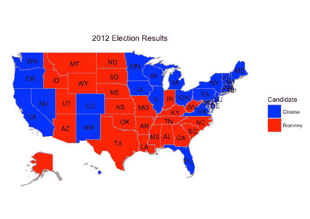

# Ari Lamstein 轻松创建 Choropleth 地图

> 原文:[https://simple programmer . com/ari-lam stein-creates-choropleth-maps-easy/](https://simpleprogrammer.com/ari-lamstein-creates-choropleth-maps-easily/)

阿里·拉姆斯坦是免费博客课程的毕业生，也是认真对待所有知识和建议的人之一。当 Ari 发邮件告诉我他新产品的成功时，我知道我必须采访这个家伙。我一直在考虑开设面向创业和创建在线业务的新课程。听说 Ari 在这个领域取得了成功，这很酷，所以我想分享一下，希望能激励人们。

大约 2 年前，他在一家房地产公司工作，有很多数据。他开始从事软件/数据科学项目。查看阿里 的完整 **[视频采访，并阅读下面他整理的 Q & A。](https://www.youtube.com/watch?v=hYwrrUiWBAs)**

## 说说你的开源软件项目吧。

这个包叫做“choroplethr ”,它使得用 R 编程语言创建 choropleth 地图变得很容易。Choropleth 贴图只是使用颜色来表示值的贴图。美国总统地图就是一个例子:那张地图用蓝色表示一个民主州，用红色表示一个共和州。这是这张地图在 choroplethr 的样子:

该软件包是开源的，完全免费。它经常被流行病学家、经济学家等使用。基本上，如果你正在使用 R 并且想要创建这种类型的地图，choroplethr 可以帮助你。

## 写博客对你的项目有什么帮助？

它给了我一个宣布软件包更新的中心位置。它还允许我突出显示读者可能感兴趣的相关工作。例如，我经常写关于地理空间开放数据集的博客，比如美国人口普查数据。

我也写了很多客座博客。这让我有机会向新的观众介绍这个包，并展示这个包所支持的各种分析。

Ari Lamstein 是旧金山的一名软件工程师、数据分析师和顾问。

## 你如何扩大你的邮件列表？

去年，我举办了一个关于用 choroplethr 分析美国人口普查数据的免费研讨会。我决定在这个研讨会的基础上创建一个免费的电子邮件课程。该电子邮件课程名为“[学习在 R](http://www.arilamstein.com/free-course/) 中绘制人口普查数据”，大约有 1500 人参加了该课程。开设这门课程并在课程进行过程中与人们交谈是一件非常有趣的事情。

## 是什么让你决定创建付费课程？

随着这个项目越来越受欢迎，我想更详细地谈谈它的某些部分是如何工作的。结果就是我的课程，“[在 R 用 choropethr](http://courses.arilamstein.com/courses/mapmaking-r-choroplethr)制图”。我原以为这个课程会花去我大约三周的时间来创作，而我根本负担不起免费的创作。

## 课程进展如何？

在财务上，它做得比我预期的好得多。第一个月票房收入约为 3500 美元。此外，该课程已经产生了许多咨询线索。

## 你对其他开源开发者有什么建议？

技术培训的市场很大。如果你喜欢教书，你当然可以进入其中。我的路径是项目->博客->免费课程->付费课程。我怀疑其他人也可以使用这条路径。

## 有什么书推荐？

这是我推荐的资源列表。注意，都不是书。我希望那没问题。我一年读几十本书，但我认为如果人们想做我所做的事情，他们最好阅读这些文章并使用这些资源。

当我基于我的开源项目创建一个产品时，这些资源对我帮助最大:

1.  乔恩·莫罗为博客撰写的六位数路线图。我在这里最大的教训是他对客座博文的重视，以及为我博客的读者创造了一个令人信服的选择加入。我认为这是你博客课程的一个很好的后续。
2.  Nathan Barry 在 Gumroad 卖 355，759 美元的经验教训。我在这里学到的最大的一课是内森强调能够通过电子邮件联系你的客户。
3.  [可教的](https://teachable.com/?src=happy-teacher)。这是主办我课程的公司。他们每周都有信息网络研讨会，我发现这很有帮助。
4.  艾米·霍伊的飞船。我在这里学到的最大的一课是从我的课程中轻松地删除那些我认为重要，但最终却没有必要的部分。
5.  [演讲会](https://www.toastmasters.org/)。我的课程之所以成功，很大程度上是因为我在课程发布前一年在会议上演讲的经历。演讲会真的帮助了我。