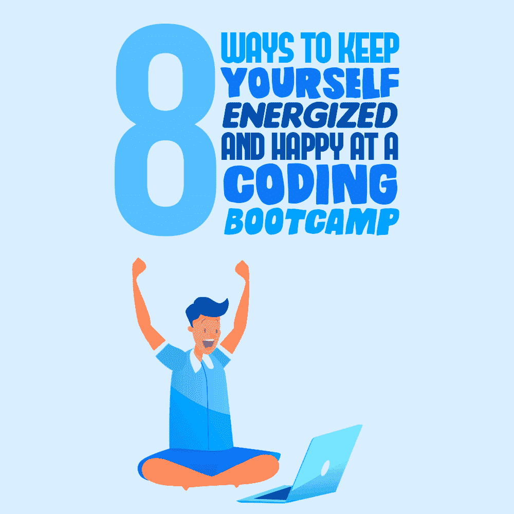

# 在编码训练营中让自己保持活力和快乐的 8 种方法

> 原文：<https://simpleprogrammer.com/avoid-burnout-coding-bootcamp/>

Coding bootcamps are intensive, stressful, and difficult by their very nature. You spend all day on something that might deep down be fun and cool, yet it’s also highly challenging. The aim is to learn a complete skill in a very short space of time.

编码训练营需要你绝对的、不可分割的注意力，有些甚至一周持续 80 个小时！如果你不小心，就会出现严重的倦怠，无论你在做什么事情，都会陷入困境，似乎找不到解决办法。

当你回到家，你可能会觉得再也不想编码了。这不仅是精神上和身体上的不健康，从长远来看对你的编码也没有好处。但在正常情况下，你可以从训练营回家，获得难以置信的技能和知识，这是你在其他地方很难获得的。

无论你获得了晋升还是一份新工作，这些知识都会让你的薪水增加 51%。然而，应该不惜一切代价避免倦怠。这可能是一个真正的挑战，尤其是考虑到训练营的性质。为了帮助你解决这个问题，这里有八个小贴士，可以让你的事情变得简单很多。

## 安排你的休息时间

休息是至关重要的，故事结束。你在做什么活动并不重要，休息一下应该是活动本身不可或缺的一部分。对于编码来说尤其如此，它要求你静止不动，盯着屏幕，长时间全神贯注。

[散散步，喝杯酒，](https://simpleprogrammer.com/productivity-proactivity/)换换风景；做一些事情来打破这一天。尝试在手机上设置提醒，这样你就不会忘记休息。在你工作的过程中休息一下是可以的。

一些编码训练营会教你如何休息。在一些训练营，他们甚至会让每个人立刻休息一下，参加一些放松的活动，比如瑜伽或冥想。

## 记住你是来学习的

不仅仅是做。参加编码训练营的最大好处之一就是能够从房间里的其他人那里汲取知识。

最重要的是，学习意味着永远不要害怕寻求帮助或建议。你可以问坐在你旁边的一个程序员同事或者一个领导者。你越是孤立地挣扎，压力和狭隘的视野就会加剧。把它挡在外面，转向其他人。

这不像学校——你可以在工作的时候和其他人说话。事实上，大多数训练营都鼓励这样做。我参加过的大多数训练营都有一些导师，我们鼓励你和他们交谈，他们通常是训练营的前学员。他们仍然记得在训练营的感觉，所以他们很有帮助。

## 恭喜你自己

很容易忘记你做得对的事情，尤其是当你周围都是和你做同样事情的人的时候。但是为了保持积极的心态，你应该时常缩小视野，并在胜利到来时庆祝胜利。花点时间拍拍自己的背，承认你正在取得的成就。

在我参加的一次训练营中，我和我的朋友会站起来握手，这是我们每次最终破解了那个 bug 或者解决了那个问题时发明的。我还听说，编码训练营创客学院有一个巨大的锣声，每当他们的毕业生找到工作时，他们就会响起来——还有什么比这更能激励参与者呢？

## 做准备

为这种经历做准备可能会令人困惑，感觉有点浪费时间。事实上，这是至关重要的。你从训练营中获得最大收获的方法就是为任何可能发生的事情做好准备。另外，[做好充分准备和知识渊博](https://www.amazon/dp/0091929784/makithecompsi-20)真的会让你精神振奋，这可以很好地抵御疲劳。

准备编码训练营的一个好方法是使用免费的相关在线编码资源——例如，练习你将要使用的编程语言。

## 选择有间歇的训练营

作为一名训练营项目的程序员，间歇期让生活变得如此简单。就倦怠而言，它基本上消除了风险，因为你永远不会长时间处于无法逃避的压力之下。

标准训练营通常专注于在最短的时间内教给你最多的东西，但是你不必经历这些。中场休息制度确实有效，被越来越频繁地采用。

我最近参加了一个使用这个系统的训练营，发现中场休息让体验变得更加放松。

## 不要放弃

希望你从这篇文章中得到的建议能确保你永远不会觉得自己需要放弃。但是如果你真的有这种想法，这里有一些建议:不要。这可能会很艰难，但完成训练营并完成工作后，你会感觉好很多。

当你想放弃的时候，试着回家休息一下。做一些让你放松的事情。想想看，完成训练营后，你可能会找到一份薪水翻倍的工作，并且可以展示你的新技能。

## 不要拿自己和别人比较

这是一个人们都有的古老缺陷，也是生活在一个社会中的不幸副产品:不要拿自己和其他人比较。你可能会看到某人似乎比你领先很多，工作效率更高，结果也更好。

不要去想自己哪里出了问题，甚至不要去想他们一定在某种程度上优于你，而是把注意力转向内心，专注于自己的努力。如果你在学习，你就赢了。

## 保持轻松

Coding is fun, or, at least, it’s meant to be! Try and keep that in your mind like a mantra to live by. The problem with taking it all too seriously is that your mood can easily turn to frustration, which is the first stop on the train to burnout, so just relax and enjoy the coding for the puzzle-like challenge it is.

在大多数编码训练营中，你肯定会收获各种有趣项目的成果。你可能会学到如何编写一些对你的生活有用的小游戏和工具。例如，在我的第一次编码训练营，我被教导如何制作一个定制的闹钟应用程序，我今天还在使用。还有什么比被告知熟悉玩 Connect 4 或 Uno 的机制更好的作业呢？

## 在训练营保持快乐和健康

精疲力尽会削弱你通过编码训练营取得成就的机会，所以避免把自己逼入困境真的很重要。希望这些建议能帮助你保持身心健康。

参加编码训练营会很有趣。我希望这些建议能帮助你选择适合你的训练营。有了这个建议，你可以充分利用你在训练营的时间，并享受它。你将能够从训练营出来，获得惊人的新技能，并充分利用它。