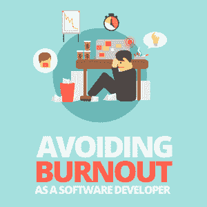
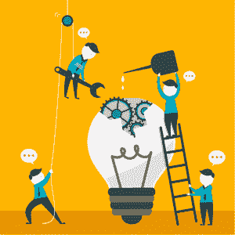

# 作为软件开发人员避免精疲力尽

> 原文:[https://simple programmer . com/avoiding-burnout-software-developer/](https://simpleprogrammer.com/avoiding-burnout-software-developer/)

Life as a Software Developer is about creating great software every day. You feel like less of a developer when you are performing at anything less than your optimum capacity. So every day, you do your best to turn in the best code possible and you try to keep doing that.

即使是机器也不会每天都有同样的效率。但在当今世界，每个人都在寻求更高的薪水和其他奖金，我们希望比下一个人更好，这样我们就能在月底拿到舒适的丰厚支票。

不要误会，想有同样的功效是好事；唯一的问题是永远知道什么时候你应该停下来休息一下，什么时候你已经完全筋疲力尽了，什么时候你需要休息很长时间才能继续工作。

因为另一个开发人员在他/她的计算机上呆了八个小时就意味着他做了更多的工作，这种想法是错误的。我们应该做更多的事情来理解工作不仅仅是基于花在工作上的时间。

我们工作的多少也是基于休息的时间和完全收回我们工作时消耗的能量。你希望每天都处于最佳状态，这意味着你需要给自己足够的时间来恢复，这样你就可以每天都处于最佳状态

以一个新加入公司的开发人员为例。他/她的目标是展示他/她能够真正实现公司想要实现的目标。为了表示他们能送货上门，他们会呆到很晚，并且是第二天第一个到达的人。

循环变成了工作，工作，工作，再睡一会儿。这种循环持续了一段时间，公司对该员工的产出印象深刻，也很高兴。他们开始给他发奖金和更多的津贴。随着时间的推移，自然因素开始出现，程序员开始交付比他以前交付的少一点。对于开发人员来说，他们仍然在尽自己最大的努力，但是对于组织来说，开发人员已经开始付出比他所能提供的更少的努力。

为了满足这种期望，开发人员继续把自己推得更高，直到他们无法再继续下去。在某些情况下，正是在这一时期，组织雇用了另一个人，一遍又一遍地开始同样的循环。很快，每个人都失去了动力和士气。该组织认为开发人员可以做得更多，并且开发人员认为他们已经尽了最大努力。

在这个阶段，已经达到了一个非常高的压力水平，曾经充满激情和协调的开发人员现在只是其他程序员中的一员。这个案例是真实的，许多程序员正以这样或那样的方式面临这个问题。

千万不要想:*嗯，这不会发生在我身上。*它发生在我们当中最优秀的人身上，当它发生时，你只是**筋疲力尽**。你需要的是被服务。汽车运行一段时间后得到保养的方式。

那么，开发人员如何防止这个问题，特别是对于刚进入公司编程领域的新开发人员，不再为了娱乐或课堂练习而编写代码？这里有一些我希望知道的建议，因为它们会对我有所帮助。我希望它们也能帮助你防止倦怠。

## 永远不要追求比别人更好，只求比自己更好

This is one of the famous lessons I learned from John Wooden, the legendary basketball coach: The only person you should be better than is yourself. Sometimes we burn out when we focus too much on what others are doing and how others are becoming better everyday while we are just following the path of the great programmers without ever catching up.

你需要的是制定一个个人计划，并按照你的计划去做。不去跟进别人的计划。寻求每天在你的道路上继续成长，而不是在别人的道路上。

制定一个目标，推动目标，并不断推动目标。重要的是专注于你想做什么和实现什么。不要让别人的成功或失败阻止你走自己的路。你的路是你的，也是你唯一的路。

有时间做有意识的练习。在学习如何学习中，强调的是学习需要专注，理解，然后刻意练习。深思熟虑的练习会让你学到更多的专业知识，而且学习你擅长的东西会更有趣，因为你需要应对的问题更少。

持续学习就是你如何通过向你认为比你更好的人学习来成为更好的自己。寻求指导和参加活动只是你提升自己的几种方式。但是永远不要把你的成功水平建立在别人的成功之上。

## 平衡工作和生活

这个建议太老套了，甚至其他行业的人都觉得有用。当我们一生只专注于工作时，我们有时会精疲力尽。想象一下一个程序员的生活，他每天只睡六个小时，然后回到工作岗位，除了他/她的当前工作之外，没有任何形式的参与。

当你问这样一个人关于他们自己的情况时，他们开始仅仅根据他们目前的工作来描述自己。问他们喜欢什么不喜欢什么，也是围绕着同样的事情。

热爱和珍惜我们的工作是很重要的，但缺乏平衡会让我们过于偏向一方，正如他们所说，任何事情太多都是不好的。

你需要有时间去做一些有意义的活动，这些活动可能与你目前的工作没有任何联系。抽出时间让你有更多的时间关注生活中的其他领域，在这些领域，你可以比现在的工作产生更多的影响和被影响。

想象一下，每个周末给一个小组上辅导课。这项活动让你有时间重新学习你已经知道的东西，并且对其他人的生活也有很大的影响。请记住，这是一个发现你从来不知道你能擅长的领域的好机会。

众所周知，没有时间锻炼和做更多让身体充满活力的事情是导致快速消耗健康问题的途径。问一些人为什么他们不锻炼，他们会给你无聊的解释，他们基本上太忙了。

好吧，如果你忙得顾不上自己的健康，那你来这里到底是为了什么？当你生病的时候，你想用这笔钱来照顾自己吗？对我来说，这听起来不对。

花些时间去寻找工作之外你可以积极参与的其他方式。除了工作之外，你还能做哪些同样能从中获得乐趣的活动。偶尔出去参加一些其他的活动，这些活动也能让你享受时光，也能对社区产生很大的影响。

## 照顾好那些小事情

The little things matter because the small things are what make up the big things. You should focus and pay attention to the very small things that accumulate to become very big things in your life as a developer.

注意你坐着的方式，你工作的方式，你吃的食物，以及其他很多在此刻对你来说似乎不太重要的事情。注意你在键盘上打字的方式。电脑屏幕的亮度。如果你想成为一名更长时间的开发人员，所有这些都很重要。

对于开发人员来说，这不仅仅是一份支付账单的工作，这是一份大多数开发人员充满激情地做的工作，他们希望尽可能长时间地继续编程，并且做一些可以使之成为可能的事情是一个需要始终关注的领域。

不做这些事情可能不会有任何立竿见影的效果，但是随着时间的推移，我向你保证，效果是显而易见的，你只能希望你做了这些小事。

## 食物、睡眠和锻炼是给聪明人的

当你问一些程序员他们是否安排了一些时间来锻炼和更好地发展自己时，你会得到有趣的答案，好像作为一名开发人员锻炼是一种犯罪。对一些开发者来说，你所要做的就是睡觉、吃饭和编程。仅此而已。

然而，要认识到，你身体中负责开发编写代码的想法的最重要的部分是大脑。所以问题是问大脑是否需要食物、睡眠和运动。答案很清楚——大脑需要很多这样的东西。

作为一名更好的开发人员，你必须总是想办法保证你休息和锻炼，[吃好的食物](https://simpleprogrammer.com/cooking-at-home/)以确保你能一直保持这种状态。

没有时间锻炼、睡眠和吃美食的观念应该被大大地劝阻。我们可以在不休息和保持健康的情况下，每天每时每刻都保持高效，这是我们需要从头脑中清除的观念。

## 永远不要抓住过去不放

因为我们过去失败了并不意味着我们将永远失败，因为我们过去赢了并不意味着我们将继续赢。不抓住过去不放意味着我们不应该让昨天的问题决定我们的今天。

有些人会比其他人更快达到精疲力竭的阶段。他们过于关注过去失败的次数。他们可能太努力地想找到一种方法来防止别人注意到他们的错误。他们太专注于不展示他们的真实生活，以至于工作变得不那么有趣。

总是寻找方法让你超越昨天的形象。昨天已经成为过去，你所拥有的就是现在。不要被昨天的行为所束缚。

求成长，求更好。但是不要抓住过去的问题不放，因为今天不再需要过去。让昨天成为过去，继续前进。

放下过去，你会意识到今天可以比昨天更好，今天的成功不应该由昨天的失败决定。培养这样的心态是帮助对抗和克服倦怠的好方法。

## 学习你当前领域之外的新思想

Working on the same language or software day in and day out can cause a great level of repetition which can, in no time, lead to boredom. Seek to learn a new way of doing what you are currently doing; for example, another language you can use for your work or a different kind of workflow.

学习一门新的语言可以增加多样性，并且可以大大降低无聊的程度。这意味着你每天可以做不止一件事。永远不要觉得你不能走出你的舒适区去做别的事情；你想要坚持的只是你每天做的一件事。

精通一种语言或框架是有意义的，但有时有一点多样性可以使工作不那么枯燥，更具挑战性。

通过克服无聊，你可以更好地战斗，更快地战胜你的倦怠。想象一下，你已经精疲力尽了，你每天坚持做的任务没有刺激或挑战你变得更好，这意味着你陷入了困境，你需要真正找到一种方法来克服这种情况。

寻找具有挑战性的任务可以帮助你远离疲惫，你很快就会意识到你不再疲惫。

## 做最好的自己，避免倦怠

作为一名开发人员，除了上面描述的方法之外，还有很多方法可以防止你精疲力竭。你可以轻松地在团队中讨论倦怠，这样他们就可以提出更好地解决他们的需求和情况的解决方案。

永远不要追求比任何其他开发人员更优秀的激烈竞争，并创建一个帮助您成长和跟踪您的成长的计划，可以很快注意到并防止倦怠。

保持工作与生活的平衡，确保你从生活中获得很多:健身和锻炼以保持健康，吃好的食物以滋养你的系统，以及照顾好小事也是你防止精疲力竭的方法。

我们都想成为最优秀的人，而确保做到这一点的一个方法就是避免精疲力竭。