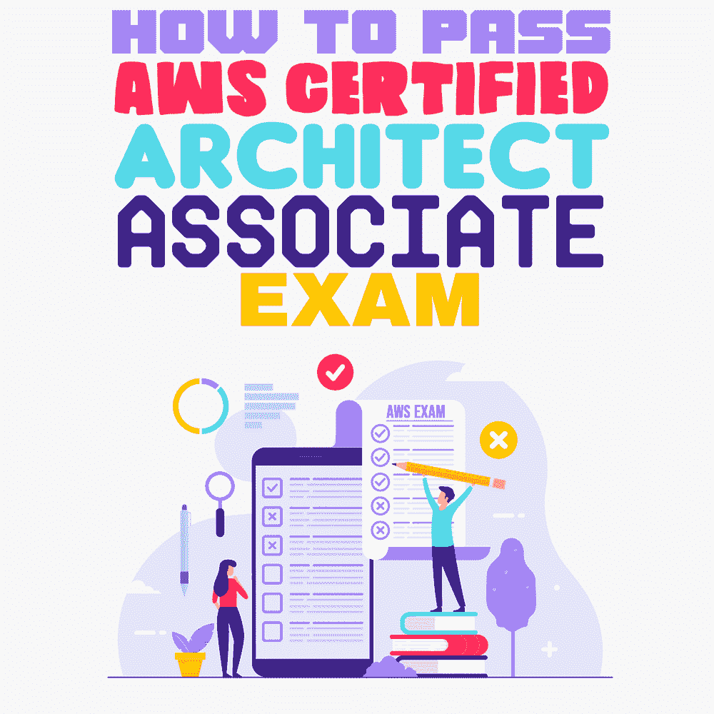

# 如何通过 AWS 认证建筑师助理考试

> 原文：<https://simpleprogrammer.com/aws-certified-architect-associate-exam/>

> 
> 
> “Failure doesn’t mean the game is over, it means try again with experience.”
> 
> 勒恩·施莱辛格

我最近通过了亚马逊网络服务(AWS)认证建筑师助理考试(woohoo！).这并不容易，需要做很多工作，但这一切都是值得的。这个认证可以帮助你[开始云计算](https://simpleprogrammer.com/career-in-cloud-computing/)的职业生涯。如果你想进入云计算领域，提升现有工作的技能，或者只是想通过个人发展考试，这篇文章很适合你。在这里，你会学到我用来通过这次考试的技巧、窍门和材料。

我的老板要求我通过考试作为一个工作延伸目标。然而，我面临的挑战，也是你们可能面临的挑战，是我没有全职从事 AWS 技术。我兼职参与了一个项目，该项目的一个组件使用了 AWS，所以我对 AWS 及其很多很多(我提到过有很多吗？)技术和组件。

为了通过架构师考试，您必须掌握许多这些技术的知识，因此最大的挑战是无处不在的先有鸡还是先有蛋的困境:我需要通过考试的经验，也需要获得通过考试所需的经验。

由于当时我是 AWS 领域的新手，没有人会考虑将生产甚至开发工作交给我，以便我可以进行实验和学习。我将向您展示我是如何解决这个难题的，您也可以这样做。

AWS 认证考试不同于我过去参加的任何考试。他们以场景为导向，期望的不仅仅是死记硬背。您必须知道好的云架构的原则，并且能够在现实场景中应用它们。

此外，该考试旨在混淆视听。这意味着对于任何给定的场景，都可能有两个正确的答案，其中一个根据所提的问题更加正确。你应该选择那个答案。

我写这篇文章是为了概述通过技术考试的一般程序。我将使用 AWS 认证建筑师助理考试作为蓝本，但这种方法可以用来通过任何技术考试。该方法由不同的步骤组成，每一步都有一个里程碑，每个里程碑都会引导你到达通过考试的目的地。

所以，让我们来分解这些步骤，以及每一步如何让你更接近你的目标。

## 第 0 步:一片漆黑

和所有优秀的程序员一样，我们会从 0 开始计数。在第 0 步中，你将对 AWS 及其不同的技术一无所知，就像我开始准备时一样。

既然你是 AWS 的初学者，你必须首先接触一些基础知识。现在还不要担心成百上千的技术，因为你在这一步的目标就是不要被蒙在鼓里。让我们创造一些光，好吗？

在这一步中，您必须完成 AWS 提供的以下免费初级课程。前往 [AWS 认证和培训](https://www.aws.training/)并注册一个培训帐户。

将此内容添加到您的学习模块: [AWS 云从业者基础知识](https://www.aws.training/learningobject/curriculum?id=27076)。请务必按照推荐的顺序完成。

接下来，前往 Coursera，旁听本课程: [AWS 基础知识:云原生化](https://www.coursera.org/learn/aws-fundamentals-going-cloud-native)。别担心，审计是免费的。

AWS cloud 上有许多其他初学者课程可供您学习，但这两个课程相当全面，涵盖了很多领域。如果你认为你需要额外的帮助，请随意使用任何其他初学者课程。

在这一点上，你只是想从黑暗中走出来，所以抵制诱惑，报名参加课程或参加实践考试。

在这一步结束时，您的里程碑是您将完成这两门课程，并对 AWS 有一个稍微清晰的了解。

## 第一步:清澈如泥

在这一步，你对 AWS 的大部分概念和技术并不清楚。但是，您对 AWS 中不同的重要术语有一些了解，例如区域或可用性区域。你现在准备好进行你的第一次购买。

前往 Udemy 并购买以下课程:[由云专家教授的 AWS 认证架构师助理](https://www.udemy.com/aws-certified-solutions-architect-associate)。(不要支付超过 15 美元。只要等到下一个美国重大节日，它就会上市销售。)

如果您愿意，您也可以购买以下书籍，并将其用作教科书:

*   [AWS 认证解决方案架构师学习指南:助理 SAA-C01 考试第二版](https://www.amazon.com/Certified-Solutions-Architect-Study-Guide/dp/111950421X/ref=sr_1_3?crid=1QDETG0RKCOTO&dchild=1&keywords=aws+architect+associate+study+guide+2020&qid=1600312766&sprefix=AWS+Architect+Assocaite+study%2Caps%2C169&sr=8-3)
*   AWS:亚马逊网络服务:亚马逊网络服务初学者完全指南

记住，学习不是来自于读书，而是来自于工作。

During your “Clear as Mud” phase, you must finish this entire course. The reason I am recommending this course is because Ryan Kroonenburg guides you from one step to the next, and with each video lecture there are multiple hands-on labs.

**不要跳过**任何实验，跟着 Ryan 一起做实验。我怎么强调都不为过。由于您对 AWS 的工作原理仍然模糊不清，所以了解架构的最好方法是实际进行架构设计。

跟随 Ryan，他会告诉你一些通过考试需要知道的东西。只有一点？那我为什么推荐这门课呢？我很高兴你问了。

没有哪门课程(有很多这样的课程)能够涵盖你准备考试需要知道的所有话题。任何人能做的最好的事情(Ryan 做得很好)就是让你熟悉 AWS，让你不再害怕控制台。

**暂时不要参加**任何课后测验或考试；我们会谈到这一点。这包括课程每一部分末尾的测验。我们将在下一步尝试这些。

在这一步中，你的里程碑是观看每一个视频，在不参加任何测验的情况下完成本课程的每一个实验。

## 第二步:半透明阶段

我把这一步称为“半透明阶段”的原因是，你现在知道了一些术语，你不再害怕 AWS 控制台，并且你已经通过大量的练习弄脏了你的手。

现在，您已经完成了本课程，请继续尝试期末测验。由于你第一次没有参加这些测验，你将会忘记大部分内容，并且很可能表现不佳。这就是重点。你还没有准备好进入下一关。

对于每一次得分低于 80%的测验，请再次观看部分视频并重新做实验。一旦你完成了一遍又一遍的复习，你就可以参加你的第一次模拟考试了。

继续尝试课程中包含的第一个模拟考试。警告:你不会做好的。你的分数可能只会比你随机猜测的分数稍微好一点(我的第一次分数是 34%，如果你在 MCQ 考试中随机猜测，你几乎可以保证有 20%的分数)。

不要因为结果而气馁。我们只是中场休息。游戏还没有结束。放松点，我保证你会成功的。

## 步骤 3:循环时执行…

Now that you have your first exam score, you are ready for the next step, which I like to call the “Do While Loop….” This step will take you the longest.

你会有你错过的考题和每个考题答案的解释。对于你答错的每道考题，你应该做以下的事情:

1.  阅读问题，首先理解被问到的问题以及为什么你答错了。
2.  Google 一下这个主题，阅读与这个主题相关的 AWS 文档。
3.  找一个你以前没看过的关于该话题的视频，看一下。YouTube 是你的朋友。
4.  找一篇博客文章，描述如何做问题问你的事情，然后在你的 AWS 控制台上实际做。
5.  通过谷歌找一个题目的实验室，做实验室。如果实验不涉及在 AWS 控制台中实际执行某些操作，它就不是一个好的实验。

例如，我在练习中漏掉的一个问题与身份和访问管理(IAM)有关。我是这样做的:

1.  我在 IAM 上看了 SimpliLean 的这个视频。
2.  我在 IAM 上做了这个 qwiklab。
3.  我阅读了 AWS 文档中关于该主题的章节。

那么，while 循环在哪里呢？这是你的算法。如果您上次考试的分数低于 80%，您必须对错过的每个问题重复上述步骤 1-5。那就继续，再考一次。不要两次参加同一个样本考试。

如果你下一次考试的分数也低于 80%，那么对那次考试中错过的每个问题做步骤 1-5，并尝试另一次考试。起泡，冲洗，然后重复。对于你参加的每个样本考试，你可以预计学习大约 20 到 40 个小时，同时提高你的分数大约 10-15%。以下是我的日程表:

| **考试编号** | **得分百分比** | **学习的总小时数** |
| one | 34% | Forty |
| Two | 44% | Eighty |
| three | 57% | One hundred and twenty |
| four | 66% | One hundred and forty |
| five | 71% | One hundred and sixty |
| six | 77% | one hundred and eighty  |
| seven | 80% | Two hundred |

没错，在我达到 80%的里程碑之前，我花了 200 小时的总学习时间，12 个月，7 次抽样考试。这也是你的里程碑。继续重复直到你到达那里。

这里有一些资源可以帮助你:

*   [Udemy 上的模拟考试](https://www.udemy.com/aws-certified-solutions-architect-associate-amazon-practice-exams/)
*   [SimpliLearn 上的免费样题考试](https://www.simplilearn.com/aws-solutions-architect-exam-free-practice-test)
*   [亚马逊的免费样题](https://d1.awsstatic.com/training-and-certification/docs/AWS_Certified_Solutions_Architect_Associate_Sample_Questions.pdf)

大脑转储是从真实考试中复制的实际考试问题，违反了每个学生在考试时签署的保密协议。一定不要使用任何来自互联网的大脑转储。如果你已经参加了上述课程中的两个考试，花钱从一个可信赖的供应商如 PearsonVue 购买一个样题。

脑残使你的证书贬值，而且你不可能因为作弊的考试而得到或保住一份工作。在现实生活中，你不会知道答案，一旦你被发现考试作弊，你的职业生涯很可能会倒退十年。所以不要做。在这里阅读关于大脑垃圾的文章。

我使用的其他资源:

*   [SimpliLearn YouTube 频道](https://www.youtube.com/user/Simplilearn)
*   [Edureka YouTube 频道](https://www.youtube.com/user/edurekaIN)
*   [AWS YouTube 频道](https://www.youtube.com/user/AmazonWebServices)
*   [AWS 在线技术讲座频道](https://www.youtube.com/user/AWSwebinars)

## 满怀信心地参加 AWS 认证建筑师助理考试

在这一点上，如果你已经遵循了上述所有的指示，你应该参加考试，并有可能通过第一次尝试。然而，就问题的难度而言，抽签总是有运气的。

我个人没有通过第一次尝试，因为我的第一次考试包含一些相当难的问题。任何考试都可能发生这种情况，所以如果第一次没有通过也不要气馁。我考了 69%的及格线，72%是及格线，第二次考试及格了。这是一个漫长而艰难的过程，但非常值得。

这就是了。如果你想改变职业或作为 IT 专业人员进入云计算领域，AWS 认证架构师助理证书是一个突出你技能的好方法。有了上面概述的步骤，你应该能通过考试，并能追求许多令人兴奋的新机会。祝你考试顺利。