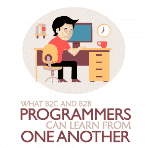

# B2C 和 B2B 程序员可以互相学习什么

> 原文：<https://simpleprogrammer.com/b2c-and-b2b-programmers/>

What is the difference between developing a consumer-level product and an enterprise one in the current landscape?

为了理解，我们必须首先考虑这些分类意味着什么。企业对客户公司，或称 B2C，有许多基于客户服务的项目。与专业人士或高管相比，他们无疑是在与普通消费者合作并建立关系。这并不是说他们的观众有时不能是同一个——只是需要不同的关注点。

另一方面，企业对企业(B2B)公司正在慢慢转变为以消费者为中心的观点，但仍然是以企业为中心。

它们仍然相关，因为无论产品和服务是否直接到达个人手中，最终产品都会到达消费者手中。对于每种类型的团队来说，从一开始就应该首先考虑客户的优先事项。

B2B 和 B2C 市场的每一方都在完全独立的规模上运作。B2B 有不同的配额，需求和目标，比典型的 B2C，同样可以反过来说。需求的不同带来了解决许多相同问题的不同方法。

当今现代技术的影响导致社会希望在商业交易中保持稳定，这意味着 B2B 和 B2C 的方法最终会重叠。以下是这两种商业模式的程序员可以互相帮助的几种方式。

## B2B 与 B2C 开发者

一个[开发人员是一个开发人员](https://simpleprogrammer.com/becoming-better-software-developer/)，所以无论他们是在 B2B 还是 B2C，他们通常处理相同的任务和概念。真正的区别出现在最初的专业化，或者产品或服务的适当设计阶段。

B2B 产品和服务主要是改善或增强现有的业务流程。这不仅仅是提供一种“体验”——正如你在消费者方面看到的那样——而是提供更有效的方式来完成事情。这就是为什么，你会注意到，许多 B2B 工具和服务往往是现有产品或平台的翻版。

作为一名开发人员，这使得你的角色更多的是产品或平台的设计和可用性，而不是整体体验。你倾向于花更多的时间考虑 UX 设计、交互、参与和平台怪癖。换句话说，与 B2C 产品相比，你会更注重从服务中获取额外的效率和性能。

这并不是说 B2C 开发者有时不关注同样的事情。

例如，B2B 云存储提供商可能更专注于为其他企业提供解决方案和产品——想想亚马逊 S3——而 B2C 提供商可能更面向消费者，如 Dropbox 或 Flickr。这两个平台都为数字数据、文档和内容的存储和检索提供云服务，但你可以从一开始就看到它们是如何显著不同的。

非商业服务 Dropbox 可能被用来存储照片、简历、个人文档等等。与此同时，亚马逊 S3 处理虚拟主机、商业和客户数据、分析数据集等等。

## B2B 能从 B2C 学到什么？

随着 B2B 慢慢变得更加关注终端产品和客户，各方面都在进行一个学习曲线，将消费者而不是其他企业放在第一位。B2B 程序员最好的起点是设计。

### 1.统一设计

虽然 B2B 服务通常有大量的功能，但是他们的网络工具很难使用。简单和极简主义在设计程序时变得流行，因为它们是为任何人使用而构建的。即使 B2B 项目拥有世界上最好的工具，如果人们不知道如何使用它们，它们也毫无意义。

Sacrificing features for simplicity may become a problem. While it’s possible to keep many features when moving over to a more minimal and user-friendly interface, not everything will be saved. There's going to be cuts on many fronts, unfortunately, but better design means the features already in the program will get used by someone.

更好的设计是让客户乐于使用服务的开始，但不是结束。也许你的 B2B 不依赖于交互式程序，而是为用户提供不同的服务。在这种情况下，客户仍然想知道发生了什么，而不需要任何技术术语或复杂的网站。消费者希望知道他们的钱花在哪里，希望了解产品的最新进展。

### 2.社区更新和参与

客户希望参与到业务流程中，尤其是当他们的钱岌岌可危的时候。虽然该公司为消费者提供每一个过程的一步一步可能很乏味，但这种例行程序只能支持 B2B。顾客会在他们的业务中感到更加安全，产品必然会发展得更快。

你会注意到许多 B2C 公司在整个开发过程中，甚至在发布之后，都与他们的客户分享这种关系。它有助于确保客户从产品或服务中获得他们想要的东西，并为企业提供关于他们所做工作的重要见解。例如，你可以很容易地指出在你的观众不使用的功能上浪费的时间，并将你的注意力转移到其他地方。

虽然透明是一件好事，但大多数消费者喜欢把事情掌握在自己手中。如果 B2B 允许客户自己提供服务，这将是一个巨大的优势。随着越来越多的人希望控制自己的支出，自助服务变得越来越受欢迎。不是每个 B2B 都可以提供自助服务门户，自助服务也不是期望的，甚至不是必要的。不管怎样，从长远来看，赋予消费者权力是有益的。

### 3.自主和重复

自动化正在成为商业世界以及客户服务中的一种常见做法，在这种情况下，任务往往是机械的和重复的。从电子邮件和通信等次要职责到开发前瞻性聊天机器人和程序等主要职责，autonomy 提供了简单性和效率。

通过利用收集的用户数据，联系人甚至可以[个性化。当有数以千计甚至数百万计的客户时，理解个人可能是复杂的，但有了自动化程序，这是可能的。该系统可以自动保留和处理与平台交互的用户信息。然后，它可以将这些信息反馈给客户服务软件，以提供更加个性化的相关体验。](https://www.information-age.com/how-implement-personalisation-b2b-support-services-123465755/)

## B2C 能从 B2B 学到什么？

B2C 公司不会很快改变他们的优先事项。在 B2C 公司中，顾客总是第一位的，所以他们通常会考虑顾客服务。B2C 程序员可以从 B2B 程序员那里学到的是如何在内部层面上顺利工作。顾客可能是第一位的，但是如果内部崩溃，业务就不会繁荣。

### 1.扩展设计技术和控制

还是那句话，起点在于设计质量。虽然大多数用户喜欢像谷歌这样的大公司组织他们非常直观的网站的简单方式，但一些用户想要更直观的体验。如果极简主义不起作用，也许添加更多可用的功能会很方便，而不会与 B2B 的亲极简主义方法相矛盾。

B2C 已经了解客户需要什么，想要什么。添加的功能应该只是为了增强用户体验，而不是因为过于复杂的技术或混乱的界面而导致问题。如果需要多一点复杂性，如果客户想要增加功能，那么只会有好处。

### 2.增强的开发人员技能

Programmers in B2C companies could also benefit from B2B expertise in [handling internal affairs](https://simpleprogrammer.com/developer-communication-skills/). Crisis management from within can [help cut down on panic](https://www.business2community.com/brandviews/teamsupport/b2b-vs-b2c-differences-customer-service-interactions-02043645) with fast-approaching deadlines or the plethora of problems a power outage brings.

在 B2B 团队中，在这方面，团队领导和决策者必须能够对专业化做出快速而准确的选择。最终，这有助于提高团队的整体技能，增加支持和运营效率。同样的情况也可以延伸到 B2C 世界，人才、可靠性和生产力不仅成为团队成员梦寐以求的价值，也成为优先考虑的事情。

这也可以归因于 B2B 公司如何经营规模。B2C 和 B2B 团队的一个显著区别是规模，这改变了他们的个人需求。虽然 B2C 可以从 B2B 学到很多东西，但没有必要马上这么做。事实上，试图以超过必要的规模经营只会阻碍业务，而不是帮助。目前，B2B 可以传授的技能比 B2C 客户服务技能要少。

## 有效地混合两种分类

在未来的任何时候，B2B 和 B2C 公司都不会成为一个实体。在自由市场中，只要还需要大企业，这两者将永远保持分离。但这并不意味着界线有时不会模糊。

无论是因为美国经济衰退还是千禧一代简化技术，B2B 公司变得更加以客户为中心，B2C 公司变得更加高效和注重绩效。正如您所料，这将对这两种分类产生深远的影响。

只要竞争保持健康，就会有比以往更多的方式来迎合消费者。最终可能不会合并，但两个实体在结构上可能会变得天衣无缝。更多的是学习或改进各种平台，以提供新鲜、更有效、更令人满意的东西。