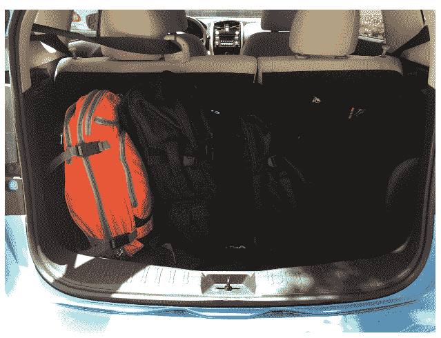
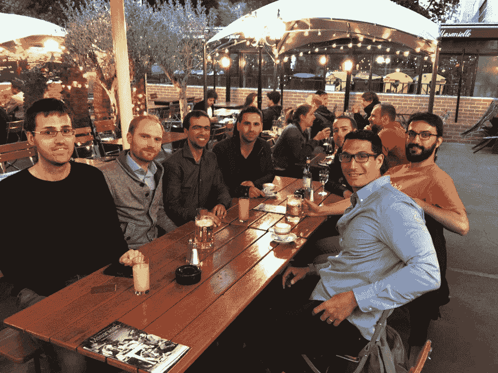
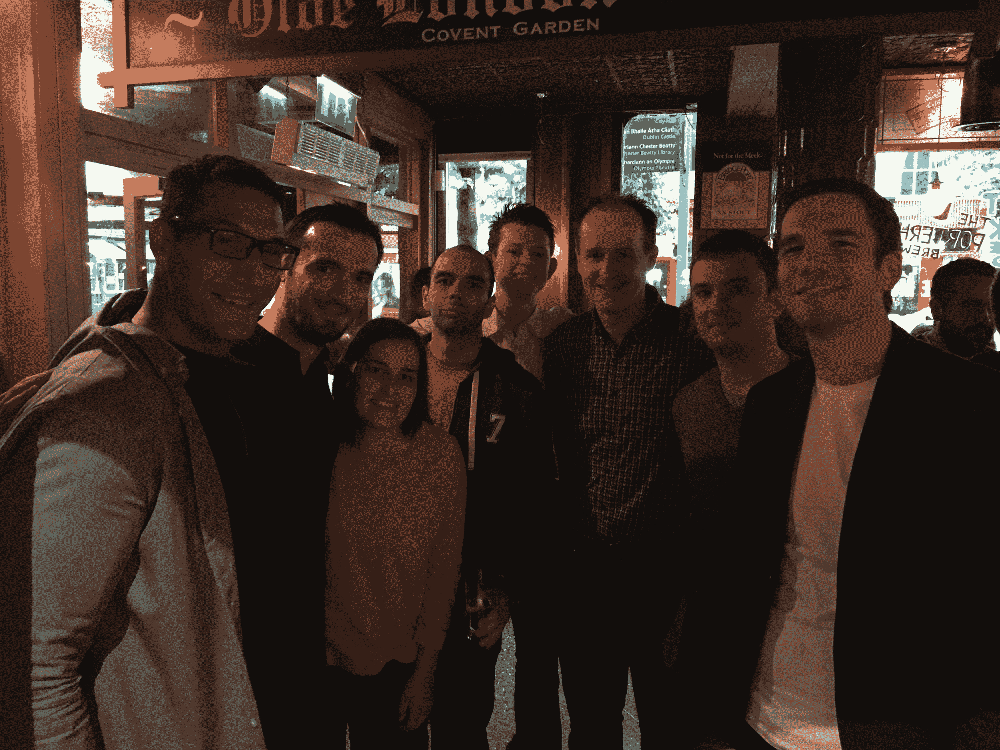
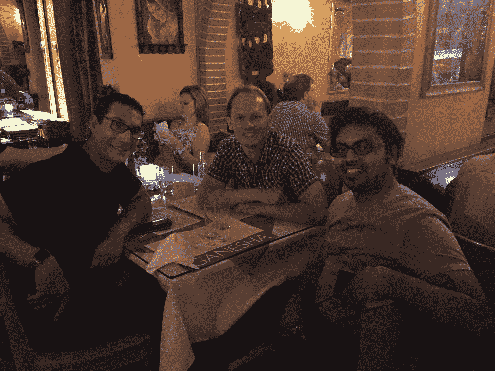
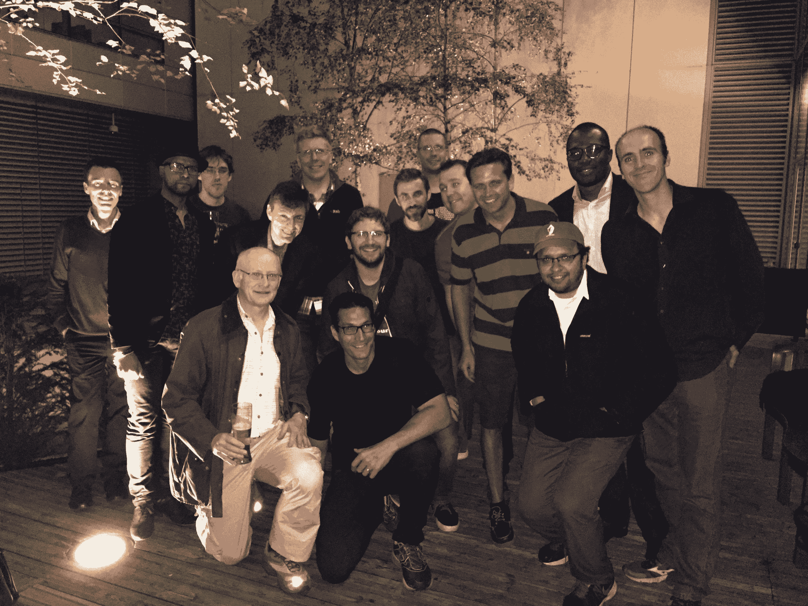
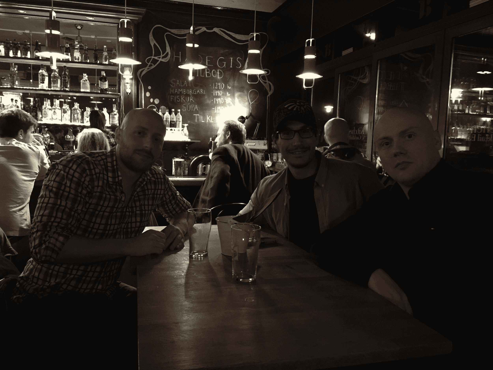

# 从欧洲回来并更新

> 原文：<https://simpleprogrammer.com/back-from-europe-and-updates/>

好了，我为期三个半月的欧洲之旅终于结束了。

实际上，我正坐在我的办公桌前，用我可爱的 4k 显示器和鼠标在真正的键盘上写这篇博客。

[换成我的 13 英寸 Macbook Pro](https://simpleprogrammer.com/2015/05/04/my-journey-to-finally-ditching-my-desktop-pc/) 对这次旅行来说很好，但有一把舒适的椅子和多一点屏幕空间也很好。

(正如我在边上提到的，我认为对我来说更理想的设置可能是在家里有一台 5k 分辨率的 iMac 和一台 Chromebook，甚至是一台新的 MacBooks，因为这些天我的很多工作都是在网络浏览器上进行的。)

无论如何，我想我应该为简单的程序员写一篇类似“国情”的文章，谈谈我的旅行和 SP 的未来。

## 漫长的旅程…

今年 5 月 30 日我启程去欧洲旅行，最后在 9 月 14 日回到佛罗里达州的坦帕。

我带着妻子、4 岁的女儿和三个背包。

就是这样。

在回家之前，我们从巴黎旅行到了柏林、爱尔兰、布鲁日、阿姆斯特丹、伦敦、冰岛的雷克雅未克，最后到了纽约。

这是一次不可思议的旅行，但是当我们回到家的时候，我已经准备好回到日常生活中去了。

在旅途中，我将周五作为工作日。

我在其他日子做一些小任务，比如回复邮件，但是星期五是我完成大部分工作的日子，这些工作是运行简单的程序员所需要的。

这次旅行最终是对一些新过程和自动化的一次很好的测试，我一直在帮助简单的程序员更顺利地运行，甚至在某种程度上，在没有我的情况下。(稍后将详细介绍。)

我在旅行出发前预先录制了一些 YouTube 视频，但我也在途中录制了一大堆视频。

如果你想看看我旅途中的视频，我整理了一个播放列表，你可以在这里查看。

我甚至通过参观欧洲各地的许多健身房来保持我的跑步和举重习惯。我非常担心我会在那里失手，但我把它作为保持正轨的优先事项。

T2 我从这次旅行中学到了很多东西——不仅是关于世界、历史、不同的人和文化，还有关于我自己。

一个有趣的观察是，这次旅行实际上并不是度假。有一些放松的部分，但背着背包生活三个多月并不停地移动是相当累人的。

我玩得很开心，但在旅行结束时，我开始觉得我需要休假。

好消息是:在我再次旅行之前，我已经准备好回到正常的生活和工作中去了。

(哦，对了。实际上，我在旅行时有机会欣赏一本小说。如果你还没有读过《火星人》，我强烈推荐。我还完成了史蒂文·普莱斯菲尔德的《[之火之门](http://www.amazon.com/exec/obidos/ASIN/055338368X/makithecompsi-20)另一本很棒的书，我很容易就给了 5 颗星。)

## 聚会

在我四处旅行的时候，有一件事我觉得很棒，那就是在我去过的许多国家聚会。

我没有在每个地方都有聚会，但是我能够在我去过的大多数地方组织聚会。

我甚至有两个简单的程序员出现在我的冰岛聚会上——多酷啊？

以下是每个聚会的一些照片:

在柏林的一家意大利餐馆吃饭。柏林是我最喜欢的城市之一。

在都柏林的一家酒吧。爱尔兰是最让我惊讶的地方之一。结果和我预想的完全不同。

阿姆斯特丹的印度餐厅。我真的很喜欢这个城市的所有自行车。

在伦敦一家非常拥挤的酒吧外面。如此不可思议的城市。我喜欢公共交通的高效。“小心差距。”

在雷克雅未克市中心的一家餐馆。冰岛可能是我见过的最独特、最令人惊叹的景观。也贵得要命。

感谢所有来接我的人——尤其是在这么短的时间内。

见到来自世界各地的简单程序员读者真是太棒了…好吧，嗯，整个欧洲。

## 一些简单的程序员更新

现在我回来了，我为简单的程序员计划了很多。

这个博客和社区在过去的几年里有了巨大的增长，我想继续为软件开发社区提供尽可能多的价值。

在我出发去旅行之前，我意识到我一个人做不到。

我不仅雇佣了一些员工来帮助运行简单程序员的日常操作，而且——我相信你已经看到了——我已经开始邀请社区中的其他作者为博客写作。

扩张带来的一个担忧是失去控制和降低产品质量。

我很高兴地说，一直在投稿的才华横溢的作家让我感到惊喜。

我希望你已经喜欢了新的作者和观点，他们贡献了自己独特的声音，但仍然留在这个博客的精神。

在接下来的几个月里，我会更加努力，所以如果你有兴趣为简单的程序员写作，[让我的编辑团队知道这里](https://simpleprogrammer.com/write-for-us/)。

## 论坛和社区

我前进的一大重点是围绕简单的程序员创建更多的社区。

部分灵感来自我旅行时的聚会。

我意识到，几乎在每一个大城市，都有素不相识的程序员读者。

我也收到了许多我的博客课程的毕业生的来信，他们希望有一个认识彼此的方式，并有一个他们可以互动和分享想法的地方。

我还认为，简单的程序员需要一个新的收入来源，以进一步发展和接触更多的开发人员。

因此，在接下来的几个月里，我将致力于打造一个优质的社区体验，简单的程序员成员将能够互相帮助，分享他们的经验，结识志同道合的开发人员，甚至从我这里获得一些个人帮助。

我想创建一个赋权和支持的社区，让那些认真改善职业生涯、推销自己和实现目标的软件开发人员能够聚在一起，共同发展。

## 新产品

我还计划发布一些新产品和资源，尤其是围绕软技能和企业家精神的主题。

我收到了许多关于建立品牌、发展博客、发展人际技能和管理职业生涯的更深入内容的请求，我想开始讨论其中的一些话题。

我也很惊讶有这么多的人要求更多关于创业和成为企业家的内容。

这是一个我没有过多谈论的话题，因为我认为大多数阅读这篇博客的程序员会对推进他们的职业生涯感兴趣，而不是建立他们自己的企业，但是我非常乐意帮忙。

我喜欢谈论企业家精神和商业。

我还收到了一些关于更深入的技术内容的请求。

到目前为止，我的大部分技术内容都是通过 Pluralsight 发布的，但我可能也会在这里发布一些课程。我得考虑一下，但这是我正在考虑的事情。

## 绘制路线

一周前刚回来，我还没有时间坐下来计划未来的课程。

我在考虑花几天时间静下来，真正专注于为简单的程序员绘制前进路线。

有这么多潜在的工作领域和这么多的项目，但关键是决定哪些是最重要的，什么行动将是最有效的。

在接下来的几周里，我会对事情的发展有一个更好的想法，但现在我可以告诉你，我很兴奋能够回到事情的轨道上来，看看我们能走多远。

感谢所有支持我的博客、观看过我的 YouTube 视频、给 T2 买过我的产品、给 T4 读过我的书的人。

我期待着在未来尽我所能为您服务。

特别感谢赞助这篇文章的[泽法](http://www.getzephyr.com/)。泽法是敏捷开发和软件测试领域的思想领袖，也是 Simple 程序员的长期合作伙伴。如果你正在寻找一个[测试管理解决方案](http://www.getzephyr.com/)，我强烈推荐他们。