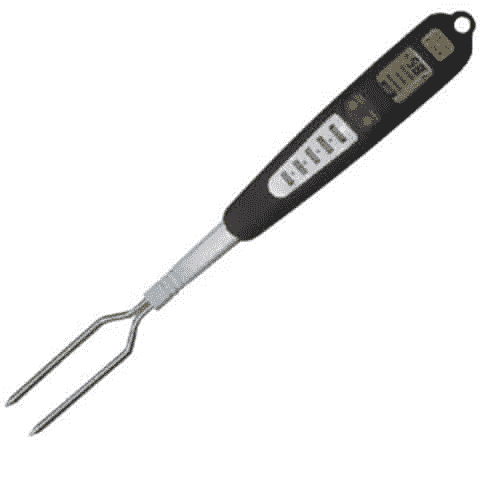

# 单元测试和自动化黑盒测试

> 原文:[https://simple programmer . com/back-to-basics-unit-testing-automated-black box-testing-and-decisions/](https://simpleprogrammer.com/back-to-basics-unit-testing-automated-blackbox-testing-and-conclusions/)

如果你从[回归基础系列](https://simpleprogrammer.com/back-to-basics-series/)的[开始](https://simpleprogrammer.com/2010/10/30/getting-back-to-basics-introduction-and-why/)一直关注我，你会知道我开始重新评估一些公认的最佳实践真理，特别是关于单元测试、依赖注入和控制容器的反转。

我们已经讨论过[什么是接口](https://simpleprogrammer.com/2010/11/02/back-to-basics-what-is-an-interface/)、[内聚耦合](https://simpleprogrammer.com/2010/11/04/back-to-basics-cohesion-and-coupling-part-1/)，甚至稍微偏离了一下轨道来讨论一下[排序](https://simpleprogrammer.com/2010/12/07/back-to-basics-sorting/)。

在大多数帖子中反复出现的一个主题是单元测试。我谈到了[为什么单元测试很难](https://simpleprogrammer.com/2010/12/12/back-to-basics-why-unit-testing-is-hard/)，我定义了单元测试的三个层次。

*   第 1 级–我们有一个单一的类，没有外部依赖，也没有状态。我们只是在测试一个算法。
*   第 2 级–我们有一个没有外部依赖的类，但是它有状态。我们正在设置一个对象，并将它作为一个整体进行测试。
*   第三级–我们有一个至少有一个外部依赖的类，但是它不依赖于它自己的内部状态。
*   第 4 级–我们有一个单独的类，至少有一个外部依赖，并且依赖于它自己的内部状态。

在本系列中，我最终放弃了只使用单个非单元测试实现的接口。我批评了为了单元测试的唯一目的而过度使用依赖注入。我攻击了很大一部分最佳实践，我觉得它们实际上只是为了能够孤立地对类进行单元测试而使用的。

但是，我从来没有提供解决方案。我告诉你什么是坏的，但我从来没有告诉你什么是好的。

我说不要创建所有这些额外的接口，在你的应用程序中使用 IoC 容器，到处模仿，只是为了能够隔离你想要进行单元测试的类，但是当你问我要做什么时，我说“我不知道，我只知道我们正在做的是错误的，我们需要停止。”

嗯，这不是答案，但我现在打算给一个答案。几个月来，我一直在思考这个问题，研究这个话题，自己做实验。

## 我终于有了答案

但是，在我给你之前，我想给你一点我对这个主题的立场的背景。

我来自一个相当坚实的单元测试和测试驱动开发的背景。至少在过去的 7 年里，我一直在宣扬这两者。

我从一开始就支持依赖注入和 IoC 容器。我甚至推出了自己的工具，以此来帮助隔离真正单元测试的依赖关系。

我认为单元测试和 TDD 是非常好的技能。我认为每个人都应该学习它们。TDD 真正帮助你编写面向对象的代码，只负责很小的集中领域。

但是，经过这么长时间，我终于得出结论，在很大程度上，单元测试和实践 TDD 通常比软件对编码人员更有好处。

什么？我怎么能说出如此亵渎神明的话？

事实是，作为一名开发人员，我个人通过学习和实践 TDD 而成长，这使我能够构建更好的软件，但不是因为单元测试本身做了很多。

事情是这样的，当我感觉到为依赖关系创建模拟和在我写完代码后试图进行单元测试的痛苦时，我正在学习减少依赖关系和如何创建适当的抽象。

我觉得当 IoC 框架最弱的时候，我学到了最多，因为我被迫最小化依赖，因为我很痛苦地试图创建如此多的 mocks，或者根本无法对一个类进行单元测试。

我现在已经知道发生了两件事:

1.  我不再需要 TDD 训练轮了。我并不假装是某种编码神或半神，但是一般来说，我用 TDD 或 BDD 风格编写的代码与我不用它编写的代码几乎完全一样。
2.  IoC 容器使得向我的构造函数传递 50 个依赖项变得如此容易，以至于我不再感觉到导致我的单元测试让我编写更好的代码的痛苦。

当我写单元测试的时候，我发现自己最终得到的是 70%的模拟代码，它验证了我的代码以一定的顺序调用了某些方法。

很多时候我甚至不能确定我的单元测试实际上是不是在测试我认为的东西，因为它太复杂了。

## 嗯，你说你有答案了吗，伙计？

是的，我有一个答案。我只是想在我抛弃这些年的实践知识和良好实践之前，确保你理解我的想法。

我不是敌人。

如果你不应该仅仅为了单元测试而在你的代码库中使用 IoC 容器和接口，我的回答是采取一种双管齐下的方法。

1.  大多只写 1 级或者 2 级单元测试。如果你只有 1 个或者可能 2 个依赖项，偶尔写 3 级单元测试。(我将在下一篇文章中详细讨论如何做到这一点)
2.  花费你大部分的精力，所有你会花在编写单元测试上的时间，而不是写我称之为黑盒自动化测试或 BATs 的东西。(我曾经称之为自动化功能测试，但是我认为这个名字太模糊了。)

我打算在一些即将到来的帖子中深入探讨这些方法，但是我想简要地谈谈为什么我建议用这两种方法来代替传统的 BDD 或 TDD 方法。

## 有什么好处？

第一个显而易见的好处是，你不会因为注入依赖关系的复杂框架和其他聪明的事情而使你的产品代码变得复杂，这些事情实际上使单元测试变得更加容易。

同样，我不是说你不应该使用依赖注入、接口或 IoC 容器。我只是说，当它们提供真正切实的价值时，你应该使用它们(大多数时候，这需要接口的替代非单元测试实现。)

想想看，如果你在需要的时候创建一个具体的类，你的代码会变得多么简单。如果你没有为它创建一个额外的接口，然后在构造函数中传递它。你只是把它用在你需要的地方，就是这样。

第二个好处是你不会花太多时间去写硬的单元测试。我知道当我为一个特性编写代码时，我通常会花至少一半的时间来编写单元测试。这主要是因为我正在编写 3 级和 4 级单元测试，这需要大量的模拟。

嘲笑杀死我们。嘲笑有负面的投资回报。创建它们不仅耗费时间，而且会将我们的测试类与系统紧密耦合，使它们变得非常脆弱。另外，模仿给单元测试增加了巨大的复杂性。嘲讽通常会导致我们的单元测试代码变得不可读，这使得它几乎毫无价值。

多年来我一直在写模拟作品。我知道书上的每一个技巧。我可以告诉你如何用 Java，C#，甚至 C++来实现。这总是令人痛苦的，即使是自动模仿库。

通过跳过困难的单元测试，并找到聪明的方法使更多的类只需要 1 级和 2 级单元测试，你就使你的工作变得更加容易，并最大化地利用给你带来高 ROI 的活动。据我估计，1 级和 2 级单元测试会产生很高的 ROI。

第三个好处是黑盒自动化测试是你整个系统中最有价值的测试，现在你将会编写更多的测试。这些测试有很多名字，我现在称之为 BATs，但基本上这是大多数公司所说的自动化。不幸的是，大多数公司把这项工作留给了 QA 自动化工程师，而不是开发团队。不要误解我的意思，QA 自动化工程师很棒，但数量不多，好的很贵，责任不应该直接落在他们肩上。

蝙蝠测试整个系统一起工作。BATs 是你对整个系统的自动化回归测试。BAT 是自动化的客户验收测试，BAT 中每一行代码的投资回报率要比每一行产品代码的投资回报率高得多。

为什么？这怎么可能呢？这都是关于杠杆宝贝。BAT 中的每一行代码可能会运行 5 到 500 行生产代码，这与单元测试的情况完全相反，在单元测试中，每一行单元测试代码可能平均只测试 1/8 或 1/16 行生产代码(取决于所达到的代码覆盖率)。)

我将把细节留到以后的文章中，但是我强烈认为开发团队的大部分精力应该放在 bat 上，因为 bat

*   对客户有很高的价值
*   回归测试整个系统
*   每行代码都有巨大的投资回报率(如果你创建了一个合适的 BAT 框架)

想象一下，如果您的系统中的每个 backlog 项目都有一个 BAT，您可以在开发过程的每个迭代中运行它，那么您的软件质量会有多高。想象一下，当你知道你有一套自动化的测试可以捕捉到几乎任何功能上的缺陷时，你对系统的改变会有多自信。

难道你不认为放弃编写第 3 级和第 4 级单元测试是值得的吗？这些单元测试已经很痛苦了，而且开始实现起来也不是很有趣。

在我以后的回归基础系列文章中，我将深入讨论如何通过提取逻辑到没有依赖关系的独立类中，将更多的代码推入到 1 级和 2 级单元测试中，并且我将更多地讨论 bat，以及如何开始并成功地使用它们。(提示:你需要一个好的 BAT 框架。)