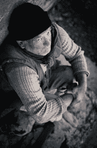
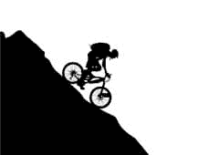
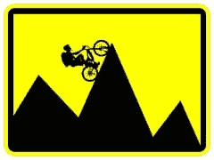
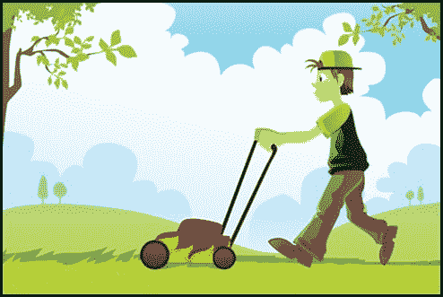

# 坏建议:“不要再这么努力工作了”

> 原文:[https://simple programmer . com/bad-advice-stop-working-so-hard/](https://simpleprogrammer.com/bad-advice-stop-working-so-hard/)

最近我在[黑客新闻](https://news.ycombinator.com/news)上看到了不少帖子，关于为什么你不应该工作得太辛苦，[甚至说你一周的工作时间应该少于 35 小时。](https://medium.com/i-m-h-o/ef4772e3c628)

不要误会我的意思。我认为这些文章的作者是了不起的人，他们完成了巨大的事情。我没有不尊重这些伟大企业家的意思。我只是认为他们中的一些人搞不清他们现在在哪里，以及他们是如何到达那里的。)

我们会希望生活在这样一个世界里吗？在这个世界里，更努力的工作并没有带来更多，反而回报更少。

我知道很多人一周工作不到 35 个小时，我不会说他们在做一生中最好的工作。

相比之下，我知道很多人每周工作 50 到 60 个小时，他们正在做一些令人惊讶的事情。

## 你现在必须努力工作，才能在以后获得收益

在帕特·弗林的播客每一集的开始，他都会说

> **“欢迎来到智能被动收入播客，这里所有的一切都是关于现在努力工作，这样你就可以坐下来，在以后收获收益。”**

这是没有办法的。这是工作中播种和收获的原则。

虽然许多善意的博客作者敦促你不要在晚上加班，而是花时间做你想做的事情，过工作之外的生活，但他们已经忘记了他们是如何走到今天的。

如果你正处于人生的那个季节，那么请接受他们的建议。他们百分之百正确。有一个收益递减点，你并没有因为更努力地转动轮子而获得更多的收益。

你骑自行车下山时速度很快吗？

你知道，一开始你可以开始踩踏板，这实际上会让你更快地下山，但在某个时候踏板就开始自己旋转？

你到达了这样一个点，你实际上不能足够快地移动你的腿来做出很大的改变。每隔几秒钟，你的脚就会碰到一点点阻力，这告诉你你实际上做了一些事情，但大多数时候你只是旋转你松动的踏板，而不是实际上增加任何速度。

用最少的努力从山上冲下来的感觉非常好。没有必要像上山时那样猛踩油门。如果你在这一点上疯狂踩踏板，不仅是浪费你的努力，而且你错过了享受骑行最好部分的时间。

## 你必须先爬山，然后才能驾船下山

当骑自行车时，只有一种方法可以让你毫不费力地滑下山——你必须先爬上一座山。

**高度向下改变，需要先前的高度向上改变。没办法回避。**

骑自行车上山是一项艰苦的工作。

你不仅要不断努力把自行车推上山，而且每次你停止踩踏板，你就有向后滚的危险。

你越想越快地爬上山坡，你就必须越用力地踩踏板，你就越有可能累垮并滚下山坡。

骑自行车上山时，没有休息，没有休息。你能做的最好的事就是下车一会儿，步行上山，但那肯定会让你慢下来。

一般生活也是如此。

## 我的私人山丘

我想相信这个故事，我们可以放轻松，好事就会来，但现实情况是，你必须首先投入工作——努力工作。

我 18 岁开始买房产。我买了我的第一套房子，这是我今天仍然租用的。

从那以后，我每隔几年就以大约 1 英镑的速度购买房产。

这并不容易。为了能够做到这一点，我付出了巨大的牺牲，但是从我开始的时候，我就知道我是在骑自行车上山。

在过去的 15 年里，我也一直是全职开发人员。在那段时间，我在晚上和周末工作，处理我的房地产、建筑应用程序，最近[为 Pluralsight](https://simpleprogrammer.com/pluralsight) 创建在线课程。

直到今年年初，我才终于能够辞掉为别人工作的固定工作，开始完全为自己工作。

两年多来，我每周都要在晚上和周末加班加点，才能到达那里。

就在去年，我在过去 15 年里进行的所有房地产投资都开始在我的口袋里放了一些钱。

我仍然处于每周工作 60 小时的状态。我还在爬山。

但是，好消息是我可以看到顶峰，我知道如果我继续踩下踏板，我将到达顶峰，从那里我可以滑行下来。

## 我的建议

不要相信有办法避开艰苦工作的想法。

停止逃避艰苦的工作，开始拥抱它。我从经验中了解到，总的来说，逃避艰苦的工作比做它要花费更多的努力，而且逃避艰苦的工作不会带来长期或短期的好处。

做出正确的牺牲。

不要为了出人头地而牺牲婚姻或家庭。最终，它会让你落后。记住，没有比离婚更费钱的追求了。

腾出时间和你的配偶在一起，如果你有孩子的话，每天留出时间和他们一起玩。请一天假享受家庭日。

相反，从这个列表中选择牺牲:

*   看电视
*   和朋友出去玩
*   玩游戏
*   闲荡
*   浏览网页

是的，可能会有一段时间很糟糕，但是如果你现在想爬上那座山，这样你以后就可以顺流而下了，你必须做出一些牺牲。

不要浪费时间。

以下是我不做的事情的清单:

*   修剪我自己的草坪
*   洗我的车
*   打扫我的房子
*   任何类型的家居装修工作

我为这些东西付钱，并把这些时间花在——不是坐在沙发上看电视——而是努力做我最擅长的事情。努力做一些能给我带来更多钱的事情，这些钱比我花钱请别人做我在这份清单中提到的其他事情要多得多。

我使用一种叫做“花式手”的服务来处理许多我可以委托出去的耗时任务。通过使用这项服务，我节省了大量的时间和金钱。*(披露:该链接是我对该网站的推荐链接。)*

每次我做事情的时候，我都会问自己是否应该付钱给别人来做这件事。如果你的时间完全溜走了，开始追踪它。

减轻你的负担。

想让骑自行车上山变得更容易吗？

很好，你要做的就是少带东西。

这意味着，降低你的开支。开始明智地使用你的钱。

还债，不要欠债。不要因小失大，但同时要学会节衣缩食。

如果你学会一个月靠 2k 生活，猜猜你需要多少钱生活？没错 2k。

如果你背负着债务和开支，所以你需要每月 10，000 元来生活，你将不得不更加努力地踩踏板…只是说。

(如果你想读一本帮助你学习这种思维方式的好书，那就去读罗伯特·t·清崎的《富爸爸穷爸爸》。)

## 一切都归结到这一点

为了有一个更好、更轻松的明天，现在就要愿意努力工作。

不要试图走捷径或快速致富，那些道路会导致灾难和浪费时间。

相反，如果你现在为别人做全职工作，每周给自己 10 个小时的“你的时间”，在那里你为自己工作。

现在就花点时间把生意做起来。做出这样的牺牲 2 年或 5 年，或者无论多长时间，让你的自行车被推上山。

不要放弃，不要害怕努力工作，不要被任何宣扬通过少做事快速致富和休闲的传教士所吸引。

记住，那些每天出现的人最终会打败更快和更聪明的人。