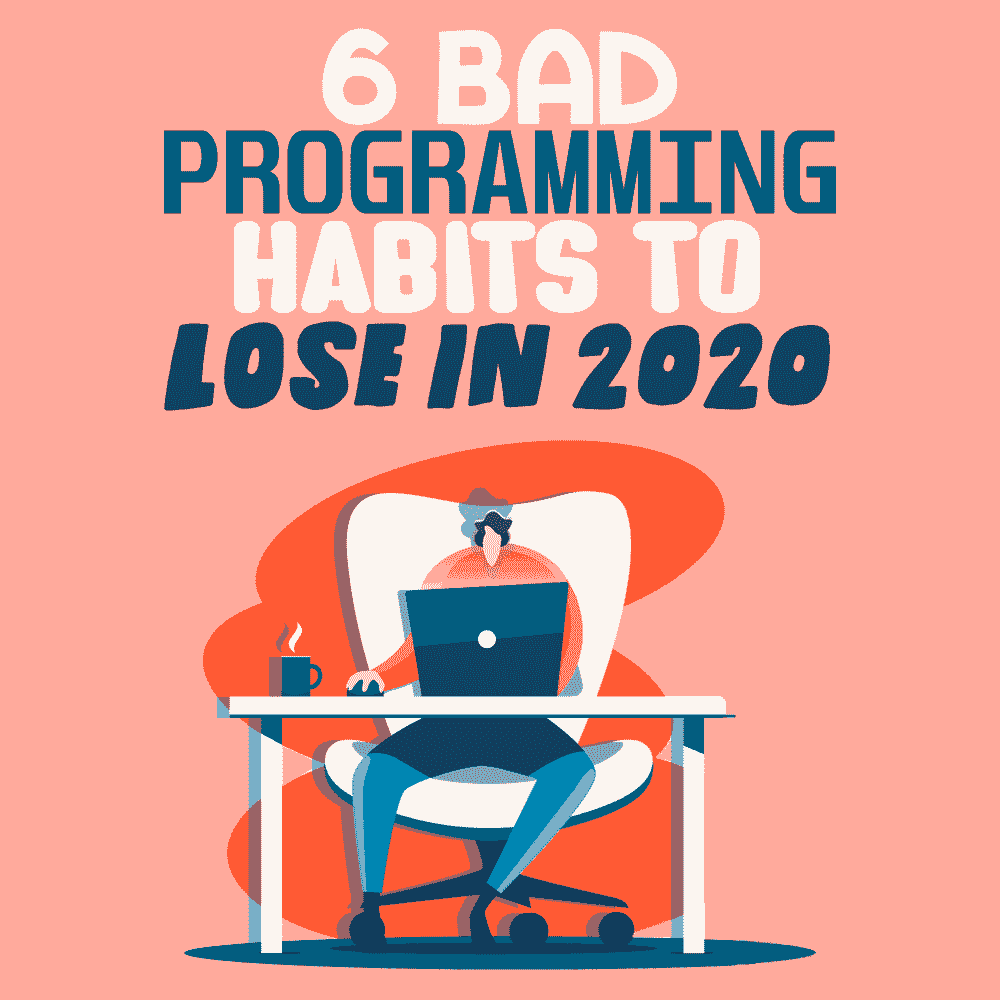

# 2020 年要改掉的 6 个坏编程习惯

> 原文：<https://simpleprogrammer.com/bad-programming-habits/>

The coronavirus pandemic is shaking up a lot of programmers’ working lives, [posing new challenges](https://simpleprogrammer.com/challenges-remote-workers-face/) and threatening old ways of working.

与此同时，在家那段意想不到的宁静时间是一个很好的机会，让我们重新评估我们的工作方式，并尝试改变那些阻止我们发挥作为程序员的全部潜力的消极或无益的做法。

这些负面的做法真的很重要，甚至——或者尤其是——在远程工作环境中。团队变得捉襟见肘，沟通比以往任何时候都更加困难，这意味着任何非生产性的习惯都会给工作带来麻烦。

在远程工作时，也很容易偏离正题。幸运的是，封锁是改变这些习惯和提高程序员技能的绝佳时机。毕竟，你有一套独特的技能。有了正确的习惯，你现在真的可以有所作为。

让我们来看看影响程序员工作效率的六个最具破坏性的习惯。我也会和你分享如何改掉这些习惯，为未来打下良好的基础。

## 盲目复制粘贴

互联网是学习和成长的绝佳资源，尤其是对那些从事网络开发的人来说。但是，当你无法方便地获得同事的建议和商业资源时，使用互联网的方式会限制你成为程序员的潜力。

例如，每个人都至少在他们的一个项目中使用过他们在网上找到的代码，但是不经检查就盲目地将其复制粘贴到您的项目中是一个浪费的机会。

花点时间了解一下您找到的代码。弄清楚它是如何解决你的问题的，它的基本结构。当然，如果它非常复杂，没有人会期望你知道它所有错综复杂的细节，但是花一点时间去理解复杂的代码将会使你下一次需要实现类似的解决方案更容易，甚至是你自己可以做的事情。

分析你过去的项目，从新的挑战中学习，你会成为一个更强的程序员。为了检查你对代码的理解，看看你是否能写一个程序或脚本，凭记忆做同样的事情。

## 没有风格或结构

过于依赖其他程序员复制粘贴的解决方案的程序员经常会陷入第二个陷阱，即他们的代码没有连贯的风格结构。对每段单独的代码使用注释并分解子例程应该有助于提高代码的可读性。

对代码没有任何预定的计划会让你看起来像一个没有提前思考的业余爱好者。此外，这也给你的其他团队成员带来了更多的困难，他们很难得到你的澄清和解释，他们可能不得不处理你的代码。

技术专家 Dando Rylan 说:“架构和代码的小规模风格对于尽早实现和保持一致以避免项目变得混乱和难以管理是非常重要的。此外，拥有预先确定的架构和风格有助于其他人在查看您的代码时找到自己的位置并理解您的思维过程。”

所以[发展你自己的风格](http://www.amazon.com/exec/obidos/ASIN/B00JDMPOSY/makithecompsi-20)让你自己和其他人清楚地理解你的代码在审查时做了什么。享受创造自己独特签名风格的乐趣。

## 态度

态度或观点是一个相当广泛的范畴，但它值得一些关注，因为你对工作和他人的态度是影响你的工作关系的主要因素，尤其是在我们被迫远程工作的考验时期。

不幸的是，有一种刻板印象认为程序员不合群，难以相处，这种刻板印象的基础是普遍的不良态度。

这些不良态度中最主要的可能是表现得好像你什么都知道。假设你是对的，其他人都是错的，或者你是唯一能解决问题的人，这不仅会给别人留下傲慢和居高临下的印象，还会给你带来不必要的压力。当你的代码受到批评时，与这些消极态度相关的是防御性的。

然而，当你远程工作时，良好的态度对于良好沟通和完成项目至关重要。

尽量谦虚地接受你的工作可以做得更好，别人可能会帮助你做得更好。此外，查看一些关于在编程业务中有效沟通的文章和技巧，成为一名关系专家。你将最终拥有更好的工作关系和更强大的代码。

## 通宵工作

即使你从来没有为了完成一个项目或赶上一个截止日期而通宵工作过，你也可能作为一名程序员在办公室呆过至少一个深夜。在我们目前在家工作的环境下，结束熬夜特别容易，因为工作日和下班时间之间的界限比以往任何时候都更加模糊。

虽然这可能很常见，但强迫自己在晚上工作实际上弊大于利。

科技作家 Rami Salik 建议说:“真的要让自己考虑一下你熬夜工作是否是有成效的工作。”“如果你不得不在早上修改和重做，那么你在深夜写多少行并不重要。归根结底，我们都是人，我们需要时间休息以保持身心健康。从长远来看，拒绝休息几乎肯定会影响你的表现。”

即使你没有上班，也没有通勤，试着仍然坚持同样的例行公事，典型的朝九晚五的时间表，5 点下班。

## 跳过文档

文档是良好团队协作的另一个方面，它将使你的工作变得容易理解。文档经常被认为不重要而被搁置一旁；毕竟你知道自己做过什么，在做什么，为什么还要写下来呢？

答案是，让团队成员之间的沟通更顺畅。如果没有实际存在的好处，团队成员可以简单地走到同事面前询问，顺畅的远程沟通非常重要。

缺少文档是编程中最令人失望的事情之一。它延迟了新团队成员的入职和培训。做你的文档可能是一件苦差事，但是像任何苦差事一样，它最终必须被完成。少做多做容易得多。

## 至善论

Perfectionism is a tough habit to break. As much as I wouldn’t want to advise anyone to do worse programming, there are some situations in which striving too hard for perfect code is actually hindering your progress.

有时候，当涉及到运行实验、修复紧急错误或满足最后期限时，只需要编写简单有效的代码(甚至勉强有效)，花太多时间来完善代码是浪费时间。

如上所述，在家工作时，生活在完美主义中意味着你很容易发现自己花了几个小时去做一些恰到好处的事情，尤其是当你觉得没有其他事情可做的时候。

我能建议的就是学会何时应用你的技能。当然，总会有需要完美代码的时候，或者需要完全优化元素的时候。然而，从长远来看，有些时候优化代码会使代码更难理解。

试着记住项目的大目标，让你的代码朝着这个目标前进，而不是过于专注于短期的表现。

## 打下良好的基础，以便将来受益

因此，如果你在家工作，有更多的时间为自己工作，改掉这些坏习惯，养成良好的工作习惯，将在疫情结束后很长一段时间内对你大有裨益。

即使在正常情况下，在远程工作中坚持工作也是困难的。但随着许多企业对远程工作的投资增加，这种工作形式似乎会在一些员工中存在。

你可能会发现自己长时间远程工作，现在养成这些积极的习惯将会在很长一段时间内帮助你。

因此，在这些测试期间，祝你在自己和你的编程上工作愉快，从这种封闭中以一种全新的态度出现在你的工作中。