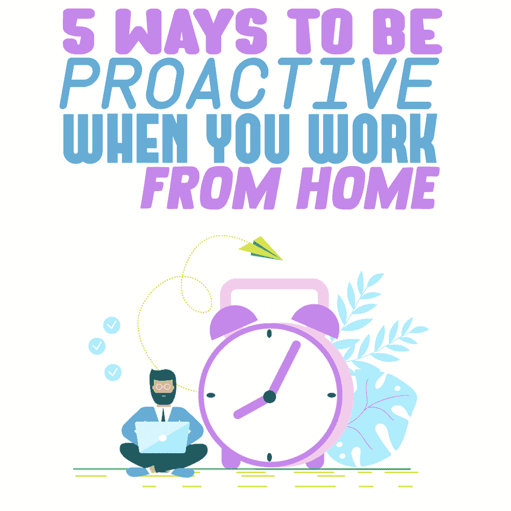
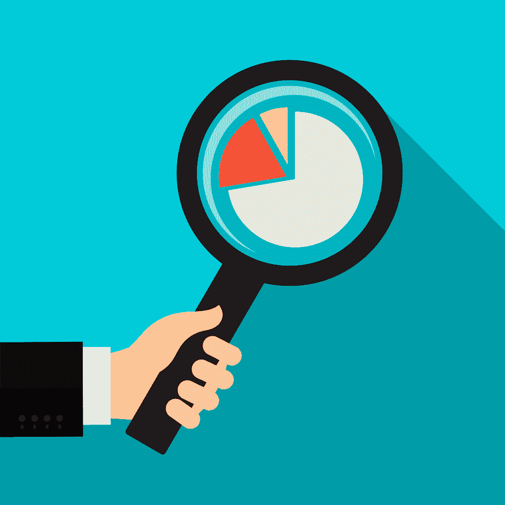
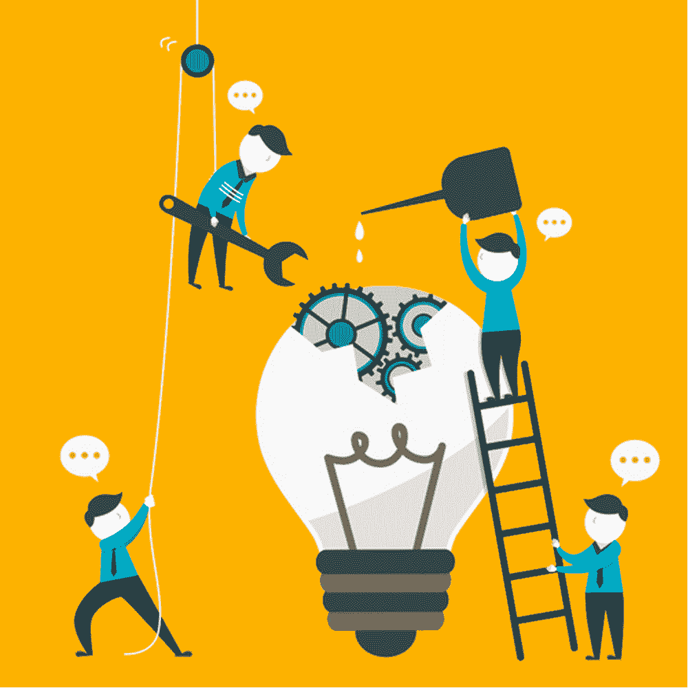

# 在家工作时积极主动的 5 种方法

> 原文：<https://simpleprogrammer.com/be-proactive-working-remotely/>

Unless you live on Mars in radio silence, you know how the COVID-19 virus has deeply affected us all. Regardless of whether you are currently working from home or not, there is still a lot you can do with the time you have at your disposal. Being proactive in your mindset will greatly improve your performance and help you grow as a person and as a professional.

对许多人来说，情况是可怕的，如果不是完全可怕的话。可以理解为什么这么多人试图一天一天地熬过来。然而，简单地压制恐惧并等待它结束会损害你的心态。

就我个人而言，我达到了接近筋疲力尽的压力水平，这影响了我的动机、表现、快乐、健康，以及我生活的几乎每一个方面。从紧张的状态中抽身出来比一开始就保护你的健康要困难得多。我能够重新站起来的唯一方法就是积极主动，朝着对我来说很重要的几件事情努力。

为了我们所有人的安全，我们必须保持距离，直到我们从新冠肺炎那里找到更有效的治疗方法。这是不可能的。这并不是说，一旦情况好转，你就必须保持警惕和紧张。相反，你可以先发制人，在回到办公室后做得更好。

你可以读更多的书，变得更有知识，你可以学会生活技能，这将使你的生活方式更加健康和可持续。例如，你可以学习办公室友好的快速简单的食谱，或者你可以锻炼增强耐力和灵活性，减少背痛。

另一个选择是发展兴趣爱好或艺术方面——这可以帮助你解决工作中的问题。所有这些都建立在你的整体个性和技能上，并会在以后以某种方式帮助你。最棒的是你可以选择业余时间做什么！

## 为什么你应该积极主动

你可以把这段时间想象成你生命中的一个巨大的停顿，不耐烦地等待它结束。或者你可以认为这是一个自我反省的时间，也是一个成为更好的人的挑战。为了充分利用在家工作的时间，你需要积极主动。作为一家开发医疗保健技术的公司的一员，我的目标就是这么做。

但是什么叫积极主动呢？根据[这个定义](https://www.lexico.com/definition/proactive)，它的意思是“创造或控制一种局面，而不仅仅是在事情发生后做出反应。”

在我们无法真正控制周围发生的事情的时候，仍然有一些事情是我们可以控制的。比如我们如何花费时间和精力。我们可以选择引导他们两个来提高我们自己。

积极主动地承担责任需要更高层次的自我参与和自律。这肯定比简单地按兵不动直到形势过去要求更高。但是，如果你能够承受病毒的所有负面影响，并从中获得一些好处，这种努力是值得的。

### 你如何积极主动

很好，现在我们知道我们需要有一个积极的心态。但是那个*到底是什么意思呢*？我如何在日常生活中运用积极主动的价值观？根据你目前的情况，积极主动会有所不同。

对一些人来说，简单地提前 30 分钟起床是迈向不那么匆忙的早晨生活的积极步骤。对于其他人来说，报名参加一门课程并承诺获得一个证书是朝着更好的工作前景迈出的一大步。

你应该找到一种方法来定义主动性对你意味着什么。你需要在对你来说重要的生活领域积极主动，帮助你成长为个人和专业人士。

我个人建议每个人申请并设定积极的个人目标，以及职业目标。对我来说，这意味着每天至少锻炼 15 分钟。即使我不喜欢拉伸，我也会主动选择拉伸——这对我有好处。无论你选择为自己设定什么目标，这里有一些步骤可以指导你在你选择的领域做得更好。

## 定义你的优先事项

As I already mentioned, being proactive brings in the most value if you focus your efforts toward the most important aspects of your life. It takes a while to build a solid foundation of healthy practices. But once you do, you can add on top of them with additional tweaks and improvements as you go—or change your focus to another area and improve in different ways.

第一步是确定你的优先事项。你希望在哪些方面表现得更好？你想在工作中取得更大成就吗？你在这个行业的知识和经验是在增长还是停滞不前？你的[软技能](https://simpleprogrammer.com/softskills)是否阻碍你追求更多的管理职位？你想提高你的收入潜力吗？你想改善你的健康和体力，以及外观？

想想你一天中想做什么，并将其与你实际完成的事情进行比较。它们对齐了吗？如果不是，那就调整你的一天，让它更接近你对自己的看法。

你也应该评估你生活中的优先事项。如果是家人，你和他们在一起的时间够吗？如果是健康，你做你需要做的事情来变得更健康吗？如果是渴望更有技巧，你是否有意识地推进你的知识？如果答案是否定的，那么你已经明确了你的优先事项，并可以开始采取措施过上符合你价值观的生活。

## 一次一个目标

你有明确的优先事项吗？你知道哪些价值观是你信奉的，但执行得不够吗？

你的目标是什么？现在你知道你的优先事项是什么，你可以开始设定一个具体的，可衡量的目标来努力。例如，你可以和家人约定一个谈话的时间。

假设你有你的优先事项和你的具体目标。我的首要任务是保持健康。我的目标是获得充足的睡眠来辅助这一点。

你可能有很多不同的目标，这些目标在你生活的不同领域都有所不同。但是你需要专注于其中的一个，把其他的放一放。你不能同时做所有的事情。你要么让自己不知所措，要么每一项都得不到理想的结果，因为你无法给予你的目标必要的关注，你很可能会失望和气馁。

所以从你生活的一个方面开始吧。写下你所有的优先事项，然后进行排序。现在对你来说最重要的是什么？用你的习惯建立一个足够坚实的基础来改善它，以至于你几乎可以自动保持它。然后拿起你生活中清单上的下一个优先事项，开始在你的方法中引入小的富有成效的改变。

## 评估适合你优先考虑的习惯

一旦你选择了你的关注点，你就需要有一个真正的想法来帮助你变得更好。假设你想学习一门新的编程语言来拓宽你的专业范围。什么样的习惯会让你的目标受益？你可以经常做些什么来让你有一天把这种技能加入到你的简历中？

你可以参加编程课程，或者从网上数以百万计的资源、书籍、视频、指南和教程中挑选任何一种，开始一点一点地学习。养成每周练习这种编程语言的习惯。

最好每周只留出一个小时*来培养这种技能，而不是一天抽出八个小时，然后两个月就忘得一干二净——因为，当你回去试着继续时，你可能会忘记你所学的一切，不得不重新开始。*

## 研究研究研究。

Whatever skill you choose to work on to better your quality of life, you need to have a good idea of what you are doing. Once you have chosen what you want to focus on for the foreseeable future it is time to do your research.

尽可能找到与该主题相关的任何信息。人们通过哪些不同的方式达到了你想要的结果？在你的生活中，有哪些可靠的资源可以让你运用健康的做法？

你从一开始就了解得越多，结果就越好，你就能越快达到目标。互联网是你最好的朋友。你可以找到任何你想知道的东西，所以利用它。

了解如何使用搜索运算符。例如，如果您将一个短语放在引号中，您将只能得到包含该短语的结果。你可以在这篇文章中了解更多关于不同操作符[的内容。](https://ahrefs.com/blog/google-advanced-search-operators/)

## 寻找不同的职业发展方式

虽然我报道的大部分内容都是关于个人成长的，但是现在个人发展和职业成长已经深深地交织在一起了。作为一名开发人员，你可能希望在你所选择的领域提高自己的专业水平。或者你可能想拓展到不同的技术领域，或者跳到一个管理岗位。如果你只是坦率地接近你的经理，你可能会对你所能取得的成就感到惊讶。要求与他们会面。

你可以讨论你想去哪里，从专业角度来说。你可以分享你的目标，但要准备好一个具体的计划，告诉你如何在公司内部实现目标(这正是你的研究派上用场的地方)。请公司支持你，因为你希望将这种个人成长用于公司未来的成功。

告诉他们你打算做什么，这样你就可以达到你能做到的程度。问问他们是否愿意支持你，给他们提供替代方案的机会，或者让你知道他们愿意为你做什么。

一次简单、直接的会面可能会为你带来更好的职业前景，也会因为你在努力扮演自己在公司的角色时表现得开放和积极而赢得经理的尊重。取决于你如何展现自己，这可能是一个双赢的局面。

## 一次一点点

积极主动会给你的日常生活或职业生涯带来巨大的飞跃。或者，当你开始新的一天时，这种改变可以小到一种新的心态。每一步都很重要，尽管看起来很小。日积月累的影响是显著的，如果不是令人震惊的话。

不断努力提升自己会很累。你在实践主动性上投入得越多，你在情感上付出的代价就越多。然而，拥有成长的心态并不一定意味着你需要一直做出大的改变——更重要的是在追求伟大的过程中保持一致和可持续。把它当成一场马拉松而不是短跑。

比方说，你想积极参加体育锻炼。你设定你的目标，不管它们是什么。然后你热情地决定每天上班前训练两个小时。那将意味着总共十个小时的训练。

如果你在做这个决定之前几乎没有锻炼过，会怎么样？你认为你能坚持多久？其他因素呢，比如你必须早起多长时间才能到达健身房并准时上班？一个关键的习惯改变，比如改变你的作息时间，也会改变你需要多早回家来获得充足的睡眠。这反过来会影响你的社交生活。

这对你来说是一个可持续的选择吗？你能想象这样做六个月吗？一年？两年？

做出改变不应该是一个临时的解决方案，而是一种生活方式的改变。所以你应该用一种坚持的方式来对待它。试着一次引入一点点运动。想想你能在很长一段时间内可持续地做多少事情。开始时每周两次，每次一小时。这样做，直到你觉得这是可行的，易于维护。

然后选择是否要添加更多的持续时间或频率。在一天结束时，一周四次，在家里定期进行 30 分钟的快速锻炼，持续一年，将比几个月来每天在健身房锻炼两个小时，只是因为筋疲力尽而放弃，保证更好、更持久的结果。那你就得从头再来。

## 发挥创造力

Aside from going out, there really is no limit to what you can do at home. Challenge yourself, learn a craft, become more physically active, read more, expand your knowledge, dabble in hobbies you were curious about but never actually tried.

只有你自己知道你能在生活中改善什么。只有你知道你有什么资源可以支配，什么对你来说足够重要，值得你去关注和奉献。不管你和你的经理讨论的是个人目标还是职业目标，现在是时候给自己留点时间，并承诺在几个月后离开你的家，成为一个更好的人。

当疫情结束时，你想通过什么方式变得更好？不管是什么，设定你的目标，制定一个计划，日复一日地展现给自己，哪怕只是一次一点点！