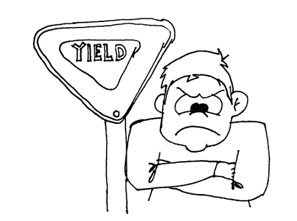

# 可教，可指挥，可批判

> 原文：<https://simpleprogrammer.com/be-teachable-be-command-able-be-critique-able/>

有三个主要原因可以解释为什么我看到程序员，一般来说是见鬼的人，感到压力过大，失败并最终筋疲力尽。

*   他们不能从别人身上吸取教训
*   他们不能接受别人的命令
*   他们不能接受别人的批评

我把这三种品质归为“屈服”品质。

事实是人们不喜欢屈服。

我们似乎不是那样被建造的。自我往往会成为阻碍，导致我们错过成长和繁荣的机会。

我自己也时常为此感到内疚，尤其是在我职业生涯的早期。

它让我失去了友谊。

它让我失去了成长的机会。

最重要的是，这花了我很多时间。因为我们需要学习的课程，我们将会学习，生活会确保这一点。学习它们需要多长时间取决于我们自己。

这三课都是相似的，都是关于学习一些东西。我们可以争论可教性和可批判性是否是分开的事情，或者甚至我是否可以创造像可批判性这样的词。

但是，不管怎样，这是我的三条经验，并不是说我已经完全学完了。

## 第一课:可教

在这一课适用的所有方式中，有一种方式让我印象深刻…

这是一个有点奇怪的场景。

我在看一场星际争霸 2 比赛的现场解说。(《星际争霸 2》是非常受欢迎的即时战略游戏之一。它有着难以置信的战略深度。它的竞争也令人难以置信。)

比赛评论员正在评论其中一名球员的表现，我们称他为我们的英雄。嗯，我们的英雄是个相当有经验的玩家。他的技术水平可能和评论他的剧本的人一样高，甚至更高。

解说员会说一些非常基本的事情，这些事情是游戏策略的基础。他会指出我们的英雄在这种情况下应该如何做这做那。他甚至会提出一些基本的观点，比如我们的英雄应该按什么按钮，以及他应该如何握住他的鼠标或手。一些很基本的东西，显然我们的英雄已经知道了。事实上，他所做的一些评论听起来太简单了，对一个那样水平的球员来说几乎是贬低。

然而让我惊讶的是我们的英雄是如何回应的。他一次也没有为自己的行为或自己辩护。他完全理解并认可了评论员对他的比赛所说的一切。他没有浪费精力，没有浪费时间，没有浪费一口气来为自己辩护或证实他对所听到的事先了解。他只是让评论员说的每一个字都渗透进去，知道其中一些可能没有用，但对所有这些都心存感激。

我立刻想到，“为什么我不能像这个家伙一样受教。”我想，如果我能那么受教，如果我能那么无我，我真的可以向任何有所贡献的人学习，而不仅仅是那些我认为比我更高或更有经验的人。

这是可教的关键:不仅向我们认为能教我们东西的人学习，而且要认识到，如果我们能不带偏见、不设防、不间断地倾听，任何人都可以给我们上一课。

## 第 2 课:能够指挥

难能可贵，难能可贵。

似乎没人想让别人告诉他们该做什么。然而这是非常不幸的，因为当我们能够教会自己跟随别人的鼓点前进时，它有着巨大的价值。

我将使用另一个游戏类比来说明我的观点。熟悉 MMO 的人可能对突袭的概念很熟悉。虽然我很难承认，但我一度非常沉迷于一款名为《指环王》的在线游戏。

如果你不熟悉 MMO 和突袭，基本概念相当简单。在这些游戏中，他们会让你杀死一些非常讨厌的老板，这些老板会有不错的奖励。问题是你一个人杀不了这个老板。你必须团队合作，而不是只有一两个人。对于某些突袭，你可能需要和 20 到 30 个其他玩家组队。

在这个游戏中，我和几个不同组的玩家一起突袭，成功组和失败组之间有明显的区别。有一个共同点，成功的团队都有，而不成功的团队都缺乏…被指挥的能力。

你会认为玩家的技能水平，或者他们拥有的装备，甚至是玩家的数量会对突袭的成败产生最大的影响，但是你错了。

每次我出去参加一次突袭，我都发现一个最重要的因素，比技能、装备或任何其他因素都重要，那就是团队中玩家的指挥能力。

真正奇怪的是，有时拥有太多高技能玩家的团队表现最差。有时，在这些群体中，没有人想被告知该做什么，每个人都想独立行动。在这种情况下，我们都成了龙小吃。

我知道你们中有很多人认为我所说的只适用于战争和在线战斗游戏，但是我要挑战你们，我要说你们参与的每一家公司、每一项业务、每一个软件项目都是一场战争。

你可能不是在与入侵者的军队或在线龙作战，但你是在与竞争、期限、内部和外部政治以及一大堆比不死龙更糟糕的事情作战！

底线是:有时候你只需要闭上嘴，让其他人来管理，让你做什么就做什么。

通常，这种能力是你能带给任何团队的最大财富。

## 第三课:可批评

可被批评和可被教导是非常相似的，但是在我看来，可被批评更多的是像冠军一样接受批评，而可被教导是试图在某种情况下收集知识。虽然你肯定可以在两种情况下做这些事情中的任何一个，但我区分了你把焦点放在哪里。

我们都会搞砸。见鬼，我每天至少会搞砸一次。如果我一天没有搞砸 50 次，那可能是因为我一整天都在睡觉，这本身就意味着至少有一次搞砸了。

一个从他们的失败中受益的人不仅能意识到他们什么时候会失败，而且愿意承担他们应得的，甚至是他们不应得的。

我兼职做一些房地产投资。这是我的退休计划。我可以告诉你的一件事是，你需要一个好的物业管理公司。我也可以告诉你一些不好的物业管理公司；我解雇过很多人。

我终于在爱达荷州的博伊西找到了一家物业管理公司，我不打算解雇它，这并不是因为它们不会搞砸。他们搞砸了，有时他们搞砸了，但这家管理公司让他们与我过去解雇的那些人不同的一点是，当他们搞砸时，他们会承认。

他们不会努力争取自己的权利。他们不会试图去宣称他们是如何做到最好的。

有一天，我给公司经理打电话，当时我对我收到的一份账单有疑问，你知道他怎么说吗？他说“约翰，我知道我们搞砸了。我能做些什么来弥补这一切？”

当出现某种问题或争议时，他曾多次说过这些话，我绝对肯定，至少有几次他认为他的公司做得完全正确，没有任何错误。

有时候我不得不提醒自己闭嘴，点点头，道歉，然后继续前进。

有时候我真的不得不强迫自己去考虑，也许我是错的。也许我确实做错了什么，我可以从中吸取教训。

有时候我真的需要提醒自己，没有人喜欢借口。没有人想听到“对不起，但是”辩解使道歉无效。不只是为了他们，也是为了你。

一旦你开始为自己找借口，你就摆脱了困境。你失去了从错误中学习的所有可能性，因为它不再成为你心中的一个错误。相反，这变成了一种不幸的情况。

我最好的建议是:当有人批评你时，闭嘴，听听他们要说什么，承认，道歉，并说你没有借口。这需要一点勇气。这有点刺痛，但你会因此成为一个更好的人，你可能真的会学到一些东西。