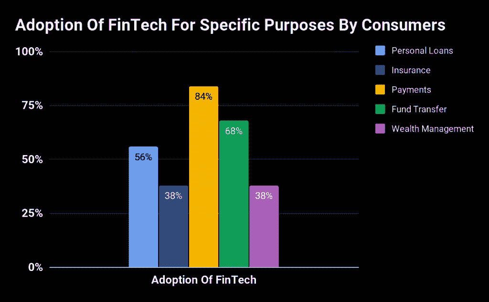

# 为什么你应该成为金融科技开发者:2018 年金融科技趋势开发者指南

> 原文:[https://simple programmer . com/become-fin tech-developer-2018-trends/](https://simpleprogrammer.com/become-fintech-developer-2018-trends/)

This is a good time to become a FinTech programmer. Programmers are taking part in transforming just about every facet of the global economy. For example, transport and health care have not been spared. The likes of Uber and Fitbit, along with other startups, have disrupted traditional models of industry. Now, as a developer your career options include working in the emerging FinTech industry.

如果你不确定什么是 FinTech，你可以想到比特币、以太坊、Dash 和其他数字货币作为一个快速、实用的例子。在世界上的许多地方，金钱已经数字化，新的创业公司正在发挥重要作用。例如，像 CoinDesk 这样的区块链交易平台实现了数字代币的高效交换。

许多创业公司都在积极发展他们的团队，作为改变金融未来的努力的一部分。在这些金融科技初创公司中，有专门从事这项技术的开发人员。如果你是一个对这个行业感兴趣的初级程序员，下面是你应该知道的入门知识。

## 金融科技的重要性

金融科技是全球经济发展的一个重要领域。作为一名程序员，如果你有合适的技能，将有机会在金融科技领域获得工作或启动风险投资资助的初创公司。

新的发展，如金融区块链应用的增长，有可能改变商业格局。如果你能为该行业开发区块链或其他解决方案，你将会大受欢迎。

随着破坏性创新以新的方式解决问题，旧的解决方案可能变得不那么相关或利润更低。即使是金融或银行业以外的传统企业也必须注意。

金融科技的崛起不仅可以帮助老牌企业更有效地开展贸易，也可以成为精益初创公司与老牌公司竞争的重要优势。这意味着[金融科技开发商](https://mobilunity.com/blog/10-demanded-sectors-for-a-fintech-developer/)将为这两类公司贡献价值。因此，你可以得到各种各样的工作，从令人兴奋的新公司到有更多安全感的老牌公司。

金融科技解决方案往往比传统金融解决方案更便宜，因此允许预算较少的初创公司开发能够推动新行业发展的强大软件。正因为如此，在一个经济体中采用金融技术可以为经济增长带来强大而积极的乘数效应。

作为这一领域的开发者，你将参与未来经济增长引擎之一，这意味着你的工作更有保障。

来自普华永道 2017 年全球金融科技调查的数据显示，金融科技不仅在金融领域，而且在整个经济的主要领域都得到了广泛采用。例如，根据该研究，支付行业 84%的客户已经在部分支付中采用了一些金融科技解决方案。然而，这并不意味着完全抛弃旧的解决方案，因为消费者经常同时使用这两种解决方案。

为特定目的采用金融科技技术

如图所示，作为一名金融科技初创公司或大公司的开发人员，你将从事的解决方案会影响不同的市场。这些包括个人贷款、保险、支付和资金转移。

对你的好处是选择面广，所以你可以选择你感兴趣的。如果你最喜欢保险业，你可以与一家为这些公司提供技术解决方案的初创公司合作。如果你喜欢拓宽个人贷款渠道，你也有机会加入一家专注于此的创业公司。

作为一名程序员，你可以选择你的技能通过金融技术发挥作用的领域。

## 顶级金融科技公司

在金融科技发展方面，北美和西欧的主要发达国家处于领先地位。然而，新兴市场的新进入者在促进金融科技解决方案的扩散方面表现出巨大的潜力。

作为一名开发人员，由于金融技术带来的效率，你将能够为全球经济的增长做出贡献。金融技术不仅在金融技术出口国创造增长，甚至在欠发达国家也是如此。这是因为金融科技对那些传统金融分布不均的国家来说更加重要。

这项新技术将为这些国家采用该技术的客户和公司带来更高的生产率。此外，作为一名程序员，你将能够在世界各地找到可以使用你的金融技术技能的工作。

### 欧洲金融科技领域

欧洲有各种各样的金融科技创业公司聚集在主要的金融中心。在英国，你会发现金融科技公司集中在伦敦。在德国，看看法兰克福和柏林。瑞士作为传统的金融中心，也有很多金融科技创业公司。

值得关注的欧洲金融科技公司包括:

*   Azimo-一家伦敦初创公司，拥有超过 3000 万美元的资金。Azimo 的目标是使跨国汇款比普通银行更便宜。
*   **Yoyo Wallet**-一家英国初创公司，通过奖励计划帮助零售商向买家推广促销活动。
*   **bit bond**——一家德国初创公司，提供使用比特币的点对点借贷。
*   **Avance Pay**—这家总部位于瑞士的金融科技初创公司致力于为企业提供移动支付和移动票务解决方案。

### 美国的金融科技

美国拥有一些世界上最令人兴奋、资金最充足的金融科技初创公司。取样包括:

*   **kabb age**–这家总部位于亚特兰大的美国初创公司为小企业提供全自动融资。这家初创公司能够利用其技术在几分钟内满足贷款请求并提供资金。
*   **avi xchange**——这家金融科技初创公司为企业提供支付和发票解决方案。
*   SoFi-总部位于加州，通过技术推动的个人贷款、抵押贷款和其他金融服务，帮助消费者实现个人理财目标。

## 2018 年值得关注的金融科技趋势

To truly understand what your strategy should be when it comes to financial tech, it helps to first grasp where things are headed. In this respect, there are some broad trends now emerging that will shape the immediate future of the FinTech industry.

关注这些趋势将使你明白你可以在哪里部署你的编程技能，为这个世界做出积极的贡献。

### 区块链和加密货币应用

区块链是一种允许分布式金融应用和其他以共享账本为中心的网络合同的技术。比特币、莱特币等加密货币依靠区块链技术运行数字货币系统。了解区块链及其对金融科技的影响将有助于你专注于学习正确的工作技能。

### 人工智能

通常被称为人工智能，人工智能是技术的应用，以复制人类复杂决策的能力。人工智能使用大量数据和模式匹配来解决通常需要人类思考的问题。

由于人工智能可以用于创新技术，如果你想与应用人工智能的公司合作，比如谷歌、优步或特斯拉的无人驾驶汽车公司项目，学习人工智能是必不可少的。例如，无人驾驶汽车人工智能解决了在城市街道上安全驾驶汽车而不与其他汽车或行人相撞的问题。

人工智能在投资和金融风险管理方面有很大的应用潜力。如果你想与在金融市场使用人工智能的对冲基金合作，你需要学习如何编写人工智能解决方案，然后如何专门为金融市场编写代码。

## 了解金融科技开发人员及其工作

在它的核心，[金融科技开发商](https://mobilunity.com/blog/10-demanded-sectors-for-a-fintech-developer/)应用新技术提供满足消费者需求的解决方案。例如，世界各地的金融科技初创公司为以下金融服务提供技术解决方案:

*   比传统网络更快地将企业与股票投资者联系起来
*   促进实时数字支付的电子商务支付解决方案
*   使用人工智能做出更好交易决策的金融市场应用程序
*   企业家和个人获得贷款的数字平台比传统银行更快
*   使用机器学习来减少金融欺诈并保护人们资金安全的金融软件

## 如何成为一名金融科技开发者

成为一名金融科技开发人员将让你发挥实际作用，并参与到这个令人兴奋的行业中。

金融科技工程有很多回报，其中之一是在硅谷和伦敦等地，金融科技软件工程师的工资可能达到六位数。如果你很了解这项技术，你甚至可以启动自己的金融科技软件创业公司，向明星们射击。

### 第一步:学习金融科技的最佳编程语言

首先掌握一门基本的金融科技编程语言是很重要的。对于大多数用途来说，最实用的无疑是 Python，它在华尔街和伦敦被金融工程师广泛使用。

许多银行都有使用 Python 进行大量智能数据编程的团队。如果您已经知道他们的语言，那么您将更容易与现有的财务应用系统集成。一本关于 Python 与金融应用的好书是 Yves Hilpisch 的[*Python For Finance:Analyze Big Financial Data*](https://www.amazon.com/Python-Finance-Analyze-Financial-Data/dp/1491945281/ref=sr_1_3?ie=UTF8&qid=1527376033&sr=8-3&keywords=python+for+finance)。

对于更快、速度关键的应用程序，主要中心的大多数金融机构混合使用 **C++** 和 **Java** ，以及 **C** 和一些 **C#** 。了解其中一种编程语言将有助于加入金融科技初创公司或与大型金融机构合作开发产品。 **Node.js** 和 **Javascript** 对于 web 应用来说将会派上用场。

### 第二步:学习算法、密码学和数据

除了编程语言之外，您还想深入研究密码学、区块链开发和一些数据科学。随着人工智能[算法](https://simpleprogrammer.com/how-to-learn-algorithms/)变得越来越重要，对于最雄心勃勃的金融科技工程师来说，数据科学和深度学习的坚实基础将变得至关重要。

In addition, you should learn how to design and optimize fast data-access architectures. This means you need to become a master at using databases such as **MongoDB** and **Apache Cassandra**, and big data processing systems such as **Hadoop**. Knowing these technologies in depth will allow you to architect robust FinTech systems that can stand the test of the real world.

### 第三步:在合适的公司申请工作

正如我们已经指出的，这个行业的开发人员的工作将在初创公司和在金融行业发挥重要作用的老公司中找到。如果你已经磨练了你的技术技能，你应该使用像 [AngelList](https://angel.co/) 和 [LinkedIn](https://www.linkedin.com/) 这样的在线平台与这些公司开始对话。例如，在 AngelList 上，你可以主动与初创公司的创始人和首席执行官交谈，向他们推销为什么你的技能会对他们的项目有用。

你也应该参加社交活动。例如，在旧金山，有许多聚会，例如:

*   [金融科技发展和项目经理](https://www.meetup.com/fintech-devs-and-pms/?_cookie-check=U3BjXDtvT6g9FlfM)
*   [我们是旧金山金融科技公司](https://www.meetup.com/We-Are-Fintech-San-Francisco/)

你所在的城市可能会有类似的活动，在那里你可以见到公司高管，并在你可以展示编程技能的公司建立联系。如果你想要最好的机会，你可能需要考虑搬迁到金融中心，比如伦敦、纽约或香港，这些地方是创业公司集中的地方。

## 作为一名开发人员，走在潮流的前面

在不久的将来，硅谷和其他地方的金融科技公司将比以往任何时候都更有可能轻松便捷地开展金融活动。数字货币系统和区块链应用将是这场革命的重要组成部分。

此外，期待人工智能和智能机器人能够更智能地管理从股票投资到个人财务的一切事务。这个行业的未来看起来非常令人兴奋。如果说现在是进入金融科技的最佳时机，那就是现在。

从长远来看，随着行业的发展，那些有经验的人将获得更高的薪水，并在资金最充足的初创公司中找到巨大的机会。对于程序员来说，这使得金融科技行业这样一个年轻且不断增长的行业成为职业发展的绝佳机会。