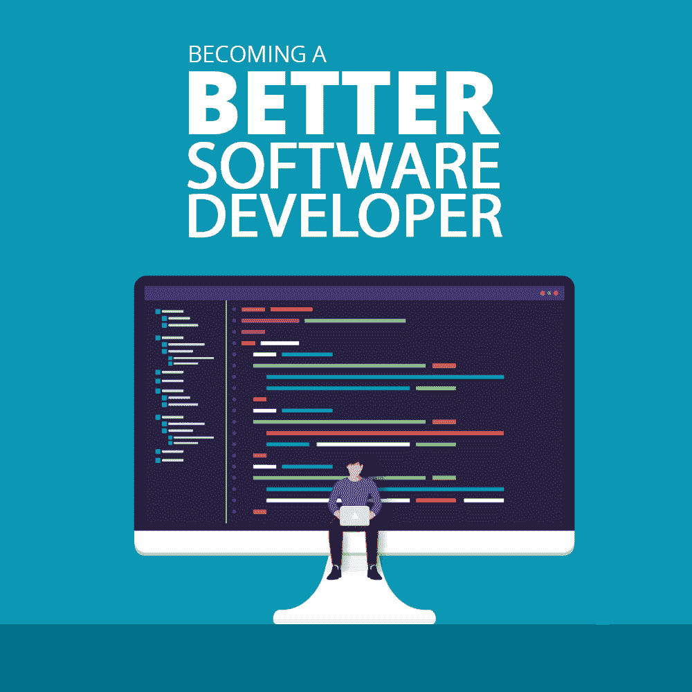

# 成为更好的软件开发人员

> 原文：<https://simpleprogrammer.com/becoming-better-software-developer/>

Becoming better at what we do for a career is what many aspire to in life. However, it is not enough to simply keep doing the same thing every day. To become better, we sometimes need to do things in a different way from how they were done previously.

这尤其适用于软件开发领域。强调作为软件开发人员的一些改进方法是很重要的，因为最终，一个更好的开发人员比一个好的开发人员更有可能被考虑担任这份工作、下一次晋升、下一次加薪或奖金。

成为一名更好的软件开发人员就是要精通你的技能，[每天都要提高你的技能集](https://simpleprogrammer.com/skills-dream-software-job/)，并且能够使用这些技能向你的客户交付解决方案。变得更好不仅仅是获得技能，还包括使用这些技能为用户创造价值。

作为一名开发人员，变得更好不仅在于你成为自己的改进版本，还意味着你能够作为团队的一部分工作，因为开发人员的大部分工作是作为一个团队进行的，除非你自己编写软件的所有部分。

一个好的团队成员也能够帮助其他团队成员做得更好。这个团队在一起工作时表现出色。当一个开发人员能够掌握如何发展他们个人的技能，并且能够帮助他人变得更好时，他们会变得真正更好。

这里有一些软件开发人员给其他人的建议，可以让很多开发人员变得比现在更好。

## 养成阅读习惯

阅读是我们体验新事物的方式之一。我们可以通过其他人写的书来体验他们的生活，我们也可以从书籍和其他拥有这些知识的人分享的文件中学习新知识。

作为软件开发人员，技术几乎每天都在变化，昨天有效的方法今天可能不是最好的方法。学习这些新事物最简单的方法之一就是阅读。阅读让开发人员接触到新的信息，这使得编写代码的过程更加有趣和进步。

这种知识的收集并不以书本为结束。它继续看视频，听播客，并通过所有其他可能的方式吸收知识。

作为软件开发人员，知识是最有价值的，这一点永远不应该被低估。作为一名软件开发人员，你掌握的知识越多，你就越优秀。

软件开发有很多方式，但是最有效的方式之一是使用大量知识和最新信息的方法。

在这个时代，软件开发人员可以被认为是知识工作者，成为有价值的、更好的知识工作者的唯一途径是我们有更多的知识，而获得更多知识的最简单的方法之一就是从其他人的经验中学习。

所以，要继续成为更好的知识工作者，永远不要停止学习。读，读，再读一些。

## 被聚焦

在你做的很多工作中考虑刺猬的概念。[刺猬概念](https://www.jimcollins.com/concepts/the-hedgehog-concept.html)讲的是一只狐狸和一只刺猬。狐狸知道许多事情，但是刺猬知道一件大事。

由于软件开发有如此多的部门，所以很容易陷入想知道一大堆事情的陷阱。这意味着在你被认可为该领域的专业人士之前，你需要成为一些领域的大师。

然而，要想在这一领域获得认可，你需要专攻某一领域。专业化不仅仅意味着[学习一门编程语言](http://www.amazon.com/exec/obidos/ASIN/B0039OVIAK/makithecompsi-20)；意思是选择一个重点，一个你想变得擅长的领域。如果更喜欢前端，那就坚持下去；如果后端是你的天赋，坚持下去。

但这并不意味着你不能走出你的领域。它简单的意思是，你有一个主要的关注领域，而你偶尔也有其他领域可以努力。你需要选择一个焦点并坚持下去。

这意味着你需要做你的研究，并确保你知道你想掌握什么。这可能需要一段时间，但是一旦你选择了一个领域，尽可能努力坚持下去。这意味着你已经简单地做了你的研究，并选择了一个领域花大部分时间。

可以学到很多东西，并且擅长。然而，好是伟大的敌人。要想变得伟大，你需要强烈地考虑变得不仅仅是优秀。可能需要一个天才才能非常擅长很多事情，但是对于我们其他人来说，我们需要选择一个领域并专注于它。

考虑做一个写很多后端语言的后端开发者。成为一名后端语言的专业人员比简单地在同一水平上学习要好得多。有了这一点，就很难被公认为这个领域的传奇人物；例如，如果你选择 Java 作为你最喜欢的语言，那么你就开始增加你的注意力，变得更加精通这项技能。

想想软件开发界的名人，并意识到他们被一件事联系在一起:他们不仅仅是万能的。他们学习相当多的东西，但他们寻求在这些领域之一的熟练程度。当新技术出现时，你可以继续学习，但也可以选择一个擅长的领域。你这样做很重要，因为这不是关于知道很多事情；这是关于知道一些事情，但要充分了解它们。

最后，每个组织都想要一个专注的专业人士，而不是一个多面手。

## 练习你的技能

作为一名知识工作者，收集大量的知识是很重要的，但是如果我们不实践，我们如何验证和存储我们所学的知识呢？

把实践看作是验证你已经知道的东西的一种方式，并且继续把你知道的东西和有效的东西进行对比。你需要当前有价值的知识，而不是 10 年前有价值的知识。

要在现代有用，你的知识也必须有用。让这些知识变得有用的一个方法是不时地验证它。光看书是不够的；你需要练习。

想象自己是一名网球运动员，觉得自己已经知道所有要学的东西，甚至一周都不练习。他们可能在一周后比赛时仍然很强壮，但是如果他们在比赛前练习的话，他们会变得更好更强壮。

但是你可能会问，软件开发人员是怎么练的？好吧，一种方法是反复做一件事，直到它成为你的一部分。拿一个问题，找到解决它的方法，这样做很多次。这种方法会一直伴随着你，下次你必须解决这个问题时，你会做得更好。

每当我看到人们在谷歌和其他代码挑战中以惊人的速度解决问题，我都会认为这些人是天才。然后，我意识到他们可能以前见过那个问题或使用相同原理的另一种问题，他们会多次练习解决它，以便变得有效和准确。

此外，专业软件开发人员能够更快更好地编写代码，因为他们已经编写代码很长时间了，并且他们已经练习了许多对于没有练习过的人来说看起来非常困难的事情。

实践是每个领域的关键，所以要继续变得更好，你需要实践。

## 分享你的知识

分享是强大的。你把你知道的东西给别人，然后让它继续帮助尽可能多的人。作为一名开发人员，继续[提高的一个方法是](https://simpleprogrammer.com/become-a-better-developer/)与他人分享你所知道的。

写文章和博客，制作视频，或者用其他你觉得可以和外界分享你的经验和知识的方式。谁知道呢？也许你所知道的可以帮助另一个人得到梦想中的工作，或者避免他们将要犯的改变一生的错误。

分享您在开发解决方案时解决遇到的特定问题的方式；写下问题以及你是如何解决的。有人，有一天，可能会经历同样的问题，可能会联系你解决问题，这可能是咨询业务的门户。

分享的力量永远不可低估。当我现在写这篇文章的时候，我不知道有多少千里之外的人可以从这篇文章中获得知识和智慧。

想象一下，一个人分享，然后下一个人，再下一个人，直到我们都分享了一些东西，这些东西可以让明天的软件开发人员避免犯那个错误，或者构建出那个惊人的特性或产品。

## 今天就迈出大胆的一步，成为更好的软件开发人员

我们总是可以做得更好。作为软件开发人员，我们可以通过阅读来提升我们的知识，学习别人知道的东西，专注于一件事而不是做一个多面手，练习来微调我们的技能，并分享我们知道的东西。这些是我们可以让软件开发领域，甚至是我们自己变得更好的一些方法。