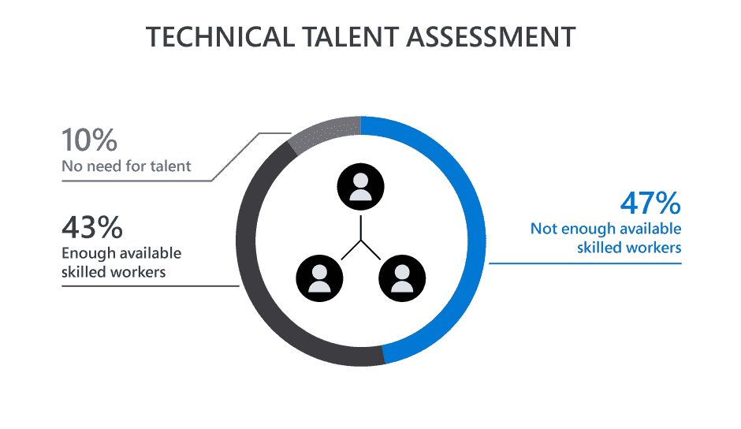

# 成为物联网开发者的基本指南

> 原文：<https://simpleprogrammer.com/becoming-iot-developer/>

智能和互联物体(物联网或物联网)的全球网络已经改变了每个行业。这些智能设备促成了我们通常所说的第四次工业革命或工业 4.0。很难想象没有这些联网设备的生活，因为它们让生活变得更加轻松，让我们能够更好地控制自己的生活。

几乎所有的技术创新都依赖于互联网，物联网推动了这一趋势。Statista 的最新[估计显示，到 2025 年，全球物联网设备市场将达到 754.4 亿美元。物联网正在改变世界各地企业的游戏规则，使他们比竞争对手拥有更大的优势。然而，最近](https://www.statista.com/statistics/471264/iot-number-of-connected-devices-worldwide/)[微软的一项研究](https://cloudblogs.microsoft.com/industry-blog/manufacturing/2019/09/16/addressing-the-coming-iot-talent-shortage/)显示，大多数组织缺乏先进的物联网技能。

[来源](https://cloudblogs.microsoft.com/industry-blog/manufacturing/2019/09/16/addressing-the-coming-iot-talent-shortage/)

难怪对物联网开发人员的需求呈指数级增长。越来越多的企业希望雇佣熟练的物联网开发人员，他们可以利用自己的技能来构建创新的物联网解决方案，从而抓住商机。

如果你打算在物联网就业市场上竞争，磨练你的技能并建立你作为该领域专家的声誉是有意义的。在这篇文章中，我将与你分享五个有价值的技巧，帮助你成为一名王牌物联网开发者。

## 培养对传感器和硬件的理解

一个物联网开发者应该专注于几个领域，这取决于系统的复杂性和他们正在工作的物联网架构的层。

例如，对于设备层，开发人员应该专注于智能传感器和终端物联网设备的嵌入式软件开发。同样，对于数据分析层，物联网开发人员应该具有批量和流大数据处理、[数据可视化](https://thinkbiganalytics.com/data-visualization)和 ML 算法实施方面的经验。

除了拥有编码语言的实用知识(针对 web 应用的后端)，物联网开发人员还应该对嵌入式系统、现场网关以及数据管理和分析有深刻的理解。他们应该知道传感器如何工作并集成到物联网架构中。

计算机科学或电子工程背景可以确保你成为一名成功的物联网开发人员。或者，Udemy 和 upGrad 等几个在线教育平台提供关于物联网传感器和设备的认证课程和指导模块。参加此类在线课程将让你深入了解物联网行业专业人士必备的技术领域。

这些平台提供与传感器和无线通信相关的各种课程和项目，让有抱负的物联网开发者升级知识。

## 精通 Python

一项[堆栈溢出调查](https://insights.stackoverflow.com/survey/2019/#most-loved-dreaded-and-wanted)显示， [Python](https://www.amazon.com/Learning-Python-5th-Mark-Lutz/dp/1449355730/) 是专业开发人员中流行且增长最快的编程语言。它是一种支持任何编程风格的通用语言。与 C++或 Java 不同，Python 被设计成在设备级实现业务逻辑。

这种语言易于学习、语法和调试。它支持大型标准库，并满足所有开发人员的要求，无论他们是从头创建一个物联网项目，还是使用传感器和执行器。实际上，Python 是用于[树莓 Pi](https://www.raspberrypi.org/documentation/usage/python/#:~:text=Python%20is%20a%20wonderful%20and,and%20uses%20standard%20English%20keywords.) ，市场上最流行的微控制器。

对于涉及机器学习和其他机器智能工具的物联网项目，Python 是必不可少的。所以，如果你想成为一名成功的物联网开发者，[了解 Python](https://simpleprogrammer.com/get-started-learning-python/) 会是一个巨大的加分点。它可以帮助您编写开发板代码，使用 Raspberry Pi，并更有效地自动化。此外，您可以使用 Python 服务器端语言与数据库进行交互。

## 玩树莓派或 Arduino

热衷于通过实验了解更多物联网知识的 Greenhorn 物联网开发人员应该与 [Raspberry Pi](https://www.amazon.com/Raspberry-Pi-Cookbook-Software-Solutions/dp/1492043222/) 和 Arduino Uno 合作。了解这两者的工作原理可以帮助你增强物联网技能，并将这些知识应用到可穿戴技术、智能环境和家庭自动化等领域。

此外，在为物联网项目选择合适的硬件时，需要考虑几个因素。例如，可伸缩性、功能性和灵活性是决定特定硬件是否适合项目的几个因素。

Raspberry Pi 和 Arduino 都非常适合原型开发。然而，Raspberry Pi 提供了更多的板载功能，可以运行比 Arduino 更复杂的功能。另一方面，Arduino——虽然价格昂贵——却很省力，可以轻松处理简单的重复性任务。

因此，如果您的物联网应用程序需要从多个传感器收集数据，从互联网上获取数据，连接到智能手机，并共享复杂的输出，您应该选择 Raspberry Pi。尝试 Raspberry Pi 和 Arduino 将有助于您了解它们之间的比较，并根据项目需求做出合适的决定。

## 追求一个激情项目

物联网是一个不断发展的领域，需要高质量、可扩展、强大、安全和用户友好的解决方案。然而，这些应用以极快的速度发展，几个月后就让梦想中的物联网应用过时了。

为了站在这些不断发展的趋势的顶端，有抱负的物联网开发人员应该参与能够给他们带来真实物联网体验的激情项目。此外，你应该考虑在[物联网黑客马拉松](https://www.hackerearth.com/challenges/hackathon/)或峰会上展示这些项目。这将提高你的原型系统的曝光率，并帮助你与中小型公司建立项目机会网络。

## 加入物联网社区

Being surrounded by a [community](https://simpleprogrammer.com/importance-community-cant-alone/) of inventors, developers, and business visionaries can help an IoT developer in more ways than one.

通过与行业内的思想领袖和导师交流，您可以分享您的想法和面临的挑战，并讨论最佳实践和发展机会。这样的互动将有助于你完善自己的想法，让你成为一名物联网开发专家。

物联网是一个新生而模糊的领域。一个由经验丰富的物联网专业人士组成的社区可以让您一窥行业动态。它也加强了你的网络，为你作为一个开发者打开了一个充满机会的世界。

社区是建立在致力于共同事业的人们的共同挑战之上的——掌握和贡献领域的创新思想。加入[物联网社区](https://www.iotevolutionworld.com/iot/articles/444725-iot-developer-communities-platforms-people-productivity-2020.htm)将帮助你与经验丰富的开发人员和导师一起开拓坚实的职业道路。

## 交给你了！

物联网格局正在扩大。创新的物联网应用正在将我们的世界转变为一个复杂、动态的互联设备系统，让我们的生活变得更加轻松。物联网的广泛采用使得企业拥有能够提出创新和有竞争力的解决方案的熟练物联网开发人员变得非常重要。

现在是进入物联网开发领域的激动人心的时刻。如果你对物联网充满热情，使用本文中分享的最佳实践来提升你在该领域的知识，并将自己定位为物联网专家开发者。