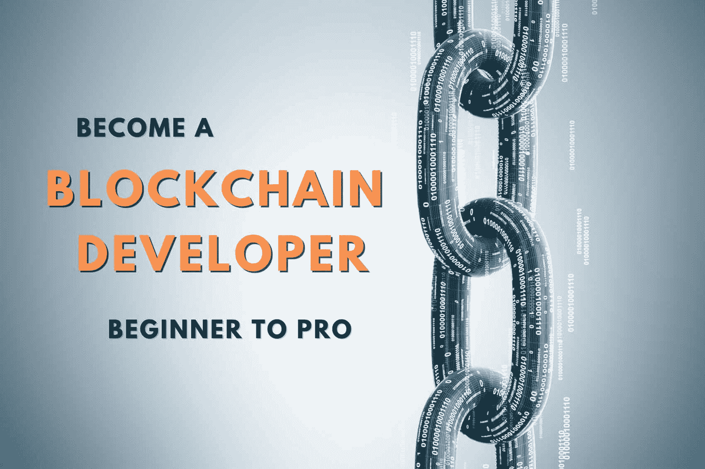
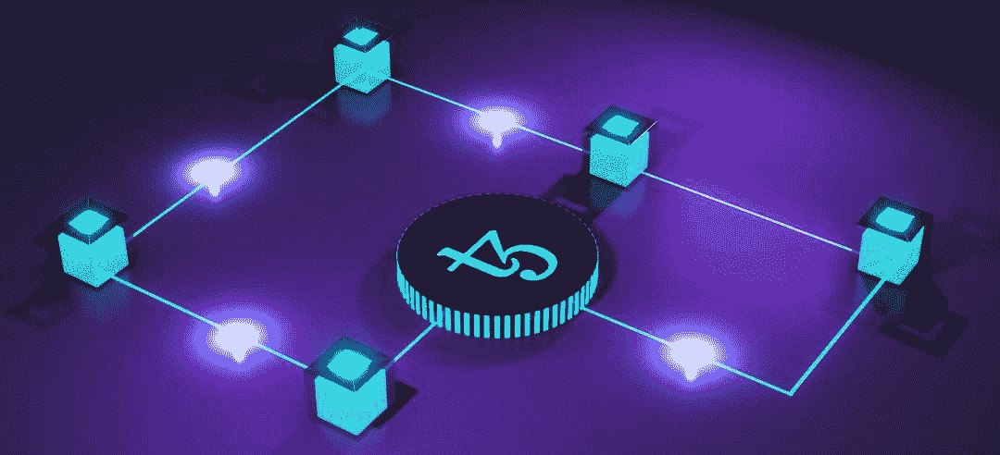
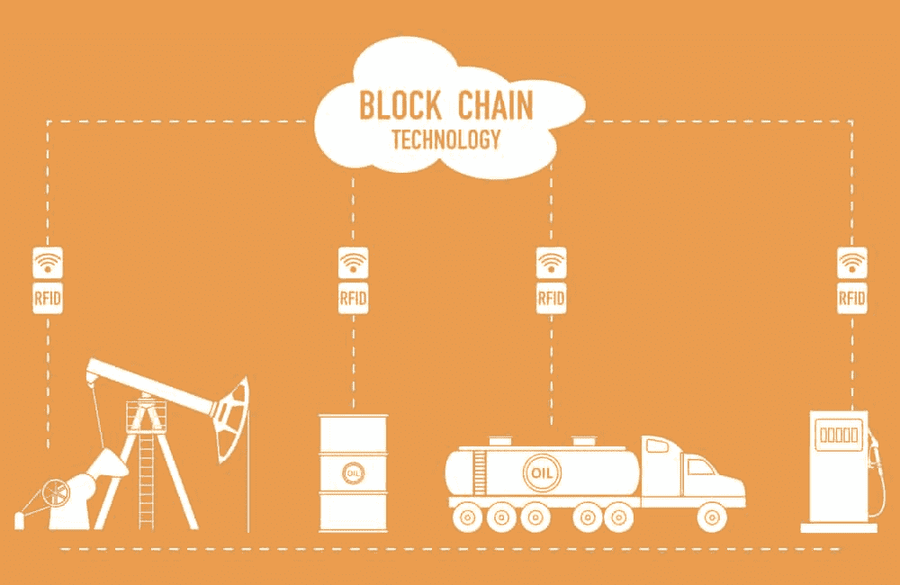
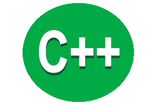
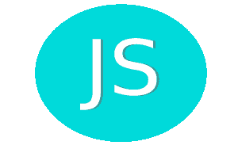

# 如何成为区块链编程向导:初学者到专业人士

> 原文:[https://simple programmer . com/初学者-区块链-编程/](https://simpleprogrammer.com/beginners-blockchain-programming/)

进入未来最热门的开发人员职业:

区块链编程。

现在是你进入其中的最佳时机。

原因如下:

*   作为一名区块链开发商，你肯定会在未来几十年内大受欢迎。

过去，只有那些想开发自己的加密货币的人才需要区块链的开发者，而这种人并不多。

现在每个人都看到了好处，区块链的采用率正在飙升。政府、财富 500 强公司开始进入区块链。它正在成为主流—[对有能力的区块链程序员的需求激增。](https://cointelegraph.com/news/crypto-jobs-market-holding-up-despite-tech-industry-cutbacks)

*   **你可以在区块链获得丰富的编程资源**

简单的程序员是关于让你成功和作为一个开发者赚最多的钱。

平均工资为每年[109.000 美元](https://www.glassdoor.co.in/Salaries/us-blockchain-developer-salary-SRCH_IL.0,2_IN1_KO3,23.htm?clickSource=searchBtn)，自由职业者的平均时薪为[81-100 美元](https://arc.dev/freelance-developer-rates/blockchain#:~:text=Blockchain%20developers%20typically%20charge%20%2481,range%20may%20increase%20as%20well.)

如果你想成为一名富有且成功的程序员，我们向你推荐这条职业道路。

*   **你的竞争还是小的**。

在全球 2000 万软件开发者中，只有[0.6%](https://paybis.com/blog/how-many-blockchain-developers-are-there/)知道区块链编码。

并不是所有这些都达到了能够按需交付高质量代码的水平。

## 学习区块链编程:这个 3 步教程将带你去那里

作为一个初学者，学习区块链编程似乎是势不可挡的。

你从哪里开始？

不要再烦恼了。

本教程将引导您进入主题，因此您可以一个一个地深入其中。

一步一步来！从头开始学习一切。

你会被压倒的。你会开始有更深的理解。即使你现在还是一个初学者，你也将很快掌握区块链编程。

#### 1.区块链编程基础

您将学习区块链编程的基础知识，例如

*   [了解区块链科技](#technology)
*   [区块链如何改变软件开发行业](#transform)
*   [作为一名区块链开发者，你到底在做什么](#developer)
*   [它有哪些用例](#use-cases)

#### 2.区块链的编码

*   [怎么做](#how-to-code-blockchain)
*   [哪些语言最好](#blockchain-languages)
*   [你需要什么软件&硬件](#what-you-need-for-blockchain-coding)

#### 3.如何赢得区块链程序员的职业生涯

*   [你需要培养的技能](#blockchain-developer-skills)
*   [您的开发者路线图](#blockchain-developer-roadmap)
*   [你能挣多少钱](#blockchain-money)

好了，你准备好成为区块链开发者向导了吗？

那我们开始吧！

## 了解技术

[区块链](http://www.amazon.com/exec/obidos/ASIN/1101980141/makithecompsi-20)是由一群计算机管理的不可改变的记录数据的时间戳序列，与单个实体相对。这是一种分散的、不可破解的电子分类账，用于记录经济交易，是一种高度可靠的透明数据传输技术。

它遵循链条的基本原理，每块积木都牢牢固定。

例如，当使用区块链技术开发应用程序时，用户有权查看软件数据库并向其中添加记录。

他们不能修改或删除任何数据记录，这提高了整个过程的完整性。

### 什么是智能合约？

[*智能合同*](http://www.amazon.com/exec/obidos/ASIN/3982103827/makithecompsi-20) 是一种软件协议，其在不需要第三方的情况下执行合同，例如执行可信的交易。智能合约存储在区块链上，并且在满足某些预定条件时自动执行。

## 区块链如何改变软件开发行业

软件开发行业已经见证了向基于云的产品的重大转变。云技术促进了数字资产的去中心化，这形成了区块链的主干。

[区块链技术](https://en.wikipedia.org/wiki/Blockchain)突飞猛进，解决了软件行业面临的各种挑战。它的目的是确保有效的测试活动，增强团队内部的协作，并增加智能合约在软件开发中的使用。

### 为什么要用区块链做软件开发？

正如我所说，区块链软件是高度安全的。它用于在透明分类帐中存储数据，并用于对等网络中的数据传输。

具有增强的安全性和更高质量的移动应用的增加导致了面向区块链的应用的增加。

面向区块链的软件(BOS)系统的主要特征如下:

*   **数据复制:**数据在成千上万个系统中复制存储，保证了数据安全。每个节点都有一份区块链码。
*   **需求检查:** BOS 在进行验证处理之前检查交易需求。
*   **事务记录:** BOS 将事务记录在由一致算法创建的链接块的顺序日志中。
*   **公钥加密:**交易基于[公钥加密](https://en.wikipedia.org/wiki/Public-key_cryptography)。

这些功能使区块链软件在确保数据安全方面受益匪浅。

### 它是如何在软件行业中使用的

区块链技术在软件质量保证中起到了推进器的作用，保证了安全性，这在金融行业至关重要。

许多知名公司都在寻找机会将区块链技术集成到他们的数据库中，以获得最高的安全性。

例如，通用电气正计划在他们的航空部门计划中实施区块链开发的数据库。他们还在开发能够管理销售、跟踪、记录、库存细节的软件，具有高端的安全性、透明度和完整性。

在传统的开发方法中，透明度与完整性相反，因为数据的透明度增加了有人篡改数据的机会。但有了区块链的技术，它们就共存了，并作为公司的额外优势。

## 什么是区块链编程？

区块链编程正在编写智能合同，完全按照编程运行，没有任何欺诈的机会，并为区块链建立端到端的应用程序。

所以，区块链编码要么是:

1.  设计区块链点对点技术及其流程
2.  开发使用该技术的应用程序

## 到底什么是区块链开发者？

作为一名区块链开发者，你要么从事区块链本身的工作——这会让你成为一名核心开发者。

或者，你是一名**区块链软件开发人员**——你正在设计智能合同和创建分散式应用程序(dApps)。

对区块链来说，做核心比做软件开发更难。

## 区块链的最佳编程语言

这里有一些区块链编程语言，它们的用途，以及一些进一步学习的资源。每一节都将是纯粹的介绍性的，因为这个主题可能会变得相当广泛，并且充满了代码。

### 1.C++

让我们从最古老的 C++开始。在比雅尼·斯特劳斯特鲁普的努力下，这种语言于 1985 年问世。那时，基本的 C 语言已经存在，但它是面向过程的；C++作为面向对象的升级扩展出现(其中数据和函数被打包成一个名为“对象”的包)。对于初学者来说，面向对象的产品可以在其他平台上重用，而不需要重新编码。

C++保留了 c 的效率、安全性和灵活性。它的常青特性使其成为区块链编码的核心语言，包括比特币区块链。不过，对新手的警告是:作为一种语法相当过时的纯类型语言，学习曲线有点陡。然而，由于大多数区块链技术都是用这种语言编写的，所以你为学习这种语言所付出的任何努力都会有丰厚的回报。

以下是 C++更适合区块链编码的几个原因:

更好的记忆控制。区块链生态系统中有很多需求。例如，平台需要是一个安全的堡垒，但同时以更快的速度执行事务并与所有节点交互。为了实现这一切，您需要更好地控制内存和 CPU 的使用。C++可以给你提供这些。

**高超的多线程技术。**线程是一组要同时执行的指令。在区块链开发过程中，您会遇到并行化的任务和不并行化的任务。大多数语言只能处理其中一项任务，而不能两者都处理。猜猜看，C++允许你同时处理这两者。

**编译时多态性。**之前说过，C++是一种面向对象的编程(OOP)语言。多态性(以多种方式使用某个特性)也是 OOP 的一个特性。现在，通过 C++编写您的区块链，您将能够单独执行一些任务，从而提高整个数字账本的性能。

**代码隔离。这种古老但革命性的编码语言具有命名空间特性，可以从一个地方移植到另一个地方。但有时，碰撞会发生并扭曲整个系统。然而，由于该语言的分段能力，将各种 API 不同地分组，代码隔离/分离可以变得稍微容易一些。**

**成熟。作为最古老的编码语言之一，C++已经成熟，并且会定期更新。除此之外，这种语言还有一些实用的特性，比如调试器和特殊的分析工具，可以检测或优化各种功能。这种语言的复杂性和最新性可能是 Satoshi 将其用于比特币源代码的部分原因。**

### 2.计算机编程语言

Python 是另一种简单的编程语言，适合害怕 C++复杂本质的初学者。它是由一位名叫吉多·范·罗苏姆的荷兰程序员在 1991 年开发的。这种语言的结构基于一个简单的前提:简单、易读和极简。

这种语言的简单特性使得它得到了大量新老开发者的支持。与 C++中使用的花括号和关键字来表示代码块不同，Python 使用简单且不那么吓人的空格。

简单很容易被理解为低效。然而，Python 足以构建稳定可靠的复杂数字总账。最棒的是:这种语言是脚本化的，可以编译也可以不编译。例如，当你在代码中发现一个错误时，你只需修复它并重新加载你的应用程序。

对于其他语言，如 C++，您需要停止应用程序，修复源代码中的错误，并在重新启动应用程序之前重新编译它。选择 Python 可以避免相当多的工作。此外，该语言为开发人员提供了一个巨大的免费资源中心，他们可以用它来编写自己的区块链代码。

### 3.Java Script 语言

JavaScript 是万维网上最常用的语言之一。如果你想要一个有漂亮用户界面的交互式网站，这是你应该使用的语言。谷歌 Chrome、火狐等各大浏览器都支持。

我们已经说过，粗略地说，区块链是一个由一个接一个的积木组成的系统。然而，这个分类帐有一些特殊之处——它是不可变的，这意味着一旦数据被写入，就没有撤销的可能。JavaScript 是制作简单但防篡改的区块链的首选语言之一，黑客和其他欺诈者无法对其进行修改。不过，只有一个缺点:这种语言缺少 SHA256 哈希函数。

### 4.固态

This is the most complex, high-level language that applies JavaScript’s scripts and functions as well as C++’s classes. The language is not only beginner-friendly but also offers tips and instructions on how to go about using its code. While the language is not very complicated, those who have a fair grasp of modern programming languages have an advantage.

即使 Solidity 仍在试图在编码世界中站稳脚跟，以太坊(仅次于比特币的第二大加密货币)已经在使用它了。他们创造了这种语言，所以他们是第一个使用这种语言的人是有道理的。然而，就创建智能合约的速度和便捷性而言，以太坊区块链是最高效的之一。

因此，如果你想创建一个去中心化的应用程序，持有一个初始的硬币产品，或者构建一个安全的、不可变的、多用途的区块链，可靠是应该使用的语言。对于任何希望将智能合同集成到其数字账本中的人来说，这是一种必须知道的语言。关于 Solidity 的教程，你可以从 readthedocs.io 查看 ConsenSys Academy 或语言文档。

### 5.去

GO 是 GOLang 的缩写，GOLang 是一种相对现代的编码语言，于 2007 年由谷歌开发，并于 2012 年正式发布供公众使用。这种健壮的、多用途的编码语言是为了结合 JavaScript 等其他通用语言的语法和用户友好性，同时保留 C 和 C++等旧语言的可靠安全性而创建的。

GO 本质上运行在操作系统中，这意味着最大的灵活性，尤其是在同时处理区块链的几个部分时。以太坊的 SDK 协议是用 GO 写的，还有很多这种语言的其他[区块链应用](https://simpleprogrammer.com/testing-blockchain-applications/)。

## 作为开发人员，您可以参与的 9 个区块链用例

每年，区块链都有更多的[用例。](https://www.ibm.com/blockchain/use-cases/)

正在为不同行业开发应用程序:

1.  网络安全
2.  卫生保健
3.  制造业
4.  法律和政府
5.  慈善
6.  零售
7.  房地产
8.  旅游业
9.  媒体

和许多其他人。

如果您成为一名区块链开发人员，您可以在所有这些行业中选择您想从事的用例。

## 如何编写区块链代码——简化为 5 个简单步骤

当你是一个初学者时，你可能不知道为区块链编码的过程对你来说是什么样的。

让我们举一个最简单的例子来说明如何编写区块链代码。

简单来说，它是这样工作的:

1.  在您的 [IDE](https://ethereum.org/en/developers/docs/ides/) 中编写您的智能合约或 dApp
2.  在[当地区块链](https://medium.com/datawallet-blog/how-to-deploy-a-local-private-ethereum-blockchain-c2b497f068f4)上测试它
3.  运行或连接到一个[节点](https://www.coindesk.com/learn/what-is-a-node/)
4.  在[测试网](https://en.wikipedia.org/wiki/Testnet)上测试它
5.  部署 it

## 区块链编程需要什么？

### 软件

*   一个 IDE(集成开发环境)来编译、测试和运行你的区块链软件。例子有[安全帽](https://hardhat.org/)、[松露](https://trufflesuite.com/)和 [Remix](https://remix-project.org/) ，其中 Remix 最容易上手。
*   前端环境如[节点。JS](https://developer.mozilla.org/en-US/docs/Learn/Server-side/Express_Nodejs/development_environment) 对 dApps 面向用户的部分进行编程
*   探索区块链数据和事务的 API(例如:[blockchain.com](https://www.blockchain.com/api)的开发者 API)
*   例如，比特币的区块链核心，或者以太坊的客户端，在你的电脑上编译以运行你自己的节点
*   或者像 [NOWNodes](https://nownodes.io/) 这样的服务，将你连接到一个节点。他们还提供了一个块浏览器。

### 五金器具

硬件要求类似于我们在[中概述的编程所需的内容](https://simpleprogrammer.com/best-coding-hardware/)。

请考虑运行自己的节点所带来的额外压力。

首先，在你自己的电脑上运行一个节点是可以的。从长远来看，您可能会考虑再用一台计算机来运行节点。这样，您将获得更好的性能和安全性，并且不会增加您的主 PC 的负担。

硬件的最大瓶颈是硬盘大小。例如，以太坊需要大量的来回通信，并占用大量的硬盘空间。

你需要一个像固态硬盘这样的快速硬盘——以及一堆空白空间:虽然整个比特币区块链只有几千兆字节，以太坊的大小约为 1 *太字节*。

**区块链编程需要什么？**

*   **CPU** : 2-4 核
*   **内存** : 8-16 GB 内存
*   **硬盘** : 500-1000+GB 空闲空间(最好是 SSD)
*   **带宽** : 10 兆比特/秒–25+兆比特/秒

## 你需要的 7 大区块链开发者技能

这个问题没有明确的答案，因为区块链技术仍处于发展的早期阶段。然而，2022 年成为区块链开发者可能需要的一些技能包括:

### 1.掌握基本的密码学概念

对于程序员来说，加密技术可能很可怕。

但是基本的[密码学概念](https://www.ibm.com/docs/en/i/7.2?topic=cryptography-concepts)将会支撑你作为区块链开发者所做的事情——所以请确保你熟悉这些基础知识:

*   哈希函数
*   加密
*   公钥和私钥
*   签署

如果你要编写分散的应用程序，你将会使用这些概念。首先提高这方面的技能是有意义的！

### 2.了解区块链和分布式分类帐的工作原理

什么是区块链？什么是分布式分类账？

如果你想成为一名优秀的区块链程序员，你需要能够回答这些问题。

因为你的工作要么是直接设计这些东西(作为核心开发人员)，要么是在它们之上构建应用程序(作为区块链软件开发人员)。

为了理解这一点，你可以从一本关于区块链的初级书籍开始。

### 3.了解流行的区块链平台

熟悉最流行的[区块链平台](https://www.techtarget.com/searchcio/feature/Top-9-blockchain-platforms-to-consider)及其工作方式，例如:

*   以太坊
*   超总帐会计管理系统
*   主要的

一旦你了解了每一个[区块链平台](https://simpleprogrammer.com/7-best-frameworks-blockchain-apps/)的特点，你就准备好接受在这些平台上运行的项目了。

### 4.具有 web 开发、智能合同和 web3 中使用的语言的编码技能

作为一名有抱负的区块链开发者，请具体说明你正在学习哪些编码技能

在你职业生涯的某个阶段，你会需要使用以下语言。

但是要明智地使用你的时间和精力。永远要知道你当前正在做的项目需要什么。在开始你的第一个动手区块链编码项目之前，不要预先花六个月的时间，孤立地学习书籍和语言。

如果你使用“边做边学”的方法，你会缩短你的学习曲线。

#### 固态

有了 Solidity，你可以在大多数区块链平台上编写智能合约。作为一名区块链开发者，这是一项非常重要的技能。也是最容易捡的！

#### 网页设计

如果你想成为去中心化应用的前端开发者，你需要在 HTML & CSS 的 web 开发语言方面有很好的技能。

#### JavaScript /节点。射流研究…

学习 Web3.js，这是一个 JavaScript 库，允许 Web 应用程序与区块链节点交互。

#### GO 和 Python

这些通常用于 Web3 应用程序，所以它们是添加到您的工具箱中的一个很好的技能。

#### C++

比特币的创始人用 C++创建了最初的区块链。如果你打算从事比特币区块链，学习 C++是个好主意。

### 5.擅长面向对象的编程概念

擅长[面向对象编程](https://en.wikipedia.org/wiki/Object-oriented_programming) (OOP)意味着你必须理解继承、多态&类以及如何在你的代码中使用它们。

像 [Solidity](https://medium.com/coinmonks/solidity-and-object-oriented-programming-oop-191f8deb8316) 这样的区块链编码语言都是基于面向对象的编程。每当您必须将应用程序与现有的区块链技术集成时，这些传统的开发概念就会出现。

作为一名区块链开发者，你不需要学习全栈开发。但是在很多情况下，在你的区块链项目中，你需要传统的全栈编码的某些方面。

所以在你前进的过程中不断学习它。

### 6.了解数据库、数据结构和网络概念

作为一名区块链开发人员，您需要了解数据库、数据结构和网络:

*   平面和关系数据库
*   堆栈、链表、队列
*   局域网/广域网、交换机和路由器

当你与区块链打交道时，所有这些都会发挥作用。

区块链是数据库的一种形式，你的应用程序将依靠栈、链表和队列来检索信息，你需要很好的网络知识来理解区块链上的通信是如何工作的。

### 7.饿了

一直努力提高你的开发者技能。愿意学习并跟上区块链的新技术。

去加入 Reddit 论坛、Github 页面和 StackExchange。

要成为顶级的区块链程序员，永远保持对更多知识和技能的渴望。

## 区块链开发者路线图——从零开始的 13 个里程碑

成为区块链开发者不仅仅是获得认证。这是关于成为区块链编码所需技能的专家。

参加课程有助于你的学习之旅。获得认证确实会提高你的可信度。

但公司最看重的(至少是聪明的公司)是你执行相关区块链编程任务的能力——这样他们就能在业务中获得 T2 结果。

边做边学，能够用自己完成的项目证明自己的熟练程度，你会比想象中更快地得到高薪工作或自由职业合同！

这是您尽快实现这一目标的路线图:

### 1.学习编程基础

如果你还不是一个开发者，从学习你的第一语言的基础开始。对于不同的区块链项目，你可能需要学习不同的语言。

不过，总是从一个开始。你必须从某个地方开始，对吗？

那么，应该先学什么语言呢？

例如，您可以从学习使用节点编码开始。JS 平台(基于 JavaScript)。

JavaScript 和 Node.js 足以构建与加密货币 API 实时交互的程序。JavaScript 是区块链编程最流行的语言，而 Solidity 是最容易学的。

你最好两者都学。

### 2.了解区块链流程是如何运作的

为了理解区块链过程，您应该学习以下基本概念:

**区块链的基础部分**

确保您掌握以下内容:

*   什么是对等网络？
*   什么是加密哈希？
*   什么是非对称密钥加密？

**总账**

了解分类账的概念，以及交易是如何记录在分类账中的。

**区块链术语**

熟悉以下术语:

*   证明
*   批准
*   采矿
*   目前
*   工作证明
*   验证交易
*   共识；一致
*   创建和添加块

**白皮书**

阅读[白皮书](https://bitcoin.org/bitcoin.pdf)并逐一阅读其不同部分。

关于区块链以及如何为其编程的书籍

阅读:[Josh Thompson s 的区块链](https://www.amazon.com/Blockchain-Beginners-Technology-Leveraging-Programming-ebook/dp/B0711RN8KJ)，Henning Diedrich 的以太坊，Chris Dannen 的以太坊和可靠性介绍，Melanie Swan 的区块链。

**加密钱包和 dapp**

开始玩加密钱包和 dApps。

### 3.开始区块链编码教程

最好的选择是分成小项目的教程，你必须自己完成。通过这种方式，你不仅仅是接受了一堆新的信息，而且你总是在实践中学习。

你就是这样让知识黏住的！

1.  **学扎实**。这是一种初学者友好的语言，在许多应用程序中都有使用。你可以从免费教程和游戏化课程开始，比如太空狗&隐型僵尸。
2.  **参加高级课程**。一旦你掌握了基础知识，考虑投资一个更高层次的课程，这个课程可以带你一路成为专业的区块链开发者。

确保选择一门课程，让你在指导下完成专业水平的项目。一旦你经历了这些，你就为现实世界的工作、自由职业或你自己的区块链项目做好了准备。

### 4.实际一点:建立自己的节点

虽然运行自己的节点并不是 100%必要的——但如果你想成为一名认真的区块链开发者，这是值得推荐的。

它让你监控你的编码工作，并给你完全的控制权。

### 5.理解共识算法

共识机制:分散系统就特定问题达成一致的工具。

例如白皮书《工作证明》中提出的原始共识机制。

### 6.学习派生现有的区块链，如比特币或以太网

为此，你必须在你的电脑上下载并编译核心代码。然后，您将重新编写代码，以在您的个人区块链叉子中包含您想要的更改。

### 7.叉钱包

了解如何从头开始创建自己的加密货币[钱包](https://blog.chain.link/how-to-build-a-crypto-wallet/)。

### 8.改变你的分叉中的共识算法

为了更好地理解区块链不同的[共识算法](https://www.investopedia.com/terms/c/consensus-mechanism-cryptocurrency.asp)，试着改变你自己的区块链分支所使用的算法。

### 9.为 fork 建立一个测试网，并把它放到网上

测试网是一种区块链，它不需要你花真正的钱来使用它的网络。

这使得它们非常适合[尝试你的代码想法](https://simpleprogrammer.com/testing-blockchain-applications/)或者预发布你创建的新工具。在成为区块链开发人员的道路上，testnet 入门是一个很好的沙盒练习。

### 10.写一份智能合同，放在以太坊或类似的平台上

尝试创建你的第一份[智能合同](https://ethereum.org/en/developers/docs/smart-contracts/)并放到网上。

### 11.编写一个 dApp 并把它放到一个平台上

现在你已经准备好开发你自己的 [dApp](https://ethereum.org/en/developers/docs/dapps/) ，并在你完成后向全世界发布。

### 12.一直以来，保持进步

如果你努力学习，你可以在大约三个月内实现这一切。

但是，当您在学习并尝试在区块链上编写您的第一个项目时，不要忘记与志同道合的人交往:

最好的地方是 GitHub，Reddit 和 StackExchange。

和其他开发者聊天，问问题，寻求他们的帮助。你会学得更快，你会开始出名，你会结交一些很酷的朋友。

## 作为区块链开发者，你将如何赚大钱

区块链程序员的薪水很高，通常超过六位数的年薪。

作为一名自由职业者，你可以要求每小时 100 美元以上的报酬。

如果你自己的区块链项目启动，这可能是你在短时间内致富的一种方式。

### 一个区块链开发者的工资是多少？

在北美，区块链程序员每小时能挣 150-200 美元，或者说每年能挣 6 位数。在西欧，开发者至少也能赚 100-150 美元。在远东，主要是印度，你可以以每小时 40 美元的价格找到一个区块链开发者。

## 新手区块链编程常见问题

### 区块链开发者需要编码吗？

到目前为止，还没有完整的无代码解决方案来使用区块链技术、开发智能合约或创建 dApps。这意味着对于任何区块链开发项目，您都需要一些编码知识。对于许多应用程序来说，你只需要掌握一两种编程语言的专业技能就可以了。

### 区块链编程难吗？

区块链编程可能会更困难，因为你不能像传统开发那样快速移动——你不能在分散的数据库中破坏东西。此外，你需要在密码学、后端和前端开发以及网络概念方面全面发展。

### 学习区块链需要多长时间？

如果你按照我们描述的路线图去做，你可以在 1-3 个月内把区块链编程学到一个不错的水平。成为精英级别的区块链开发者需要 1-3 年的时间。投入必要的时间，你就能在这个利润丰厚的职业中走得更远。

### 你能自学区块链吗？

理论上你可以自学区块链。通过免费教程和大量编码练习自学。虽然许多雇主要求大学学位，但并不是所有的雇主都要求。你也不需要为一门课程付费。但是如果你不自己做，而是在专家的指导下，事情会变得更容易。