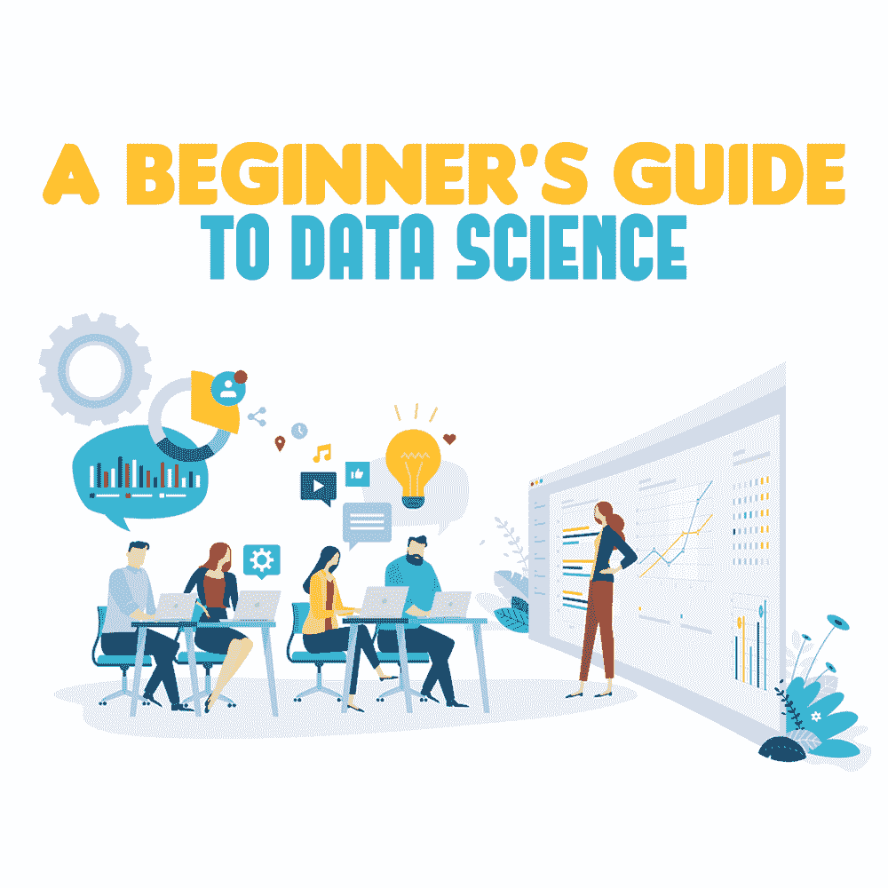

# 数据科学初学者指南

> 原文：<https://simpleprogrammer.com/beginners-guide-data-science/>

<figure class="alignright is-resized">

</figure>

你有没有想过亚马逊的搜索引擎如何为你推荐理想的产品，网飞如何推荐你可能想看的电影，或者自动驾驶汽车如何能够安全地把你从一个地方带到另一个地方？

这都是因为**数据科学**。

你可能听说过“数据科学”或“数据是新的石油”这个术语，也许你甚至想知道从事这个领域是否是一个可行的职业选择。

好吧，你是在搭车，因为[数据科学](https://simpleprogrammer.com/data-science-beginners)是未来的职业。事实上，数据科学正在为全球企业创造巨大价值，是目前最热门的领域。

为了让您的生活更简单，并帮助您全面了解这一流行词汇，我编写了一份数据科学指南，其中包含关于数据科学的所有基本信息，包括其定义和对企业的重要性，以及成为数据科学家所需的技能。

所以，让我们开门见山。

## 数据科学到底是什么？

简而言之，数据科学是指利用大数据(大量非结构化数据)和结构化数据，并将其转化为可操作的见解。

通过数据科学获得的“基本智能”有助于企业解决问题、提高效率、降低风险、增加收入、基于逻辑而非猜测做出有说服力的决策，进而获得竞争优势。

不言而喻，数据科学在每个业务部门都扮演着举足轻重的角色，无论是财务、营销、产品开发、销售、管理还是人力资源。

让我们只考虑提高软件开发过程的生产力。数据科学不仅可以帮助做到这一点，还可以通过捕获和分析代码库的稳定性、分支数量以及拉取请求和部署的数量等指标来改进最终产品。

这通过描绘当前状态的清晰画面和在特定的时间框架内以最小的风险交付特定的高质量产品所需的改进，将投机抛到了窗外。

由于技术发展的快速步伐，世界正变得更加复杂和动态。公司正在从智能手机、机器、网站、社交媒体和物联网平台收集大量数据。

根据经济学家 *的说法， [*数据——变化和增长的驱动力——正呈指数级增长。*早在 2013 年，数字世界的大小还不到 50 亿字节，到 2025 年，它将达到 180 亿字节左右。](https://www.economist.com/briefing/2017/05/06/data-is-giving-rise-to-a-new-economy)*

尽管这些原始数据对肉眼来说似乎毫无用处，但它们实际上一点也不。

令人着迷的是，世界各地的企业要么没有意识到数据科学可以带来的价值，要么发现清理原始数据、正确分析数据并最终将其转化为有用的见解极具挑战性。这正是数据科学和数据科学家发挥作用的地方。

作为第四次工业革命不可或缺的一部分，数据科学正在颠覆我们的生活、研究、决策、治理社会和做生意的方式。因此，现在是各个行业的专业人员，尤其是开发人员，开始熟悉数据科学的时候了。

## 开发者最好加入进来

数据科学是数学、统计学和计算机科学以及数据挖掘、数据可视化和机器学习等技术的多学科融合。除了分析技能之外，它不仅需要牢牢掌握技术、编程和算法开发，还需要敏锐的商业头脑。

数据科学家的高需求、工作的复杂性以及数据科学项目的严谨性意味着，正如 [*Glassdoor*](https://www.glassdoor.com/research/internships-entry-level-jobs-2019/) *所指出的，“数据科学家”是今年美国收入最高的入门级工作，这一点都不令人惊讶。*而且，它还连续第四年被评为[美国最好的工作](https://www.glassdoor.com/List/Best-Jobs-in-America-LST_KQ0,20.htm)。

现在，你肯定在想，你——一个专业的、崭露头角的、甚至有经验的开发人员——如何才能成为一名数据科学家，并从这份[特殊职业提供的](https://simpleprogrammer.com/heard-in-data-science)中受益，对吗？

嗯，你可以这么做:

### **技能提升**

<figure class="alignright is-resized">

</figure>

你可以采取的第一步是开始提升编程语言 R、Python 和 SQL 的技能。这些是在数据科学领域广泛使用的语言，你越早掌握它们，你就会越好。从在线课程到新兵训练营，你可以选择对你最方便的课程。

### **应用机器学习**

接下来，你需要拥抱机器学习并应用它。不像学习不同的编程语言，你只需要学习新的语法，获取和实现关于[机器学习](https://simpleprogrammer.com/machine-learning-modern-web-developer/)的知识更具挑战性。

然而，有了适当的资源，如强烈推荐的在线教育课程，您可以牢牢掌握与数据科学密切相关的机器学习的技能和概念，即数据建模、算法解密模式和进行预测。

### **保持联系**

除此之外，通过参加聚会、听播客或参与实际项目来与数据科学社区保持联系，可以极大地有助于您成为数据科学家。

你也可以加入 LinkedIn 的数据科学小组，与志同道合的人联系，以提高你的学习。此外，你应该通过提问和分享知识成为 Stack Overflow 等在线社区的活跃成员。

重要的是，您要保持专注，并与不断发展的数据科学领域保持同步。不要犹豫去试验、迭代、学习和忘却，因为只有通过这些实践，你才能真正地将自己从一个开发人员转变为一个数据科学家。

## 未来就在这里

底线是，随着大数据趋势积聚巨大的势头，数据科学的未来看起来非常有前途。

这一点，加上数据科学提供了一种便捷的方式来使用数据发现趋势和信息，帮助企业大幅改善他们的系统、流程、产品和服务，这就是为什么数据科学家的工作被《哈佛商业评论》**称为 21 世纪最性感的工作。**

*现在球在你的球场上。如果你想拥抱未来并参与其中，一个好方法就是让自己沉浸在数据科学的世界中。*

*记住，当你停止专业学习的时候，你的职业生涯就开始一落千丈。因此，要致力于终身学习，更深入地钻研数据科学。*