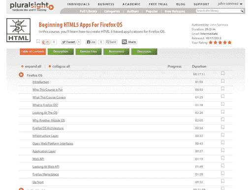

# Firefox 操作系统的 HTML5 应用入门

> 原文：<https://simpleprogrammer.com/beginning-html5-apps-firefox-os/>

我的最新课程刚刚在 [Pluralsight](https://simpleprogrammer.com/pluralsight) 上发布:

[开始为 Firefox OS 开发 HTML5 应用](https://simpleprogrammer.com/beginning-html5-apps-firefox-os-1)

如果你还没看过 Firefox OS，那就值得看一看。我认为这个移动操作系统有很大的潜力，因为它从一开始就专注于 HTML5。我很惊讶火狐操作系统的外观和感觉有多好，而且使用你已经掌握的技能开发起来有多容易。

以下是官方课程描述:

Firefox OS 是一个新的令人兴奋的移动操作系统，其目标是将 HTML 5 发展成为一流的移动公民。在本课程中，我将向您介绍 Firefox OS 的基础知识，并通过示例向您展示如何创建两个真正的 Firefox OS 应用程序，以及如何将这些应用程序推向 Firefox 市场。

在本课程中，我们将从了解 Firefox OS 及其与众不同之处开始。我们还将讨论使用您已经熟悉的 web 技术的移动操作系统的一些好处，并快速浏览一下操作系统本身。

之后，我们将创建一个非常基本的 Hello World 应用程序，完成安装 Firefox OS 模拟器和创建一个在其中运行的非常基本的应用程序的简单过程。

一旦我们有了这些基础，我们将直接创建我们的第一个应用程序。首先，我将向您展示如何创建一个托管应用程序，这是一个实际上您可以在自己的 web 服务器上托管的应用程序，但它像任何其他移动应用程序一样安装在 Firefox OS 上。

然后，我们将创建另一个完整的应用程序，我们将学习如何创建一个打包的应用程序，它能够访问更多的 API，而 Firefox OS 只向设备上实际安装的应用程序公开这些 API。我们仍将使用您已经习惯的 HTML 5 技术，但我们不需要自己托管应用程序，因为用户将直接在他们的设备上安装。

最后，我将带您完成部署 Firefox OS 应用程序的过程。我们将讨论让我们的应用程序到达用户手中的不同选择，包括自己分发它和使用 Firefox Marketplace 托管您的应用程序。

因此，如果你对移动感到兴奋，并想了解一个令人兴奋的平台，你可以为这个平台开发并重用你现有的 HTML 5、JavaScript 和 CSS 技能，你肯定会想参加这个课程。