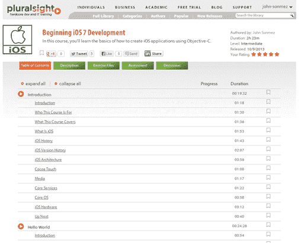

# 开始 iOS 7 开发

> 原文：<https://simpleprogrammer.com/beginning-ios-7-development/>

距离我第一次参加 [Pluralsight](https://simpleprogrammer.com/pluralsight) 的 iOS 课程已经有一段时间了。使用 Objective-C 进行 iOS 开发时，一些事情发生了变化。也许，最大的变化是使用故事板，而不是在 iOS 中手动切换视图。

因此，我创建了这个新课程，[开始 iOS 7 开发](https://simpleprogrammer.com/beginning-ios7-development)，为使用 Objective-C 开始 iOS 7 开发提供一个全新的教程。

所以，如果你对 iOS 7 开发感兴趣，就去看看吧。

以下是官方的课程描述:

如果你没有太多使用 Mac 的经验，也没有使用过 Objective-C，开始学习 iOS 应用程序开发可能会令人生畏，但是，这不一定是一次痛苦的经历。

在本课程中，当我们构建一个完整的 iOS 应用程序时，我将向您展示创建 iOS 应用程序的基础知识，同时学习我们需要了解的关于 Objective-C 的知识。

我们将从学习 iOS 的一般知识和 iOS 开发环境开始。

然后，我们将直接进入并创建第一个 Hello World iOS 应用程序，同时设置我们的开发环境并学习我们用于 iOS 开发的 IDE Xcode 的基础知识。

之后，我将向您展示构建任何应用程序所需了解的核心内容，以及如何构建用户界面并与之交互。我们将学习如何使用 Xcode 的界面构建工具来创建一个非常基本的 IU 并与之交互。

一旦我们掌握了基础知识，我们将开始构建我们的第一个真正的应用程序。在构建我们的应用程序时，我们将学习一些新概念，比如如何使用 iOS 故事板功能来创建多屏幕应用程序，以及如何在我们的应用程序中设置导航。

最后，我们将学习如何向应用程序添加用户设置，以及如何通过使用警告向用户显示简单的通知，从而完成我们的 iOS 应用程序。

因此，如果你想开始 iOS 开发，并且在构建一个真正的应用程序时，想寻找一种简单而温和的方法来了解环境和工具，那么这个课程正是你所需要的。学完这门课程后你不会成为 iOS 开发方面的专家，但这门课程肯定会让你在学习平台方面有一个良好的开端，并向你展示在学习更高级的课程之前你需要知道的基础知识。

***快速补充:**如果你读到这里，你可能是那种关心你职业的开发人员。我正在整理一个完整的包，里面有关于如何真正促进你的软件开发事业和增加你的收入潜力的信息。目前[只接受预订](https://simpleprogrammer.com/howtomarketyourself)。我只会在短时间内以如此大的折扣价出售它。我还将对鲍伯·马丁、乔恩·斯基特和杰夫·阿特伍德等著名软件开发人员进行独家采访，分享他们的成功秘诀。*