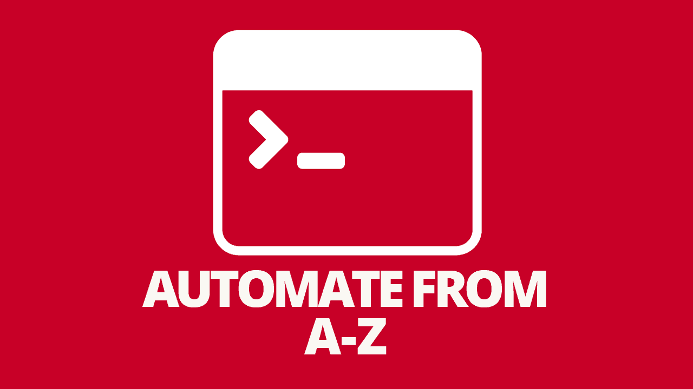

# 最好的自动化框架和工具

> 原文：<https://simpleprogrammer.com/best-automation-frameworks/>

你曾经尝试过建立一个企业级的自动化框架吗？你不是第一个。

幸运的是，许多聪明的人多年来一直在创造不同的工具和框架来处理自动化。因此，如果你正在尝试做一些自动化的 UI 测试、自动化的单元测试、静态代码分析或者其他事情，有一些经过测试的工具和框架可以帮助你完成你的目标。

下面是你应该使用的最好的 C#自动化框架和工具的列表。此列表中的所有内容都适用于。网；然而，有些工具可能更通用，因为它们可以用于任何编程语言。

我根据我多年作为测试自动化开发人员的经验编辑了这个列表。我已经使用了这些自动化框架中的大部分，并且可以保证它们是满足您需求的可靠选择。我没有使用的工具，我彻底研究，为您提供最佳的选择。

## Selenium WebDriver 框架代码

### [1)假人自动化测试框架](https://github.com/ProtoTest/ProtoTest.Golem)

Selenium WebDriver | GUI 测试| RESTful 测试| SauceLabs

这个框架是我在业界见过的功能最丰富的框架之一。它帮助您构建 GUI 测试、RESTful 测试和针对 Windows 应用程序的测试，并且它在本地或云中运行所有这些东西。我花了很多时间看这段代码，学到了很多东西。

创建者有一些非常好的策略来做非常可读的测试。此外，他创建了很棒的日志、截图和视频记录来帮助调试失败的测试。遗憾的是，我无法让它持续运行，但这是一个很好的起点。另外，它已经有一段时间没有更新了。我做了[分叉我自己的副本](https://github.com/nadvolod/ProtoTest.Golem)并且清理了所有的编译问题，如果你想尝试一下的话。

### [2)页面对象模型框架](https://github.com/nadvolod/LightPomFrameworkTutorial)

[终极质量保证](https://courses.ultimateqa.com/)

Selenium WebDriver | C# |页面对象模型

这是一个健壮的 Selenium 自动化框架，将帮助您开始使用页面对象模型和 GUI 自动化。此外，这个框架包含许多高级技术，可以帮助您管理大型页面对象、良好的解决方案架构以及创建 HTML 报告。

如果你有兴趣了解更多，我实际上有一个[完整的视频课程](https://courses.ultimateqa.com/courses/selenium-with-c?coupon=simpleprogrammer-resource-guide)，在那里我教如何开发这样一个自动化框架。[分叉它或下载它](https://github.com/nadvolod/LightPomFrameworkTutorial/tree/SeleniumV2)为你的未来框架获得一些新的想法。

### [3)自动化行星框架](https://github.com/angelovstanton/Projects/tree/master/PatternsInAutomation.Tests)

Anton Angelov

selenium web driver | Test Studio | c#

安杰洛夫有大量有用的代码，你可以看看。他将不同的设计模式应用到他的代码中，向您展示它的外观。例如，您可以看到如何使用策略设计模式、外观设计模式、页面对象模型和高级页面对象模型。您可以在其中循环，并决定想要重用哪个[代码](http://www.amazon.com/exec/obidos/ASIN/1783283033/makithecompsi-20)。这些代码将帮助你开始你自己的自动化测试。

## BDD 框架

### [1) SpecFlow BDD 自动化](http://www.specflow.org/)

C# | Selenium Webdriver | BDD

SpecFlow 是为数不多的 C# BDD 框架之一，这自然使它成为您在开发项目中使用的非常理想的自动化工具。这个框架帮助您使用业务可读的规范来构建验收测试。您使用小黄瓜语法来构建阅读起来接近简单英语的测试。因此，这些测试对于开发人员、测试人员和业务人员来说是可读的，并且在理论上，可以作为可以替代需求的活文档。

### 宁静

Java |硒| BDD

Serenity 是一个 BDD 框架，可以与 Java 和 Selenium WebDriver 一起工作。Serenity 还提供以下功能:

*   提供 web 驱动程序管理
*   截图
*   并行运行测试
*   促进吉拉一体化

我没有用过 Serenity，因为它不与我的 Visual Studio 集成，但我知道有人用过，他们都对它赞不绝口。

### [3)量规](http://getgauge.io/get-started/index.html)

思想作品

测试自动化框架

Gauge 是一个测试自动化框架，由创建 Selenium WebDriver 的团队设计。用他们的话说，“Gauge 是一个轻量级的跨平台测试自动化工具，能够用业务语言编写测试用例。”

虽然我自己没有探索过这个框架，但它确实让我觉得很有趣，因为它是由 Selenium 的人创建的。他们似乎确实创造了改变世界的资源。这是我将来要看的一个节目，你也应该看。

### [4) BDD 样本代码](https://watirmelon.blog/2011/03/15/specdriver/)

阿利斯特·斯科特

c# | Selenium web driver | BDD | spec flow

如果您希望使用 Selenium WebDriver 和 C#构建行为驱动的开发测试，那么 Scott 有您想看的代码。他利用 T2 的框架来运行他的测试。这个资源不是一个真正的框架，而是一些样本代码。然而，我总是建议你尽可能地查看所有代码，作为从其他人那里获取知识的实用方法。

## 单元测试框架

### [1)努尼特](http://nunit.org/)

C# |单元测试

NUnit 绝对是最流行的 C#单元[测试框架](http://www.amazon.com/exec/obidos/ASIN/9401800626/makithecompsi-20)。它在 Github 上非常活跃，有大量的贡献者和提交者。您可以使用这个框架进行单元测试，也可以使用 Selenium WebDriver 这样的工具进行验收测试。它非常易于使用，而且非常健壮。文档也很好，并且有大量的在线资源可以提供帮助。

## 嘲弄框架

### [1)最小起订量](https://github.com/Moq/moq4)

模拟框架

我使用过这个开源的嘲讽框架，我可以保证它运行良好。它使得模拟测试自动化变得容易使用。NET Linq 表达式语法。文档也是丰富的和描述性的。Github 社区有大约 60 个贡献者，有超过 1000 个提交；这意味着项目正在被更新。另外，你可以找到一个关于如何在 Pluralsight 上使用它的优秀教程。

### [2) FakeItEasy](https://fakeiteasy.github.io/)

模拟框架

我没有使用过这个嘲弄的框架。快速浏览一下文档页面，您会发现这是一个非常好的框架。模拟的格式便于阅读和理解。因此，如果你对使用 Moq 有问题，你可以试试 FakeItEasy，我相信它会满足你的嘲笑需求。

## 验收测试

### [1)适合度](http://fitnesse.org/)

FitNesse 是一个语言无关的验收测试框架。这个程序的一个优点是，你可以通过网络浏览器创建和编辑需求，这使得参与项目的每个人都可以很容易地与这个工具进行交互。“使用验收测试允许更好的协作，因为现在涉众可以设计可测试的文档。”这个程序是改善业务人员和程序员之间交流的好方法。

## 变异测试和基于属性的测试

### [1) VisualMutator](http://visualmutator.github.io/web/)

C# |突变测试

你听说过变异测试吗？这是一个有趣的概念，它允许你基本上逆转你所有的断言，看看你的自动化测试是否会失败。这个概念是我需要尝试的。在我的职业生涯中，我见过许多永远不会失败的自动化测试，看到这样的测试总是令人失望。突变测试工具会指出那些从未失败的测试，以便您可以修复这些测试。

Visual Mutator 是少数几个在执行变异测试方面看起来不错的 C#工具之一。我查看了变更日志、文档和网站，以确定这个工具的质量。我自己还没有使用过它，但是如果你打算进行突变测试的话，这个似乎是值得的。

### 2)fscheck

C# | F# |基于属性的测试

FsCheck 是一个测试工具。NET 程序自动运行。“你可以提供程序的属性——也就是说，应该满足哪些函数、方法或对象。FsCheck 测试这些属性，看看它们在大量随机生成的案例中是否成立。

FsCheck 支持多种测试框架，如 NUnit、MsTest 和 XUnit。此外，他们的文档非常好，你应该很容易上手。

## 代码覆盖和静态分析测试

### [1)点覆盖](https://www.jetbrains.com/dotcover/)

C# |代码覆盖率

DotCover 是 ReSharper Ultimate suite 中的一个工具，它允许您获取代码的代码覆盖率度量。您可以执行您的单元测试，然后通过使用提供的有用的突出显示来查看代码的哪些部分被覆盖，哪些部分没有被覆盖。

### 2)声纳曲

静态代码分析|持续的代码质量|多语言支持

我坚信所有源代码的优秀质量，包括测试代码。然而，维护高质量的代码是非常困难的。每一个糟糕的编码决策都可能很快失去控制，导致您的测试代码腐烂。

减少腐烂代码数量的一个很好的方法是对代码质量设定严格的标准。然后，您可以使用静态分析来确保您的团队标准得到执行。SonarQube 是一个工具，我很高兴能够学习并将其包含在我的测试自动化管道中。

SonarQube 提供了一个主页，显示你在质量方面的地位。可以设置质量关卡来防止有异味的代码进入生产。您还可以对您的 pull 请求运行分析，这为您提供了快速查看您的代码如何影响整个项目的能力。

## 从头到尾自动化

去使用这些工具来极大地提高您的测试自动化技能。有了它们，您现在可以自动执行代码覆盖、单元测试、基于属性的测试等等。

所有这些工具将最终帮助你达到每个人都追求的更高的软件质量。如果你想进一步扩展你的技能，一定要看看 [8 本书来提高你的测试自动化技能](https://simpleprogrammer.com/2017/06/14/improve-test-automation-skills/)和[测试自动化框架架构](https://simpleprogrammer.com/2014/04/14/test-automation-framework-architecture/)。