# 2021 年最佳云备份服务

> 原文:[https://simple programmer . com/best-cloud-backup-services-2021/](https://simpleprogrammer.com/best-cloud-backup-services-2021/)

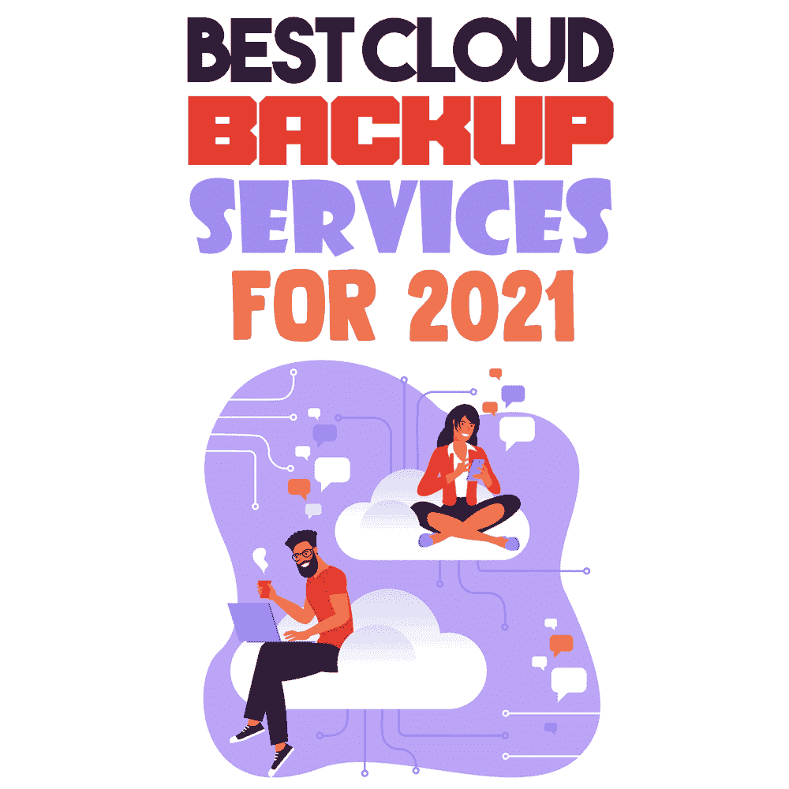

With the expansion of high technologies and millions of data, the problem of losing any of the data becomes more serious. The sensitive data on personal devices or computers are prone to damage or loss caused by mechanical failure. Cloud backup is, so far, the best means to protect data and restore it in case of a crash.

云备份或在线备份是将数据发送到辅助服务器或数据存储系统的技术服务。第三方服务为消费者提供数据存储空间或数据访问，或者在需要时随时恢复数据。这项技术是公司从物理设备转向云的更加灵活的数据存储并降低成本的关键解决方案。

作为一个 IT 领域，云计算在 2020 年创造了超过 3000 亿美元的收入。此外，已经有 81%的企业实施了云计算战略。2020 年，67%的业务基础设施转变为基于云的，据预测，全球高达 94%的工作负载不久将由云服务器控制。很明显，云备份是一项重要甚至至关重要的技术。

在这篇文章中，我将对你能找到的最好的云备份系统进行全面的分析，列出它们的优缺点，以便你能选择最适合你需求的解决方案。

## 云的类型和云服务模式

首先，澄清一下。“云存储”和“云备份”不是同义词。前者是远程存储驱动器，用于保存数据并通过互联网访问数据。另一方面，云备份包括云存储的功能，加上它从设备中抓取所有数据并存储在云中。通常，云存储和云备份以及云同步在同一软件中运行。

一般来说，我们可以将云分为三个独立的类别:**公共云、**云和**混合云**:

*   **公共云**归第三方服务提供商所有，通过互联网提供服务。用户可以通过网络浏览器或手机应用程序访问云服务并管理自己的账户。
*   **另一方面，私有云**在组织内部提供服务。[云计算](https://simpleprogrammer.com/adopt-cloud-computing/)服务和资源由单个公司及其拥有访问权限的成员使用。云可能位于公司的现场数据中心，或者由第三方服务提供商托管。
*   **混合云**提供两种类型的云使用。混合云的灵活解决方案建议在公共云和私有云之间平稳切换。

除了这个[基本划分](https://aws.amazon.com/backup/?whats-new-cards.sort-by=item.additionalFields.postDateTime&whats-new-cards.sort-order=desc)之外，我们还可以根据云服务的模式进行分类: ***软件即服务(SaaS)、平台即服务(PaaS)、*** 或 ***基础设施即服务(IaaS):***

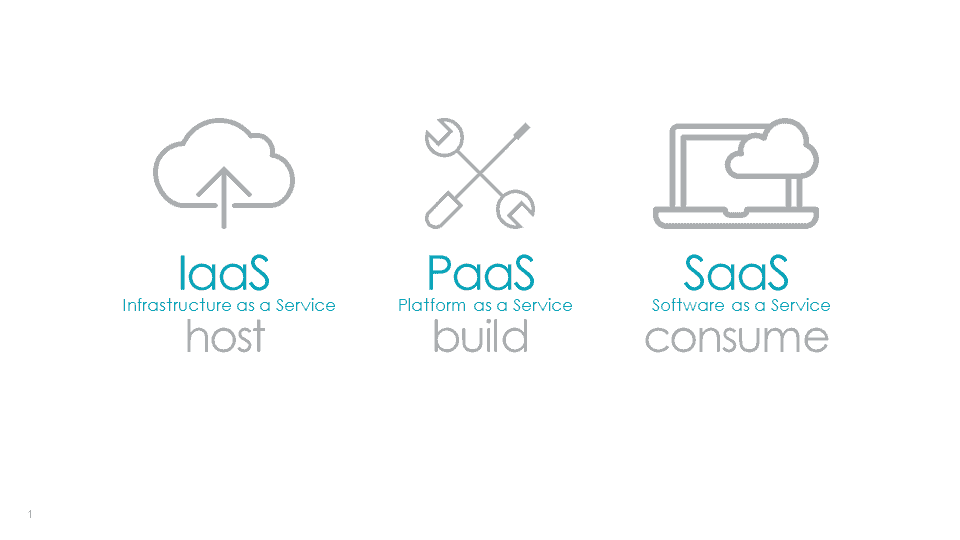

[来源](https://edge.siriuscom.com/_wss/clients/509/assets/503/3%20Popular%20Cloud%20Service%20Models.PNG)

*   ***【软件即服务】(SaaS)*** 通过设备或网络连接的网络浏览器提供数据访问。通过这种方式，提供商让最终用户能够通过网络访问为 SaaS 发行版创建的应用程序的单一副本。同时，云提供商可以通过 SaaS 管理软件应用，并处理任何维护，如更新或安全补丁。凭借 18%的复合年增长率，到 2023 年，SaaS 市场的价值将达到[6230 亿美元。](https://financesonline.com/saas-statistics/)
*   ***平台即服务(PaaS)。***PaaS 模式为[开发 app](https://addevice.io/blog/cloud-based-application-development/) 并管理其未来维护提供了环境。该技术在移动应用程序开发中更受欢迎。它有助于更快地构建应用程序，而无需设置服务器和存储的底层基础架构。简而言之，开发者从云提供商那里租用构建应用所需的一切。
*   ***基础设施即服务(IaaS)。*** 云计算的形式是通过互联网将存储、网络等按需资源交付给消费者。由于 PaaS 的兴起，IaaS 技术出现了下滑。尽管如此，到 2027 年， [IaaS 市场](https://www.alliedmarketresearch.com/infrastructure-as-a-service-IAAS-market#:~:text=Infrastructure%20as%20a%20Service%20(IaaS)%20Market%20Statistics%20%2D%202027,23.2%25%20from%202020%20to%202027.)的价值将达到 2010 亿美元。

有数百种免费和付费的云服务，找到一种能够满足您的要求并提供安全备份和存储的可靠云服务至关重要。毕竟，你将把你生活中一些真正重要的部分托付给这片云。

## 云备份选项

在这一部分，我将向您提供一份现有的[流行云备份服务](https://www.amazon.com/dp/B07K5L4GB6/makithecompsi-20)的列表，包括它们的优缺点。这样，您可以看到哪些具有您需要的功能，以便做出适合您的选择。

### [IDrive](https://www.idrive.com/)

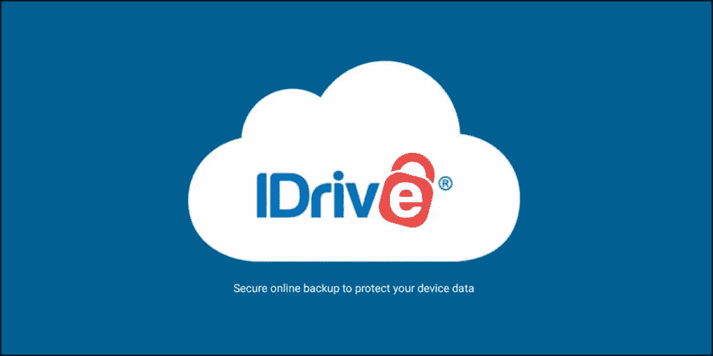

[来源](https://www.cloudzat.com/wp-content/uploads/2020/09/idrive-cloud-storage.jpg)

IDrive 是迄今为止最受欢迎的云备份服务，在数据备份过程、同步和共享方面提供了一系列有用的功能。它提供 5GB 存储的免费基本计划和 5TB(52.12 美元/年)的标准付费计划，可以升级到 10TB 存储。

IDrive 的主要功能之一是无限制的设备集成和连续数据备份，与计划备份功能相比，可确保全面的数据保护。

*优点*

*   *文件不会自动从云端删除*
*   *移动备份服务*
*   *安全文件传输*
*   *覆盖多个平台*
*   *私有加密密钥*

*缺点*

*   *有限存储*
*   *缺乏双因素认证(2FA)*
*   *基线存储只有 250GB*
*   *基本共享选项*
*   *界面不友好*

### 诺德洛克公司

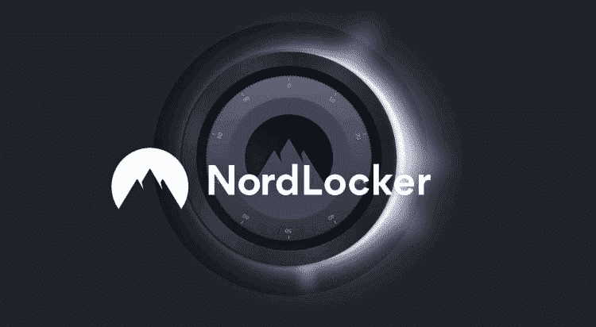

[来源](https://www.cryptoninjas.net/wp-content/uploads/nordlocker.jpg)

NordLocker 拥有 5GB 的免费存储空间，是个人使用的绝佳备份解决方案。付费计划提供高达 500GB 的存储空间。高级和坚如磐石的安全有最新的加密协议。通过该服务，可以同步文件，并通过应用程序从不同的设备进行访问。

*优点*

*   *使用简单*
*   *“零知识”政策*

*缺点*

*   *文件只能与 NordLocker 用户共享*

### [pCloud](https://www.pcloud.com/)

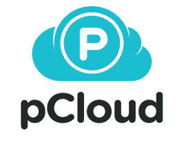

[来源](https://kommandotech.com/wp-content/uploads/2020/09/pcloud-logo-1.png)

pCloud 服务最好的一点是，你可以获得 4GB 的免费空间，并且通过安装桌面和移动版本并邀请你的朋友加入 pCloud，可以将存储空间最大化到 10GB。该服务的另一个便利功能是客户端文件加密，它基于 256 位 AES，除了用户之外，不允许任何人访问文件。

*优点*

*   *合理价格(48 美元/年)*
*   *用户友好界面*
*   *桌面和移动应用*
*   *扩展文件历史*
*   *口袋友好型*

*缺点*

*   *没有协作选项*

### [Dropbox 业务](https://www.dropbox.com/business)

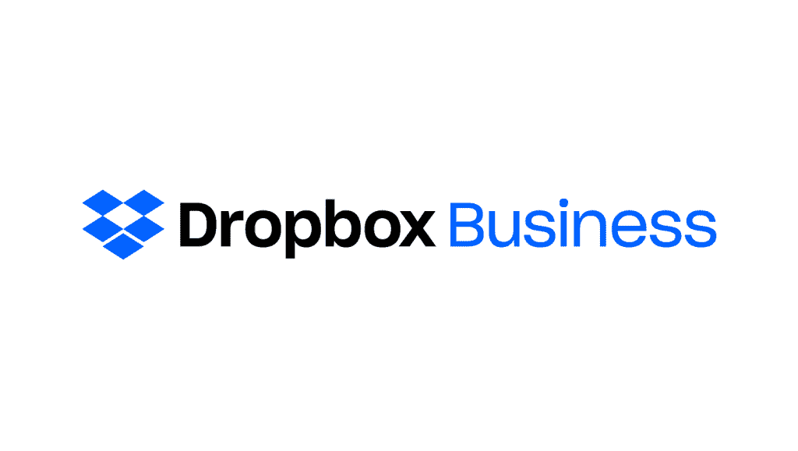

[照片网址](https://www.betterbuys.com/wp-content/uploads/2015/06/Dropbox-Business.png)

Dropbox 于 2007 年率先提供云备份和存储。当时，这是一个突破性的解决方案，开创了在异地存储数据的新文化和新趋势。如今，Dropbox Business 拥有高达 5TB 的存储容量和扩展功能；单一管理员登录、256 位 AES 和 SSL/TLS 加密、控制用户权限、水印、180 天数据保留等等。

*优点*

*   *强大的协作工具*
*   *无限存储选项*
*   *功能特性和工具*
*   *云存储和同步*

*缺点*

*   *高价(高级功能每月 25 美元)*
*   *不支持在线编辑选项*

### [坠毁计划](https://www.crashplan.com/en-us/)

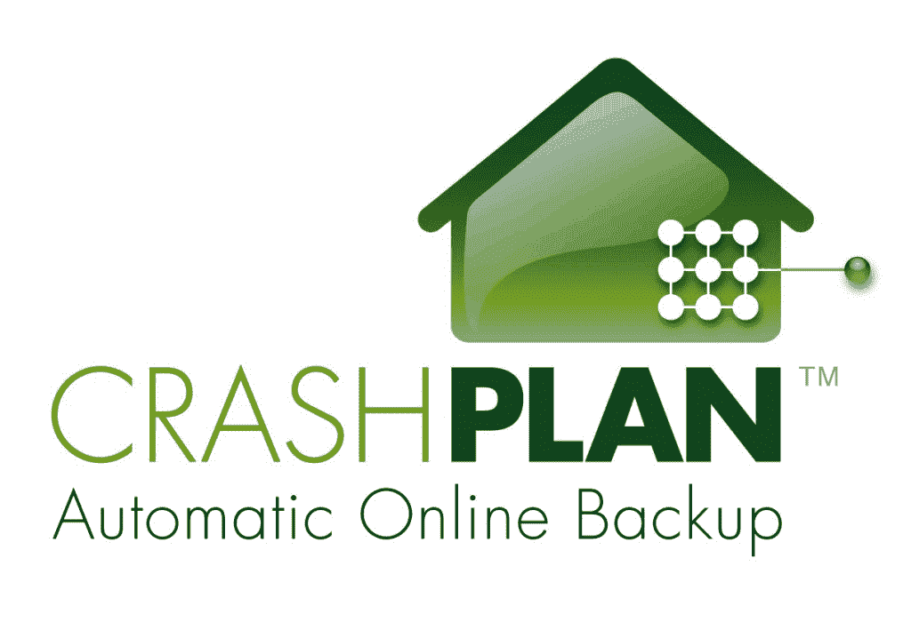

[源 1](https://www.unixmen.com/wp-content/uploads/2014/06/crashplan.jpg)

CrashPlan 由于其快速的功能和多平台支持，可以被视为小型企业的顶级云备份服务。可定制的服务提供设置备份频率、帐户安全、已删除文件的保留等。每台设备的定价模式非常适合拥有少量设备的初创公司和小型企业。

*优点*

*   *无限存储*
*   *快速下载和上传速度*
*   *备份外部驱动程序的选项*
*   *强大的加密*
*   *无限制的文件版本控制*
*   *移动设备支持*

*缺点*

*   *定价(10 美元/月)*
*   *不支持文件共享*
*   *不支持离线备份和恢复*

### [微软 OneDrive](https://www.microsoft.com/en-us/microsoft-365/onedrive/online-cloud-storage)

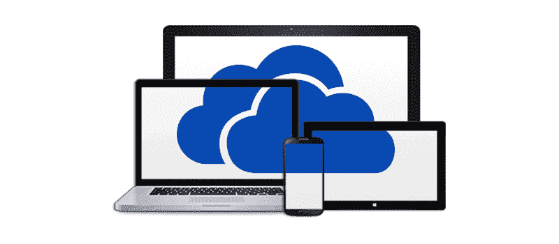

[来源](https://www.reactcp.co.uk/wp-content/uploads/2015/02/microsoft-onedrive.jpg)

对于 Windows 和 Microsoft Office 用户来说，OneDrive 是一种功能性云备份服务，具有许多优势和功能。网络和移动界面很容易操作。OneDrive 支持多台电脑以及对在线和离线存储的访问。但是，作为一个企业备份工具，OneDrive 的灵活性和有效性较差。

*优点*

*   *微软 365 提供*
*   *无需下载即可在线编辑文件的选项*
*   *15GB 免费存储空间*
*   *社交网络整合*
*   *用户友好界面*
*   *手机应用支持*

*缺点*

*   *没有高级功能*
*   *仅同步特定文件夹*

### [后台业务](https://www.backblaze.com/)

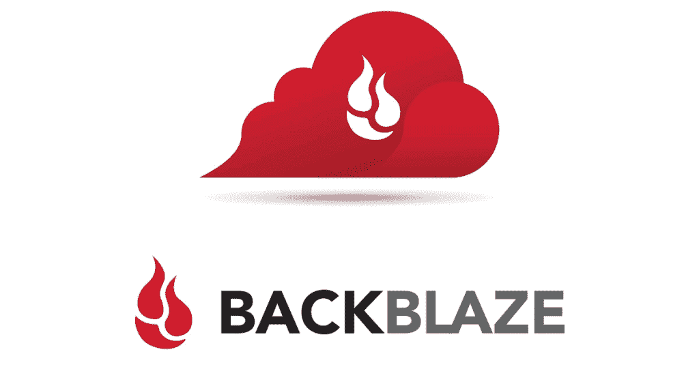

[来源](https://www.backblaze.com/pics/facebook-share-image.jpg)

这是最经济、最简单的个人和企业备份服务之一。云备份最看重的是容量，Backblaze 钉钉，提供无限备份空间。不幸的是，这项服务经常因为没有文件同步而被低估，但它的主要作用是完美的，即备份。为了安全起见，数据是加密的。

*优点*

*   *低价(一年 60 美元)*
*   *无限存储*
*   *数据加密*
*   *外置硬盘备份*

*缺点*

*   *无多设备支持*
*   *不人性化的手机应用*
*   *中端备份性能*
*   *没有私人加密*

### [碳化保险箱](https://www.carbonite.com/products/carbonite-safe-cloud-backup)

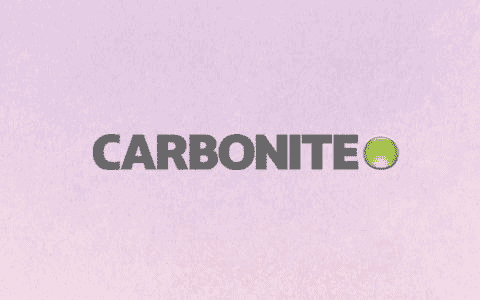

[来源](https://cdn.mos.cms.futurecdn.net/SDAvTQ6vc9yvHA6DzJssM7-480-80.jpg)

Carbonite 安全备份服务的最大优势之一是直观的界面，显示已经完全或部分备份或根本没有备份的文件。基本的 Safe 计划功能有限，缺乏大型文件、视频文件和外部驱动程序的自动备份。

*优点*

*   *无限存储*
*   *连续备份*
*   *所有可用计划的 15 天免费试用*
*   *高安全级别*

*缺点*

*   *上传速度慢*
*   *附加功能的额外费用*
*   *文件版本限制为 30 天*
*   *大文件应手动选择备份*
*   *相对较高的价格*

### [SOS 在线备份](https://www.sosonlinebackup.com/)

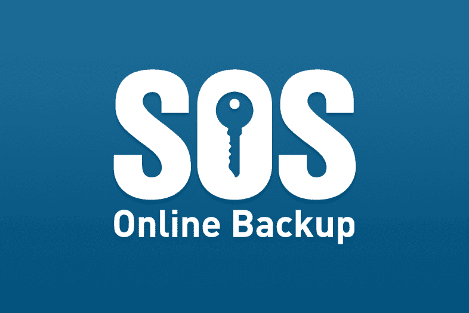

[来源](https://gadgetshelp.com/wp-content/uploads/images/lfw/ba63ea9d24ff95220192d24c26a91afe.PNG)

SOS 在线备份提供了大量免费功能，这些功能大多是其他服务中的附加服务。它还支持 SQL Server、Exchange 和 SharePoint。SOS 在线备份永久存储任何删除的文件，所以即使意外删除也没有机会丢失任何数据。

*优点*

*   *没有限制*
*   *集成无限数量设备的选项*
*   *无限版本化*
*   *多平台支持(iOS、Android、Mac、Windows Vista 等。)*

*缺点*

*   *没有从网络访问的选项，一旦密钥丢失，就无法恢复*
*   *高价格 1TB 每月 40 美元)*

### [SugarSync 业务](https://www1.sugarsync.com/business/)

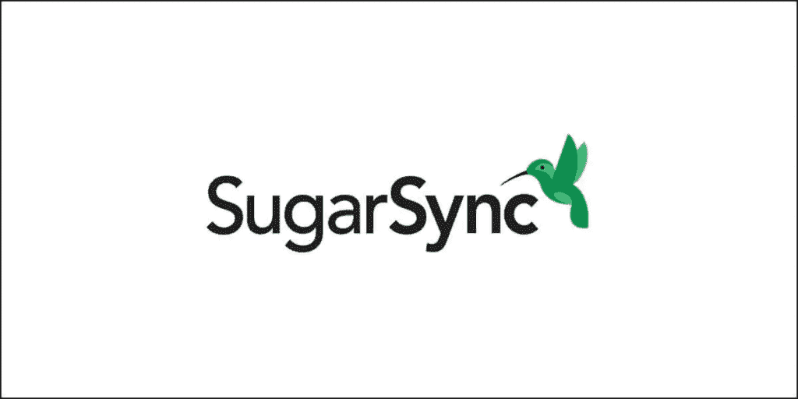

[来源](https://www.cloudzat.com/wp-content/uploads/2020/10/sugarsync-image.jpg)

对于个人使用，SugarSync 有一个 100GB 云存储的基本计划，而商业计划则有更多功能和 1TB 容量的存储。该服务在上传、存储和下载过程中对数据进行加密。SugarSync 提供了一个选项来选择要同步的文件夹，并排除那些不需要自动备份的文件夹。

*优点*

*   *可配置的同步服务*
*   *远程管理*
*   *文件浏览器集成*

*缺点*

*   *缺少方便的功能*
*   *上传和下载速度慢*
*   *昂贵(55 美元/月)*
*   *没有 2FA*

## 选择云备份有很多原因

云备份和存储非常重要，甚至对个人和企业的使用都至关重要。即使您的敏感数据从设备中丢失，它也会保护您的敏感数据，让您有一种安全感。那么选择云备份服务需要注意什么标准呢？

最终，这是一个平衡的问题。理想情况下，应该有一个解决方案，以较低的价格将高性能、多功能性和强大的安全性结合起来，或者，为什么不呢，甚至是免费的。但是没有这样的选择，所以这是一个找到适合你需求的平衡点的问题。

除了以上这些属性，您还应该考虑存储空间选项、服务的可扩展性、备份频率和供应商灾难恢复。

根据你的个人要求，仔细考虑每个选项的利弊，可以揭示你应该做出的选择。