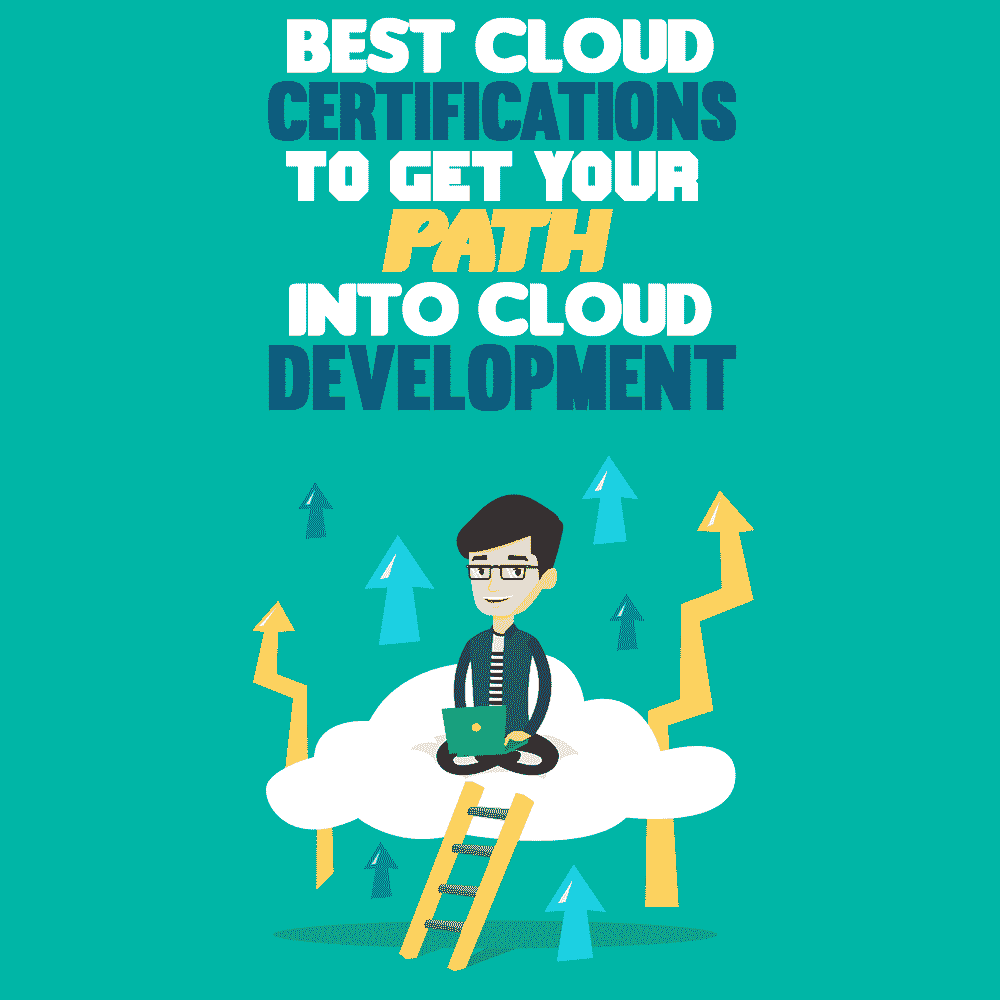

# 最佳云认证让您踏上云开发之路

> 原文：<https://simpleprogrammer.com/best-cloud-certifications/>

In our undeniably digital modern world, to remain competitive, organizations must have the right cloud computing strategy. Cloud adoption has been expanding in the past years and accelerated even more due to the pandemic. In the first quarter of 2020, cloud spending rose 37% to $29 billion, [reports PwC](https://www.pwc.com/us/en/tech-effect/cloud/covid19-cloud-infrastructure.html). According to [Gartner Research](https://www.gartner.com/en/newsroom/press-releases/2021-04-21-gartner-forecasts-worldwide-public-cloud-end-user-spending-to-grow-23-percent-in-2021), the worldwide public cloud revenue had seen 23% growth in 2021, to $332.2 billion.

因此，云计算工作是信息技术领域薪酬最高的工作之一。云支持、云架构和[云软件开发](https://symphony-solutions.com/insights/cloud-software-development-guide)方面的专家带来了很多价值。

需求的巨大增长一直在创造新的云角色，这导致了行业中巨大的技能缺口。无论你是刚开始还是想继续下一步，成为云计算专家都将帮助你推进你的职业生涯。

有很多课程可以让你从认证开始。如果你不知道从哪里开始，下面的列表会有所帮助。我们将了解特定供应商提供的课程，以及一些通用课程，并为您提供一些测试背景，以帮助您做出正确的决定。

## 为什么认证很重要

如果你是刚刚进入云计算的世界，你应该开始*思维云*。认证可能是获得基本云知识的首选。

如果你考虑成为一名 IT 专家，参加课程比大学教育花费的时间更少，成本更低。远程学习既方便又及时，它还让你可以选择学习什么和什么时候学习。

证书不能保证你得到这份工作，但它们绝对是敲门砖。在你的简历、博客或 LinkedIn 个人资料中展示你的云证书表明了你对这个话题的兴趣和包容性。更不用说，有云证给你未来雇主的印象是你花时间学习过，面临过考试挑战。

事实上，雇主寻求的是具备特定专家级技能的 IT 专业人员，这些技能可以在课程中获得，例如:

*   云架构和设计
*   云概念
*   云解决方案
*   云中的安全性
*   自动化和虚拟化
*   公共云与私有云
*   大数据，数据科学

通过认证提高您的专业技能不仅可以更新您在云计算方面的经验，还可以让您获得更好、收入更高的工作。

## 2022 年如何选择最好的云认证

云计算认证的选择取决于你的专业水平和你的目标工作。无论您是在其他云领域经验丰富、正在改变 IT 专业化，还是刚刚开始云计算职业生涯，在新的云环境中工作都可能具有挑战性。考虑获得特定于供应商的云认证，以获得必要的技能和对个别技术和基础架构的理解。

让我们看看最受欢迎的认证，它们的费用，以及需要多长时间来掌握它们。快速注意:所有考试费用都以美元列出，可能会因您的国家或监考地区而异。请向官方认证提供商查询您所在地区的当前价格。

### 亚马逊网络服务(AWS)认证

[亚马逊网络服务](https://aws.amazon.com/certification/)为基础和专家级专业人士提供各种认证。凭借 33%的市场份额和在全球网络中的强大影响力，AWS 在选择您的云平台时是首选供应商，因此它产生了对云专家的最大需求。

AWS 认证是一种快速且经济实惠的方式来验证您的云知识。高级别的认证可能更难获得，需要多年的云技术经验。

**AWS 认证云从业者。**该入门级认证将检查您对基本 AWS 架构、云的价值主张以及其他核心原则的理解。
**考试时长:** 90 分钟
**考试费用:** $100

**AWS 认证解决方案架构师助理。**有设计分布式应用的经验就拿吧。你需要知道[网络技术如何在 AWS](https://www.amazon.com/AWS-Solutions-Architects-infrastructure-implementing/dp/1789539234) 中工作，AWS 中高性能系统的设计、实现和部署。除此之外，考试还包括 AWS 相关的数据安全和成本优化实践。
**考试时长:** 130 分钟
**考试费用:** $150

**AWS 认证开发人员-助理。**考试涵盖基本 AWS 架构和核心 AWS 服务。您将应用利用 AWS 服务的应用程序的工作知识。要通过考试，您需要知道如何编写代码，使用 AWS 软件从您的自定义业务应用程序中访问 AWS 应用程序。
**考试时长:** 130 分钟
**考试费用:** $150

**AWS 认证系统管理员-助理。**该考试专门针对系统管理员，要求您具备 AWS 平台内操作方面概念的技术专业知识和知识。测试形式为多项选择、多项选择和考试实验室(由要在 AWS 管理控制台或 AWS CLI 中执行的任务组成的场景)。
**考试时长:** 3 小时
**考试费用:** $150

**AWS 认证解决方案架构师-专业人士。**那是一般 AWS 专业知识的巅峰。该考试面向具有两年以上在 AWS 上设计和部署云架构实践经验的专业人士。
**考试时长:** 3 小时
**考试费用:** $300

### 谷歌云平台(GCP)认证

谷歌云仍然是三大云平台之一，拥有 8%的市场份额，迅速扩大其全球影响力。目前有十种认证可供选择。GCP 考试可能更难通过，因为有些考试对考生的要求更高(例如，开发人员背景)。

**协理云工程师。**谷歌建议那些拥有半年以上谷歌云实践经验的人参加考试。它确保你有一个强大的基础，让你继续进行专业认证。
**考试时长:** 2 小时
**考试费用:** $125

**专业云架构师。**你应该精通云计算，并在谷歌云环境中工作至少一年。该考试测试您设计云解决方案架构和管理其基础架构的能力。此外，您需要熟悉数据安全性和成本优化实践。
**考试时长:** 2 小时
**考试费用:** $200

**专业数据工程师。**根据 Google 的说法，数据工程师通过收集、转换和发布数据来实现数据驱动的决策。该考试评估您设计数据处理系统、保护和监控数据处理系统的能力，尤其是操作机器学习模型的能力。
**考试时长:** 2 小时
**考试费用:** $200

**专业云开发者。**该考试要求云开发人员具备丰富的云原生应用经验，并使用谷歌推荐的实践和工具设计高度可扩展、可用且可靠的应用。此外，开发人员应该精通至少一种通用编程语言才能完成考试。
**考试时长:** 2 小时
**考试费用:** $200

**专业云网工程师。**成功的考生可以设计一个谷歌云网络。他们还应该能够实施虚拟私有云(VPC)实例和混合互连。
**考试时长:** 2 小时
**考试费用:** $200

**专业云安全工程师。**该考试评估在云环境中配置访问和管理操作以及确保网络安全性和合规性的能力。
**考试时长:** 2 小时
**考试费用:** $200

### 微软认证 Azure 认证

[微软 Azure](https://docs.microsoft.com/en-us/learn/certifications/browse/?resource_type=certification&products=azure) 以 21%的市场份额登上顶级云平台排行榜。有 12 种云认证可供选择。微软认证的云专家需求量很大。

Azure 基础知识。 Azure 是世界第二大云提供商。因此，它应该出现在初学者的云计算认证名单上。考试是为那些有技术和非技术背景的人设计的。Azure 基础知识涵盖了云计算的基础知识，并允许继续进行更高级的 Azure 认证。
**考试时长:** 45 分钟
**考试费用:** $99 

Azure 管理员助理。建议候选人具有 6 个月以上管理 Azure 的实践经验，并且能够实施、管理和监控组织的 Microsoft Azure 环境。
**考试时长:** 3 小时
**考试费用:** $165

Azure 开发人员助理。考生需要测试的核心技能是:在微软 Azure 上设计、开发、构建、测试、部署、性能调优、监控、维护云应用和服务。候选人应该具备 PowerShell、Azure CLI、Azure portal 和 Azure 资源管理器模板的实际知识。
**考试时长:** 3 小时
**考试费用:** $165

### IBM 云认证

[IBM 已经建立了云培训中心](https://cloud.ibm.com/docs/overview?topic=overview-cloud-certifications)，在这里你可以选择你的学习路径，并准备 12 种认证中的一种。IBM 定期更新其考试和培训。你可以继续学习，每 1-2 年重考一次，以保持你的知识证明是最新的。

**IBM 认证倡导者 v2。**考试培训为云计算初学者提供必要的知识。认证倡导者可以描述云计算的历史和本质，并区分云服务和部署模式。考试的形式是多项选择和多项选择。
**考试时长:** 90 分钟
**考试费用:** $200

### 思科认证网络管理员云

思科提供两种认证，CCNA 和 CCNP。与其他供应商相比，这些考试有些昂贵。然而，思科提供基于角色的课程，这意味着认证是实用的、以任务为导向的，并且与云专业人员的需求技能相一致。思科认证让你为中小企业工作环境，甚至政府工作做好准备。

**思科认证网络助理( [CCNA](https://www.cisco.com/c/en/us/training-events/training-certifications/certifications/associate/ccna.html#~about-ccna) )。**培训课程和考试为实施和管理网络和 IT 基础设施奠定了基础。该认证面向助理级网络工程师和设计师、云工程师和云管理员。CCNA 考试涵盖网络基础知识、IP 服务、安全基础知识、自动化和可编程性。
**考试时长:** 2 小时
**考试费用:** $300

**思科认证网络专家 [(CCNP)数据中心](https://www.cisco.com/c/en/us/training-events/training-certifications/certifications/professional/ccnp-data-center-v2.html)。继 CCNA 之后，专业级证书可能是你候选名单上的下一个。它表明了您在数据中心解决方案方面的技能。要获得 CCNP 数据中心认证，您需要根据您的技术领域偏好选择核心考试或数据中心集中考试。
**考试时长:** 2 小时
**考试费用:**核心考试$400，集中考试$300**

### 供应商中立认证

Non-vendor-specific or vendor-neutral certifications are a way to validate your cloud knowledge and expertise without regard to the platform. These are foundational certifications for building your expertise in cloud technology.

然而，通常提供的认证种类很少，而且它们比特定于供应商的认证相对更贵。如果供应商中立认证是您的特定工作领域(例如云安全)的最佳选择，您可能希望选择这种认证。

**云安全联盟:云安全知识证书(CCSK)。**[CCSK](https://cloudsecurityalliance.org/education/ccsk/)证书是云安全专业知识的标准。这是构建您特定于供应商的云服务专业知识的必要基础。
**考试时长:** 90 分钟
**考试费用:** $395

**CompTIA Cloud+。**正如[非营利协会所言，](https://www.comptia.org/certifications/cloud)这是“唯一一个基于性能的 it 认证，它将基于云的基础设施服务置于更广泛的 IT 系统运营环境中，而不考虑平台。”Cloud+是入门考试。尽管如此，考生被认为具有计算机、网络和网络安全的实践经验。
**考试时长:** 90 分钟
**考试费用:** $348

**CompTIA 云必备+。**该认证利用了 IT 和非技术专业人员所需的业务原则和基本云概念。
**考试时长:** 1 小时
**考试费用:** $130

**云认证专家(Arcitura 教育)。** [考试](https://www.arcitura.com/cloud-school/certifications/certified-cloud-professional/)评估云计算概念、模型和业务考虑因素，基础技术的熟练程度，以及云计算的安全相关领域。你可以选择与你的云计算工作或职业需求相关的研讨会和[考试](https://www.arcitura.com/cloud-school/exams/)。持续时间和价格各不相同。比如云技术专业联合认证考试，时长 90 分钟，费用 199 美元。

**[云学院](http://cloud-institute.org/)** 提供厂商中立、领先的云计算在线认证项目。你可以从云开放考试开始，测试你的云计算知识，免费为未来的评估做准备。如果您想测试您在设计和实施云计算服务方面的知识，请参加*认证云架构师*认证。
**考试时长:** 1 小时
**考试费用:** $95

## 哪个云认证适合你？

云认证可以帮助你脱颖而出，让自己在就业市场上更有竞争力。这是你知识和技能的证明。

无论你是[开始云计算的新事业](https://simpleprogrammer.com/career-in-cloud-computing/)还是扩展你的职业范围，明智地选择认证。为了缩小您的选择范围，请研究哪些云平台在您的目标地理区域和行业中使用得更广泛。了解哪些认证与你的工作相关，并确保它们是最新的。