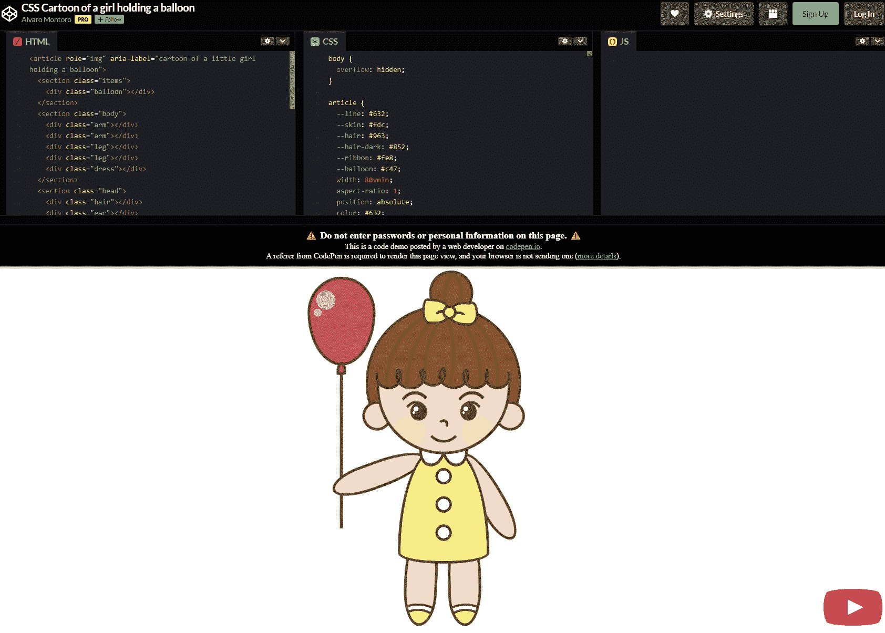
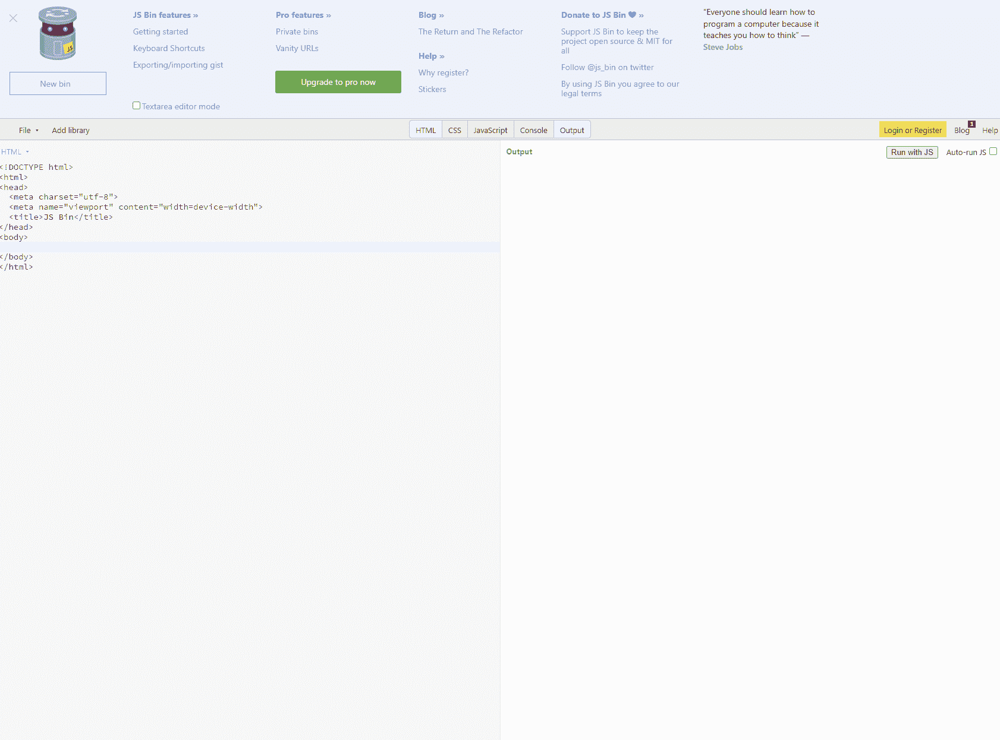
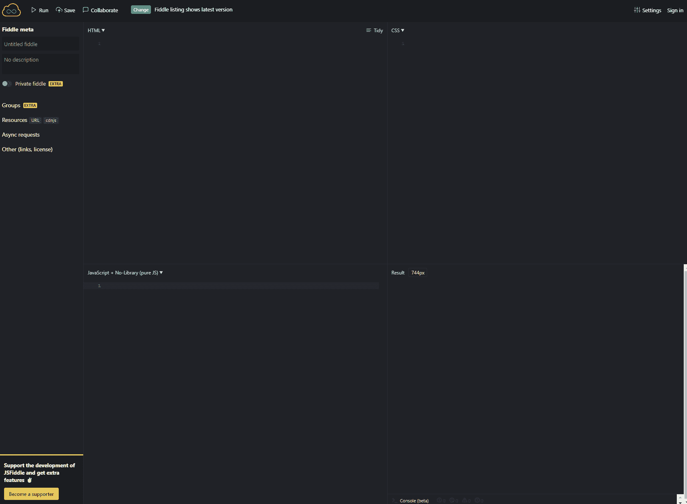
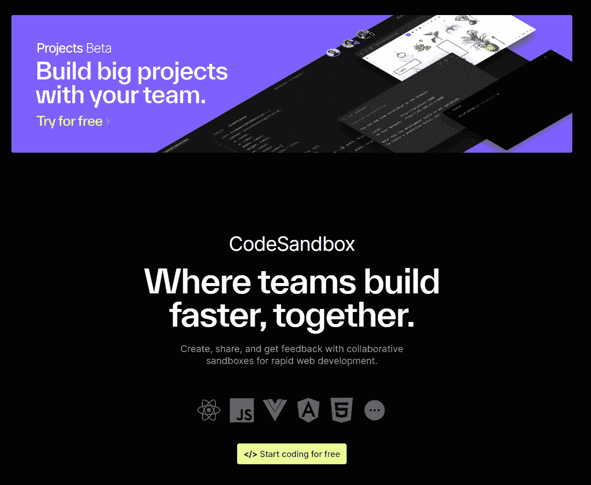
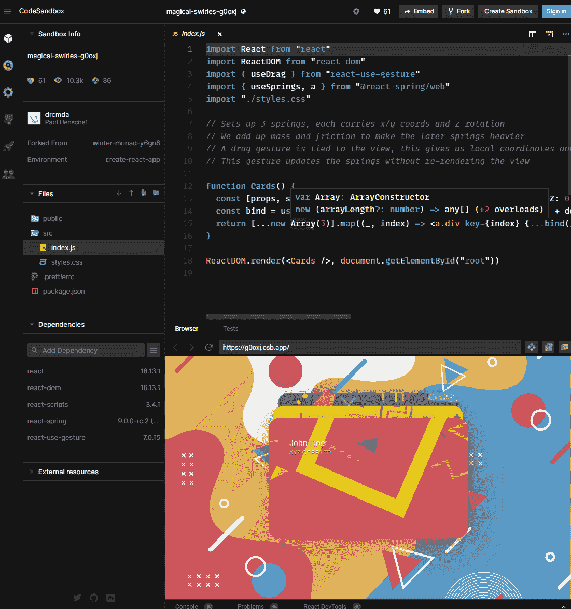
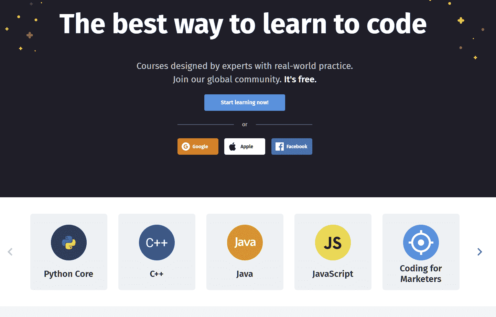
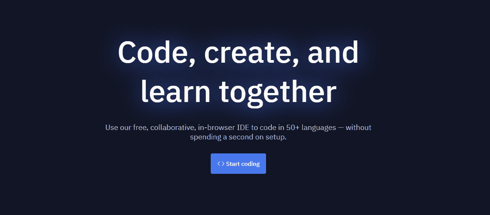
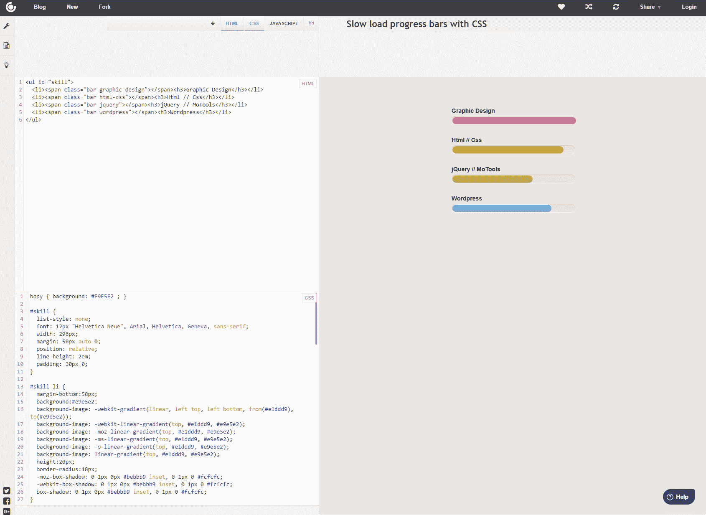

# 学习、分享和实验的 7 个最佳代码平台

> 原文：<https://simpleprogrammer.com/best-code-playgrounds/>

你有没有想到一个令人兴奋的代码想法，你想立即尝试，并与你的同事分享？你并不孤单。

代码操场让你做到这一点。它们是在线平台，允许您快速运行客户端和服务器端代码，而无需设置、配置和拥有基础架构。

所有你需要做的就是创建一个帐户和代码了！

## 什么是代码游乐场？

Code playgrounds 是一个在线平台，可以让你构建、测试并与同事和社区分享代码。这些游乐场是思想的滋生地，并提供了一个与社区分享你的想法的简单方法。

例如，最受欢迎的 code playgrounds 平台之一 Codepen 允许用户通过趋势部分探索其他人的工作，该部分列出了来自全球开发者的独特和有趣的代码样本。

一般来说，代码运动场是为前端开发而优化的，尤其是 HTML 和 CSS，但是你也会发现服务器端代码运动场。

除了分享你的工作，你也可以使用代码操场进行学习。初学者可以用它来创建简单的 web 模板(HTML/CSS)或运行他们的 JavaScript。这很好，考虑到新的学习者通常很难建立和配置开发环境。

大多数 code playgrounds 都是免费使用的，但是附带了一个提供高级功能的付费层。一些常见的 code playgrounds 功能包括:

*   功能丰富的网页编辑器(HTML，CSS 和 JavaScript)支持自动完成。
*   实时预览窗口。
*   支持 Sass，Less，HAML，手写笔等处理器。
*   支持流行的 JavaScript 库，包括 Vue.js，Angular，React 等。
*   协作编码特征
*   Fork Github 仓库
*   轻松共享选项
*   代码验证和开发人员控制台工具

### Code Playgrounds 如何帮助你成为更好的程序员？

编程全靠实践。你练习得越多，你就会变得越好。代码操场为实践、分享和实验提供了环境。它提供了一种简单的方式来完成您的项目并与全世界分享。

而且很多 code playgrounds 每周都有挑战(比如 CodePen)。这些挑战是独特的，让你解决问题，增加你的技能。简而言之，Code playgrounds 提供了一种无缝的编码方式，尤其是对于初学者。

## 玩代码的 7 个最佳代码游乐场

### 1.密码笔

CodePen 是一个顶级的在线代码平台，你可以在这里为团队创建前端的笔和成熟的项目。CodePen 已经从一个代码游乐场发展成为一个更加全球化的社交中心(拥有超过 180 万开发人员)，他们在那里举办每周挑战，并提供一个趋势页面，社区可以从一些令人兴奋的工作中获得灵感。

至于功能，您可以直接从浏览器构建和测试。它提供了简洁的用户界面和实时结果。作为初学者，你可以享受成为 CodePen 的一员，而有经验的开发者可以分享他们的经验。他们还运行 CodePen Spark，这是一个时事通讯订阅，提供优秀的编码资源。

#### 特征

*   支持自动完成和 Emmet
*   他们的 Pro 计划支持私人钢笔
*   支持现场嵌入笔
*   支持资产托管
*   附带实时协作模式(专业版)
*   团队可以构建整个项目

CodePen Pro 是他们的付费服务，提供高级功能，如资产托管、多项目、协作移动、私人笔和实时视图。

### 2.JS Bin

如果你喜欢 JavaScript，那么 [JS Bin](https://jsbin.com/?html,css,js,output) 就是你需要的。它是一个在线编码平台，支持 JavaScript 和 bins(类似于 CodePen 的 Pen)。界面很光滑，您可以将它分解成多个基于列的部分来同时处理多个文件。

此外，它还支持广泛的编辑，包括编辑 HTML 页面的部分。它也是少数几个开始支持控制台的游戏场之一，控制台对于 JavaScript 开发至关重要。

就功能而言，JS Bin 提供了实时重载、gist 支持、调试、定制模板、库和预处理程序支持。您还可以使用键盘快捷键来提高工作效率。就像 CodePen 一样，只有 Pro 计划允许您创建私人媒体夹。

如果你想保护自己工作的隐私，又不想得到他们的专业计划，你可以[在本地](https://jsbin.com/help/running-a-local-copy-of-jsbin/)下载 JS Bin 并运行你的项目。

#### 特征

*   控制台支架
*   完整的未修改渲染视图
*   支持主要的处理器，包括 HTML，CSS，Markdown，Sass，JavaScript 等。
*   自定义模板和库支持
*   快捷键
*   拖放文件

JS Bin 的 Pro 版本提供 1 GB 的存储空间，独特的虚荣网址和无限的垃圾箱和嵌入。

### 3.JSFiddle

JSFiddle 是另一个流行的代码平台，它提供了极简的特性，但缺乏实时的代码视图。然而，它通过提供优秀的编辑器布局定制和对异步请求的支持弥补了这一缺陷。

在这里，您创建了 Fiddles(类似于 Pen 和 Bin)。它支持 HTML，CSS 和 JavaScript 代码片段。而且，如果你喜欢别人的项目，可以叉出来玩代码。

在 JSFiddle 上协作很容易。你所需要做的就是点击顶部菜单上的协作按钮，并与你的同事或朋友分享生成的链接。一旦您的朋友加入，他们就可以通过音频和聊天进行交流。

#### 特征

*   广泛的布局定制
*   支持 HTML、CSS 和 JavaScript
*   协作功能

JSFiddle 是免费使用的，没有任何付费版本。这意味着 JSFiddle 依靠捐赠来运营。

### 4.CodeSandbox

[CodeSandbox](https://codesandbox.io/) 让你把你的团队聚集在一起，远程创建项目。它不仅仅是一个代码游乐场；它通过提供预配置的环境、命令选项板和开发工具来提供简化的开发体验。

首先，您需要使用 GitHub 或 Google 帐户登录并导入您的项目。接下来，邀请您的团队成员实时协作。

您还可以通过使用它们的扩展将 CodeSandbox 带到您的 IDE 中。它也适用于 iOS、iPad 和 iPhone，让您可以随时随地自由编码。

像 CodePen 一样，CodeSandbox 也提供了一个特色部分，在那里你可以找到社区项目。

#### 特征

*   支持智能感知
*   预构建
*   通过神奇的分支管理组织工作流程
*   支持的键盘快捷键
*   编码时实时预览

CodeSandbox 免费使用。然而，你可以利用它的专业版，它提供了高级功能，如私人 NPM 包支持，更大的存储空间，私人沙箱，高级权限和集中计费。

### 5.Sololearn

Sololearn 是一个不受干扰的在线平台，是学习者和专业人士的理想选择。它支持 Python、Java、C++、JavaScript、C#和其他主要编程语言。

由于它不是一个专用的代码平台，Sololearn 代码编辑器并不先进。Sololearn 提供了一个代码园地，你可以在那里创建“新代码”并尝试新想法。

在这里，您只能获得一个控制台和不同的部分来编写代码。

然而，对于学习者来说，Sololearn 是一个优秀的社区。你可以通过他们的讨论区学习，与他人竞争，并在他们的排行榜上排名。

#### 特征

*   专用学习平台
*   简约而实用的代码游乐场
*   支持多种编程语言
*   全球和课程排行榜
*   讨论并从社区获得反馈。

你可以免费开始使用 Sololearn。他们的专业版提供了无限的实践，目标跟踪和交互式代码演示。

### 6.雷普利特

Replit 是一个广泛的在线代码平台。它提供了一个协作环境，支持 50 多种语言。Replit 的浏览器内置集成开发环境很先进，不需要任何用户设置。

作为一名程序员，您可以快速上手 GitHub Repos，并与同事和队友进行实时协作。

Replit 对任何人都有帮助，不管他们的经历如何。为了改善学习体验，Replit 提供学习资源和一个很棒的社区。此外，一旦你创建了一个可共享的 live Repl(类似于 CodePen 的 Pen)。

#### 特征

*   开始编码不需要任何设置
*   即时共享回复
*   GitHub 支持
*   如果需要，可定制设置
*   完全控制您的文件和设置
*   通用软件包管理器
*   模板支持

Replit 附带了一个免费层，可以让您创建尽可能多的副本。Replit 黑客计划提供了访问高级功能，如人工智能助手。它还配备了更好的存储、内存和速度。

### 7.CSS 服务台

CSS Desk 是一个功能丰富的代码平台，在这里你可以使用 HTML、CSS 和 JavaScript 创建 web 项目。深受社区欢迎，用户数达到 100K。

尽管它是一个简单的代码游乐场，但它确实提供了社交和协作功能。由于最小化，它确实受益于提供更快的加载时间。

#### 特征

*   简单化和最小化布局
*   良好的布局选项
*   加载速度快

CSS 桌面是免费使用，没有付费选项。

## 你应该选择哪个代码操场？

选择代码操场很容易。您必须查看 code playground 是否支持您正在使用的编程语言。如果是的话，试试看它的特性，比如可配置性、可共享性和协作性。

我们推荐 CodePen，因为如果你从事 web 开发，它是一个很好的起点。它提供了一个优秀的界面，伟大的社区和良好的编辑器功能。

对于特定于 JavaScript 的项目，您可以使用 JSFiddle 和 JSBin。而且，如果您正在寻找更多的编程语言支持，那么 Replit 应该会引起您的注意。

对于学习者来说，Sololearn 是一个很好的起点。对于类似的体验，但没有代码游乐场选项，你可能也想看看[免费代码营](https://www.freecodecamp.org/)。

你的探索不应该就此停止。当涉及到代码运动场时，网络上充满了选择。我们建议查看一下 [Dabblet](https://dabblet.com/) 、 [PLAYCODE](https://playcode.io/) 、 [Plunker](https://plnkr.co/) 、 [Glitch](https://glitch.com/) 、 [Liveweaver](https://liveweave.com/) 和 [ESNextBin](https://esnextb.in/) 。

最后，记住代码操场是用来实验、分享你的工作和合作的。那么，你想先尝试哪个代码游乐场呢？请在下面评论并告诉我们。