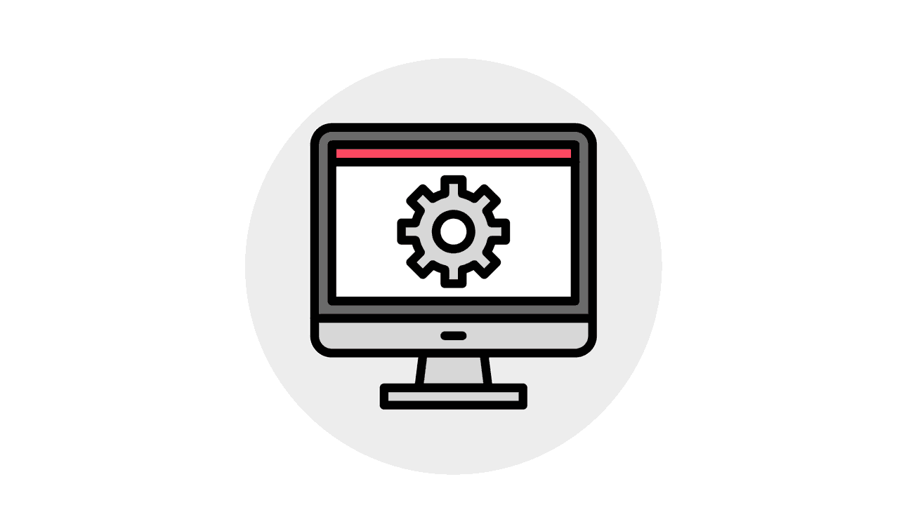

# 推出新软件的一些最佳实践

> 原文：<https://simpleprogrammer.com/best-practices-deployment/>

很多时候，IT 部门过于急于推出新软件，并且在没有充分测试或深思熟虑的计划的情况下行动过快。

2016 年，加利福尼亚州阿拉米达县为阿拉米达法院系统引入了新软件，以取代已有 40 多年历史的系统。早就应该升级了，该县在他们整个地区的 50 多个法院推出了新软件。

不幸的是，新系统 Odyssey 没有经过测试，也没有进行任何地区范围的培训。尽管《奥德赛》本身对法院系统来说可能是一个总体上不错的选择，但糟糕的推出导致了[不必要的逮捕](http://www.sfchronicle.com/bayarea/article/Alameda-County-s-new-software-system-blamed-for-10643452.php)，延长的监禁时间，以及对性侵犯者的错误定位。

如果阿拉米达县 It 部门花更多的时间，更有条不紊地准备推广，确保一切都经过测试并在上线前准备就绪，这场灾难本来是可以避免的。

安全威胁不断演变，用户需要新功能。新软件的推出和升级比以往任何时候都更加重要。公司希望升级他们的安全应用程序，采用与混合云模型更兼容的系统，并升级到 Windows 10 以获得最新的恶意软件保护。

为了避免和阿拉米达县犯同样的错误，这里有一些简单的提示给你的 IT 部门，如何确保你的下一个软件部署顺利进行。

作为一名 IT 经理或系统管理员，无论您正在为您的公司处理哪种类型的软件部署，遵循这些最佳实践将最大限度地减少日常操作的中断，并减轻您的 IT 部门的整体压力。

## 在虚拟机上测试

多亏了虚拟机，系统管理员现在可以在一个安全的环境中测试新软件，在兼容性问题变成问题之前识别它们。

虚拟机是模仿专用硬件的操作系统。在虚拟机上测试新软件会给您带来与在实际环境中运行软件相同的体验。

使用像 [VMware](https://www.vmware.com/) 这样的服务可以让你在新软件在全公司推广之前，在一个更安全、更具成本效益的环境中测试它。您可以在软件在公司范围内推广之前发现问题并解决它们。

面对不相容的灾难性冲击？在虚拟机上进行测试是您的第一道防线。推出可以回滚，绝对不会给公司带来任何后果。

## 对高级用户进行测试

在虚拟环境中测试了新软件之后，是时候在员工群体中进行测试了。可以把它想象成一个用户的焦点小组，他们可以给你有价值的、真实的反馈，指出任何问题，给你一个机会在软件上线之前解决问题。

请注意:大多数用户不希望使用新软件或者用测试来中断他们的工作流程。最好的策略是在第一轮测试中只让一组精选的“高级用户”参与。

超级用户的定义是什么？这些是使用现有软件最多的员工，也是最热衷于改进的员工。他们每天都在使用当前的软件，并能告诉你新系统的优缺点。

定义高级用户的工作流程并清楚地了解他们在测试之前和测试期间如何使用软件是一个好主意，这样您就可以从他们的反馈中获得最大的价值。这一轮测试也是了解任何投诉、负面信息或潜在安全问题的绝佳机会。

## 有效沟通

在推出任何新软件之前，与那些将要使用它并受到变化影响的人进行公开交流是很重要的。

从高级用户的测试中获得反馈，并用它来塑造你如何培训公司中的其他人。如果你的公司里有人不会直接使用软件，但是他们会注意到程序或结果的变化，给他们提个醒。概述他们期望看到的变化。

在实施任何新项目之前，你也应该让部门领导参与进来。在整个过程中让他们了解情况，并与他们分享您从高级用户测试中学到的东西。这样，当需要将软件部署到整个公司时，您将能够清楚地将日常工作流程的任何更改作为改进传达给全体员工。

## 分批部署

根据您的公司和 IT 部门的规模，在部署软件时可以考虑不同的部署方法。

### 金丝雀部署

金丝雀部署得名于利用金丝雀探测危险气体的采矿实践。在这种情况下，新软件就是“金丝雀”它被发布给少数用户，这些用户可以是随机选择的，也可以是有意选择的。为了确保真实的评估和体验，您可以选择不让用户知道新软件的推出。

如果在 canary 部署期间出现问题，您可以将测试用户路由回仍在使用旧软件的组，并纠正任何问题。对日常工作流程的中断是有限的。

不幸的是，为了最大限度地减少潜在的停机时间，canary [部署需要在安全进行之前进行大量仔细的规划](http://www.amazon.com/exec/obidos/ASIN/1491979801/makithecompsi-20)。这种方法通常最适合拥有大量 IT 员工的组织，而不是只有一名系统管理员的组织。

### 分阶段部署

一个[分阶段部署](http://searchitoperations.techtarget.com/definition/phased-rollout)就像它听起来的那样:软件分几个阶段向公司推出。

明智地选择前几组员工接受软件的首次展示，因为他们将会经历在测试期间没有发现的任何问题。考虑那些最常使用该软件的高级员工，他们对该软件的成功进行了投资。然后，您可以设置一个专门的流程，他们可以通过该流程报告与首次展示相关的问题。

随着后续阶段的进行，部署将变得更加容易。

### 滚动部署

[滚动部署](http://searchitoperations.techtarget.com/definition/rolling-deployment)一次在一台服务器(或服务器的一个子集)上部署内部软件。对于需要停机安装的软件和应用程序来说，这一过程非常有效。

通过使用滚动部署，公司经历的停机时间最少。通过会话共享，先前版本的软件或应用在不受推广影响的服务器上仍然可用。一旦使用新软件成功测试了服务器，它将恢复服务，并在下一组服务器上重复该过程。

### 蓝绿色部署

[蓝绿色部署](https://docs.cloudfoundry.org/devguide/deploy-apps/blue-green.html)同时运行两个产品环境——一个标记为“蓝色”,另一个标记为“绿色”一个环境保持活动状态，而另一个环境处于空闲状态。

生产流量被发送到较旧的、仍在运行的环境，而部署和测试在另一个尚未运行的环境中进行。测试完成后，路由器被切换，流量被定向到新软件的实时环境中。

这种方法通过拨动开关来降低风险。如果新软件发布后出现任何重大错误，流量可以立即发送到空闲的旧版本软件。

这些部署方法不是一次性推出新系统，而是以一种有分寸的方式推出变化，让您有机会快速修复任何问题。

## 明智地选择部署

当推出新的软件时，记得不要着急，要有计划。

在评估部署策略时，请始终充分评估您可用的资源和时间。没有适当的计划就投入使用可能会适得其反，导致安全问题甚至用户反弹。

在虚拟机和高级用户上测试，然后慢慢部署。此外，记得要让部门领导完全了解你的策略。在公司内部进行有效的沟通将会使你的首次展示顺利进行。

经过适当的考虑和测试，您的软件部署和选择的部署策略将会成功。您将最大限度地减少整个公司的中断和停机时间，减轻压力，并使您的 IT 部门成为公司的明星。