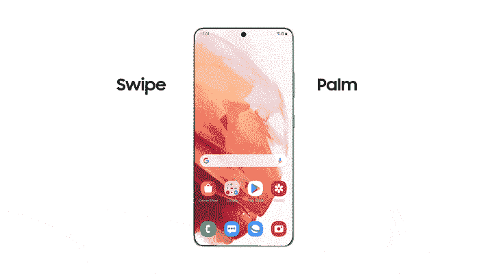
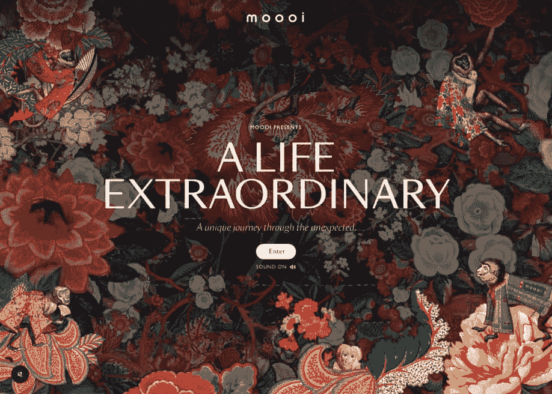
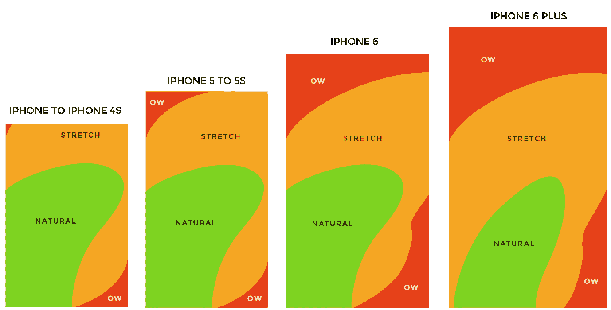
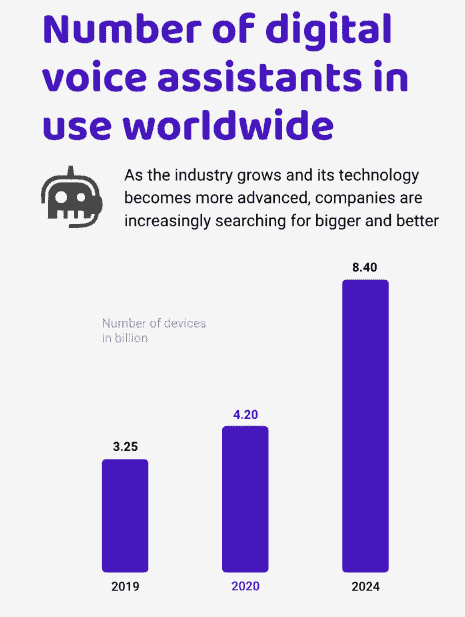
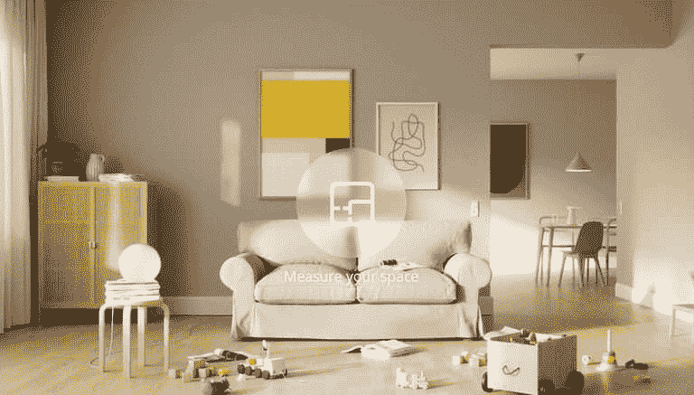
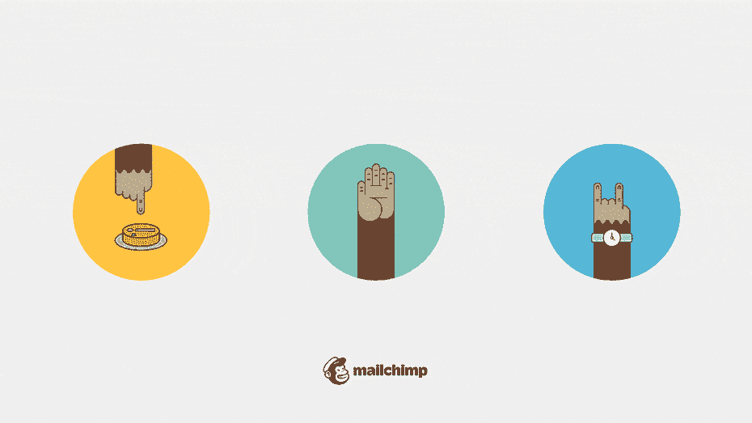

# 移动 UX 设计的最佳实践

> 原文：<https://simpleprogrammer.com/best-practices-mobile-ux-designs/>

As per a report compiled by Statista in 2021, the number of mobile users worldwide stood at 7.1 billion. It is expected to upsurge and reach a [whopping 7.49 billion users by 2025](https://www.statista.com/statistics/218984/number-of-global-mobile-users-since-2010/)! With that estimate, it is clear that there will also be an increase in [mobile applications](https://www.resourcifi.com/resources/ebooks/9-stages-mobile-app-development?utm_source=SimpleProgrammer&utm_medium=Offsite).

随着数以百万计的移动应用程序已经出现在谷歌 Play 商店和苹果的应用程序商店，对于一个设计师来说，选择正确的灵感确实很难。

但是你有没有想过，尽管用户可以使用各种各样的其他移动应用程序，但是是什么把用户钩在一个特定的应用程序上呢？完美的用户界面(UI)设计和直观的[用户体验(UX)设计](https://www.resourcifi.com/blog/latest-trends-in-mobile-app-design-2021?utm_source=SimpleProgrammer&utm_medium=Offsite)是两个关键因素。

移动应用的第一印象总是与 UI/UX 设计有关。因此，移动应用程序设计师必须密切跟踪最新和最好的用户界面/UX 设计趋势。以下是 2022 年设计移动应用的一些最佳实践。

## 移动 UI/UX 设计如何更人性化？

UI/UX 设计是创建应用程序和软件的过程，这些应用程序和软件可以在各种移动屏幕尺寸上无缝导航和平滑配置。

因此，让我们了解更多关于 2022 年将流行的移动 UI/UX 设计最佳实践。

### 1.空中手势

当手机与令人惊叹的 UX 融为一体时，使用手机就变得引人入胜。这个例子包括使用身体姿势来执行一个动作；手可以在屏幕前滑动进行截图(如下图)。

[资料来源:Samsungtechwin.Com](https://samsungtechwin.com/how-to-screenshot-on-samsung-a21/)

使用起来相当简单。三星、小米、谷歌和其他 android 手机制造商制造的许多 Android 手机都将这一功能集成到了旗舰手机中。

使用手势的一个显著优势在于它的直观性。集成了不同的手势，如左右或上下滑动手指，以控制设备上的各种导航。简而言之，手势会一直存在。

### 2.Scrollytelling

那不是印刷错误——你没看错！Scrollytelling 是“滚动”和“讲故事”的融合，其中设计师使用视差滚动等技术来消除静态图像的单调。

[资料来源:Moooi.com](https://www.moooi.com/en/a-life-extraordinary#monster-garden)

文本、音频和视觉的动态交互创造了一种有节奏的流动。Moooi 就是一个使用视差滚动的例子。网站上的效果给人一种赏心悦目的视觉享受，就好像内容在博物馆里展出一样。

### 3.经验法则

当 UI 设计想法让你困惑，你不知道从哪里开始时，注意拇指区。许多移动用户单手操作他们的设备，绝大多数使用一个拇指。

“拇指区”是屏幕上的一个区域，在这里你的拇指可以轻松地滚动、滑动和到达标签栏。

[资料来源:Miro.medium.com](https://miro.medium.com/max/2400/1*KBZ9YsdZHYE-RkzBAHDYCA.png)

上面的热图阐明了拇指的自然位置以及“低”和“拉伸”区域。您可以看到，随着手机屏幕尺寸的增加，可达区域的百分比减少了。

### 4.语音搜索

“嘿，阿列克谢，弹一首蒙特罗的《里尔·纳斯 X》！”

人们经常使用语音命令来简化他们的搜索，或者当他们想在打字时休息一下。

语音搜索仅通过个人的语音命令显示结果。语音搜索功能是在品牌进行大量用户研究后整合的。

虽然它是十年前推出的，但人们最近才开始熟悉它的便利性。因此，语音搜索是 UX 设计最佳实践的新成员。一些电子商务网站和移动应用程序已经集成了这一功能，供消费者使用。

[资料来源:Statista](https://www.statista.com/statistics/973815/worldwide-digital-voice-assistant-in-use/)

该图预测了全球语音助手使用的预期增长。到 2024 年，用户数量预计将上升至 84 亿！

### 5.虚拟现实

虚拟现实(VR)是一场技术革命。像宜家、苹果和宝马这样的全球知名品牌已经集成了虚拟现实，为他们的消费者提供了惊人的无缝体验。

[来源:宜家](https://econsultancy.imgix.net/content/uploads/2021/05/11150914/ikea-studio.png?auto=compress,format&q=60&w=768&h=437)

这是因为虚拟现实市场预计到 2024 年将从 50 亿美元增长到 120 亿美元。以前，宜家应用程序允许用户虚拟摆放家具。但有了新的更新，用户可以捕捉整个房间的平面图，并相应地重新设计。

### 6.情感互动

人类是有情感的生物。在移动应用中注入情感是一种巧妙的移动 UI 设计趋势。像 Duolingo 和 MailChimp 这样的许多品牌已经在各自的应用程序中使用这种趋势。

[资料来源:99 项设计](https://99designs-blog.imgix.net/blog/wp-content/uploads/2021/12/mailchimp.gif?auto=format&q=60&fit=max&w=930)

动画和其他视觉效果，就像你在上面看到的，模仿人类的互动。类似地，Duolingo 中的角色会在用户完成任务时为其鼓掌，并以点数奖励他们。

### 7.简明 UX 写作

如果用户找不到他们想要的东西，他们会直接退出应用程序。那么，如何才能避免这种情况呢？答案在于 microcopy——按钮和输入栏上的微小副本，引导用户体验应用程序。

Microcopy 是移动 UX 设计的一个重要方面——如果 microcopy 不能在应用程序中无缝地指导用户，他们会发现体验令人沮丧。简而言之，与其用无关紧要的东西装饰内容，不如尽可能简明扼要地传达信息。

谷歌表示，当 microcopy 从“酒店房间”修改为“检查可用性”以获得更好的预订结果时，他们的参与度上升了 17%。在 UI/UX 设计中，即使是最小的副本也很重要！

### 额外提示

请继续阅读一些额外的技巧来避免设计失误！

*   避免无目的的改造

当你没有一个明确的目标来为应用程序的 UX 设计注入新的东西时，放弃这个任务吧！你不必要的更新可能会产生相反的效果；你可能会震惊用户，而不是取悦他们。

*   别忘了原型

您必须避免的另一个错误是没有执行充分的测试。对应用程序进行多阶段测试可以确保你朝着正确的方向前进。永远不要跳过原型阶段！

*   保持简单

与其把不需要的元素塞进设计中，不如把它们清理掉。如果你认为有些东西可以从设计中删除而不牺牲功能，那就删除它。

### 就这些了，伙计们！

你现在知道了所有将在 2022 年流行的最新 [UI/UX 设计趋势](https://simpleprogrammer.com/ux-trends-2022/)。这些现代趋势是关于创造性的滚动、可视化数据以及为用户提供无缝体验。然而，请记住被误认为是潮流的 [UX 设计失误](https://simpleprogrammer.com/common-ux-design-mistakes/)。

所有这些趋势都将为移动应用程序设计者服务；然而，在实现变更之前，您必须弄清楚业务和用户的适当需求。现在，前进吧——UI/UX 设计的世界在等待着你！