# 程序员最佳书籍(2020 年更新)

> 原文：<https://simpleprogrammer.com/best-programming-books-2019/>

<figure class="alignright is-resized">

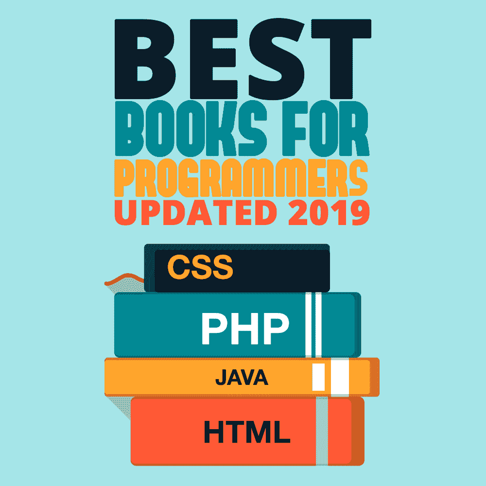

</figure>

对于程序员来说，有这么多的书，但没有足够的时间去读完它们。

如果你有一个精选的清单，这样你就可以最有效地利用你的自学时间，这不是很好吗？

下面是我个人列出的程序员最佳书籍清单。

你可能会发现的第一件事是，这个列表不是你会在互联网上找到的典型的“程序员书籍”列表之一——这是一件好事！

我选择了这些特别的书，因为我想提供一个书单，不仅能提高你的技术技能，让你成为一名更好的程序员，还能挑战你作为一个人的成长，并在这个过程中提供一些娱乐价值。

这份清单上的书是专门为你设计的，在对软件开发人员来说很重要的所有领域给你一个坚实的基础。

我按照我认为最重要的主题领域对书籍进行了分类，其中很多都被严重忽视了。

你会发现**基础书籍**会帮助你学会写好的、干净的代码，熟练地组织你的代码，以及帮助你掌握所有主要的编程概念。

你会发现一些专门帮助你提升职业生涯和帮助 T2 成为程序员的书籍。

你会发现一些书**教你关于最佳实践**——尤其是围绕敏捷开发——并且教你**如何在工作中做得更好**(包括面试)。

最后，你会发现一系列的书籍会帮助你成为一个完整的人，实现你想要的人生目标。

这不是枯燥的技术书籍集…

尽情享受吧！

**目录–按类型分类的图书链接:**

[基础编程书籍](#foundational)

[专业开发编程书籍](#professional)

[基于架构的编程书籍](#architecture)

[敏捷编程书籍](#agile)

[算法和面试问题编程书籍](#algorithm-interview)

[语言专用和编程语言相关的编程书籍](#language)

[OPs、QA 和部署相关编程书籍](#op-qa)

[软技能等好玩的编程书籍](#soft-skills)

## 基础编程书籍

<figure class="alignleft is-resized">

</figure>

**[代码全编:软件构造实用手册第二版](https://simpleprogrammer.com/get/code-complete)**

这本书充满了关于如何编写好代码的好建议，不管是架构还是编程语言。代码完整深入到编写好代码的结构细节中。我从来没有找到任何一本书能够触及这本书的许多主题。我认为这本书是所有严肃的软件开发人员的必读之作。这本书有点过时了，但仍有极有价值的信息。

<figure class="alignleft is-resized">

</figure>

**[干净的代码:敏捷软件工艺手册](https://simpleprogrammer.com/CleanCodeBook)**

这是另一本彻底改变了我写代码方式的书。我可以将我的编程生涯分为代码完成前、代码清理前和代码清理后。在阅读完《代码完整》之后，我推荐这本书，因为《代码完整》更多的是处理代码和方法的单个行的结构，而《干净的代码》处理一些相同的概念，但是在一个稍微更高的层次上。

<figure class="alignleft is-resized">

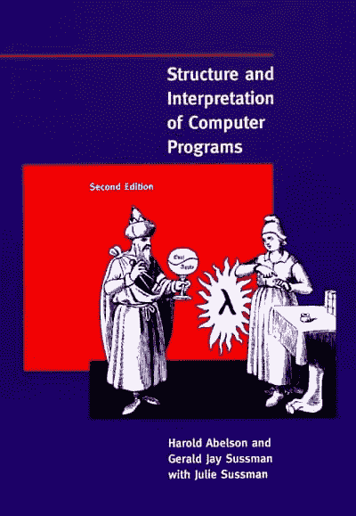

</figure>

**[计算机程序的结构与解释，第二版](https://simpleprogrammer.com/structure-interpretation)**

我争论着把这一个列入名单。真的是基础性的吗？这取决于你想拥有一个多么坚实的基础。如果你想有一个真正坚实的基础，那么答案是响亮的“是”

我考虑过把这个放在列表上。真的是基础性的吗？这取决于你想拥有一个多么坚实的基础。如果你想有一个真正坚实的基础，那么答案是响亮的“是”

这本书很有挑战性。它涉及函数式编程。它是为麻省理工学院著名的编程入门课程而写的。我建议你不仅要阅读这本书，还要完成书中所有的练习。这将是一个艰难的旅程，但你会成为一个比以前更好的程序员。

<figure class="alignleft is-resized">

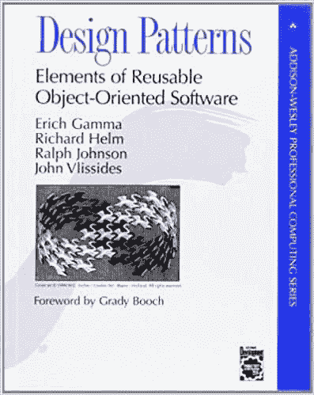

</figure>

**[设计模式:可复用面向对象软件的要素](http://www.amazon.com/gp/product/0201633612/ref=as_li_tl?ie=UTF8&camp=1789&creative=390957&creativeASIN=0201633612&linkCode=as2&tag=makithecompsi-20&linkId=T5LO7MSEHZOVINEZ)**

这本经典书籍是真正理解什么是设计模式，并熟悉你在职业生涯中可能遇到的最常见的设计模式的关键读物。这不是一本特别容易阅读的书，其中的描述和例子可能有点难以理解——尤其是如果你对 UML 没有很好的理解的话——但是我认为这是一本“必读”的书如果你对这本书有困难，你可能想从“头先设计模式”开始，它以一种更容易理解的方式教授这本书中的设计模式——尽管如此，没有什么可以替代原著。

<figure class="alignleft is-resized">

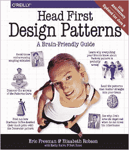

</figure>

**[头先设计图案:一个脑补指南](https://simpleprogrammer.com/headfirstdp)**

先看经典，再看这一本，再回头带着重新认识的心情去读经典的那本。这本书让设计模式更容易理解。这也是一本学习如何教授复杂话题并让它们变得有趣的有用的书。

<figure class="alignleft is-resized">

</figure>

**[重构:改进现有代码的设计](https://simpleprogrammer.com/refactoring-code)**

尽管现代 ide 已经自动化了本书中提到的许多重构，但是为了编写好的、干净的代码，重构仍然是一个非常重要的概念，尤其是在当今敏捷的环境中。这本书涵盖了所有软件开发人员应该知道如何在任何代码库中执行的所有主要重构。学习如何重构你的代码可以让你给它注入新的生命，让它随着时间的推移得到改进，而不是腐烂。

<figure class="alignleft is-resized">

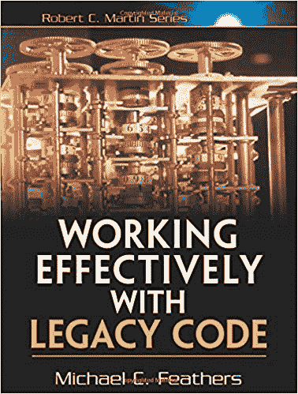

</figure>

**[有效处理遗留代码](https://simpleprogrammer.com/workinglegacy)**

除非你足够幸运，总是从事绿色领域的项目，否则你很可能会在职业生涯中遇到遗留代码——而且是大量的遗留代码。我包括这本书是因为它是关于使用遗留代码的基础编程书籍。如果你正在开发一个超过五年的大型代码库，这本书可能是你的新圣经。读一读，记在心里。

<figure class="alignleft is-resized">

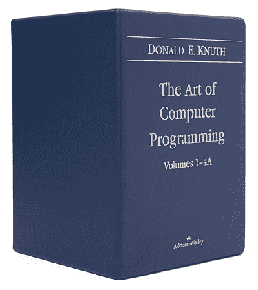

</figure>

**[《计算机编程的艺术》第 1 卷——4A](https://simpleprogrammer.com/art-of-programming)T3】**

真的可以推荐一个我没看过的书系列吗？当然可以。这套四卷本的书在我“有一天要读”的书的清单上，但是我从来没有抽出时间去读它。

为什么？因为阅读这些书是一项巨大的事业。这些书深入而详细地介绍了计算机科学算法——而且不是简单的东西。如果你真的真的想深入研究算法，并且你已经准备好了一些复杂的数学，那就去做吧。让我知道进展如何。祝你好运。

<figure class="alignleft is-resized">

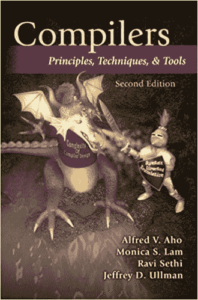

</figure>

**[编译器:原理、技术和工具(第二版)](https://simpleprogrammer.com/compilers)**

这本书被称为“龙之书”——这是有充分理由的。

它深入到了龙生活的地方:编译器和操作系统的领域。

有些信息可能有点过时了，但是如果你真的对编译器的工作方式感兴趣，也许想自己写一本书，可以试一试这本书。

## 专业开发编程书籍

**[完整的软件开发人员职业指南](https://www.amazon.com/Complete-Software-Developers-Career-Guide/dp/0999081411/ref=as_li_ss_tl?_encoding=UTF8&qid=1500389436&sr=8-2&linkCode=sl1&tag=makithecompsi-20&linkId=d55a1ae638178485198666921b44e781)** *****约翰(我的)书！**

<figure class="alignleft is-resized">

</figure>

我写这本书主要是因为没有一本好书——或者真的没有任何这方面的书——告诉软件开发人员他们需要知道的关于如何在软件开发中获得成功的一切，并回答我得到的所有常见问题，比如:
——我如何开始成为一名软件开发人员？
–我如何学习一门新的编程语言？
–大学，新兵训练营，自学？
–我该如何应对我的混蛋老板？我的同事？歧视？
–我如何找到一份新工作？我的第一份工作？
–作为一名软件开发人员，我需要知道些什么？
–我如何赚更多的钱并促进我的职业发展？

<figure class="alignleft is-resized">

</figure>

**[务实的程序员:从熟练工到大师](https://simpleprogrammer.com/pragmaticprogrammer)**

当我第一次读这本书时，它并不是我最喜欢的。我仍然不同意书中所说的一切，但即使我有疑虑，我也不得不承认这是一本编程书籍，每个软件开发人员都应该阅读，当他们想从仅仅是一个程序员过渡到更多的东西时。这本书里有一些非常实用的建议，会给你提供一些原本需要几年甚至几十年才能学会的课程。

<figure class="alignleft is-resized">

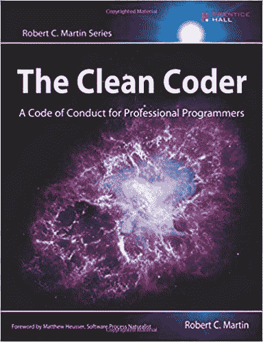

</figure>

**[《干净的程序员:职业程序员的行为准则》](https://simpleprogrammer.com/clean-coder)**

这本书是关于如何成为一名职业程序员的。这是一本难读的书。很多开发人员不会喜欢这本书，因为它的建议有时难以下咽。但如果可以的话，还是咽下去吧，因为本书的作者鲍伯·马丁是业内资深人士，他已经成功地编写了数十年的代码。我真的发现这本书在塑造我的职业生涯和做出艰难决定方面很有帮助。

<figure class="alignleft is-resized">

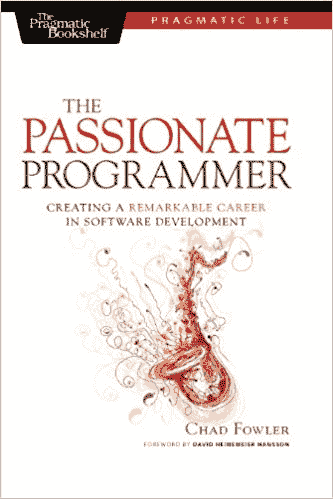

</figure>

**[热情的程序员:在软件开发领域创造非凡的](https://www.amazon.com/Passionate-Programmer-Remarkable-Development-Pragmatic-ebook/dp/B00AYQNR5U)**

这本书是主要的编程书籍之一，它影响了我将我的软件开发生涯视为一项业务，而不仅仅是我做的事情。这本书充满了各种各样的智慧，关于如何增加你的技能，最大限度地利用你的时间，保持你的职业生涯和激情，等等。如果你想超越编程仅仅是一份工作，我强烈推荐你阅读这本书。

<figure class="alignleft is-resized">

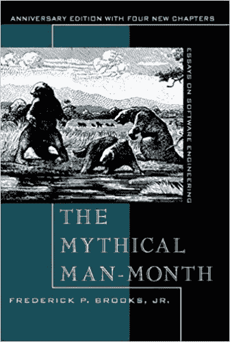

</figure>

**[神话中的人月](http://www.amazon.com/gp/product/0201835959/ref=as_li_tl?ie=UTF8&camp=1789&creative=390957&creativeASIN=0201835959&linkCode=as2&tag=makithecompsi-20&linkId=AJXQSTT3JZM4EFOA)**

所有那些你认为是你的项目特有的问题，我告诉你，它们不是。它们在这本书里。如果你想要一本关于复杂软件开发项目的非常实用的编程书籍，这就是了。这本书就像是困扰非平凡软件开发项目的最常见问题的目录，并且这本书经受住了时间的考验。

## 基于架构的编程书籍

<figure class="alignleft is-resized">

</figure>

**[领域驱动设计:解决软件核心的复杂性](http://www.amazon.com/gp/product/0321125215/ref=as_li_tl?ie=UTF8&camp=1789&creative=390957&creativeASIN=0321125215&linkCode=as2&tag=makithecompsi-20&linkId=IQJEFS3QBO4A4WPZ)**

扣上你的安全带，这是一本难读的书。第一次看这本书，没看懂。第二次看的时候，我有点明白了。直到我第三次翻阅这本书时，它才终于一路走好。这本书将帮助你学习如何创建一个基于领域建模的可维护架构。一旦你知道了这本书里的内容，你就不能回头了。你不会再用同样的方式思考软件开发架构了。

<figure class="alignleft is-resized">

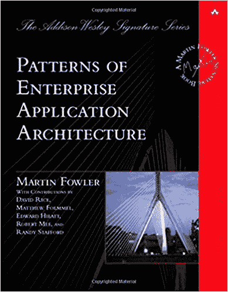

</figure>

**[企业应用架构的模式](http://www.amazon.com/gp/product/0321127420/ref=as_li_tl?ie=UTF8&camp=1789&creative=390957&creativeASIN=0321127420&linkCode=as2&tag=makithecompsi-20&linkId=E7JZASHLN5LXW3V6)**

如果您正在进行任何类型的企业应用程序开发，您会发现这本书非常有用。它包含了关于如何从头到尾设计和构建企业应用程序的大量信息。不过，我发现最有用的是书中包含的许多在企业应用程序中常见的模式。这是我在为工作构建大型企业应用程序时一直参考的一本书。

<figure class="alignleft is-resized">

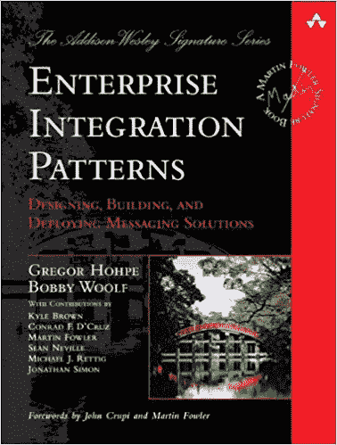

</figure>

**[企业集成模式:设计、构建和部署消息传递解决方案](http://www.amazon.com/gp/product/0321200683/ref=as_li_tl?ie=UTF8&camp=1789&creative=390957&creativeASIN=0321200683&linkCode=as2&tag=makithecompsi-20&linkId=PIR7XJJSX6LYRE32)**

这是实现消息总线或服务总线架构的绝对指南。不要让书名欺骗了你；这本书是关于消息总线和所有用于正确实现它们的模式的。如果您正在使用总线进行应用程序或服务之间的任何类型的集成，您一定会喜欢这本书。

<figure class="alignleft is-resized">

</figure>

**[重构为模式](http://www.amazon.com/gp/product/0321213351/ref=as_li_tl?ie=UTF8&camp=1789&creative=390957&creativeASIN=0321213351&linkCode=as2&tag=makithecompsi-20&linkId=TIS57GQXK42INOR3)**

阅读和学习设计模式是一回事；实现它们是另一回事。实际获取现有代码并将其重构为设计模式是另一回事。这是一本教你——从头开始——如何将现有代码移入模式，甚至如何将其移出模式的编程书籍。应该在每个建筑师的书架上。

## 敏捷编程书籍

<figure class="alignleft is-resized">

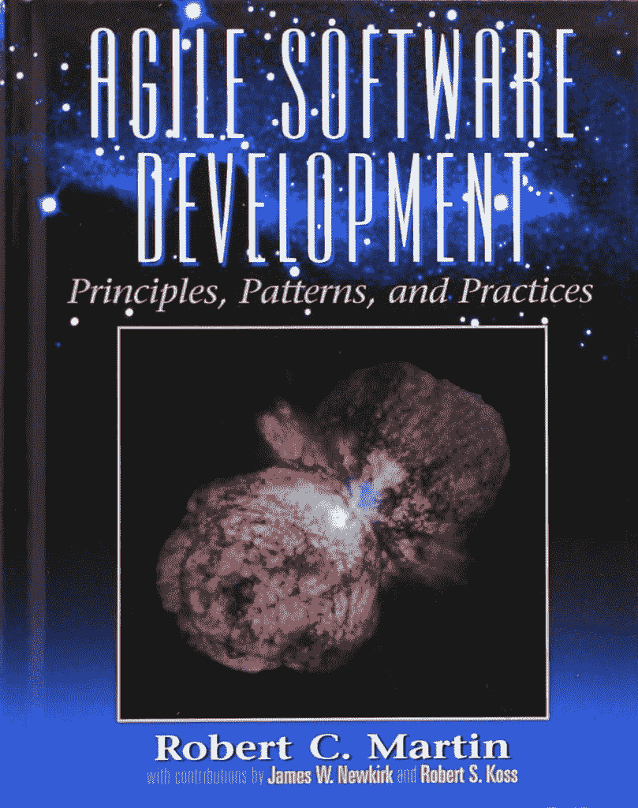

</figure>

**[敏捷软件开发、原则、模式和实践](http://www.amazon.com/gp/product/0135974445/ref=as_li_tl?ie=UTF8&camp=1789&creative=390957&creativeASIN=0135974445&linkCode=as2&tag=makithecompsi-20&linkId=4DHTIVWBRMB372SW)**

([这本书还有 C#版本。](http://www.amazon.com/gp/product/0131857258/ref=as_li_tl?ie=UTF8&camp=1789&creative=390957&creativeASIN=0131857258&linkCode=as2&tag=makithecompsi-20&linkId=NXVYGRQXBCWL6JMG))

是的，这是另一本鲍伯·马丁的书，非常棒。这本书将带你了解敏捷开发的所有核心原则，而不是所有的琐事。不仅如此，它还介绍了坚实的设计原则，这些原则是理解如何编写干净、可维护的代码的基础。这本书说服了我开始结对编程。

<figure class="alignleft is-resized">

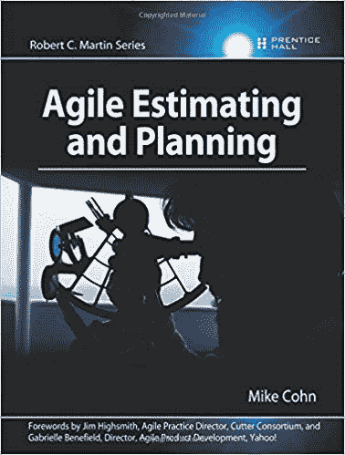

</figure>

**[敏捷估算和计划](http://www.amazon.com/gp/product/0131479415/ref=as_li_tl?ie=UTF8&camp=1789&creative=390957&creativeASIN=0131479415&linkCode=as2&tag=makithecompsi-20&linkId=UBM7CZE37UYGEIYB)**

很多团队都搞错了。这本书告诉你如何正确地做这件事。当我第一次通读这本书时，我意识到合理的原则可以应用到敏捷团队的评估和计划中。强烈推荐给任何在敏捷环境中工作的人。

<figure class="alignleft is-resized">

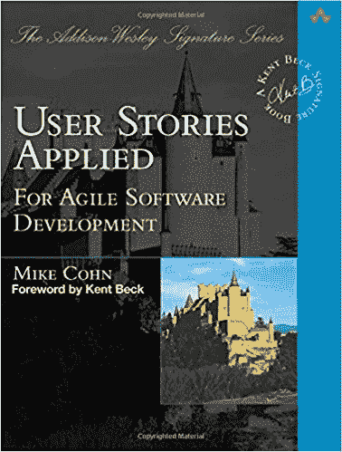

</figure>

**[用户故事应用:对于敏捷软件开发](http://www.amazon.com/gp/product/0321205685/ref=as_li_tl?ie=UTF8&camp=1789&creative=390957&creativeASIN=0321205685&linkCode=as2&tag=makithecompsi-20&linkId=6YBSU7KRCEJBF5A3)**

另一本很棒的敏捷书籍帮助解决了一个主要的问题:用户故事。当我在敏捷团队工作时，我遇到过一些非常糟糕的用户故事，仅仅是因为没有人知道如何做出好的用户故事，或者用户故事实际上应该是什么样子。这本书解决了那个问题。

<figure class="alignleft is-resized">

</figure>

**[极限编程讲解:拥抱变化，第二版](http://www.amazon.com/gp/product/0321278658/ref=as_li_tl?ie=UTF8&camp=1789&creative=390957&creativeASIN=0321278658&linkCode=as2&tag=makithecompsi-20&linkId=LMXPKIVOJLV2S7G3)**

我认为是经典的敏捷书籍。对某些人来说有点极端——这不是 SCRUM，这是真正的 XP。这本编程书是关于如何实现极限编程的非常规范的描述，但是书中的思想可以应用到许多不同类型的敏捷环境中。

## 算法和面试问题编程书籍

<figure class="alignleft is-resized">

</figure>

**[编程珍珠，第二版](http://www.amazon.com/gp/product/0201657880/ref=as_li_tl?ie=UTF8&camp=1789&creative=390957&creativeASIN=0201657880&linkCode=as2&tag=makithecompsi-20&linkId=WUX7MH3IPWHBIP2L)T3】**

编程问题的经典书籍。阅读这本书，并实际做所有的练习。如果你熬过了这一考验，你将成为一名更好的程序员，并获得对算法和算法设计的深刻理解，以及一些关键的解决问题的技能。

<figure class="alignleft is-resized">

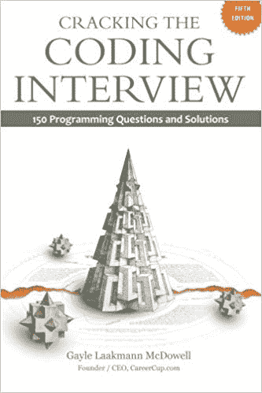

</figure>

**[破解编码面试:150 道编程题及解答](http://www.amazon.com/gp/product/098478280X/ref=as_li_tl?ie=UTF8&camp=1789&creative=390957&creativeASIN=098478280X&linkCode=as2&tag=makithecompsi-20&linkId=PPVAMLLSJHP56DJY)**

这本书不仅是亚马逊上最畅销的编程书籍之一，也是亚马逊上最畅销的书籍之一。而且理由很充分。这本书充满了很好的面试建议和真实的编程问题，不仅能帮助你通过编码面试，还能让你成为一名更好的程序员。浏览书本，做练习。如果你能掌握这本书里的练习，在编程面试中难倒你将会非常困难。

<figure class="alignleft is-resized">

</figure>

**[【算法简介】第三版](http://www.amazon.com/gp/product/0262033844/ref=as_li_tl?ie=UTF8&camp=1789&creative=390957&creativeASIN=0262033844&linkCode=as2&tag=makithecompsi-20&linkId=MLA46VDMERC3PKVP)**

这本书被认为是学习算法的最佳书籍之一，这是有充分理由的。对于任何有兴趣提高自己编写和理解算法(这是编写代码的核心)的能力的人来说，这是一本坚实的编程书籍。如果你要读任何关于算法的书，一定要从这本开始。

## 特定语言和编程语言相关的编程书籍

<figure class="alignleft is-resized">

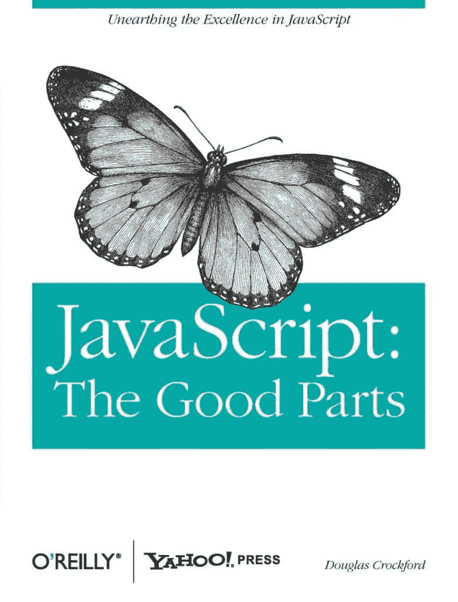

</figure>

**[JavaScript:精彩部分](http://www.amazon.com/gp/product/0596517742/ref=as_li_tl?ie=UTF8&camp=1789&creative=390957&creativeASIN=0596517742&linkCode=as2&tag=makithecompsi-20&linkId=JJFR64SIFQJSGIEX)**

随着 JavaScript 的发展，这本书可能会过时，但是现在，这本书是必不可少的。JavaScript 是一种从来不是为今天的用途而设计的语言。这意味着在编写 JavaScript 代码时有很多陷阱。这本书不止一次救了我。如果你打算写 JavaScript，你会想要读这本书。

<figure class="alignleft is-resized">

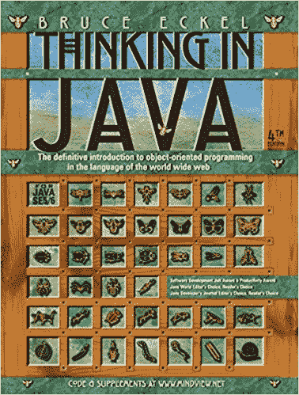

</figure>

**[Java 思维第四版](http://www.amazon.com/gp/product/0131872486/ref=as_li_tl?ie=UTF8&camp=1789&creative=390957&creativeASIN=0131872486&linkCode=as2&tag=makithecompsi-20&linkId=NOS5PVISMT2O2FFU)**

这本书不仅教你如何开始用 Java 编程，还教你如何教一门编程语言。我想我从来没有遇到过比这本书更好的学习编程语言的书。即使你对 Java 没有兴趣，我也推荐你读一读。

<figure class="alignleft is-resized">

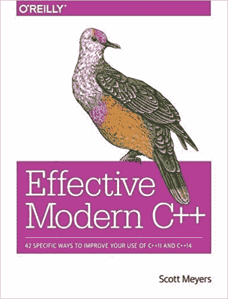

</figure>

**[有效的现代 C++: 42 种提高你使用 C++11 和 C++14 的具体方法](http://www.amazon.com/gp/product/1491903996/ref=as_li_tl?ie=UTF8&camp=1789&creative=390957&creativeASIN=1491903996&linkCode=as2&tag=makithecompsi-20&linkId=AIJ26YDJFLA5FQLG)**

([有效 C++](http://www.amazon.com/gp/product/0321334876/ref=as_li_tl?ie=UTF8&camp=1789&creative=390957&creativeASIN=0321334876&linkCode=as2&tag=makithecompsi-20&linkId=WKRPAWNCGEIWGKU7) 、[更有效 C++](http://www.amazon.com/gp/product/020163371X/ref=as_li_tl?ie=UTF8&camp=1789&creative=390957&creativeASIN=020163371X&linkCode=as2&tag=makithecompsi-20&linkId=DVIXDRZ7ZGUKTRPY) 和[有效 STL](http://www.amazon.com/gp/product/0201749629/ref=as_li_tl?ie=UTF8&camp=1789&creative=390957&creativeASIN=0201749629&linkCode=as2&tag=makithecompsi-20&linkId=BLNYYHZNG7YV34GK) )

我已经链接到这本书的现代版，但整个系列的老书是该死的好。我从阅读最初的有效 C++，更有效的 C++，和有效的 STL 书籍中学到了很多，即使我今天不写任何 C++代码，我仍然对这些书籍有美好的回忆。我承认，如果你正在用现代 C++编写，早期的书籍可能不会对你有太大的帮助，但是如果你痴迷于成为最好的 C++开发人员，你必须阅读这一经典的更新版本。

<figure class="alignleft is-resized">

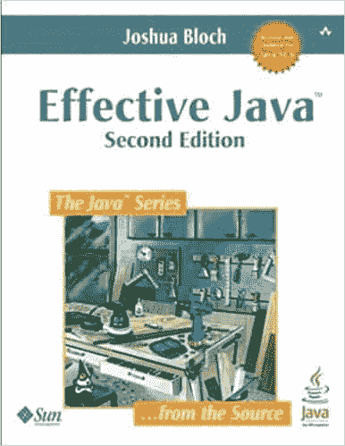

</figure>

**[有效 Java，第二版](http://www.amazon.com/gp/product/0321356683/ref=as_li_tl?ie=UTF8&camp=1789&creative=390957&creativeASIN=0321356683&linkCode=as2&tag=makithecompsi-20&linkId=TCQLO7BQTDA5FFJX)**

Java 版本几乎和 C++原版一样好。由于语言的变化，一些建议已经过时了，但总的来说，这仍然是一本真正的好书。

<figure class="alignleft is-resized">

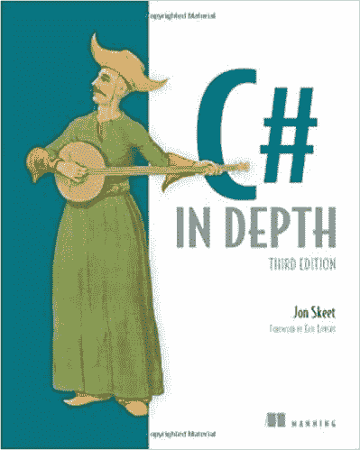

</figure>

**[【C #深度】第三版](http://www.amazon.com/gp/product/161729134X/ref=as_li_tl?ie=UTF8&camp=1789&creative=390957&creativeASIN=161729134X&linkCode=as2&tag=makithecompsi-20&linkId=LOYSLNJFEYIPC5VP)**

你知道 C#吗？你真的懂 C#吗？如果你读了这本书，你会的。我从来没有读过像这本书这样深入研究一种语言的书。在我读这本书之前，我认为自己是 C#方面的专家。我会给自己打 10 分。后来，我意识到我最初对自己知识的估计与事实相差甚远。

<figure class="alignleft is-resized">

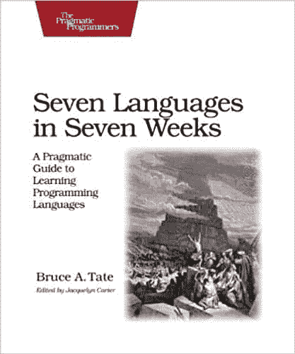

</figure>

**[【七周七种语言:学习编程语言的实用指南(务实程序员)](http://www.amazon.com/gp/product/193435659X/ref=as_li_tl?ie=UTF8&camp=1789&creative=390957&creativeASIN=193435659X&linkCode=as2&tag=makithecompsi-20&linkId=NEMLFJTPKJLMHK6B)**

我喜欢这本书，因为它拓展了你的视野，让你成为一个思想更加开放的程序员。这是一本有潜力带你进入下一个层次，让你超越狭隘的宗教技术倾向的编程书籍。这本书帮助我看到如此多的编程语言是多么的相似，欣赏它们的不同之处，并看到我能学得多快。

## 运营、质量保证和部署相关的编程书籍

<figure class="alignleft is-resized">

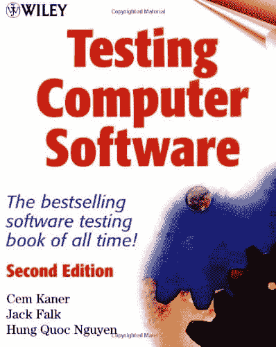

</figure>

**[测试计算机软件，第二版](http://www.amazon.com/gp/product/0471358460/ref=as_li_tl?ie=UTF8&camp=1789&creative=390957&creativeASIN=0471358460&linkCode=as2&tag=makithecompsi-20&linkId=P376HSKN3AK7NKOI)**

每个开发人员都应该阅读这本书，以便很好地理解 QA 和测试。这本书很容易理解，但却是一本全面的关于测试的书。读了这本书，我能够更好地与 QA 沟通，编写更多可测试的代码，并通过学习如何在翻墙之前测试自己的代码来避免缺陷。

<figure class="alignleft is-resized">

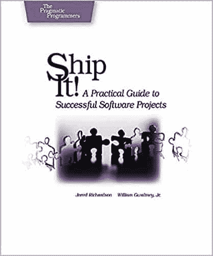

</figure>

**[发货吧！成功软件项目实用指南](http://www.amazon.com/gp/product/0974514047/ref=as_li_tl?ie=UTF8&camp=1789&creative=390957&creativeASIN=0974514047&linkCode=as2&tag=makithecompsi-20&linkId=PJFVKLNVX667RDVH)**

这本书里有很多很棒的内容和实践。有些有点极端，但都很有效。这本书可以帮助你把你的软件开发店提高到一个新的水平。这是一本值得一读的好书，然后交给你的经理，以强调一些最佳实践的价值，如持续集成、自动化测试、缩减计划等。

<figure class="alignleft is-resized">

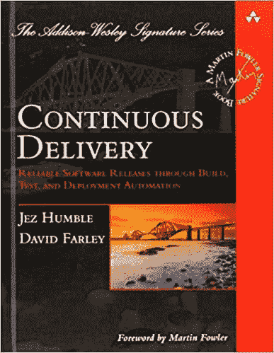

</figure>

**[连续交付:通过构建、测试和部署自动化进行可靠的软件发布](http://www.amazon.com/gp/product/0321601912/ref=as_li_tl?ie=UTF8&camp=1789&creative=390957&creativeASIN=0321601912&linkCode=as2&tag=makithecompsi-20&linkId=DZWPGIU5ARNIDT6M)**

直到我读了这本书，我才真正相信持续交付是可能的。这本书实际上向您展示了如何构建一个完整的系统，将测试代码构建并部署到产品中。这本书远远超越了持续集成，将整个交付过程带入了一个持续的流程。如果您想自动化整个部署过程，我强烈推荐这本书——相信我，您会的！

## 软技能和其他有趣的编程书籍

<figure class="alignleft is-resized">

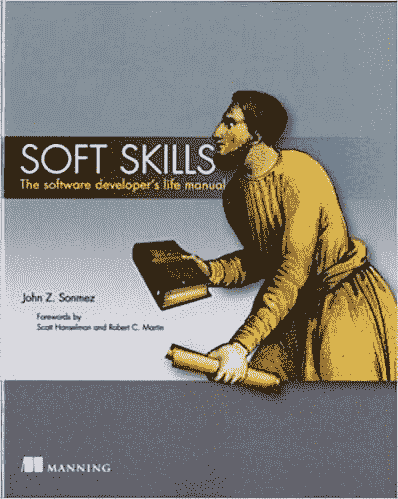

</figure>

**[软技能:软件开发者的生活手册](https://simpleprogrammer.com/softskills) ****约翰的书(我的第一！)**

是的，这是我的书。在这本书里，我涵盖了程序员可能感兴趣的所有非技术性内容，从职业生涯到个人品牌、博客、学习、教学、生产力、财务，甚至还有一点关于健康和人际关系的内容。

<figure class="alignleft is-resized">

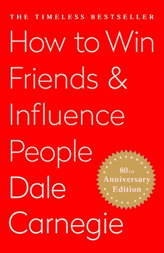

</figure>

**[如何赢得朋友和影响人](http://www.amazon.com/gp/product/B003WEAI4E/ref=as_li_tl?ie=UTF8&camp=1789&creative=390957&creativeASIN=B003WEAI4E&linkCode=as2&tag=makithecompsi-20&linkId=PFFU756LAJK6LWEK)**

这本书我真的怎么称赞都不为过。是的，跟编程没关系。你可能会惊讶地发现这是一本编程书籍，但这是一本改变人生的书。作为一名软件开发人员，你将在整个职业生涯中与人打交道。如果你学会了如何有效地处理它们，你会做得更好。所以，我强烈推荐阅读这本书。这本书改变了我的生活，让我走上了现在的道路。

<figure class="alignleft is-resized">

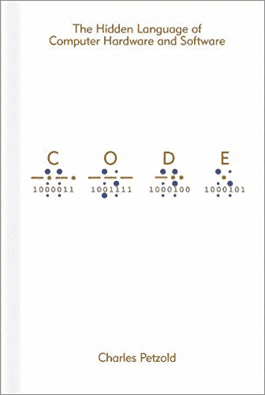

</figure>

**[代码:计算机软硬件的隐藏语言(开发者最佳实践)](http://www.amazon.com/gp/product/B00JDMPOK2/ref=as_li_tl?ie=UTF8&camp=1789&creative=390957&creativeASIN=B00JDMPOK2&linkCode=as2&tag=makithecompsi-20&linkId=YLIZQT4OP6MBEFYG)**

这是一本引人入胜的书。同样，这不是一本明确的编程书，但它是关于计算机如何在最底层工作的。读完这本书后，你会明白你写的代码实际上在做什么，以及 CPU 实际上是如何执行你的代码的。这是一本有趣又迷人的读物。

<figure class="alignleft is-resized">

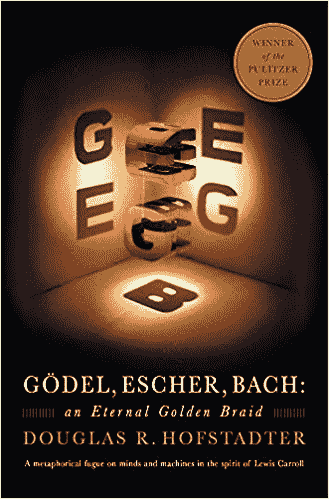

</figure>

**[哥德尔、埃舍尔、巴赫:一条永恒的金色辫子](http://www.amazon.com/gp/product/0465026567/ref=as_li_tl?ie=UTF8&camp=1789&creative=390957&creativeASIN=0465026567&linkCode=as2&tag=makithecompsi-20&linkId=VMF3NUZ3HTFLD43Y)**

这份编程书单上的另一本非编程书籍，却是一本几乎所有程序员都会觉得很着迷的书。这是一本大部头的书，是我读过的最令人愉快的书之一。我再也不想放下这本书，读到最后的时候，我难过极了。

<figure class="alignleft is-resized">

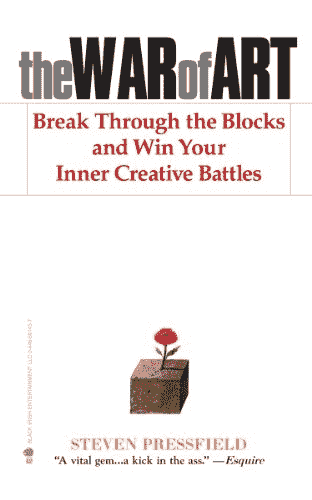

</figure>

**[兵法](http://www.amazon.com/gp/product/B007A4SDCG/ref=as_li_tl?ie=UTF8&camp=1789&creative=390957&creativeASIN=B007A4SDCG&linkCode=as2&tag=makithecompsi-20&linkId=J3DU44KE5DVHVMZE)**

这是另一个延伸。这绝不是一本编程书籍——甚至不是——但它帮助我实现了极高的生产率。这本书是我能坐下来花四个小时写这篇博文的原因。这是一本优秀的书，它将激励你成为最好的自己，并最终战胜拖延症。

<figure class="alignleft is-resized">

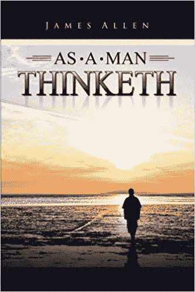

</figure>

这是一本很短的书，也是一本老书，但是非常有影响力。

本书介绍的心态是在生活中取得成功所需的心态。

这一切都是围绕你的思想和你选择如何感知世界，这最终决定了你的生活和世界是什么样的，会变成什么样。

<figure class="alignleft is-resized">

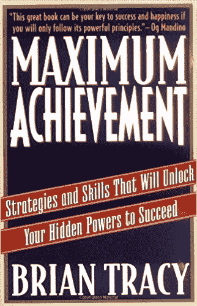

</figure>

**[最高成就:释放你潜在力量以获得成功的策略和技能](https://www.amazon.com/exec/obidos/ASIN/0684803313/makithecompsi-20/ref=as_at?creativeASIN=0684803313&linkCode=w61&imprToken=3o.fwTy6RuCOuM3Q9BVWwg&slotNum=42)**

如果我必须挑选一本个人发展书籍，而且只能是一本，那就是这本了。

为什么？

它包含了许多来源于经典书籍的概念，并以简洁明了的方式进行了解释。它有大量的练习让你在生活中做出真正积极的改变。

这本书涵盖了广泛的个人发展主题，就单本书所能提供的内容而言，给你一个巨大的“性价比”。

<figure class="alignleft is-resized">

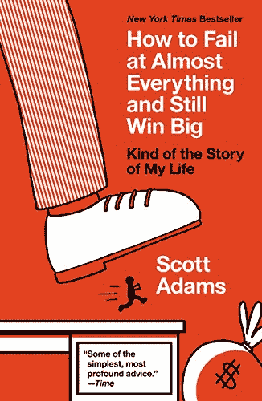

</figure>

**[如何在几乎所有的事情上都失败了，但仍然大获全胜:我的人生故事](https://www.amazon.com/How-Fail-Almost-Everything-Still-ebook/dp/B00COOFBA4/ref=as_li_ss_tl?ie=UTF8&linkCode=sl1&tag=makithecompsi-20&linkId=32d33d63821e49755adf2e89c89d7ff6)**

仍然有很多好的个人发展书籍，但我选择了这本书，因为作者不是别人，正是斯科特·亚当斯——是的，没错，就是《呆伯特》的创作者。

但他远不止如此。

这本书展示了一种人生哲学，它会让你成为冠军。

我从来没有期望过一个关于一个尖头发老板的漫画的创作者会有这样的智慧，但是这本书提供了这种智慧。

<figure class="alignleft is-resized">

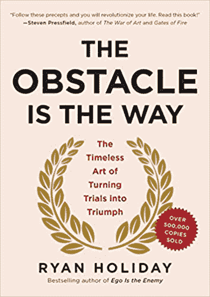

</figure>

障碍是前进的道路:将考验转化为胜利的永恒艺术

这本书是第一本真正向我介绍斯多葛派哲学的书，我认为斯多葛派哲学是我今天生活的核心。

这本书是关于发生在你身上的坏事如何被用来让你变得强大，帮助你找到正确的道路，而不是打败你。

这些课程大多来自斯多葛派哲学；他们被告知使用历史故事来证明这一原则。

<figure class="alignleft is-resized">

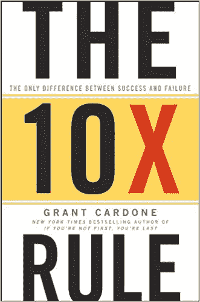

</figure>

**[10x 法则:成功与失败的唯一区别](https://www.amazon.com/10X-Rule-Difference-Between-Success/dp/0470627603/ref=as_li_ss_tl?ie=UTF8&qid=1481298873&sr=8-1&keywords=10x+rule&linkCode=sl1&tag=makithecompsi-20&linkId=61f77f8fa54be392a0dc4f680e2d7700)**

这本书的作者，格兰特·卡尔多内，在我读了这本书和下一本，也是他的书后，很快成为我生命中最伟大的榜样之一。

这本书是关于你可能需要把你的目标提高 10 倍，以及你可能需要付出比你想象的多 10 倍的努力来实现它们。

这是关于你如何能够并且应该采取大规模的行动来获得人生的成功。

这本书会让你大吃一惊——我保证。

<figure class="alignleft is-resized">

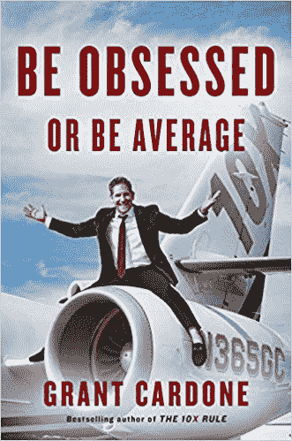

</figure>

**[痴迷或平庸](https://www.amazon.com/Be-Obsessed-Average-Grant-Cardone/dp/1101981059/ref=as_li_ss_tl?ie=UTF8&qid=1481299017&sr=8-1&keywords=be+obsessed+or+be+average&linkCode=sl1&tag=makithecompsi-20&linkId=99a878487eb392c3dad1daf0e324cfed)**

嘿，那么你周围的人是不是说你“痴迷”，说你做的事情不健康，因为你工作太努力了？

这本书允许你礼貌地“向他们伸出手指”,继续开拓你的道路。

这都是关于利用执念的力量去达到你想去的地方。

它也谈了很多关于那些试图打倒你的人以及如何对付他们。