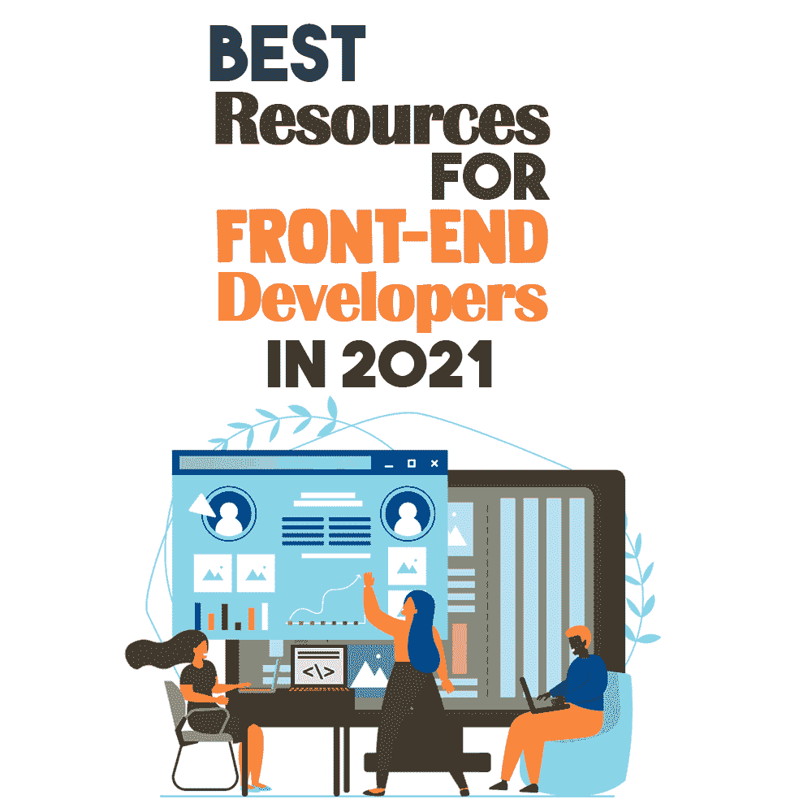
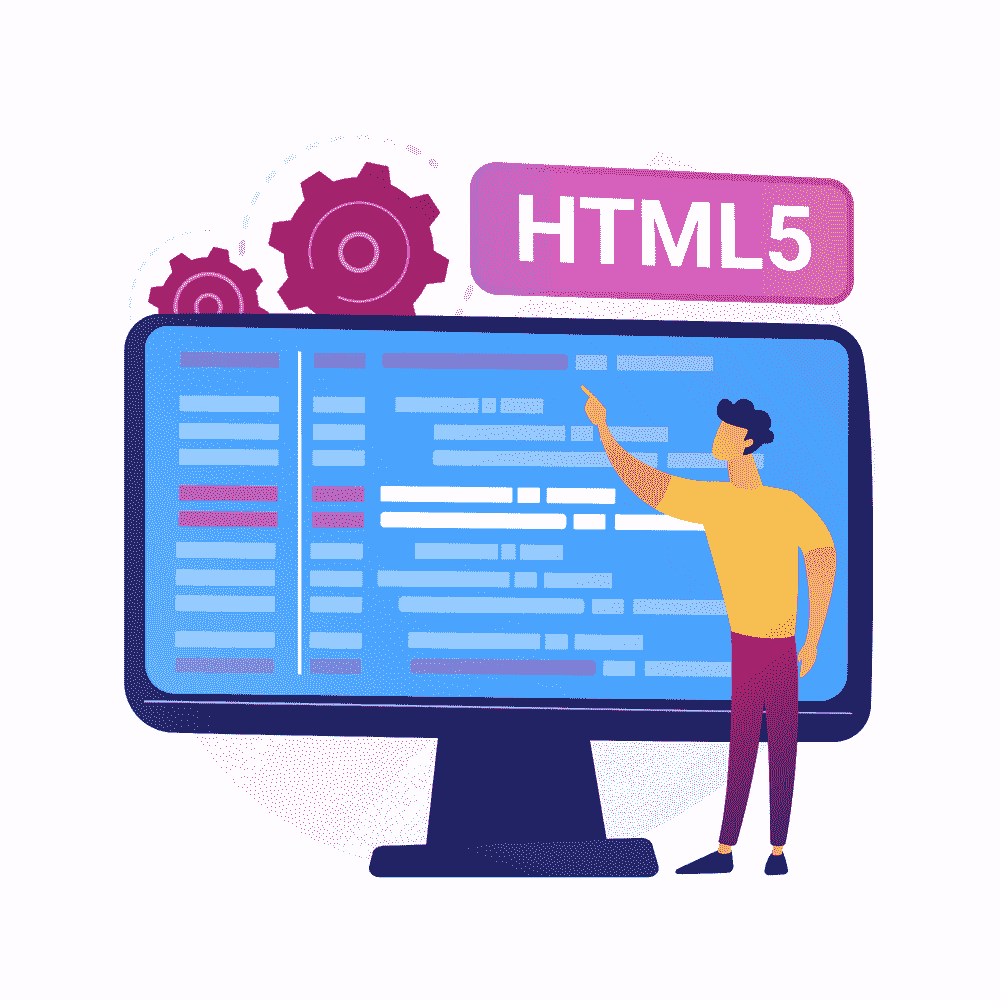
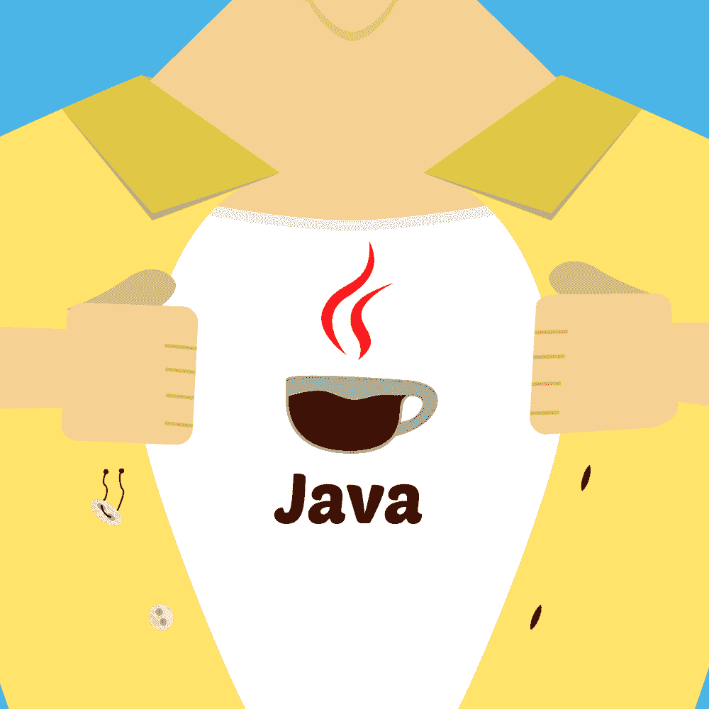

# 2021 年前端开发人员的最佳资源

> 原文：<https://simpleprogrammer.com/best-resources-front-end-developers-2021/>

Web development is the process of creating, designing, and maintaining webpages and applications using various programs and software. It is worth mentioning that web development and design are different matters, but they are closely linked to each other. While the former takes care of functionality and the structure of the website, the latter focuses on its appearance and is concerned with the overall user experience.

通常，前端开发人员已经熟练掌握了与 web 开发相关的语言，如 HTML、CSS 和 JavaScript，并且通常拥有软件和计算机工程、编程或系统分析学位。然而，随着越来越多的资源在互联网上变得可用，许多自学成才的前端开发人员也能够实现职业成功，并成为值得称为该领域的专家。

如果你正在考虑如何成为一名前端开发人员，你需要有一个建立网页的愿望以及对设计的品味。你也应该做好不断学习的准备。在开发领域，一切都变化得非常快，因此您必须跟上编程语言和实践的最新趋势。

有什么比从我们可获得的众多资源中学习更好的方法来让你自己站起来？下面是我整理的一些有用的此类资源，也将帮助你在前端开发生涯中取得成功！

## 教程和指南

先说学习的基础:教程和指南。以下包括免费课程、博客和前端开发工具，教授从基础到高级的 web 开发和设计。你可以把它们作为参考；他们会帮助你准备下一个网页设计项目。这些课程和教训是由专业人士制作和分享的，以帮助那些希望扩展他们的前端开发知识的初学者和业余爱好者。

### [女孩开发它旧金山](https://www.teaching-materials.org/)

Girl Develop It (GDI)是一家成立于 2010 年的非营利组织，致力于为女性和非女性提供她们所需的工具和技能，以便在一个无偏见的环境中从事软件和 web 开发职业。GDI 的教学材料包括从基本的 HTML 和 CSS 到高级 JavaScript 教程的广泛易懂的主题。

### [前端开发者手册 2019](https://frontendmasters.com/books/front-end-handbook/2019/)

Frontend Masters 是初学者和中级网页设计师的绝佳学习平台。这门课程将教会你如何使用现代 CSS 技术为你的网站创建一个响应式的设计。它将帮助你缩小与典型的 HTML 设计者和能够设计工作模板和原型的个人之间的差距。

### [w3 学校](https://www.w3schools.com/)

W3Schools 是在线学习 web 开发的最大资源之一。它有数百小时的教程和课程，内容是用于构建 web 的基本语言和框架。界面可能看起来有点笨拙，但令人难以置信的高质量免费课程弥补了这一点。你甚至不需要注册你的邮箱就可以开始了。

### [HTML 和 CSS 手册](http://www.htmlandcssbook.com/)

CSS and HTML are the foundational building blocks of a webpage, and if you’d like to start learning the bare basics, including web design, you can do so with Jon Duckett’s CSS and HTML learning course. These subjects are still my favorite today because the pace is great and the general scope of what they cover has given me a stronger foundation in this regard.

如果你能从 Jon Duckett 那里得到 *HTML 和 CSS:设计和构建网站*，这也是学习 HTML 和 CSS 的一个坚实的起点(加上一点网页设计)。它得到了很高的评价(在亚马逊上是 4.7/5)，并提供了对 web 开发世界的可靠介绍。这是一本漂亮的书，因为它设计简洁，字体很大，书页色彩丰富。

### [JavaScript & jQuery](https://www.amazon.com/dp/1118907442/makithecompsi-20)

乔恩·达克特的书从最基础的到更复杂的都有，并且在印刷版本中有非常生动的设计。这个由 *HTML 和 CSS 组成的包:设计搭建网站*和 *JavaScript 和 jQuery:交互式前端 Web 开发*被认为是掌握 HTML 和 CSS 的基础，为在 JavaScript 和 jQuery 上的深化铺平道路。

### [简单程序员](https://simpleprogrammer.com/)

简单程序员 2009 年以博客起家。它的创始人 John Sonmez 的目标是帮助刚刚起步的 IT 专业人员、软件开发人员和程序员在一本易读的书中获得他们需要的所有信息。

做前端开发者不仅仅意味着设计我们想要的任何东西。重要的是，我们也要遵守原则，从其他角度学习开发知识。在这个博客中，你可以阅读像“ [Web 开发原则”](https://simpleprogrammer.com/front-end-vs-back-end/)这样的文章，以及像“[改进你的 Web 开发工作流程的 7 大工具”](https://simpleprogrammer.com/7-tools-improve-web-development-workflow/)这样的资源内容，它们来自经验丰富的专业开发人员。

## 主要云提供商

据 Forrester Research 称，随着云计算在我们从最近的疫情中复苏的过程中继续成为“焦点”,全球公共云系统市场将在 2021 年增长 35%,达到 1200 亿美元。对于前端开发人员所做的所有工作，从 HTML、JavaScript 和 CSS 到优化图像，几乎不可能依赖物理劳动力来观察进度和本地存储来包含所有工作。有了云解决方案，一切都在线发送到“云”让我们看看工具和平台:

### [谷歌云平台](https://cloud.google.com/)

Google 云存储(GCS)是面向开发者或企业的高度可扩展的对象存储。该工具允许您利用谷歌的数据分析和机器学习来进一步提高结果和数据的质量。你可以在这里找到谷歌平台提供的所有产品和工具。

### [亚马逊网络服务](https://aws.amazon.com/)

Amazon Web Services (AWS)为许多组织提供了分散的 IT 基础设施。您可以在 AWS 云中创建一个帐户，并根据您的 IT 基础架构需求使用其服务。AWS 的不同特性包括存储、web 计算、数据库访问和消息传递。

AWS 监控扩展通过 AWS 云远程监控其服务的健康和性能。您还可以随时监控您的 AWS 帐户，并从您的 AWS CloudWatch 检索他们的所有服务数据。

### [微软 Azure](https://azure.microsoft.com/)

微软 Azure 是一个发展非常迅速的平台，新功能和新服务定期到来，以支持开发者和企业的不同需求。它为计算、分析和网络提供云服务解决方案。对于 web 开发，Azure 基于云的服务提供了托管、数据库、存储、度量等解决方案和功能。Azure SDKs 也可以与 JavaScript 代码一起运行，所以很容易使用有用的库来帮助你完成开发过程。

### [Zend 工作室](https://www.zend.com/products/zend-studio)

Zend Studio 是一个由“Zend by Perforce”开发的商业 PHP IDE，这是一家专注于企业级 PHP 解决方案的公司。您可以单独安装它，也可以通过 Eclipse Marketplace 将其作为 Eclipse 插件安装。Zend Studio 为 Eclipse 的免费 PHP 开发工具添加了许多企业级特性。

它与其他 Zend 产品无缝集成，特别是与 Zend Server、Zend Debugger、Zend Guard、Laminas Framework(以前称为 Zend Framework)和 Laminas API 工具(以前称为 Apigility)。然而，它并不依赖于 Zend 生态系统，因为 Zend Studio 支持许多其他框架、调试器、web 服务器和工具。

### [IBM 云](https://www.ibm.com/cloud/free/)

IBM Cloud 是一个企业云，可以在任何规模的任何类型的企业中设计和开发 web 或移动应用程序等技术体验。我们的想法是向云提供信息和数据，以便能够解决真正的问题，增加我们的业务或应用程序的价值。

一旦信息被系统化，你可以选择最适合你的目的和工作量的计算模型。无论项目大小，IBM Cloud 都能适应任何工作负载。

## 超文本标记语言

HTML is not a programming language, which means that it does not have the ability to create dynamic functionality. However, it is the core foundation of a website, as it builds and informs a browser what a webpage has.

搭建一个网站的结构，一定是一个前端开发者必须要学习的东西。我们需要它来很好地理解一个网站是如何工作的，并最终为用户创建一个有效和高效的网页设计。

### [W3C 标记验证器](https://validator.w3.org/)

W3C 标记验证服务是由 W3C 创建的验证器，它使用户能够解析格式良好且有效的 HTML 和 XHTML 文档。标记验证是保证网页技术质量的重要步骤。虽然 W3C 验证器对于检查网站可用性和浏览器兼容性很重要，但它对 SEO 的影响尚未得到证实。

### [自举](https://getbootstrap.com)

Bootstrap 也被称为国际上使用最广泛的 web 开发框架。毫不夸张地说，自助网站无处不在。几乎每个网站的源代码里都能找到。除此之外，Bootstrap 的增长阶段还没有停止。被称为 Bootstrap 4 的新的改良版本正在推向市场。数百万该工具的用户期待着这个新版本的发布。

## 半铸钢ˌ钢性铸铁(Cast Semi-Steel)

CSS 或级联样式表在 web 开发中很重要，尤其是对于前端开发人员。CSS 使网站更有吸引力，因为它允许我们使用每个 web 元素的属性，如布局、颜色和字体，甚至允许我们给使用的图像添加效果。这些资源中的许多都有预先制作的 CSS 效果，您可以随时在您的项目中使用。他们也将帮助你了解 CSS，并帮助确保你在你的设计中正确地应用它。

### [W3C CSS 验证器](https://jigsaw.w3.org/css-validator/)

CSS 验证工具通过检查您的 CSS 来确保您符合 W3C 或万维网联盟制定的 CSS 标准。这是一个有价值的工具，可以帮助你找到 CSS 的错别字、错误或不正确的用法，这样你就可以修复它，提高网站的可用性。

### [Animate.css](https://animate.style/)

这个库汇集了不少于 77 个动画，都是用 CSS 创建的，随时可以使用。只要引用 CSS 文件，当你给一个元素添加类时，动画就会发生。这在使用 JavaScript 添加或删除类时效果最好。它对文本或其他元素有简单的滚动效果。简单地用 CSS 制作你想要的动画。

### [动画师](http://animista.net/)

Animista 是由 Ana Travas 开发的，她想开发一个可以浏览预先制作的 CSS 动画的游乐场。当您找到一个适合您的需求或您的项目的美学，您可以很容易地复制代码，并将其应用到您的项目。

### [别针](https://tobiasahlin.com/spinkit/)

加载微调器减少了用户的不确定性，使用户能够被告知当前的工作状态，并增加他们停留和等待页面或信息加载的可能性。有了这个，我推荐试试 SpinKit，它是 Tobias Ahlin 开发的。它是一个开源的集合，包含了很酷很简单的加载微调器，使用 CSS 来制作动画。

### [CSS 效果](https://github.com/emilkowalski/ui-snippets)

例如，CSS Effects 是一组实用的 CSS 动画，您可以复制并用于自己的网站。到目前为止，这些 CSS 资源表明，你并不总是需要开发自己的 CSS，因为有很多开源的 CSS 可以用于你的网页设计。

### [CSS 缩小器](https://cssminifier.com/)

缩小是指删除代码文件中的字符或注释的操作。html，。css，或者。js)，因为它的省略不会使代码停止工作。目标是减小它们的整体大小，从而更快地从浏览器下载它们。在非常大的 CSS 文件中，这通常会产生相当大的影响，因此使用缩小工具并通过压缩所有信息、消除空格、回车等来减小 CSS 文件的大小是一个很好的做法。

### [自举](https://getbootstrap.com)

如前所述，Bootstrap 是一个广泛用于 web 开发的框架。因为 HTML 和 CSS 是携手并进的，Bootstrap 也是帮助 CSS 的有用资源。它有许多基于 CSS 的模板，用于表单、按钮、网格、导航、图像传送带等等，还可以帮助你创建移动响应设计。

## Java Script 语言

JavaScript is the programming language in charge of providing more interactivity and dynamism to webpages. When JavaScript runs in the browser, it doesn’t need a compiler. The browser reads the code directly, without the need for third parties. Therefore, it is recognized as one of the three native web languages together with HTML (content and its structure) and CSS (content design and structure).

### [反应堆](https://reactjs.org/)

React 是一个专门用于前端 JavaScript 的开源库，用于构建用户界面(UI)组件。它包括按钮、屏幕菜单、搜索栏和任何其他用户可以与之交互的元素。但是，为了能够使用 ReactJS 编码，您至少需要熟悉 JavaScript。对于初学者来说，可以开始阅读 [ReactJS 教程](https://reactjs.org/tutorial/tutorial.html)，学习基本的、有趣的 ReactJS 技术。

### [Next.js](https://nextjs.org/)

另一方面，NextJS 是一个 React 框架，用于开发单页面 JavaScript 应用程序。这个解决方案允许您在服务器上呈现 React 应用程序。它也有助于优化你的网页性能和搜索引擎优化，这是不能单独使用 ReactJS 完成的。

## 核标准情报中心

人们没有意识到的一件事是，当你使用一个网站时，会有很多东西进入其中。其中一个是小图标，它让用户界面变得更加简单，任何人都可以使用！在这些网站上，你可以下载和整合图标到你的网页设计中。

### [Fontawesome](https://fontawesome.com/v4.7.0/)

字体 Awesome 的图标部分非常全面，可以为您提供您可能需要的图标的所有版本。由于它们是如何工作的，不管你如何调整它们的大小，它们总是看起来清晰明了。你不需要强调如何集成图标，因为这就像复制粘贴它们自己提供的代码一样简单。

### [Flaticon](https://www.flaticon.com/)

丰富多彩和充满活力是描述他们在 Flaticon 提供的图标的最佳词汇。它们通常是成包的，即使大多数是免费的，你也可能需要支付额外的费用才能使用其他的。你可以分辨出这些是什么，因为它们的包装上有一个小皇冠。尽管如此，免费使用的图标仍然非常漂亮，给你的网站增添了一抹亮色。

### [图形汉堡](https://graphicburger.com/icons-set/)

Graphic Burger 和 Flaticon 一样，也提供成套的图标。大部分都非常丰富多彩，可以下载 PNG、SVG、EPS、Sketch 格式。图标有不同的形状。其中一些可能非常简约，而另一些则非常丰富多彩。你还可以找到更好看的免费表情符号，并将其融入到你的作品中。

## 彩色

在设计你的网站时，颜色是非常重要的，不同的颜色有不同的含义。如果你是一名前端开发人员，你至少需要了解颜色如何影响人们，这样你就可以在为客户开发网站时以此为基础。例如，如果你正在为一个 SaaS 工具或企业开发一个 UI，希望看起来值得信赖和可靠，蓝色将是最好的选择，因为蓝色与信任和冷静联系在一起。对于食品工业来说，黄色会刺激人的食欲和幸福感。

颜色还能增加品牌认知度，突出网站更重要的部分。当你想让你的网站脱颖而出时，为它确定一个完美的配色方案是至关重要的。

### [W3Schools 颜色选择器](https://www.w3schools.com/colors/colors_picker.asp)

正如我们已经看到的，W3Schools 是 web 开发的一个很好的资源。尤其是他们的颜色选择，令人惊叹。它不仅提供了颜色的 RGBA、十六进制和 HSL 值，还向您显示了与颜色相关的许多阴影。您还可以看到白色或黑色文本在您选择的颜色下会是什么样子。

### [酷派](https://coolors.co/)

从柯尔特·斯蒂尔到训练营，这个网站被很多提供编码课程的人推荐。酷酷的人会随机挑选你的项目可以使用的颜色。如果您正在从头开始构建某个东西，并且您不确定如何使用调色板，它会为您提供五种随机颜色，您可以将它们用作主色和一些修饰色。当你创建调色板时，你可以选择一些你喜欢的颜色，并不断改变其他颜色，直到它与你所寻找的主题相匹配。

### [ColorZilla](https://www.colorzilla.com/)

ColorZilla 是一个被很多 web 开发者使用的流行插件。要使用它，你必须下载它，并将其附加到您的浏览器。一旦你有了它，你所要做的就是点击出现在屏幕右上角的滴管图标，然后选择一种你想知道的颜色。例如，如果一个网站正在使用你喜欢的颜色，你所要做的就是点击滴管图标，并将其拖到你需要知道的颜色上。当你对从头开始重新创建一个网站感兴趣，并且希望尽可能精确时，这是很棒的。

### [转换颜色](https://convertingcolors.com/)

转换颜色并没有得到很多人的喜爱，但当你开始创建渐变和学习正确的颜色理论时，它是一个非常好的资源。除了 RGB 和 Hex，它还为您提供不同的颜色格式。如果你向下滚动，你会看到与给定颜色相关的不同和谐，以及该颜色作为字体或背景的样子。还有关于如何在 CSS 代码中恰当地整合您想要的颜色的说明。

## 插图

Sometimes, a generic happy photo of a family just doesn’t cut it; or you just can’t find a picture that goes with the color scheme of your website. The next thing you can use is illustrations. If you can’t draw, it’s OK! There are a lot of websites out there that provide images in .png and .svg format that you can use in your projects for free.

### [展开](https://undraw.co/)

Undraw 是 web 开发人员中一个众所周知的资源。它提供了不同的和免费的插图和图形艺术，可以用于他们的项目。它们非常适合那些正在创建作品集或网站第一版，并且需要一个不无聊的占位符图片的人。

### [灵活](https://2.flexiple.com/scale/home)

就像 undraw 一样，它为您的投资组合和业务提供了良好的形象。你可以下载. svg 或. png 格式的图片。它有各种情况的图片，从社交媒体到月球上一个男人的可爱图像。它们也可以提供同一图像的不同版本。如果你需要特定颜色的图像，它的顶部有一个颜色选择器可以为你着色。

## 形象

不是每个人都有时间和金钱来制作照片，以便为他们的网站制作视觉媒体。你能做的下一件最好的事情是去提供库存照片的网站。别担心，不是所有的都要你付钱。有些人只要求你信任网站和摄影师。以下网站非常适合查看符合主题的照片，并寻找您的网站。我还推荐了一个工具，可以帮助你即时去除图像中的背景。

### [去飞溅](https://unsplash.com/)

Unsplash 是一个充满免费使用的美丽图片的网站。你在第一页就被轰炸了，不管你向下滚动多少，你仍然会看到他们所提供的例子。如果你对某个特定团体的作品感兴趣，你可以查看他们的个人资料，看看他们是否可以合作。

### [轴](https://www.pexels.com/)

Pexels 是一个巨大的图像和视频库，可用于任何类型的项目。人们上传他们的照片，以此来炫耀他们的摄影作品。他们的许可非常简单明了:所有的图片都可以免费使用，不需要归功于摄影师——尽管这样做会非常受欢迎。

### [Shutterstock](https://www.shutterstock.com/)

当谈到提供美丽的高清图像时，Shutterstock 是标准。他们有来自专业人士的图片，你可以用于你的商业或个人网站。每月 29 美元，对于任何经常需要新的图片来用于工作的人来说都是负担得起的。

### [移除。艾](http://removal.ai)

如果您遇到了某些主题很棒但背景令人分心的图像，您可以使用移除。AI，一个背景去除工具。这样，您可以清除那些背景嘈杂的图像，以用于您自己的活动和项目。搬家最大的好处就是。人工智能，除了它能在几秒钟内处理你的图像之外，它还是免费的！

## 易接近

甚至在疫情之前，越来越多的人把大部分时间花在网上，无论是社交媒体、浏览网页、购物，甚至是创业。不可避免的是，大量使用互联网的人患有不同类型的残疾。出于这个原因，确保残疾人也能使用网站的运动越来越多。开发者应该始终确保他们的网站和应用程序对每个人来说都易于使用和导航。

### [波](https://wave.webaim.org/)

这个工具允许你测试你的网站的可访问性。它会扫描您的网站，并突出潜在的可访问性问题。它还会向你展示你的网站在哪些方面表现良好，便于所有人访问。它将以一种非常清晰的方式向您展示哪些地方不符合可访问性指导原则，哪些地方不符合，以及如何解决这些问题。

### [W3.org](https://www.w3.org/)

这是一个全面的文档，面向对开发残疾用户可访问的网站感兴趣的用户。它很长，非常详细，所以你需要花时间来检查整个事情。但这将是值得的，尤其是因为越来越多的各行各业的人都在使用互联网。

## 部署

Before you can roll out your website, you will need to deploy it somewhere where you can first show it off to your clients. It’s also a way to share with your nontech friends your work and see if they can catch any errors or bugs when going through your site. Deployment is just the process of making your work available to anyone. Here are some places where you can have your site hosted.

### [Netlify](https://www.netlify.com/)

Netlify 是托管静态网站最容易的地方之一。你所需要做的就是拖动你作品的文件夹或者只是连接你的在线回购(Gitlab/Github/etc。)到 Netlify，你就可以走了。您是否需要将变更推进到您的项目中？您只需将更改推送到您的回购协议中，它就会自动出现在您的网站上。

### [浪涌](https://surge.sh/)

Surge 是一款用于部署、托管静态网站和前端开发者工具的工具。你可以托管用静态网站生成器制作的作品，比如 Gatsby.js 和 Jekyll。任何用客户端 HTML、CSS 和 JavaScript 构建的定制设计也可以。它的免费计划对几乎任何静态网站都是最佳的，并且只需在命令行上击几下键就可以完成服务设置。有一个高级版本，增加了一些额外的功能，如自定义 SSL 和密码保护。

### [Heroku](https://www.heroku.com/)

Heroku 是一个 PaaS 工具，支持多种编程语言。这个工具目前支持 PHP、Java、Node.js、Go、Python、Clojure 和 Scala。Heroku 在虚拟形式上运行应用程序，可以根据客户要求进行更改或改造。Heroku 虚拟计算机系统被称为 dynos，可以根据用户不断变化的需求随时进行修改。Heroku 用户能够通过水平或垂直扩展来应用更多的资源。

## 有了合适的工具，你可以做任何事情

这就是帮助你成为前端开发人员的资源。尽量记住关键是尽可能多的练习。一开始可能看起来比较恐怖，你会觉得自己理解的不多，但那是正常的，久而久之你会觉得自己越来越好。

有了这些工具，你离你的前端开发职业成功更近了一步。此外，如果你遇到困难，不要忘记寻求帮助。你会对愿意帮忙的人数感到惊讶。

既然您对这个主题有了更多的了解，您就可以实现 web 开发工具来满足用户的需求，正如我们已经看到的，用户的需求由于我们生活的环境而不断变化。