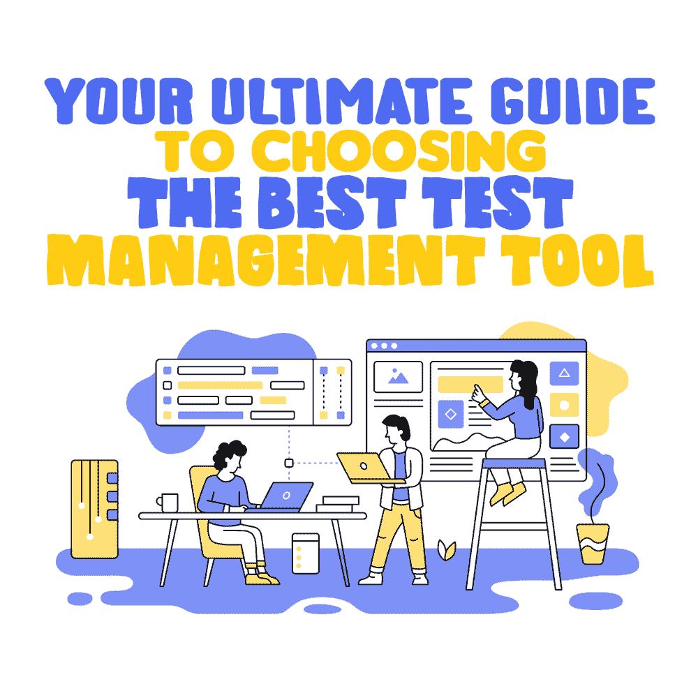

# 选择最佳测试管理工具的终极指南

> 原文：<https://simpleprogrammer.com/best-test-management-tool/>

With the growing demands from modern-day online companies, more and more organizations are resorting to [agile methodologies](http://www.amazon.com/exec/obidos/ASIN/0132350882/makithecompsi-20) to execute the software lifecycle. The demand reflects in the growing popularity of testing methodologies, given the increasing need to provide better quality delivery in a shorter period.

为了帮助组织实现最佳的测试结果，一些公司开发了测试管理工具来指导过程中的质量保证(QA)团队。这些工具帮助公司计划测试活动，存储关于如何举行测试的信息，并审计测试过程。

最近，随着越来越多的测试团队致力于改善测试的结果，测试管理工具越来越受到重视。根据 Gartner 的报告，测试管理工具的市场价值在过去几年中出现了戏剧性的增长。

今天，测试管理工具行业的总市值为 5 . 47 亿美元，几乎占 18 亿美元的应用开发和生命周期管理(ADLM)工具市场的 50%。也有 5%的年增长率。

尽管这种转变一直在增加，但许多公司仍然依赖手工方法，如使用 excel 表格和 Word 文档来组织他们的测试过程。这意味着当您了解测试管理工具并在您的公司中实现这些工具时，您可以走在他们的前面。

然而，鉴于市场上的众多选择，如今选择正确的工具是一个挑战。因此，对你来说，敏锐地理解这些工具是什么，它们有什么特性，从而做出正确的决定是很重要的。

在这篇文章中，您将学习测试管理工具的基础，以及这些工具将如何使您的业务受益。请继续阅读。

## 测试管理市场的三大类别

目前，在测试管理市场上有三个主要的类别，每一个都有独特的特征:全套测试工具、纯游戏测试工具和开源测试工具。让我们来看看每个类别。

### 全套测试工具

大型测试团队将这些类型的工具用于企业规模的目的，因为它们在较高幅度的项目中表现良好。大多数完整套件提供商提供测试管理，作为一种干预形式，附带一套 ADLM 工具。有趣的是，这一领域的测试管理工具与循环中的其他 ADLM 软件进行了系统的协调。

由于利率较高，只有有经济能力的组织才能负担得起这些工具。当然，这是合理的，因为更著名的组织拥有规模更大、更复杂的项目。但是对于预算有限的小型组织，不要担心，有一些工具是预算友好的，特别是对于初创公司。

这一类别的标准工具包括:

*   微焦点的质量中心
*   来自微焦点的丝中央
*   来自 Oracle 的测试管理器
*   Microsoft 的 Visual Studio 测试专业版
*   来自 IBM 的区域质量经理

### 纯游戏测试工具

Most of the significant shifts in the ever-growing test management market are reflected in this category, given the different tool options that are purposively geared for testing.

在某些情况下，这些工具被明确用于技术目的。例如，一些工具旨在用于 web 应用程序测试，而其他工具旨在测试移动应用程序。当然，当谈到特性和考虑因素时，也有技术上的变化，但是所有这些的结合是给定的优点。

以下是与这些工具相关的一些主要优势:

**基础设施:**因为大多数工具都是在云中自托管的，所以你不必纠结于维护和基础设施。

**现代的界面和架构:**现代的[测试管理工具](https://www.inflectra.com/ideas/whitepaper/how-to-choose-a-test-management-tool.aspx)可以产生一个直观的界面，为良好的用户体验生成最好的特性。这与提供类似于遗留系统界面的全套供应商形成了鲜明对比。

**集成:**这些工具包含最新的 API，使它们能够与其他第三方软件完美集成。这就是为什么这些工具根深蒂固，以确保全面协作的有利环境，而不管管理团队使用的工具或当前的开发。

例如，质量团队可以在 Basecamp 中记录时间，在吉拉/GitHub 中记录出现的问题，并发送 Slack 通知。这些特性只是这些集成如何根据您组织的目标发挥作用的点缀。与全套件供应商提供的工具不同，Pure Play 测试工具缺少其他 ADLM 工具，这使得集成对于它们的存在来说是至关重要的。

**定价:**无论功能、项目规模甚至用户如何，Pure Play 都提供了一个可调整的定价系统，与全套服务供应商提出的高额许可费形成鲜明对比。

对于此类别，最受欢迎的供应商是:

*   EasyQA
*   来自 Gurock 的试验轨道
*   qftouch
*   测试小屋

### 开源测试工具

与上面的类别不同，这一类别中涉及的开源玩家很少，他们已经存在了相当一段时间。幸运的是，这些玩家中的一些提供了一个高效和健壮的社区支持系统，类似于所有的开源软件；然而，这些工具在可靠性和可用性方面各有优缺点。

预算较少的 QA 团队通常会选择这个选项来组织他们的测试用例。尽管这些工具是为较小的项目设计的，但是它们和其他类型的工具一样有效。这意味着你不必追求更昂贵的选择，尤其是当你刚刚开始测试过程的时候。

请记住，您总是可以扩大规模，但从基础开始仍然是明智的。

这一类别最受欢迎的供应商包括:

*   测试链接
*   质量保证经理
*   测试主管
*   狼蛛
*   测试立方体

有了上面所有的细节，我们现在有了一个什么是测试管理工具以及它对应的类别的概述。您接下来要做的是理解哪种工具最适合您的测试过程，与您组织的目标保持一致。

## 选择正确的工具

市场上有多种选择，滚动浏览所有选择可能会让人不知所措。因此，为了找到最合适的，这里有一些重要的事情你应该考虑。

### 显色法

重要的是要记住，质量保证不仅仅是质量本身，因为它应该与开发并列。因此，您应该对开发方法有一个透彻的理解，比如瀑布式、敏捷式和混合式。

### 应用支持

测试过程可能因应用模式而异。例如，移动应用程序的测试过程可能与数字应用程序的测试过程有很大的不同。

同样，也有专门为移动应用测试定制的测试工具，集成了软件开发工具包。在最终选择工具之前，您必须考虑应用程序和环境。

### 团队结构

QA 团队可以根据组织的需求或公司支持这种团队的能力而变化。分配给测试过程的工作人员大多由一个人组成。

让多人做测试会导致重复劳动。这就是为什么选择有助于健康的[协作](https://simpleprogrammer.com/challenges-leading-distributed-team/)的工具很重要，从而避免重复和其他问题。这样做可以提高团队成员或组合的最佳生产率。

### 综合

今天，越来越多的公司求助于数字机制进行各种操作，如通信、项目管理、时间跟踪、项目监控和项目评估。有必要将这些整合成一个无缝的和谐，一个不会产生冲突或导致功能障碍的和谐。

通过使用测试管理工具，这样的集成是可能的。[例如，测试管理自动化工具](https://www.practitest.com/)可以与其他第三方工具很好地融合，以提供富有成效的增值。在这种情况下，您不需要手动修改另一个第三方软件的设置，只是为了让它与一个测试管理工具一起工作。

### 学习曲线

在您能够有效和充分地利用测试管理工具之前，您需要投入大量的时间来学习和理解细节。幸运的是，一些工具具有直观的特性。他们有一个内置的综合知识库和社区支持系统。有了这些功能，你就更容易学习和适应。换句话说，这有助于让你的学习曲线变平。

### 费用结构

为了确保组织控制开支，需要了解成本结构以及转向最佳定价模式，因为这有助于组织在运营中实现最佳增长。

定义成本结构也是至关重要的，因为您可以看到哪一类测试管理工具与您的组织的财务能力相一致。当然，您不仅应该考虑这些，还应该考虑您需要的测试过程的级别。这样，你就可以确定一个既易于管理又富有成效的最佳成本。

### 移动

Upon deciding which test management tool works best for an organization, the next thing to deal with is data migration.

重要的是，每个组织都应该将他们的数据从现有的测试管理工具或电子表格平台迁移到新工具中，而不丢失关键元素或产生不必要的差距。迁移应该非常仔细和高效地进行，因为任何丢失或鲁莽的移动都可能给组织带来重大灾难。

此外，新工具应该易于接受，并且易于数据迁移。此外，它应该自动响应所请求的集成，而不是需要特定的过程，然后才能与旧工具(数据从该工具中迁移出来)相协调。

在确保这些方面都到位之后，您就可以将一些测试管理工具列入候选名单。

## 测试管理工具可以提高性能

所以你有它。我们已经讨论了测试管理工具，以及为什么它们对您的业务很重要。有了这些工具，您可以使测试过程更加有效，并产生更好的结果。

我们还解决了在选择最适合贵公司情况和期望的工具时需要了解的基本特性。正如我们所见，每种工具都有特定的特征，适合特定的需求。

现在，您已经准备好选择一个并提高测试结果，最终提高您企业的整体绩效。