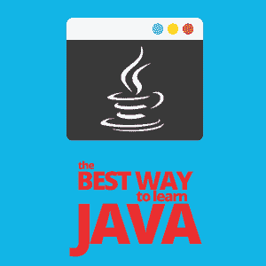

# 学习 Java 的最好方法

> 原文：<https://simpleprogrammer.com/best-way-learn-java/>

Java is one of those languages that some may say is difficult to learn, while others think that it has the same learning curve as other languages. Both observations are correct.

然而，由于其平台无关性，Java 比大多数语言都占了相当大的优势。Java 作为一种低级语言，以一种简单的方式奠定了算法的实现，并让你理解基础；同时，它也足够高，可以逻辑地实现编码。

根据你开始学习之前的心态，学习 Java 的最好方法应该遵循一定的步骤:学习术语，练习，练习，哦，等等，再练习。重复是关键。

我想分享一些在我开始学习 Java 时对我有帮助的技巧，我希望你也能从这些技巧中受益。

## 学习 Java 术语

学习 Java 或任何语言的最好方法是从初级水平开始。“Hello World”是一个很好的起点——基本上所有的程序都使用这个**想法**来说明编程语言的中心语法。

在学习编码之前，学习 Java 的人需要理解语法中的某些术语:类、对象、继承、多态、抽象和封装。要了解这些方面的内容，一本很好的书是 Head First Java。

使用不同的参考文献来理解术语，因为即使个别参考文献可能有相同的定义，解释也不是绝对的和有限的。谷歌有不同的网站，会用不同的方式解释同一个词。

当你第一次读到一个定义时，可能会觉得你在学习一种来自不同星球的语言，但重点是熟悉术语，而不是掌握它。

例如，类别是用户定义的设计或构成项目的样本。它表示对一种类型的所有对象通用的一组进程或属性。

对象是面向对象编程的重要单元，它体现了有效的实体。

一个原型 Java 程序产生许多对象，这些对象通过调用方法一起工作。

理解这些术语将有助于您了解代码的组成部分以及最终结构和代码形成背后的原因。这种对 Java 的坚实基础和理解将使你有能力编写代码，并使你能够彻底展现该语言中任何程序的潜在含义。

## 练习简单的 Java 程序

如果术语是学习 Java 的最佳方法的第一步，那么第二步就是在网上找到一个简单的程序来练习你的新语言技能。只有通过执行新获得的知识，新获得的基础才会得到检验和完善。

我们以三乘三井字游戏为例；这是一个简单的程序，不需要很多高级编程技能——这是一个适合绝对初学者的程序。这是一个对实践有效的程序，因为程序员已经知道结果。

首先要做的是写下程序的每一个步骤，例如，可以从用户在中间网格输入 X 开始，计算机自动在右上、左上、右下或左网格输出 0。用户再走一步，计算机进行有效的第二步，第二步不重复第一步，是唯一的。这种设计输入和输出步骤的方法将一直持续到完成。

在完全经历了输入和输出步骤之后，程序员需要查看代码。一个新的程序员可能不能一眼就知道所有的代码。这可能需要一段时间，所以对无法理解你自己的创造而抓狂肯定不会有帮助！

这个技巧是学习 Java 中的主要“不要”——不要害怕！

为了解决这种情况，用铅笔在笔记本上手写下整个程序是一个好主意。再次重复这个过程，在第二次的时候，定义程序的每一行代码。如果语法让你为难，你可以在谷歌上找到解释。

最后，学习者需要使用集成开发环境(IDE)，一种为计算机程序员提供软件开发综合设施的软件应用程序，在手写三次并用自己的话大声解释后输入程序。

## 忽略消极因素

There are countless programming languages, some of them are obsolete, and everyone has their favorite. Some see Java as an old language and not as trendy as other like Ruby. So, there’s no denying that you will have face some heat when you make your mind up to learn Java.

你肯定会被告知某某编程语言更好；立即忽略这种说法，保持尽可能掌握多种编程语言的态度，而不仅仅是 Java。

我得出的结论是[每个人学习的方式都不一样](http://www.amazon.com/exec/obidos/ASIN/1539397831/makithecompsi-20)。例如，我是一个触觉学习者。因此，如果一位评论家告诉我，学习 Java 的唯一方法是坐着听音频，我很可能不会成功地学习 Java。

说到学习 Java，我鼓励你涵盖所有的基础:动觉(通过进行身体活动来学习)、语言(通过说来学习)、听觉(通过听来学习)和视觉(通过看来学习)。

通常，学习如何编程的最好方法是尽可能涵盖所有这些学习风格。但是如果你发现一个更适合你，那就坚持那个。

## 坚持练习，你会在 Java 方面取得成功

学习编程语言需要重复，就像其他事情一样。学习 Java 的人会希望深深地融入并吸收这门语言，直到他们最终开始理解事物。有成就的程序员在实际开始写代码之前，会看几个小时的编码视频。

同样重要的是，要记得享受作为程序员的旅程。对自己要有耐心。

你必须记住，第一次你可能不明白所有的事情，这没关系。找出你学习的最佳方式也很重要。有些人可能在[开发 Android 应用](https://www.youtube.com/watch?v=cIigzz5jasY&feature=youtu.be)时最擅长学习 Java，有些人可能喜欢使用 JMonkeyEngine 开发游戏，而其他人可能对构建网页没什么意见。

我个人发现，在我使用 Java 构建移动应用程序时，学习 Java 更容易，因为我能够看到我的程序如何与前端一起工作。

关键是要有耐心，要明白每个人学习的方式都不一样。学习 Java 的最好方法是精通理论知识和实践知识。成功在于花多少时间来练习编程语言、[犯错误](https://simpleprogrammer.com/past-experiences-newbie-programmer/)并从这些错误中学习。

愿编码力量与你同在…编码快乐。