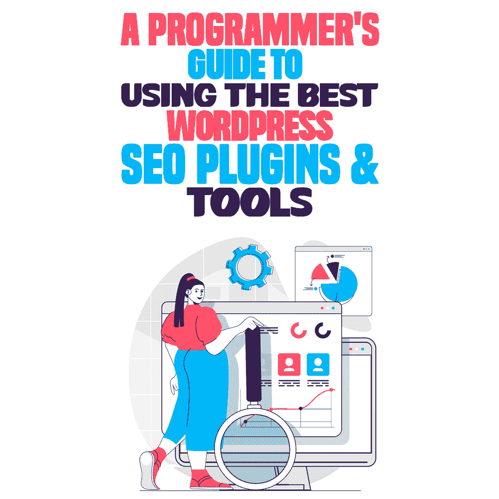

# 使用最好的 WordPress SEO 插件和工具的程序员指南

> 原文：<https://simpleprogrammer.com/best-wordpress-seo-plugins/>

Programmers understand how important it is to have a website rank high up on a search engine, while also making sure it is well optimized for search engines. But, we don’t all have the time or capital to invest in learning everything there is to know about search engine optimization (SEO).

这就是 WordPress SEO 插件和工具发挥作用的地方。

这篇博文将讨论什么是 SEO，正确使用 SEO 的重要性，以及各种 SEO 工具和插件，你可以使用它们来更好地优化你的 WordPress 网站，以获得更快的加载速度、响应速度和更好的用户体验。

在这篇博文中，我们将讨论在安装 WordPress SEO 插件或工具之前，你应该考虑哪些因素，并给出优化你的网站的技巧，以获得快速加载、响应和良好的用户体验。

通过遵循本文中介绍的技巧和工具，您将能够提高您的网站在搜索引擎结果页面(SERPs)中的排名，并吸引更多的访问者。

你也可以准确地挑选出你需要哪些搜索引擎优化工具来改进你的网站。

## 什么是 WordPress SEO，为什么需要它？

搜索引擎优化用于帮助您的网站在 Google 或 DuckDuckGo 等搜索引擎的搜索结果中排名更高。

让你的网站或博客排名靠前的唯一方法是，在搜索结果的第一页，你的内容需要写得很好，并包括信息丰富的图片。

你的网站排名不取决于其他任何东西，除了正在使用的搜索引擎。这些搜索引擎将拥有人工智能，它使用某些标准来判断一个页面是否包含与文章主题相关的所有标准和关键词。

有很多东西，比如语义相关的单词、标题和字数，会影响你的文章或博客文章在搜索页面上的位置。

为了提高你在搜索结果中的排名，经常写好的内容并提供描述性的图片和替换文字是很重要的。

这些标准是不断变化的，但是你总是可以通过访问他们的[当前推荐](https://developers.google.com/search/docs/beginner/seo-starter-guide)来找到更多关于搜索引擎在寻找什么的信息。

你也可以阅读一些信息丰富的 SEO 书籍。

## WordPress SEO 插件和工具是做什么的？

有很多不同的 WordPress SEO 工具和插件，每个都有自己的用途。这里有一些 SEO 插件和工具可以帮助你的例子。

### 提高搜索引擎排名

首先，也是最重要的，WordPress SEO 工具将帮助你的网站在搜索引擎上排名更高。

据 [SearchEngineJournal](https://www.searchenginejournal.com/google-first-page-clicks/374516/#close) 报道，在谷歌上搜索时找到的第一个结果点击率为 28.5%。接下来的两个网站点击率分别为 15%和 11%。

据美通社报道，从那里开始，只有 0.78%的用户会进入搜索结果的第二页。

正如我们所见，根据经验，一个网站在搜索引擎的结果页面上的排名尽可能高。

### 识别关键词

一些搜索引擎优化工具旨在帮助你识别关键词。这些工具还将提供关键词在文章中的使用频率以及关键词的每次点击费用(CPC)。高点击费的关键词有很多竞争，主要是因为对关键词的高需求。

这种需求可能与关键字每天被搜索的次数有关，或者与带有关键字的文章的浏览次数有关。

### **让网站更加用户友好**

网站的第一印象决定了你网站的流量。如果网站加载缓慢、滞后或看起来混乱，用户可能会找到同一主题的不同网站。

搜索引擎优化工具和插件可以帮助你发现网站的问题，并为你如何做得更好提供建议。一些工具甚至提供实时数据捕捉，如 [Hotjar](https://www.hotjar.com/) ，它显示用户悬停和点击最多的地方。

### **为移动应用优化网站**

在这个时代，大量的网络浏览发生在移动设备上。将网站格式化为手机友好型需要大量的工作。

一些 WordPress SEO 工具将帮助测试你的网站是否是手机友好的，并帮助优化它。测试可以告诉你哪些地方需要改进，或者提供一些数据，当你为移动流量优化你的页面时，这些数据可能对你有所帮助。有大量的移动网站建设者来测试你的网站的移动友好程度..

为什么要在你的 WordPress 网站上使用 SEO 插件和工具？

Whether you’re a business owner, digital marketing consultant, influencer, or programmer, getting to know the ins and outs of SEOs is not as simple as it might seem.

让你的 WordPress 网站吸引流量，出现在搜索引擎的第一页，并且在很长的加载时间内对用户友好是令人生畏的。仅仅是列出这一点就难倒了我。

你应该使用 SEO 插件和工具的主要原因是它们带来的便利。你可以节省很多时间来诊断一个点击量不正确的网站，或者你可能很难让他们点击订阅按钮。

有很多工具提供分析、提示和实时数据，可以帮助任何程序员顺利运行他们的网站。

在手机上测试你的网站时，这可能会更加困难。如果你正在寻找工具来测试你的网站对移动设备的友好程度，看看 6 种移动应用程序可用性测试方法。

## 安装 WordPress SEO 插件或工具之前需要考虑的因素

安装任何 SEO 工具听起来都很诱人，但是重要的是要明白有很多不同的功能不同的 SEO 工具。在 SEO 插件上花费数千美元，却发现你只需要其中的两个插件，这很伤人。

在安装或购买 WordPress SEO 插件或工具之前，需要考虑以下 6 点:

### #1 你不必雇用专家来使用它。

当你在与自己能力范围之外的事情做斗争时，找一个专业人士来帮忙从来都不是一个坏主意。

记住这一点，如果你已经有了一个专业的网站设置，但需要帮助优化搜索引擎优化，这可能是一个伟大的想法得到搜索引擎优化工具来帮助你。

### #2 你可以用一个 SEO 插件处理所有的方面。

一些 SEO 插件可以做你从 SEO 工具中需要的几乎所有事情。

这可能是分析你的网站，看看它有多用户友好，或者更重要的是，如果它是移动友好的。

从那里你会希望它能够提供分析，包括关键词和他们的点击费，特别是如果你在写新的文章或博客。

你还需要它能够为你提供访问你网站的人的重要信息。他们在你的网站上花时间最多的地方，他们点击最多的地方，你可以改变事情以增加他们点击的机会。

### #3 它易于使用，接收定期更新，并且是安全的。

不像雇佣专业人士来做你的搜索引擎优化，一个应用程序要可靠得多，并且总是在你需要的时候出现。

每次都需要咨询 SEO 专家并支付费用，而 SEO 工具可能需要按年订阅，或者如果你幸运的话，只需一次性付费。

同样重要的是，这些应用程序要定期更新，以适应当前的市场和数字环境。关键词和他们的 CPC 可能会根据时事新闻而改变。对此最快的反应是使用搜索引擎优化工具来帮助你。

### #4 很容易找到支持。

大多数 SEO 工具和插件都有 24 小时支持。无论是通过电子邮件，网站上的聊天室，还是打电话。

这种支持只附带插件和工具。如果你在凌晨 1 点给你的“搜索引擎优化专家”打电话，你可能得不到你想要的答案，你可能还需要找一个新的搜索引擎优化专家。

### #5 所有关键的 SEO 指标一目了然。

Most basic SEO plugins and tools will come with a home screen, where you can usually find all your current analytics.

这些通常在一两个按钮的范围内。打印出来也很快，尤其是如果你急着去开会，需要得到所有这些分析。

总比花钱请一个搜索引擎优化专家为你画一些数字要好。

### #6 没有比 SEO 插件或工具更便宜的替代品了。

负担得起的搜索引擎优化机构的搜索引擎优化服务费用通常在 400 到 3000 美元左右。而一个优秀的搜索引擎优化工具，什么都做，像 SEMRUSH，他们的 pro 计划每月花费约 119 美元。

这意味着为一个项目雇佣一家代理公司可能要花费甚至超过一年的 SEMRUSH。

与仅仅使用 SEO 工具如 SEMRUSH 相比，从他们那里获得结果也很可能需要更长的时间。

## 2022 年的 8 个必要的 WordPress SEO 插件和工具以及如何有效地使用它们

### yoast SEO 插件

Yoast SEO 是一个优秀的插件，可以帮助你确保你的 WordPress 站点是完美的。

它扫描您的网站的任何问题，无论是加载时间或位置的问题。Yoast 将确保你的 WordPress 站点符合最高的 SEO 标准。

它还能为电脑和手机优化你的网站。这种优化还会检查你的网站的可读性，并指导你相应地进行调整。

Yoast 还拥有一个 24 小时支持团队，可以回答你关于 SEO 的任何问题。

### [谷歌搜索控制台](https://search.google.com/search-console/about)

谷歌搜索控制台可以帮助你跟踪网站的搜索流量和性能。

谷歌搜索控制台还可以帮助您修复网站上的任何问题，以及帮助您在搜索结果中排名更高。

关于谷歌搜索控制台最好的部分是它是完全免费的！你甚至不需要注册。

谷歌搜索控制台不像这个列表中的其他插件那样广泛，但是如果你正在寻找一个免费的选项，由谷歌自己制作，那么你应该试试谷歌搜索控制台。

### [MozBar Chrome 扩展](https://hsinfo.moz.com/mozpro/mozbar/lander?utm_medium=cpc&utm_source=google&utm_campaign=Brand%20%7C%20ANZ&utm_adgroup=Brand%20-%20MozBar&utm_term=%2Bmozbar&gclid=Cj0KCQjwnNyUBhCZARIsAI9AYlGcZGPQxoK7SM-MFNj1559SSTa7JHPMf_DupQ55CvoO-fUhkGbA4n4aAopfEALw_wcB)

如果你正在开发 Chrome，那么 Mozbar 就是为你准备的。

如果你已经在 Chrome 上运行了 WordPress 网站，你可以通过插件和扩展选项运行 Mozbar 扩展。

与谷歌搜索控制台类似，Mozbar 可以为你提供网站的详细分析，以及你可以在哪里做出一些更好的改变。

Mozbar 也是免费的，也就是说试一试也无妨。

### [全在一个模式中丰富的片段](https://wordpress.org/plugins/all-in-one-schemaorg-rich-snippets/)

Rich Snippets 与列表中的其他工具非常不同。

Rich Snippet 向搜索引擎提供关于您的网站的信息，帮助它在搜索结果中排名更高。

它只向搜索引擎提供关于你的网站的最重要的信息。它还可以为你的网站添加图片、价格或评级，这有助于它在其他网站中脱颖而出。

这也有助于确保在脸书或 Instagram 等社交媒体应用程序上分享网络链接时，你的网站能够正确显示。

### [断链检查器](https://wordpress.org/plugins/broken-link-checker/)

断链检查器是 WordPress 的另一个插件。

当在你的网站上运行断开的链接检查器时，它会扫描你的网站上所有的内部和外部链接，确保它们都正常工作。它将快速检测丢失的图像、断开的链接或重定向。

它还可以通过电子邮件通知你一个断开的链接，如果你外出，但仍然想知道如果出现问题，你会得到保护，这是很好的。

### [WP 内链榨汁机](https://wordpress.org/plugins/internal-links/#:~:text=Internal%20Link%20Juicer%20is%20the,content%20for%20the%20given%20context.)

内部链接榨汁机是一个为你的帖子添加内部链接的优秀工具。

它使用人工智能来使用提交的关键词，并添加最适合它们的内部链接。

一旦建立起来就特别棒。内部链接榨汁机有一个自动化功能，允许它添加内部链接到任何新的职位，使用以前提供的关键字。

### [排名数学](https://rankmath.com/)

排名数学不是一个插件，甚至不是一个真正的工具。Rank Math 是一款优秀的软件，可以帮助你充分利用你的网站。那么，它是做什么的？

排名数学是一个搜索引擎优化工具，扫描你的网页，并提供建议和插件，你可以用它来获得更多的网站。

它确实带来了一些基本的优化，比如你的网站的外观，阅读和加载的效果。

### [MonsterInsights](https://www.monsterinsights.com/)

MonsterInsights 是数据爱好者的绝佳工具。

它帮助你正确设置你的谷歌分析，以及帮助你配置正确的电子商务跟踪设置，甚至广告事件跟踪。

如果你是一个初学者，需要找到一个简单的方法来把你所有的谷歌分析放到你的 WordPress 网站上，那么只需要看看 MonsterInsights 就可以了。

## 注意有害的 WordPress SEO 插件

并不是所有的 WordPress 插件都是一样的。它们可能是一种可取之处，但有些就是不好，应该不惜一切代价避免。以下是在寻找 SEO 插件时要避免的一些事情:

### 控制机器人的插件. txt

这是一个常见的特性，你可以在很多 SEO 插件上找到，但是应该小心使用。当您忘记禁用索引或缓存时，它们会很麻烦。

### 可以自动创建链接的插件

如果设置没有正确调整，断开的链接检查器是自动创建链接的罪魁祸首。

像断链检查器这样的插件会创建一个链接，自动将文本从你的网站添加到其他网站。它们非常有用，可以节省很多时间，但是如果设置不当，它们可能会成为麻烦。

### #3 缓存插件

WordPress has tons of free caching plugins already available, which means you might already have looked at some of them, or might even be using one already.

缓存插件对于加速你的网站非常有用，但是如果设置不正确的话会很麻烦。

如果你忘了确保你的插件在修改后自动更新网站，你会一直盯着旧页面，而固定链接、添加的图片或文本已经被添加了。

## 一次一个 WordPress SEO 插件

我们做到了！

如果您是一名程序员，正在寻找更快、更容易、更有效的方法来正确完成 SEO，那么只需看看本文中提供的技巧、诀窍和软件就行了。

如果你是一个初学程序员，不确定除了 SEO 软件还需要什么软件，看看这篇关于初学程序员需要的[软件的文章。](https://simpleprogrammer.com/what-you-need-computer-coding-beginner/)

你可以在 WordPress 网站上找到很多不同的 SEO 工具和插件，其中很多都是免费的。

重要的是要记住，即使免费插件很棒，付费插件也很可能提供更多的选择和多样性，以及出色的支持和性能。不仅如此，你也在支持开发者。