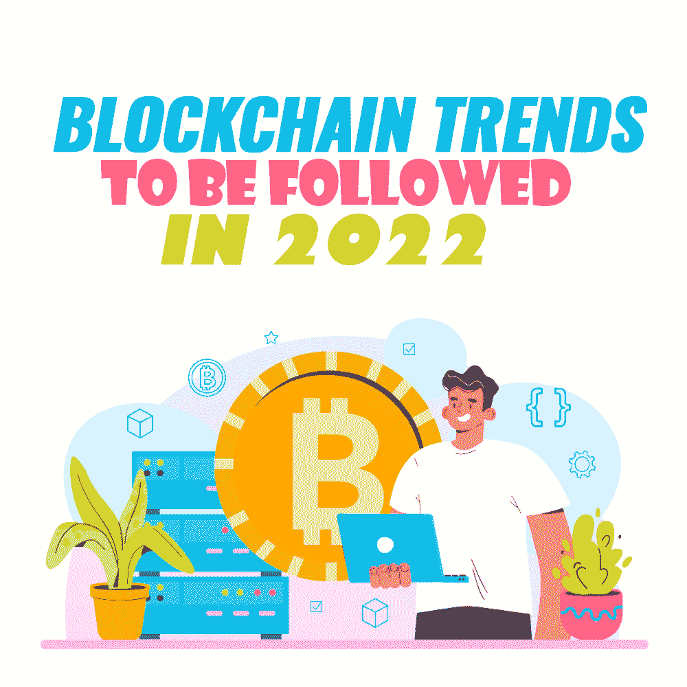

# 2022 年将遵循的区块链趋势

> 原文：<https://simpleprogrammer.com/blockchain-trends-2022/>

Blockchain, once only a daring experiment, has nowadays transformed into a revolutionary technology that is continuously evolving. As blockchain enhances the security, transparency, trust, and traceability of shared data, it has the potential to disrupt almost every industry.

这些行业包括金融、供应链、物流、汽车、医疗保健、零售和消费品以及政府。虽然我们大多数人都因为加密货币而知道区块链技术，但这只是它的一种实现方式。区块链可以提供更多的东西。

因此，在这篇文章中，我将向你提供区块链的基本知识，[区块链开发者做什么](https://simpleprogrammer.com/beginners-blockchain-programming/)，以及 2022 年区块链技术中值得关注的顶级趋势是什么。

## 什么是区块链技术？

[区块链](https://www.decipherzone.com/blog-detail/What-is-Blockchain-Technology---How-Does-it-Work-)是一种分布式、不可变的分类账，有助于商业网络中的交易记录和资产跟踪过程。几乎任何有价值的东西都可以使用区块链进行跟踪、记录和交易，因为它降低了相关的成本和风险。

术语“区块链”指的是由数据块组成的链。当新数据定期添加到网络中时，会创建一个新的数据块并添加到链中。这些新节点或数据块的创建方式是区块链被视为高度安全的原因。

你可能会问为什么。

好吧，大部分节点需要验证和确认新数据的有效性，然后才能将其添加到分类帐中。区块链的每笔交易都使用加密技术(一种使用加密代码保护信息和通信免受未经授权访问的方法)进行保护。

对于需要安全记录交易的时间戳和价值的行业来说，区块链是一项有价值的技术。除此之外，区块链还可以用于涉及跟踪不同方之间的数据移动的流程，例如在物流、贸易和供应链中。

[区块链](https://www.amazon.com/Mastering-Blockchain-distributed-consensus-cryptocurrencies/dp/1839213191)是传递信息的理想选择，它具有即时、透明、分布式和不可变的账本，只能由网络的授权用户访问。有了区块链网络，你可以跟踪生产、支付、订单、账户等等。

## 一个区块链开发者是做什么的？

负责使用区块链技术开发和优化区块链协议、架构、智能合同和 web 应用程序的开发人员是[区块链开发人员](https://simpleprogrammer.com/beginners-blockchain-programming/)。区块链开发者分为两类:

*   **核心银行开发人员**——他们负责[区块链架构](https://www.amazon.com/Architecture-Blockchain-Applications-Xiwei-Xu/dp/3030030342/)和协议开发。
*   **区块链软件开发商**——他们使用核心银行开发商开发的架构和协议来构建去中心化的应用。

简而言之，区块链开发人员负责设计协议，开发用于分散或集中数据的网络架构，开发后端和前端，以及开发和观察智能合同。

他们的目标是为具有挑战性的问题开发创造性的解决方案。作为[区块链的开发者](https://www.decipherzone.com/blockchain-development-company)，一个人还必须对运行在区块链技术上的软件进行设计、开发、复杂分析、测试和调试。

## 区块链技术的顶级趋势

Now that we have a basic understanding of blockchain, let’s move on to the important part: top trends in blockchain technology. Here is the list of the top trends of blockchain to be followed in 2022, so let’s get into it.

### ERC Tokens

ERC 或以太坊征求意见稿是由智能合约程序员使用以太坊平台编写的文档。ERC 文件提供了以太币必须遵守的规则。

ERC 是以太坊的应用级规范，如名称注册中心、令牌标准和库/包格式。ERC 标准概述了令牌类型所需的一组功能，允许智能合约和应用程序与令牌进行通信。

一些流行的 ERC 令牌是 ERC-20(标准可替换令牌)、ERC 721(标准不可替换令牌)、ERC 223(保护用户免受合同意外转移)、ERC 777(基于运营商的令牌标准)、ERC 1155(多令牌标准)和 ERC 1337(循环订阅标准)。

ERC 令牌已经成为区块链技术的一种趋势，因为它们为使用以太坊平台构建的应用程序和智能合同提供了预先编写的标准化。它们简化了开发人员的过程，因为他们不必自己编写这些标准。

### 以太坊

以太坊是一个基于区块链的平台，它是开源的、去中心化的。它用于创建开发分散式应用程序的替代协议，提供一组不同的折衷方案，这对大型分散式应用程序非常有用。

Etherium 的重点仍然是安全性、快速开发时间和不同应用程序之间的有效交互是必不可少的。

由于区块链有内置的自动机[编程语言](https://simpleprogrammer.com/top-8-blockchain-programming-languages/)，以太坊让任何人都能编写应用程序和智能合同。简单地说，以太坊允许开发者陈述转换的功能，并创建他们的交易格式和任意所有权规则。

以太坊由于其普遍性、简单性、灵活性、模块化、非歧视性和非审查性，已经成为区块链技术的一种趋势。

### WindowsNT 文件系统（NTFileSystem 的缩写）

NFT 或不可替换令牌是代表唯一项目所有权的令牌。不可替代是一个经济术语，描述的是由于其独特的属性而不能与其他产品互换的产品，如艺术品、歌曲文件或收藏品。因此，NFTs 使我们能够令牌化这些物品，并通过以太坊区块链提供安全性，同时一次允许一个官方所有者。

随着一切都变得数字化，越来越需要复制物理物品的属性，如唯一性、所有权证明和稀缺性。简单地说，数字资产的单个副本可以转换成 NFT，然后出售、购买或收藏。这里需要注意的一点是，NFTs 是不可复制的，顾名思义，NFT 需要是唯一的。

NFT 可以是任何东西，从 gif 到视频剪辑，从艺术作品到收藏品，从音乐会门票到社交媒体上的帖子。不用说，非功能性数字技术在区块链技术领域已经很受欢迎，因为它们正在改变我们对数字作品权利的看法。

### 区块链即服务(BaaS)

区块链即服务或 BaaS 是一种云服务，用于设计和执行智能合同和区块链技术中的分散应用程序。BaaS 是作为软件即服务模型构建的，其工作方式与此类似。

BaaS 的出现意味着重大进步，是区块链版图上的一个重要里程碑，因为它将加速区块链技术在各行各业的采用。

简而言之，BaaS 指的是第三方基于云的基础设施，它将帮助开发人员轻松构建、操作和管理基于区块链的应用程序。BaaS 还促进了区块链平台的后端操作。BaaS 中的一些重要参与者包括微软、亚马逊、Paystand 和 R3。

### 稳定币

稳定币是不会波动的加密货币。它们与以太坊(ETH)有许多共同之处，但与传统货币类似，具有稳定的价值。稳定货币旨在作为法定货币或加密货币挂钩，或者作为交易所交易的商品。

Stablecoins 是法定货币和加密货币的混合体，兼具真实资产和数字资产的优势。稳定的硬币价值与欧元、卢比或美元等传统货币的比率为 1:1。

除此之外，稳定的货币也可以得到石油、金属或黄金等商品的支持。随着稳定密码的持续增长，并且不像其他密码那样频繁崩溃，它们将成为区块链空间的流行趋势。

### 分散融资

分散金融(DeFi)是传统金融系统(如交易所和银行)通过加密货币的开放替代方案。DeFi 是一个在区块链公共分散网络上提供金融产品的系统。

特别是，DeFi 指的是一种系统，其中区块链软件使卖方、贷方、买方和借方能够进行对等通信或与严格基于软件的中间人通信，而不是与促进这些交易的机构或公司通信。

凭借在保险、贷款和货币兑换方面超越银行的潜力，DeFi 平台已成为区块链行业的一种趋势。DeFi 受欢迎的另一个原因是它为用户提供了相互交流的能力，而不需要中间人来要求他们的份额。

### 中央银行数字货币(CBDC)

中央银行数字货币或 CBDC 是为特定地区或国家设计的虚拟法定货币格式。它是官方货币的数字代币，由区块链发行，但由货币当局监管。例如，在印度，政府提出了一项创立数字货币的法案，而尼日利亚中央银行则提议在 Hyperledger Fabric 区块链上开展 CBDC 试点。

泰国、英国、中国、瑞典、加拿大和乌拉圭等其他国家也在尝试 CBDC 的概念，使 CBDC 成为区块链市场的一个重要趋势。

### 可验证凭证

A verifiable credential is a part of the information that a third party can validate digitally. A VC can represent the same information as a physical credential.

某人的身份信息存储在公共区块链上，并且可以通过密钥安全地与期望的人共享以访问该信息。可验证的凭证可能包括与标识主题、颁发机构、凭证类型、凭证约束等相关的信息。

随着数字签名等技术的加入，VC 变得比其物理等效物更加防篡改和可靠。它允许用户共享他们的可验证凭证，而不放弃他们的隐私。有了 VC，任何公司或机构都不能集中存储或控制信息，因为用户可以随时撤销凭据，这使它成为区块链行业的一个重要趋势。

### 自我主权认同

自我主权身份或 SSI 是以分散方式维护的数字身份。在 SSI 中，身份的公共标识符存储在区块链中，并由不同的独立服务器操作，以保护个人免受篡改。

SSI 允许用户自行管理数字身份，而无需依赖第三方提供商。使用 SSI，用户可以通过向其他方提供凭证来轻松地建立交互中的信任，然后其他方可以验证凭证是否来自受信任的颁发者。

### 混合区块链

混合区块链是私人和公共区块链提供的好处的融合。使用混合区块链，可以使用公共区块链使公众可以访问分类帐，并在后台运行私有区块链来控制对分类帐的修改。

混合区块链有助于利用智能合同、可审计性和更好的性能，同时提供交易以增强可验证性和透明度。混合区块链的成员可以决定谁可以参与区块链或者公开哪些交易。

## 区块链是未来

看看区块链的这些主要趋势，你很容易猜到即将到来的 2022 年将是各行各业采用区块链的重要时期。

作为一名开发人员，了解区块链技术的这些趋势并为变化做好准备变得非常重要。此外，了解这些趋势也将有利于促进您作为区块链开发人员的职业生涯。