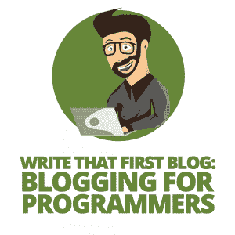
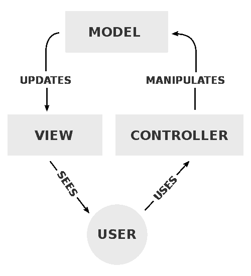

# 写第一篇博客:程序员博客

> 原文：<https://simpleprogrammer.com/blogging-for-programmers/>




Lately, I've been getting a lot of questions from friends and co-workers on how to write their first technical blog.

我的建议？就写吧。

不过，这对我来说很容易，因为我已经写了[篇获奖文章](https://www.codeproject.com/script/Articles/MemberArticles.aspx?amid=7605910)，甚至[一本出版的书](http://www.amazon.com/exec/obidos/ASIN/B01N3C5ECP/makithecompsi-20)。我也有点领先，因为我不是真正的开发人员，而是受过教育的记者(我大学毕业后才进入软件开发)。

不过，事情是这样的。我也必须写我的第一篇文章。你可能会说你没有受过写文章的教育，但是我没有受过写软件的教育，然而我在这里！

如果我现在读我的第一篇文章，关于 Visual Basic 中的 try-catch-finally。Net，我忍不住嘲笑它的简单。我做了大约四个月的编程，我的雇主决定让一些同事和我需要一些培训，于是有人过来教我们一些基本的。NET，try-catch-finally 块就是其中之一。

所以我决定我需要实践这个新获得的知识，并真正进入它。因为我已经阅读了很多关于 CodeProject 的文章，所以我决定写一篇文章试试运气。这篇文章虽然很简单，却很受欢迎。

所以我听你说，我终于学会了我写的主题，而你仍然没有学会如何写文章。先说我的第二篇。

你可能想读，但你不能。没人能。很糟糕。糟糕的是它没有被 CodeProject 接受，我把它全部删除了。

然而，那篇文章仍然是我写过的最好的文章。显然，不是因为这篇文章太好了，而是因为没有一篇文章甚至一本书比这篇文章教会了我更多。这篇文章是关于一些面向对象编程(OOP)的概念，听起来可能很有趣，只是我不知道什么是面向对象编程。

不用说，文章得到了非常负面的反馈；不幸的是，互联网并不总是一个友好的地方。人们叫我白痴，告诉我不应该写文章。

但我没有因此而沮丧。

我咽下了我的骄傲，友好地感谢评论者的反馈，并询问他们是否可以指导我，以便我可以改进。最终，我学会了 OOP、 [SOLID](http://butunclebob.com/ArticleS.UncleBob.PrinciplesOfOod) 和设计模式。

它永远改变了我的生活。我的下一篇文章是关于编程中的反模式，它赢得了 CodeProject 的月度文章。

如果你想开始定期写文章，你首先需要了解文章中的重要内容，以及如何克服写作中的困难。

## 你文章中的重点是什么

我经常从想开始写博客的程序员那里得到的第一个问题是关于写作风格的。你如何与你的听众交流？

我的回答是:就我个人而言，我喜欢像在和读者对话一样写作。我使用像“我”、“你”和“我们”这样的词，希望它能吸引读者。

除此之外，我试图通过提问来吸引人们。听起来很难，对吧？其实不是。(看到我在那里做了什么吗？许多人喜欢我的写作风格，但也有人抱怨我的风格太不正式，让人难以理解。

我经常看到的另一种风格是通过使用“一”来避免使用“我”和“你”这样的词举个例子:他们写的不是“你应该实现一个接口”，而是“你应该实现一个接口”

我的第一想法总是，*是的*一个*当然应该这么做，但是*我*该怎么做呢？*就我个人而言，我不是“one”的粉丝，但如果你觉得使用它更舒服，不要让我拖你的后腿。你可能需要几篇文章才能找到自己的风格。在文章的最后，只有一件事很重要:**我的观众学到了什么吗？**

如果人们想读写得好的文学作品，他们不会去读技术博客，而是莎士比亚(或者任何他们感兴趣的东西)。当然，如果你的博客语法正确，如果你的风格符合读者的偏好，如果它的质量一般都很高，你的博客会读起来更好，但这都是相当主观的，通常不会破坏交易。

### 注意你的语言

这让我想到另一点:语言。许多想成为作家的人担心他们的英语水平不足以写文章。

首先，即使英语不是你的母语，也不意味着你写不出好文章。第二，你的文章的目标是教人，所以代码样本往往比语法更重要。我见过语法差的文章赢得比赛，因为它们在技术上有趣且准确。

不用说，你的文章需要有一定的可读性。如果你的语法和拼写不好，读者会很难读懂你的文章。为此，我推荐一个校对。

当你读到这篇文章的时候，至少有三个人已经读过了:一个校对者，他检查拼写、语法，以及是否一切都是简单的程序员风格；检查内容、流程和正确性的内容编辑器；可能是检查技术准确性的人(此处不适用)；还有我自己。

我最新的书， *[持续集成、交付和部署](http://www.amazon.com/exec/obidos/ASIN/B01N3C5ECP/makithecompsi-20)* ，被校对、编辑、再次校对、检查风格，然后由四个不同的人阅读技术准确性(我仍然在出版的版本中发现一个错别字)。

我告诉你另一个秘密:简单程序员安装了一个插件，叫做 Yoast，用于搜索引擎优化，检查我的文本是否可读。它检查每个句子或段落是否有太多的单词。它还跟踪标题和标题下的单词。似乎还有一些可读性指数(Flesch Reading Ease)等等。

即使是专业作家也需要一点帮助！

如果语言对你来说真的是个问题，我建议你找一个能帮你的人。或者用你的母语写作，如果这是一种选择的话。你的文章不会影响很多人，但至少你写了点东西。虽然我的大部分文章都是英文的，但我也写了一些荷兰语文章。

### 阐明你的观点

一幅画胜过千言万语，至少他们是这么说的。因为你只能用文字解释这么多，而且因为书面语言可能不是你最擅长的，所以一定要用图片。你可能在写代码——可能是一些很酷的技巧、设计模式、框架或库——而图像可以揭示更多关于它的信息。

假设你想让你的读者明白什么是模型-视图-控制器，或者 MVC，模式。你可以这样解释，“一个用户调用一个控制器，这个控制器创建一个传递给视图的模型，并把这个视图返回给调用者。”但是你的读者不会仅仅通过阅读来理解 MVC。所以添加一个像下面这样的图片:




*模型-视图-控制器模式的结构【来源:维基百科】。*

I'm pretty sure that image clears up a few things for the reader. Just the text didn't help much, but remember, just the image won't make a lot of sense either. Combining them can help get your point across.

指导性文章尤其可以从大量的图片中获益。指出图像上的复选框比描述在哪里可以找到复选框更容易。

但是要小心——并不是每篇文章都会大量使用图片。如果你关注的是代码样本，那么你的代码清晰、简洁，更重要的是解释清楚，这比拥有大量图片更重要。

如果您决定添加图片，请确保图片质量良好。以我的经验来看，没有图片比没有不可读或模糊的图片要好。

另外，确保你被授权使用这些图片。要么是你的，要么是你有权限使用图片并注明出处。

您可以使用免版税的图像。Wikimedia Commons 拥有大量免版税的图片，如果你遵守一定的出版规则，你可以使用这些图片。

此外，像 Thinkstock 或 T2 Shutterstock 这样的网站会向你出售他们的图像库订阅，如果你正在写一些文章并自行出版，这可能是一项不错的投资。

从谷歌图片搜索中保存的图片**不**可以未经许可发布。对此有很多误解。所以如果你从网上取一张图片，一定要检查一下是否可以使用，在什么条件下可以使用。

### 解释一切

这是我喜欢做的事情:解释我的代码所做的一切。这听起来像是一扇敞开的门，但实际上不是。

如果有什么事是不能指望读者知道的，我就提一下。例如，我正在谈论实体框架，我的示例显示了一个属性:

读者应该知道什么是属性，公共访问修饰符是什么意思。此外，泛型 ICollection 应该相当熟悉。

然而，读者*不*期望知道的是*为什么*我们需要 ICollection 而不是不太具体的 IEnumerable 或更具体的 IList，以及为什么它需要是虚拟的，所以我想解释一下。

另一个有趣的事实是，ICollection 的实现 Collection 并不是一个广泛使用的集合类型，因为它不在系统中。通用命名空间，但在系统中。Collections.ObjectModel 命名空间(由于某些名称与旧的 Visual Basic 集合类型冲突)。正因为如此，很少能看到 ICollection 接口。

我喜欢提到这样的细节，因为读者可能自己也想知道，这样可以省去读者查找的麻烦。如果我注意到一个这样的细节，但我找不到事情为什么会这样，我也会提到。

如果你没有注意到这些细节，你就不能写它们。这没什么大不了的，只是让你变得不那么彻底(这也没什么)。

### 这要看情况而定


As is often the case in software development, sometimes the most important aspect of your article is “it depends.”

你文章中重要的内容主要取决于你的读者。你的受众可能是青少年或成年人，男孩或女孩，但在我们的案例中，可能是受众的经验水平决定了你是否会更深入地解释代码，是否会添加更多图像，以及是否会扩展某些概念。

正如我所说的，你的读者可能是通过阅读你的博客来学习一些东西。也许你已经写了关于实体框架或 LINQ 的文章，而读者正试图更好地理解这个主题。如果你的帖子是一篇给初学者的文章，那么非常重要的是你要尽可能详细地解释，并且保持你的例子简单，在文章的结尾增加难度。

如果你的读者是有多年 LINQ 经验的高级开发人员，你真的不需要解释 lambdas 是如何工作的，或者 IEnumerable 和 IQueryable 之间的区别。

此外，如果你正在描述如何构建一个完整的系统，你可能没有时间或空间(或读者的注意力范围)来详细解释每件事。解释更大的图片(可能有一些图片和一些代码样本)就足够了。

### 代码示例

如果你正在写一篇关于一段代码的文章，可能比文章中任何东西都重要的是你的代码样本。

我为文章写代码和为工作写代码是不同的。在工作中，我假设我的代码会被知道自己在做什么的专业人士阅读。

当我写文章时，我希望我的读者是学生。例如:

会被写成:

后者不一定更好读；我甚至会说读书更糟糕。但是对于一篇文章中的一个特定代码示例来说，可能更容易理解。

除了易于理解之外，你的代码应该是格式良好的。虽然您的 IDE(如 Visual Studio)非常擅长格式化代码，但您的博客页面通常不是这样。博客通常为文本预留相对较小的宽度，因此较长的代码行将在中间被截断。根据您的 CSS，您的代码将超出页面的边界或在下一行继续。

有一些 WordPress 插件可以格式化你的代码。如果你为另一个网站编写代码，比如 Simple Programmer，它使用 [GitHub Gists](https://gist.github.com/) 作为代码样本，或者 CodeProject，语法高亮可能会启用，也可能不会启用，或者可能不是你所习惯的。

当你写一本书时，你的代码必须适合一页纸，并且是黑白打印的，所以最好保持代码行简短易读。例如:

```
var result = people
    .Where(x => x.Name.StartsWith("A"))
    .OrderBy(x => x.Name)
    .ToList();

```

而不是:

```
var result = people.Where(x => x.Name.StartsWith("A")).OrderBy(x => x.Name).ToList();

```

但是这里有一个更好的选择(到目前为止我已经用过了):

这是三段完全相同的代码，一段未格式化，一段格式化，一段使用第三方代码格式化程序格式化(GitHub 要点)。我猜您更喜欢 GitHub Gist 的可读性，尽管它与前面的示例代码完全相同。

## 写博客的艰难之处

只要你知道要写什么，写一篇博文并不是很难。对我来说，最难的部分总是想出一个主题，创建一个示例项目(如果适用)，并写下第一句和最后一句。

正如我说过的，我喜欢像对读者说话一样写作。第一句话就等同于走到一个完全陌生的人面前，不知从哪里冒出来，开始谈论编程……尴尬。同样，最后一句感觉像是说了什么，然后就走开了。

### 开场白


The topics and samples are up to you. I can help a little with the first and last sentence though. A good starter can be, “In this article, I want to discuss…” or, if you're doing a series, “In my last post, we talked about…[past topic]. In this post, I want to follow up with…[new topic].”

或者你可以从是什么让你写了一篇特定的文章开始。在这种情况下，有人问我作为一个程序员如何写博文，于是我决定写博文(重新看一下导语)。其他个人例子包括，“我目前正在为考试而学习……”和“一年多以前[……]我听了一次讲座……”

在介绍中，一定要提到为什么其他人也会想读它。如果我写这篇文章是为了准备考试，那么肯定其他人也可以从中学习。

也可以“刚开始。”我的第一篇文章以“错误处理是软件开发的一个重要部分”开始，另一篇文章以“错误处理是软件开发的一个重要部分”开始。NET Framework 提供了不同类型的集合…”这种方法的好处是，你的帖子将会是关于什么的，以及为什么任何人都应该从一开始就阅读它，这一点很清楚。

### 结束语

现在你已经说了你想说的一切。你*可以*突然停止这篇文章，但就个人而言，我喜欢回顾我们讨论过的内容，以及你可以做些什么来做得更好(主要是不断练习)。

你也可以宣布你下一篇文章的内容。此外，你可以说你很乐意回答评论中的问题。如果你在写这篇文章的时候发现了一些很酷的新东西，你可以说你也从这篇文章中学到了很多。

比如“嗯，就是这样！通过写下这些，我确实学到了很多。我很乐意回答评论中的任何问题。”这比突然停下来要友好一些。

### 你没写的句子

最后，但同样重要的是，你不要说的话很重要。如我所说，你想尽可能多的解释，但是深度不同。

如果你解释一段代码，并且在一个细节上花了 500 个字，那么用 20 个字来讨论另一个同样重要的细节会感觉很奇怪。同样，如果你在一个不重要的细节上花了 500 个字，这将是很奇怪的，也许只是简单地提一下就足够了。

你也有很多话可以说。对于我的博客帖子，我通常保持 2000 到 3000 字的范围。我计划讨论几个概念，比如说四个，所以每个概念大约有 500 个单词。也许我需要 400 个单词来表达一个概念，600 个单词来表达另一个概念，但是我不可能用 1000 个单词来表达一个概念。也许你想深入讨论那四个概念，然后再提另外两三个概念来推动读者进一步探索；这真的取决于你。

例如，我写了一篇关于 NoSQL 和 MongoDB 的博文。我花了大约三分之一在 NoSQL 上，三分之二在 MongoDB 上。我花了一段时间来安装 MongoDB，我提到您可以从命令行完成各种事情，但是在本文中，我将直接使用 C#代码。我们涵盖了 CRUD 的基础知识，但我也很快提到您可以插入完整的列表。

对于那篇文章，我决定这样写，这样刚够入门，但还不够精通。这是一种选择，但在你发现自己写得太多之前，你应该提前做出选择。

如果你正为此纠结，先写一份博文的提纲是个好主意。提纲就像一个私人的小目录，你可以按照你想讨论的顺序写下你想讨论的主题。

## 现在开始写作

现在就看你的了！创建一个博客，或者你已经有一个了，或者找一个你可以自己写文章的网站。

网上有很多资源可以开始使用。甚至还有一个关于简单程序员的免费课程，可以帮助你创建你的博客。所以你真的没有借口不写作！

一旦你开始写作，一定要[坚持下去](https://simpleprogrammer.com/dont-feel-like-writing-nothing-say/)！

我很乐意回答评论中的任何问题。

祝你好运！