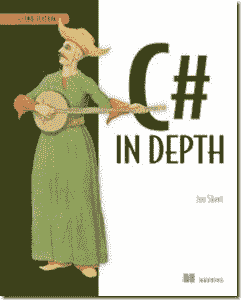

# 书评:C#深度第二版

> 原文:[https://simple programmer . com/book-review-c-in-depth-second-edition/](https://simpleprogrammer.com/book-review-c-in-depth-second-edition/)

最近很忙，所以我没有读太多书，但是我刚刚读完乔恩·斯基特的《T2》C #深度第二版。

这本书基本上涵盖了 C#语言自第一版以来发生变化的所有主要特性。

这是一本相当长的书，但它涵盖了一个相当大的主题，而且确实“深入”地涵盖了它。

我考虑过是否值得花时间读这本书，因为我已经很好地掌握了大部分 C#语言，但我很高兴我做到了。有许多非常详细的概念，乔恩做了很好的解释，使其他语言概念似乎简单得多。

这本书基本上是通过 C#的每个主要修订版的进步向前推进。Jon 做了一项出色的工作，不仅介绍了每一次语言修订的内容，还介绍了方法和原因。

至少对 C#语言有一定了解的开发人员将会从本书中获益匪浅，因为它有时会变得有点棘手和复杂。肯定也是一本给高级开发人员的书，他们肯定会学到一些他们不知道的语言知识。

如果你看过我的任何一门 [Pluralsight 课程](https://simpleprogrammer.com/pluralsight)，你就会知道我喜欢以一种非常非正式和对话的方式教学，乔恩·斯基特似乎也采用了这种方法，并使这本高度技术性的书可读性很强。

**好:**

*   非常优秀和详细的 C#语言特性。
*   出色的文字说明有助于简化一些复杂的主题，并使它们令人难忘。
*   脚踏实地的对话方式使阅读成为一种享受。
*   对 LINQ 的报道是惊人的。
*   这本书非常自然地建立在前面的例子和章节的基础上。
*   很明显，制作和策划这本书的过程中涉及了很多细节。今天很少见到。

**坏**

*   dynamics 和 DLR 的报道有点干巴巴的。这个主题非常复杂，我觉得这本书推出得有点太快了。
*   有时候我觉得乔恩在表达自己的观点时有点太客观了。我通常信任像 Jon Skeet 这样的有经验的开发人员的价值观和观点，所以我更希望他的观点在书中得到更坚定的表述。

**我学到了什么:**

首先，比我想象的要多得多。

C#语言有许多方面我认为我理解得相当好，但是从来没有拒绝过一个黑暗的小走廊。这本书让我转过那些走廊，面对那里的恶魔。

具体来说，我认为我了解 LINQ 供应商是如何工作的。我从未真正研究过这种语言，因为根据我对这种语言的了解，我有一个关于 LINQ 提供商如何工作的假设。我发现我的假设是错误的，现在我对 LINQ 有了更透彻的理解，以及这种语言的所有部分是如何结合在一起发挥作用的。

我也学到了很多关于动力学和 DLR 的知识。虽然有点痛苦，但我觉得这本书让我稍微重新考虑了一下我对动力学的立场，并考虑了静态类型 C#语言中它们可能有意义的一些地方。(在我看来，理解了动态如何工作，就把它们降低到了与任何基于反射的代码相同的水平。)

总的来说，我强烈推荐这本书。我对这本书仅有的两点否定不应阻止你去读它。初学者或中级 C#开发人员通过阅读这本书可以很容易地提高他们的技能水平和 C#知识，任何高级 C#开发人员也应该有很多东西可以从中学习。