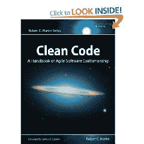

# 书评:干净的代码

> 原文：<https://simpleprogrammer.com/book-review-clean-code/>

我最近读完了[罗伯特·马丁](http://www.amazon.com/Robert-C.-Martin/e/B000APG87E/?_encoding=UTF8&camp=1789&creative=390957&linkCode=ur2&tag=makithecompsi-20)的书[《干净的代码】](http://www.amazon.com/gp/product/0132350882/ref=as_li_ss_tl?ie=UTF8&camp=1789&creative=390957&creativeASIN=0132350882&linkCode=as2&tag=makithecompsi-20)。我不得不说，这是一个门将。我强烈推荐得到这本书，并把这本书留给[你的图书馆](https://simpleprogrammer.com/2009/12/08/great-developers-are-librarians/)。

这本书非常符合[“代码完成”](http://www.amazon.com/gp/product/0735619670/ref=as_li_ss_tl?ie=UTF8&camp=1789&creative=390957&creativeASIN=0735619670&linkCode=as2&tag=makithecompsi-20)的精神，因为它在一个相当低的层次上谈论软件构建。这本书是从 Java 的角度来写的，但是很容易地，大部分思想超越了特定的语言。很少会碰到有可能完全改变一个人思考编写代码的方式的书。这是那些书中的一本。

这本书最棒的一点是让代码变得干净的实践方法。谈论如何让代码变得更好是一回事，但使用真实世界的代码并展示它是如何转化的又是另一回事。

**好:**

*   很好地解释了为什么干净的代码很重要。
*   关于选择好名字的详细信息。
*   关于函数大小和参数的优秀建议。
*   非常有说服力的一章，解释了为什么注释通常是不好的，而不是写代码来表达它的意图。
*   单元测试建议，如何保持测试干净。
*   关于并发问题和解决方案的精彩报道。
*   从真实项目中重构和清理代码的真实例子。
*   关于代码味道和启发的部分很不错。

**坏:**

老实说，这里没什么……唯一的东西是关于格式化的一章，我发现这并不重要，因为我们大多数人在 ide 中使用自动格式化规则。

**我学到了什么**

阅读这本书时，很难挑出所有“啊哈”时刻的小片段，但这里有几个特别让我印象深刻。我可能已经知道了其中的一些事情，但是阅读印刷本使它们变得更加清晰和具体。

方法应该尽量没有参数。参数越少越好。我已经知道了这一点，但是在这本书里，我很清楚为什么有一个参数比有两个参数好得多。

尽量不要重载采用不同参数的方法。当查看这里的一些代码示例时，我可以非常清楚地看到为什么拥有另一个方法比重载更好。

我在代码中过于依赖 getter 和 setter 方法。我了解到，我应该考虑一种不使用 getter 和 setter 方法的方法，让类来完成工作或在类内部移动参数。

我认为 Java Doc 或 NDoc 越多越好，但是在阅读了关于注释的部分之后，我意识到有这样严格的规则并不好。现在，我将只在 Java Doc 或 NDoc 实际提供信息的地方使用它们，而不仅仅是作为一条规则。

不要返回 null。这似乎是显而易见的，但我意识到，与其尝试和处理空参数，一个更好的策略是在代码中永远不返回 null，这样您就永远不必尝试和处理 null。

关于并发性的几点。从字节码的角度来看为什么会出现并发问题，这真的很有趣。我了解了一些我没有意识到的可能发生并发问题的地方，以及一些将并发问题放在单个类中并且不让它们泄漏到整个应用程序中的好技术。