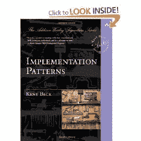

# 书评:实现模式

> 原文：<https://simpleprogrammer.com/book-review-implementation-patterns/>

我终于完成了[肯特·贝克](http://www.amazon.com/Kent-Beck/e/B000APC0EY/?_encoding=UTF8&camp=1789&creative=390957&linkCode=ur2&tag=makithecompsi-20)的[实现模式](http://www.amazon.com/gp/product/0321413091/ref=as_li_ss_tl?ie=UTF8&camp=1789&creative=390957&creativeASIN=0321413091&linkCode=as2&tag=makithecompsi-20)，老实说。我有点失望。让我先声明一下，我对这本书的评论并不反映我对 T4·肯特·贝克的看法。Kent Beck 是编程英雄。他率先采用测试驱动开发，发明了极限编程，是 JUnit 的创始人之一。也就是说，我会诚实地对待这本书。

这本书是关于软件和算法的低级构造。实现模式着眼于在创建最简单的设计时应用于编程的模式。

这本书涵盖了与类、状态、行为、方法和集合相关的模式。

**好:**

*   关于实现模式的精彩介绍
*   很好的参考，知道如何称呼你知道是对的，但不能解释的东西。
*   一节对于理解集合类型之间的权衡非常有用。

**坏:**

*   读起来不像一本书。它是每个主题上的一堆小片段，但它们并没有真正顺利地结合在一起。
*   我不同意一些模式，尤其是那些涉及到在不同的解决方案上使用继承的模式。([我不是具体继承的粉丝。](https://simpleprogrammer.com/2010/01/15/inheritance-is-inherently-evil/))
*   这本书感觉写起来并不有趣，就像是填满书页的劳动。
*   集合的处理可能属于不同的书。关于绩效评估的附录肯定会提到。这本书的大量内容都是这两个主题。
*   这本书的框架部分看起来有点奇怪，它没有足够有用的信息。

**我学到了什么:**

总有一些东西需要学习，我确实从这本书中学到了一个非常重要的概念。肯特在这本书的第三章谈到了价值观和原则。这个概念我无法用语言表达，但我知道它就在那里。Kent 非常清楚地描述了编程价值观和原则之间的区别，以及原则是如何建立在价值观之上的。通常，我很难接受在一个或多个原则之间做出权衡的必要性。他非常清楚地解决了这个问题，回到了最终做决定的价值观。

我知道了很多我正在做的事情的名字，但是不知道该怎么称呼它们。

我还学到了很多以前不知道的 Java 集合。在编写代码以确定性能时，我发现了一些好的注意事项，在阅读本书之前，我可能不会考虑这些。