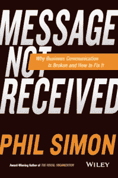

# 书评:菲尔·西蒙没有收到消息

> 原文:[https://simple programmer . com/book-review-message-not-received-Phil-Simon/](https://simpleprogrammer.com/book-review-message-not-received-phil-simon/)

几周前，我给菲尔·西蒙发了一封电子邮件，附上了我的电话号码，请他给我打电话，讨论图书公关事宜。

  

Phil Simon 是一位广受欢迎的演讲者，也是技术、趋势、沟通和管理领域公认的权威。

我认为电子邮件不是这次讨论的最佳沟通方式——我说得再正确不过了。

我一点也不知道，作者菲尔·西蒙(哦，我差点用了“技术专家”这个词)会感谢我为我想要讨论的内容选择了最直接、最恰当的交流方式。

事实上，他写了一本关于这个主题的书，“未收到[信息:为什么商业交流中断，如何修复](http://www.amazon.com/gp/product/1119017033/ref=as_li_tl?ie=UTF8&camp=1789&creative=390957&creativeASIN=1119017033&linkCode=as2&tag=makithecompsi-20&linkId=4WXJOXWU3FATQU7B)”

当我第一次见到某人时，我通常能从谈话一开始就判断出他们是否读过戴尔·卡内基的经典著作《如何赢得朋友并影响他人》

我不必读菲尔的书，他提到戴尔的杰作，就知道他已经读过了。

菲尔是那种很难不让人喜欢的人。

一旦菲尔听说了我的书《软技能》，他立即提供了一些明智的建议，并自愿帮我宣传这本书，在他的网站上发布了一篇评论。

菲尔不仅兑现了他的承诺——这在今天很少见——而且，他在赫芬顿邮报上发布了关于我的书的问答！

谢谢菲尔。

## 书上写着“消息未收到”

在讨论这本书本身之前，我想在我与菲尔本人的短暂交往中给你一点背景知识，因为我认为**菲尔的个性和帮助人们的真实愿望**充分说明了他的书。

我最初打算给“[消息未收到](http://www.amazon.com/gp/product/1119017033/ref=as_li_tl?ie=UTF8&camp=1789&creative=390957&creativeASIN=1119017033&linkCode=as2&tag=makithecompsi-20&linkId=4WXJOXWU3FATQU7B)”一个快速扫描，但这是不可能的。当我开始阅读时，我就被吸引住了，从精彩的序言开始，菲尔用几个有趣的故事展示了美国大部分公司以及我们今天所有生活中普遍存在的问题:沟通失败。

菲尔继续展示了具体的例子和研究，这些例子和研究显示了困扰我们的沟通问题是多么的重要和普遍。

技术行话和流行语已经渗透到我们生活的各个领域, Phil 的个人使命是阻止这种扩散，因为为你的听众量身定制的简单明了的语言就足够了。

当我通读这本书时，**我发现自己犯了使用诸如“低垂的果实”、“杠杆作用”、“协同作用”、**等词和短语的错误——事实上，当我写这本书时，我必须有意识地努力避免晦涩的术语，而是专注于简单的语言。

但是，菲尔在“ [Message Not Received](http://www.amazon.com/gp/product/1119017033/ref=as_li_tl?ie=UTF8&camp=1789&creative=390957&creativeASIN=1119017033&linkCode=as2&tag=makithecompsi-20&linkId=4WXJOXWU3FATQU7B) ”中传达的信息不仅仅是首席执行官们需要停止使用流行词汇，用简单的英语说出他们的意思，他还深入探讨了技术和新的通信形式在多大程度上淹没了我们的数据，以及我们可以做些什么来处理这些数据，而不是继续成为问题的一部分。

菲尔清楚地理解普通美国工人的困境，他们试图破译来自老板和同事的神秘通信，同时试图保持工作和生活的某种平衡，而他们实际上是一天 24 小时随叫随到。

毫无疑问，我们生活的世界比以往任何时候都更加紧密相连，菲尔正试图通过学习如何有效处理电子邮件、发送清晰的信息以及选择适当的沟通渠道来帮助我们理清头绪。

“信息未收到”充满了沟通出错的恐怖故事，但也有如何正确沟通的例子和建议。

老实说，任何曾经读过他们老板写的带有“范式转变”字样的电子邮件的人，或者自己写了这些话的人，都应该**读读这本书**。

*(只是想让你知道，在写这篇评论的时候，这本书还没有正式出版，但是你仍然可以在亚马逊上预订一本。)*