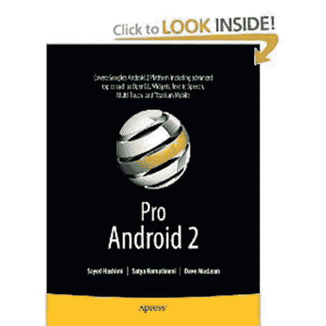

# 书评:Pro Android 2

> 原文：<https://simpleprogrammer.com/book-review-pro-android-2/>

最近看完了 [Pro Android 2](http://www.amazon.com/gp/product/1430226595/ref=as_li_ss_tl?ie=UTF8&camp=1789&creative=390957&creativeASIN=1430226595&linkCode=as2&tag=makithecompsi-20) 。这是一本相当大的书，所以花了我一些时间，但我终于看完了。我没有真正读过任何其他 Android 书籍，所以我不知道它如何比较。

这本书介绍了如何使用 Eclipse 创建一个 Android 应用程序。它包含许多非常完整的源代码示例。这本书似乎更侧重于 API 的入门而非深入。

**好事:**

*   无需浪费太多时间，立即投入 Android 开发。
*   非常完整的例子，可以让你去，并可以修改为自己的应用。
*   很好地平衡了基本示例和更复杂的架构构造。有一个很好的例子组合，这些例子建立在基本概念的基础上，并展示了如何实现更多的 MVP 风格的开发。
*   涵盖了 Android 平台相当广泛的范围，这使得很容易知道到底有什么能力。

**坏消息:**

*   尽管这本书的开头非常有趣，内容丰富，但有些章节似乎拖拖拉拉。
*   整整一章都在讨论搜索。大多数应用程序都不需要使用搜索。
*   关于 3d 应用程序开发的整整一章。我觉得不应该写在书里。相当无聊，实际上非常可怕。我不认为我会为 Android 开发 3d 应用程序。

**我学到了什么:**

在阅读这本书之前，我已经开始构建我的 Android 应用程序，所以它对我来说并不是完全新的，但我确实从这本书中学到了一些东西。

我真的很惊讶看到 2D 动画是如此容易与安卓系统。这本书很好地解释了这个问题，并提供了例子。我觉得读完这本书后，我可以很容易地实现 2D 动画。

我了解了如何创建和使用内容提供商。Android 开发的这一方面有点棘手，但我觉得 Pro Android 2 在解释它和提供我能够使用的例子方面做得很好。

我还学会了创建一个主屏幕小部件。书中的例子非常好，提供了一个完整的可用实现，可以很容易地用作创建自己的实现的基础。

书快结束的时候，提到了[钛金属手机](http://www.appcelerator.com/)。Titanium Mobile 是一个基于 WebKit 的本地应用程序开发框架，允许开发人员编写面向多个平台的应用程序。它看起来真的很酷，我有点希望这是这本书的第一章，这样我就可以在深入实际的 Android 开发之前探索它。

总的来说，我肯定会推荐这本书。我很有信心，没有 Android 经验的人应该能够拿起那本书，开始使用他们的第一个应用程序。在我读这本书之前，我确实学到了一些东西。