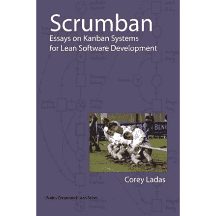

# 书评:Scrumban

> 原文：<https://simpleprogrammer.com/book-review-scrumban/>

我刚刚读完[科里·拉达斯](http://www.amazon.com/s/?_encoding=UTF8&camp=1789&creative=390957&field-author=Corey%20Ladas&linkCode=ur2&search-alias=books&sort=relevancerank&tag=makithecompsi-20)的《 [Scrumban](http://www.amazon.com/gp/product/0578002140/ref=as_li_ss_tl?ie=UTF8&camp=1789&creative=390957&creativeASIN=0578002140&linkCode=as2&tag=makithecompsi-20) 》。

这本书是自己出版的书，真的是散文集。在你读这本书之前做好准备，这样你就知道会发生什么。

这不是一本书告诉你如何准确地做看板或 Scrumban，但它给你关于看板和精益概念的想法，以及如何解决你在实施看板过程中可能面临的某些问题。

如果没有精益方法论的背景，这本书的某些部分可能有点难以理解，但是总体来说，大多数常见问题和解决方案都是可以理解的。这绝对是一本你在通读材料和查看图表时可以研究和思考的书。

**好:**

*   出色地使用了真实看板的图表和图片来说明要点。
*   许多常见看板问题的不同解决方案。
*   深入讨论不同解决方案背后的策略和原因。
*   对许多概念提出了一些独特的观点。

**坏:**

*   不太容易读懂。它有点粗糙，一些概念依赖于书本内容之外的知识。
*   有些假设有点宽泛，没有太多真实数据的支持。

**我学到了什么:**

这本书真的拓展了我对实施看板的不同方式的认识，以及一些常见问题的解决方案。有些解决方案让我很惊讶，但是很有道理。

我了解了更多关于限制 WIP 以迫使系统自我修正的理由。我没有考虑到严格限制 WIP 会迫使释放的资源自动移动来帮助解决管道中的阻塞，因为它们将不能接受新的工作。

Corey 展示了一个很棒的计划技术，当开发中的项目数量达到某个阈值时，他会召开一个即时计划会议。我以前听说过这种技术，但没有见过它的实际实现。

我肯定会推荐这本书来扩展你对看板软件开发的思考。如果你正在寻找关于如何建立看板流程的指导，这本书可能帮不了你，但是如果你想更多地了解看板的原因以及如何解决特定的问题或痛点，请阅读这本书。