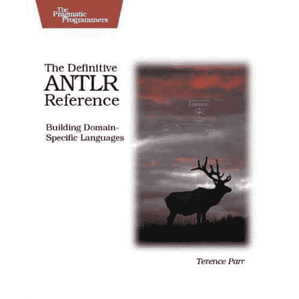

# 书评:权威的 Antlr 参考:构建特定领域语言

> 原文：<https://simpleprogrammer.com/book-review-the-definitive-antlr-reference-building-domain-specific-languages/>

花了我一段时间，但我终于读完了:[权威的 Antlr 参考:构建特定领域语言(实用程序员)](http://www.amazon.com/gp/product/0978739256/ref=as_li_ss_tl?ie=UTF8&camp=1789&creative=390957&creativeASIN=0978739256&linkCode=as2&tag=makithecompsi-20)

很难把评论 ANTLR 和评论这本书分开，这本书是 ANTLR 的作者， [Terence Parr](http://www.amazon.com/Terence-Parr/e/B001JS3O0U/?_encoding=UTF8&camp=1789&creative=390957&linkCode=ur2&tag=makithecompsi-20) 写的。ANTLR 是一个非常棒的工具，它让我大开眼界，让我看到了创建 DSL 来解决原本非常困难的问题的能力。我在 ANTLR 上查了很多资源，到目前为止这本书是最好的可用资源。如果你打算尝试学习使用 ANTLR [买这本书](http://www.amazon.com/gp/product/0978739256/ref=as_li_ss_tl?ie=UTF8&camp=1789&creative=390957&creativeASIN=0978739256&linkCode=as2&tag=makithecompsi-20)。

**好:**

*   前几章开始时非常简单易懂。
*   关于如何将 ANTLR 与真实代码和真实编程语言结合使用的非常好的例子。
*   对该工具的每个特性的出色介绍，以及为什么以这种方式构建它。
*   建立在语言解析概念的基础上，同时引入 ANTLR 特性。

**坏:**

*   在书的结尾变得有点复杂。一些例子和概念深入到复杂的语言解析中，尽管有一个警告。
*   缺少关于使用 ANTLR 的最佳实践的信息。(我很想看到专门讨论这个问题的一章。)

**我学到了什么:**

我不知道创建 DSL 会这么容易。语言解析真的没有那么难。考虑创建一个 DSL 是令人生畏的，但是使用正确的工具，这一点也不困难。

我学会了如何使用 ANTLR，并且我的大部分问题都得到了解答，这些问题是关于如何完成我在 ANTLR 中需要做的几乎所有事情。

有一个关于使用字符串模板的主题，让我意识到在创建一种语言时，不将代码生成硬编码到树解析中是多么有用。通过将代码生成分离到模板中，可以很容易地针对几种不同的语言。

我对通用语言解析和设计有了更好的理解，对抽象语法树(ASTs)也有了很好的理解，知道为什么要使用它们，以及如何有效地使用它们。我很好地理解了为什么需要一个多遍解析器来解析一门语言。

这本书会改变我看待很多问题的方式。读完这本书后，我对实现 DSL 来解决正确的问题很有信心。

我在过去实现过手写的语言解析器，但是在读了这本书之后，我再也不会那样做了，我强烈推荐你阅读这本书，并从总体上了解 DSL。这比你想象的要容易。