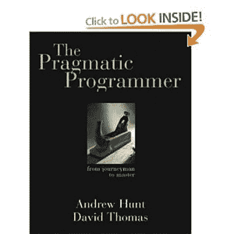

# 书评:务实的程序员

> 原文：<https://simpleprogrammer.com/book-review-the-pragmatic-programmer/>

我最近读完了 T2、安德鲁·亨特和戴维·托马斯的《实用程序员》。

我希望我能乘坐时间机器回到 2000 年，然后读它。

这本书里的许多信息似乎是许多软件开发人员理解的概念，并且现在理所当然地认为是常识，而在它写作的时候并不是这样。

这本书很大程度上是从多年编写代码的实践经验中获得的知识的集合。它非常具体地说明了应该执行哪种特定的编码实践，以及应该避免哪些编码实践。

这本书的内容介于像 [Code Complete](http://www.amazon.com/gp/product/0735619670/ref=as_li_ss_tl?ie=UTF8&camp=1789&creative=390957&creativeASIN=0735619670&linkCode=as2&tag=makithecompsi-20) 这样的书里的低级软件构造和以高级方法或项目管理为目标的书之间。

**好:**

*   多年的经验被装进一个小包装里。
*   这本书里的大多数建议都是永恒的。
*   实用的真实世界的真理，而不是理论上的空谈。
*   对所有可以自动化的东西都非常关注自动化。
*   技术独立建议。

**坏:**

*   肯定有一些过时的建议，我今天不会推荐遵循。
*   如果你已经熟悉了许多软件工艺或一般的敏捷原则，这本书的大部分内容会重复你已经知道的内容。(不能责怪作者，因为这本书可能是大部分信息泄露的来源，然而如果你没有读过这本书，你应该知道会发生什么。)

**我学到了什么:**

我非常喜欢这本书里关于在软件开发中使用“追踪子弹”的部分。基本上，这个想法是，你可以制作软件原型，或者构建你所知道的东西，然后调整你的目标以达到用户的真正需求，而不是试图预先指定。

我认为在开发过程中，很多时候我们都被所有的细节所困扰，但是有时我们需要先发射“曳光弹”来看看我们是否击中了目标。

我还意识到，我经常因巧合而编程。有时我会在代码中放入一个魔咒，但并不真正理解它为什么会起作用。重要的是要理解为什么某样东西会起作用，而不仅仅是让它起作用。