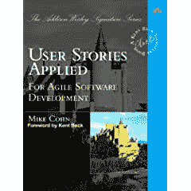

# 书评:应用的用户故事——迈克·科恩

> 原文:[https://simple programmer . com/book-review-user-stories-applied-Mike-Cohn/](https://simpleprogrammer.com/book-review-user-stories-applied-mike-cohn/)

我最近读了:[应用的用户故事:对于敏捷软件开发](http://www.amazon.com/gp/product/0321205685?ie=UTF8&tag=makithecompsi-20&linkCode=as2&camp=1789&creative=9325&creativeASIN=0321205685)

如果你能便宜地得到它，我推荐它。它确实有大量有用的信息，但也有很多无用的东西。

保持事情简单的本质是:

**好:**

*   好的用户故事的例子。
*   关于如何“搜寻”故事的好的过程想法。
*   为产品和评估开发用户故事的真实例子。

**坏:**

*   很多页都写满了相同的信息。
*   书末 10 页全空白。

**我学到了什么:**

我试图把所有完成的标准放入一个故事中，使它更像一个需求文档。这很糟糕。最好有一个小故事作为提醒，以便稍后与顾客交谈。那么,“完成标准”去了哪里？卡片背面，或最终融入故事，但在与顾客交谈之后，而不是在计划期间或计划之前。

我有三个问题需要客户回答，这样我才能完成一个故事:

1.  你想改变系统当前正在做什么？(如果这个故事的特征完全缺失，这是一个有效的答案)
2.  进行更改后，您希望系统做什么？
3.  你现在如何证明它还没有完成？

读完这本书后，我知道这些问题可以在计划后推迟，它们不一定要出现在故事中，但仍然需要有人能够回答它们。