# 2016 年看的所有书

> 原文：<https://simpleprogrammer.com/books-i-read-in-2016/>

又到了我浏览今年我读过所有书的时候了，给你一个简短的评论。

今年，我读了多达 72 本书！

是的，这很疯狂，我知道。

当我自己整理清单，发现有那么多书的时候，我有点震惊——特别是因为我不止一次地阅读了其中的一些。

这就是为什么我决定写这篇博客来列出我过去一年读过的所有书籍。别担心…如果你不喜欢阅读，也没关系。我还录制了一个视频，里面的书和你在这份清单上看到的一样:

[https://www.youtube.com/embed/haSer5FAy_s?list=PLjwWT1Xy3c4XPMBDfK_VvrCBbMa5G0Uyx](https://www.youtube.com/embed/haSer5FAy_s?list=PLjwWT1Xy3c4XPMBDfK_VvrCBbMa5G0Uyx)

## 你可能会问，我是怎么做到的？

或者你只是不相信我。

可以理解——有很多书。

不，我没有“快速阅读”它们或者只是略读。

不，我没有读所有这些书的摘要——我真的读了。

嗯，听了他们——至少是他们中的许多人。

今年，我开始每周跑 40 多英里。

是的，我知道这也很疯狂，但我就是这样“阅读”这些书的。

我用我的 Audible.com 账户来听这些书的音频版本，速度大多是 3 倍。(3 倍的速度对你来说似乎难以理解，但如果你慢慢增加速度，你就可以达到 3 倍的速度，你可以完全专注——这就是跑步如此有效的原因)。

[如果你还没有注册 Audible.com，现在就注册吧](https://www.amazon.com/exec/obidos/ASIN/B00NB86OYE/makithecompsi-20)——说真的，这将是你一生中做出的最好的决定之一。

每当我走路或开车的时候，我也会听看书。

当然，我几乎每天晚上都用 Kindle 阅读书籍。

今年我确实发现，尝试在举重时听有声读物对我来说不太好，因为太难集中注意力，所以我花时间听播客。

(如果你正在寻找一些好的编程播客，请查看[我的软件开发播客终极列表](https://simpleprogrammer.com/2016/10/29/ultimate-list-developer-podcasts/)。)

往年和其他资源

*   [2014 年看的所有书](https://simpleprogrammer.com/2014/12/08/books-read-year/)
*   [2015 年看的所有书](https://simpleprogrammer.com/2016/01/01/all-the-books-i-read-in-2015/)
*   [我的书评](https://www.youtube.com/playlist?list=PLjwWT1Xy3c4W7aRN5cCCZ90AIDYoLpqVa)
*   [我最喜欢的 10 本书](https://www.youtube.com/watch?v=h3O-RnOh-V8&list=PLjwWT1Xy3c4W7aRN5cCCZ90AIDYoLpqVa&index=2)
*   [编程书籍终极清单](https://simpleprogrammer.com/2015/03/23/the-ultimate-list-of-programming-books/)
*   [编程书评](https://www.youtube.com/playlist?list=PLjwWT1Xy3c4XoA9VdooMPPiDFsckl1d_2)

此外，你可能会注意到一些主题，比如我今年读过的一些与男子气概有关的书。

我痴迷于某些主题，并做了大量的研究，不时地阅读我能找到的关于这个主题的每本书。

今年，我收到了几个 YouTube 用户提出的关于女性问题的问题，所以我做了一些调查——今年有这么多“奇怪”的书。

好了，不多说了，这些书是按主题排列的:

*   [小说](#fiction)
*   [男子气概](#masculinity)
*   [习惯&个人发展](#habits)
*   [权力，谈判&劝说](#persuasion)
*   [商业&创业](#business)
*   [其他一切(大多是知识密集型书籍)](#everything)

尽情享受吧！

### 小说

**[1) *魔术师的侄子*](https://simpleprogrammer.com/magiciannephew)T5】**

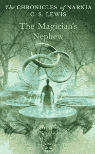

我刚刚给我 5 岁的女儿读完这篇文章——试着和她一起重温经典。这本书是纳尼亚传奇系列的第一部。很棒的东西。

**[2) *狮子女巫与魔衣橱*](https://simpleprogrammer.com/lionnarnia)T5】**

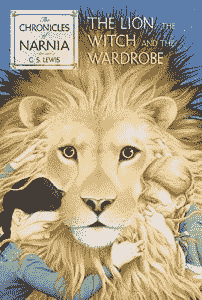

同样出自《纳尼亚传奇》。这本书无需介绍——它是这个系列中最容易辨认的书。从旧的*纳尼亚*动画片中带回一些美好的童年记忆。

**[3) *雪灾*](https://simpleprogrammer.com/snowcrash)T5】**

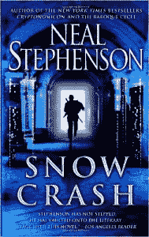

这应该是程序员最好的小说之一，但是我不太喜欢。我通常不写小说，所以这有点令人失望。

**[4) *安德的游戏*](https://simpleprogrammer.com/endersgame)T5】**

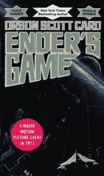

我从未看过这部电影(可能永远也不会看)，但我认为这是一本相当好的书！很好玩。我喜欢结尾。我可能会读完这个系列的其余部分，但总的来说，这对我来说是一部好小说。

**[5) *平地*](https://simpleprogrammer.com/flatlandbook)T5】**

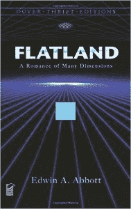

这很有趣。它混合了一点宗教和政治，但它的主题是你不能理解你不能感知的东西。它扭曲你的思维，从二维跳到三维、四维和五维。*平地*目前处于公有领域。

**[6) *上帝的碎片*](https://simpleprogrammer.com/godsdebris)T5】**

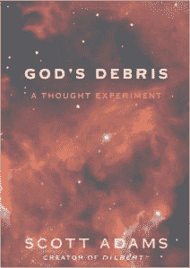

伙计，这真是本好书。它是由斯科特·亚当斯(即呆伯特家伙)写的。这个会让你大吃一惊。这很有趣，但在这个过程中会扭曲你的思想。这本书是关于一个与上帝交谈的人。这本来是一个思想实验，但它远不止于此。

### 男性

**[7) *如何做一个 3%的男人*](https://simpleprogrammer.com/howtobe3man)**

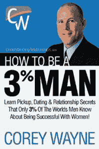

这本书讲述了如何成为吸引女性的男人，大部分材料来自各种渠道。这里有些好东西，但有些故事似乎不太可信。如果我要对此给出一些建议，我会说跳过这本书，直接看资料来源。

**[8) *理智男*](https://simpleprogrammer.com/rationalmale)T5】**

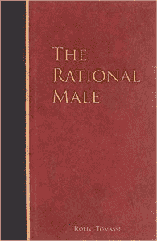

一本所有男人都应该读的书。它深入研究了现代男性今天面临的情况，特别是关于男子气概和红色药丸心理学。女性可能也会觉得这是一本好书。

**[9)](https://simpleprogrammer.com/thekingwithin)***内王*

**

**

*

我读的另一本书，主题是男子气概。荣格心理学中有四个原型:国王、战士、魔术师和情人。这本书探讨了国王的原型。这有点难懂，一定要注意。如果你正在探索男性气质和女性气质，我建议你去看看荣格心理学。

**[10) *游戏*](https://simpleprogrammer.com/thegame)T5】**

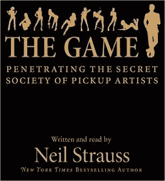

这是一本关于泡妞高手的经典书籍。这不是一本为那些寻找技巧和诀窍列表的人而写的书。相反，它探索了泡妞艺术家的社区、文化和心理，并让你感受到为什么这个社区已经远离了整个“技巧和诀窍”的方法。对于仍在约会游戏中寻找捷径的男人，我建议你读读这篇文章，找出为什么这种方法不再奏效。

**[11) *铁血约翰*](https://simpleprogrammer.com/ironjohn)T5】**

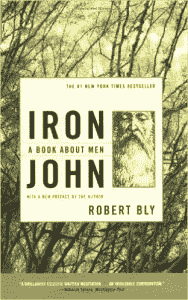

一本关于人类神话的好书。有点像坎贝尔·约瑟夫的书。它讲述了人的故事，以及它如何与男子气概、年龄的到来以及一个人在社会中成为真正的男人的过程相关联。

**[12) *大猩猩心态*](https://www.amazon.co.uk/Gorilla-Mindset-Control-Thoughts-Emotions-ebook/dp/B0100Q4S7E)T5】**

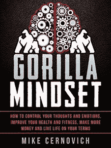

这是一本由迈克·塞尔诺维奇写的短篇小说。有着良好心态的聪明人。这本书相当基础——更像是给男性的入门书。但是如果你看一下他的博客文章，你会发现更深入的材料。

**[13) *男人之道*](https://simpleprogrammer.com/thewayofmen)T5】**

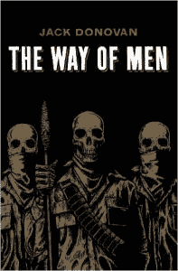

另一本所有人都应该读的书。它讲述了作为一个男人意味着什么，以及作为一个男人意味着什么。这是一种非常独特的阅读方式——你在外面找不到很多这样的书。

**[14) *配偶*](https://simpleprogrammer.com/matewomenwant)T5】**

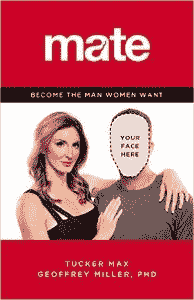

这很有趣。这是一个家伙写的，他之前宣扬做混蛋的好处来吸引女人。这本书就像他的“来到耶稣面前”的转变，相反，他把友善作为一种策略。我称之为扯淡——感觉他在试图改变自己的形象，而不是提供实际的建议。

**[15) *女人想要什么？*](https://simpleprogrammer.com/whatdowomenwant)**

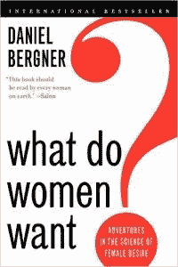

这有点吓人。我不是 100%同意里面的所有内容，但这是一本所有男人都应该看一看的书。如果有的话，它会让你更深入地思考问题。

**[16) *再也没有好好先生*](https://simpleprogrammer.com/NoMoreMrNiceGuy)**

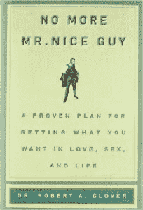

对于不想再做好人的人来说，这是一个很好的介绍。做好人真的不是你想做的(这并不意味着你应该是个混蛋)。这本书讲述了一个人从善良到自信的男性角色的故事。

**[17) *高人之道*](https://simpleprogrammer.com/waysuperiormancd)**

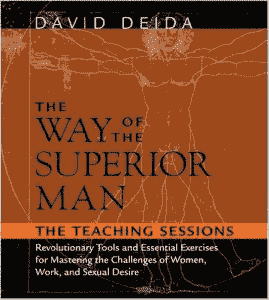

公平的警告:音频和书面版本是不同的。我听了音频版本——来自一个研讨会。我推荐 Kindle 版本，虽然这个也不错。

**[18) *成为野蛮人*](https://simpleprogrammer.com/becomingabarbarian)**

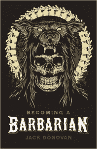

如果你对政治正确性有疑问，你会喜欢这本书的。这是关于男子气概，但更多的是关于如何作为一个男人发挥作用，而不是被政治正确的文化所吸引。

**[19) *理性男性——预防医学*](https://simpleprogrammer.com/rationalmalepreventive)**

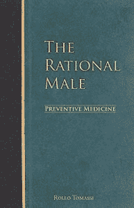

这是*理性男*的后续。我不太喜欢这个。这仍然是一本好书，但与第一部相比并不具有开创性。

**[20) *成长:男性情商指南*](https://simpleprogrammer.com/growupbook)**

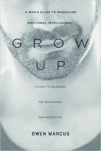

这很有趣。有点太轻了——没那么重。感觉是阳刚之气和东方哲学的融合。肯定有一些关于建立自己的好东西，但有点淡化了。

**[21) *国王、战士、魔术师、情人:重新发现成熟男性的原型*](https://simpleprogrammer.com/kingwarrior)**

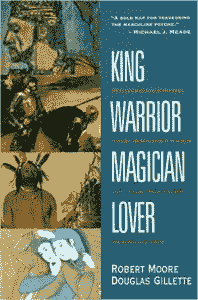

更多的荣格哲学。我认为这是理解男子气概的好模式，也是男女皆宜的好读物。

**[22) *优越男人之道:掌握女性、工作、性欲挑战的精神指南*](https://simpleprogrammer.com/thewayofthesuperiormanbook)**

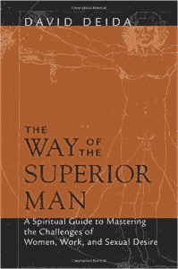

这是名单上第 58 号的书面版本。第一章本身就很棒，讨论了生活中的事情永远不会‘完成’，所以你只需要过好生活，继续前进。很多人会讨厌这本书，但我会推荐它——这里有一些好东西。

### 习惯和个人发展

**[23) *界限*](https://simpleprogrammer.com/boundariesbook)T5】**

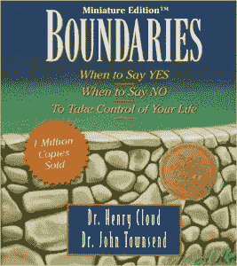

我喜欢这个。它深入研究了一点基督教神学，但不要让它吓跑了你。这本书讲的是个人界限，把期望/义务放在别人身上，反过来，接受别人的期望/义务。我想很多人都在为此挣扎，尤其是和家人。我强烈推荐这个。

[**24) *能源巴士***T5】](http://a.co/ciHakvF)

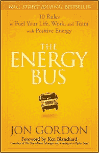

送给消极的人的好礼物！这本书给出了一些坚实的人生哲学，所有这些都以故事的形式编织在一起。

**[25) *用封印住*](https://simpleprogrammer.com/livingseal)T5】**

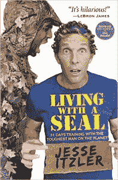

这本书狠狠地踢了我的屁股，一周后我跑了一个全程马拉松。这是一个有点时间顺序的故事，讲述了一个家伙(如标题所示)和一个海军海豹突击队一起生活，并训练他 30 天。相当鼓舞人心的一击。

**[26) *触发*](https://simpleprogrammer.com/triggersbehaviorbook)T5】**

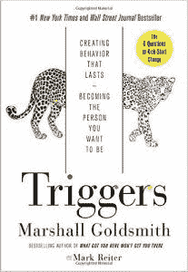

这本书是关于改变你的习惯和行为。我从中得到的主要收获是，你的环境对你的行为和“触发器”产生了巨大的影响。相当不错的一本书——它解释了你为什么这样做，以及如何停止这样做。

**[27) *极度所有权*](https://simpleprogrammer.com/extremeownership)T5】**

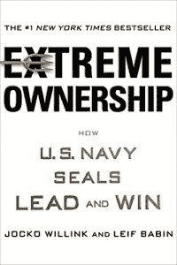

我对此有复杂的想法。从海军海豹突击队队员的角度来看，极端所有权是关于领导和所有权的。我希望他们会提供一个更“战术”的观点，但我仍然欣赏里面的概念和故事。

**[28) *复合效果*](https://simpleprogrammer.com/compoundeffect)T5】**

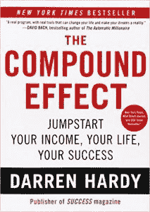

要点:事情越来越多。他们可能看起来没做什么，但是随着时间的推移，你所有的日常习惯都会累积起来。一些人向我推荐这个，因为他们认为这很像我的生活策略。看完之后，我可以确认:是的，我的人生策略就是复合效应。

**[29) *野心的力量*](https://simpleprogrammer.com/powerofambition)T5】**

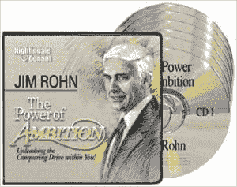

这其实是一个音频节目。这本书有点长，但它深入探讨了一些好的细节，并贯穿了我认为值得理解的个人发展和自助领域。会推荐。

**[30) *如何在几乎所有事情都失败的情况下仍然大获全胜*](https://simpleprogrammer.com/failwinbig)**

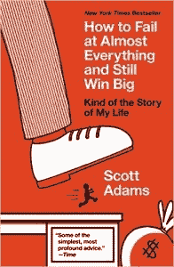

另一本斯科特·亚当斯的书。他构建生活的方式在某种程度上反映了我的生活方式——真不敢相信我没有早点发现他。这是一本很好的书，讲述了人生哲学，以及如何建立系统让你成功。

**[31) *和平之道*](https://simpleprogrammer.com/peacefulwarrior)T5】**

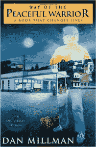

很多人向我推荐这个。这是一本有趣的读物——它用一个故事来讲述一种哲学。它也有一个好的结局。

**[32) *惊雷*](https://simpleprogrammer.com/gritbook)T5】**

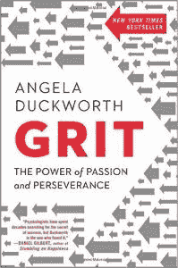

我原以为这实际上是一本关于“勇气”的书，但事实证明这更像是一本心理学科普书。在最后几章中，作者偏离了研究，更多地依靠自己的直觉。我发现这些零件更有价值。总的来说，我对这个印象不太好。

**[33) *争取个人成就的行动策略*](https://simpleprogrammer.com/actionstrategies)**

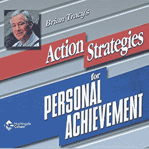

非常全面，但是如果你读过*最大成就*(出自同一作者)，你可能不会从中获得太多。

**[34) *深功*](https://simpleprogrammer.com/deepworkbook)**

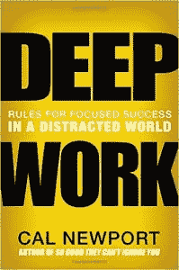

我期待这本书有一段时间了，但当它最终出版时，我有点失望。如果我没有实践其中的大部分建议，我会发现它更有用。它也没有像我希望的那样深入。我想其他人可能仍然会觉得这是一本好书。

**[35) *自己选择*](https://simpleprogrammer.com/chooseyourself)**

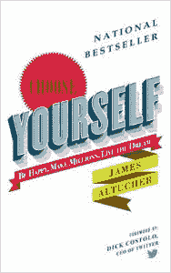

詹姆斯阿尔图切是一个可怕的家伙，我喜欢这本书。这其中蕴含着巨大的智慧。

**[36) *更聪明更快更好*](https://simpleprogrammer.com/smarterfasterbetter)T5】**

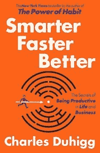

这是写了《习惯的力量》的同一个人写的。这不太好——他把它与自己的成功扯得太远了。这里面有一些好的心理学，但总的来说，它并没有很好地打动我。

**[37) *封印之道*](https://simpleprogrammer.com/wayoftheseal)T5】**

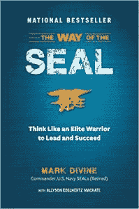

马克·迪万，海军海豹突击队本人。谈了很多关于心态的问题，虽然我不完全同意。我也不会说这是一本必读的书，但是如果你对那种东西感兴趣，你会在里面找到一些有价值的东西。

**[38) *成功的精髓*](https://simpleprogrammer.com/essenceofsuccess)**

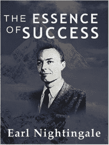

一个经典的自我发展计划。很好的信息和很好的人生哲学。

**[39) *自我是敌人*](https://simpleprogrammer.com/egoistheenemybook)**

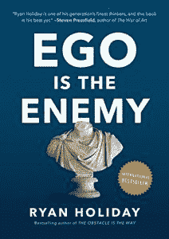

很多人喜欢这本书，但我不太喜欢。我觉得这更像是对作者的自负和他所犯的错误的道歉，但并不广泛适用。别搞错了，这本书里有一些很棒的教训，我也是作者的超级粉丝，但是感觉好像少了点什么。

**[40) *无限力量:个人成就的新科学*](https://simpleprogrammer.com/unlimitedpower)**

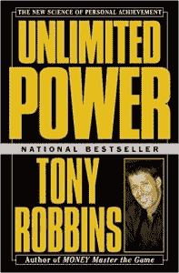

托尼·罗宾斯的一本书。没有他的另一本书《唤醒内心的巨人》强，但仍然是一本好书，尤其是如果你是他的粉丝。说到这里，如果你只打算读一本托尼·罗宾斯的书，我建议读《T2 唤醒 T3 内的巨人》。

**[41) *毫不在乎的微妙艺术*](https://simpleprogrammer.com/subtleart)**

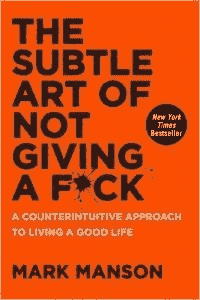

作者是马克·曼森，我认为他是一个非常好的人。他的博客很棒，有一些好东西，但这本书没有达到我的目标。这感觉就像过量的感叹号和一直试图搞笑。内容很棒，但交付感觉平平。

**[42) *新地球*](https://simpleprogrammer.com/neweathbook)T5】**

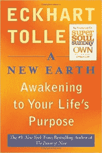

良好的生活心理。我不同意这里面的一切，但如果你想成长为一个人，这很好。我认为这比爱克哈特的另一本书《现在的力量》要好。

### 权力、谈判和说服

**[43) *那个喜欢开关*](https://simpleprogrammer.com/thelikeswitch)T5】**

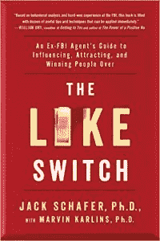

我以为这是*好的*。它是由一位联邦调查局的谈判专家写的，内容是让人们喜欢你。开始时很强劲，但过一会儿就没劲儿了。前几章值得一读，但你最好先看看这一章的梗概。

**[44) *永不分裂*](https://simpleprogrammer.com/splitdifference)T5】**

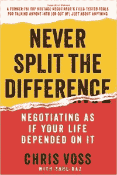

2016 年我最喜欢的书之一。这也是联邦调查局人质谈判专家写的。它提供了对谈判的深刻见解，尤其是从情感而非战略的角度。我已经读了两遍，我可能会把它加入我的常年阅读清单——它就是这么好。

**[45) *预判*](https://simpleprogrammer.com/pre-suasion)T5】**

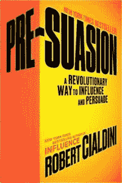

我期待这会很棒，但它并不那么棒。它在开始时给出了一些好的策略。然后在最后，它退化成一个说教，为什么你不应该使用坏的策略，但为什么他无论如何包括它…那些东西真的不需要在那里。

**[46) *王牌交易艺术*](https://simpleprogrammer.com/artofthedeal)T5】**

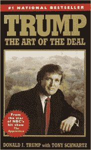

不管你是爱他还是恨他，我建议你读读这本书。这是了解特朗普、他的性格、他来自哪里以及他是什么样的人的好方法。我发现这很有见地，我想你也会的。

**[47)](https://simpleprogrammer.com/madetostick)**

**

*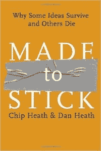*

*

这本书是关于什么样的故事会留在人们的脑海里。如果你对市场营销感兴趣，并且想掌握故事格式，这是个好主意。

**[48) *33 战争策略*](https://simpleprogrammer.com/33strategieswar)T5】**

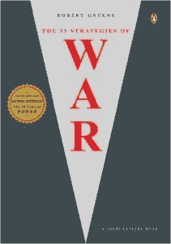

我最喜欢的作家之一罗伯特·格林的一本书。听音频版本很有挑战性，因为格林在很高的层次上写作，经常使用日期和时间。这仍然是一本很棒的书，有很好的生活策略，但我不会选择音频版本。

**[49) *诱惑的艺术:权力终极形式的必不可少的初级读本*](https://simpleprogrammer.com/artofseduction)**

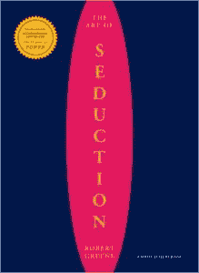

另一本罗伯特·格林的书。标题可能会误导你——它实际上是关于历史上的诱惑和所使用的诱惑类型。如果你想了解人类的心理，这是一本好书。在现实生活中非常适用。

**[50) *介绍 NLP:理解和影响人的心理技巧*](https://simpleprogrammer.com/introducingnlp)**

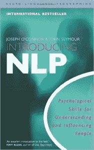

如果你没有读过关于 NLP 的书，这会给你一个很好的背景。我对它已经有些熟悉了，但这给了我一个更好的基础。总体上很好地介绍了 NLP。

### 商业和企业家精神

**[51) *泰坦们的工具*](https://simpleprogrammer.com/toolsofthetitans)T5】**

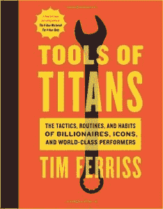

这是蒂姆·费里斯送的。鉴于我听了他的播客，我已经在这里看到了一些东西。你可能要记住这一点。然而，我认为这更像是一个很好的参考——看看每个领域最好的专家在说什么，很好地分成这本书。

**[52) *有效执行*](https://simpleprogrammer.com/effectiveexecutive)T5】**

我会说这很好，但并不伟大。这里的许多想法已经悄悄进入了主流。它在当时可能是革命性的，但我不会说它是必读的了。

**[53) *百万富翁小册子*](https://simpleprogrammer.com/millionairebooklet)T5】**

这是格兰特·卡尔多内的作品，可能是我今年最好的发现。这家伙是个很好的导师，尤其是在这个缺乏企业家好榜样的世界里。它不太长，所以如果你想快速阅读，我会推荐它。

**[【54】*你想要的一切:新型企业家的 40 堂课*](https://simpleprogrammer.com/anythingyouwant)**

这是德里克·西弗斯的一本短篇小说。除了‘ehhhh……’，我不知道该怎么形容。也许我不太喜欢德里克·西弗斯。

**[55)](https://simpleprogrammer.com/scalingup)**

**

**

*

不喜欢。我不认为我在商业阶段会发现这个有用。它似乎是针对更大的企业，我可能需要阅读该系列的前几本书，以获得更多的使用。听音频版本对我来说也不太好——如果我重访，我可能会读纸质/Kindle 版本。

**[56)](https://simpleprogrammer.com/beobsessed)**

**

**

*

格兰特·卡尔多内的另一本巨著。这里的主要思想是:去他妈的别人说什么。去他妈的那些说你工作太努力或者太痴迷的人。去吧。要痴迷。这是一本非常值得一读的书。

**[57)*10X 法则*](https://simpleprogrammer.com/the10xrulebook)T5】**

格兰特·卡尔多内带着一本精彩的书再次出现。这是我为他读的第一本书。作为一个提示，你会注意到印刷版本和音频版本略有不同——他在有声读物中更加残酷。

**[58) *优秀到伟大*](https://simpleprogrammer.com/goodtogreat)T5】**

经典商业书籍。有点言过其实，但它在公司简介和如何成为一家伟大的公司方面有一些好的内容。有趣的是，一些“伟大”的公司结果并不那么伟大，但对企业家来说仍然是一本非常好的读物。

### 其他的(大部分是知识密集型的书)

**[59)](https://simpleprogrammer.com/theinevitable)**

**

**

*

这本书提出了一些对未来的预测。一开始我有点怀疑，但它被合理地整合在一起。然而，它确实依赖于一个反复出现的主题“全球图书馆”或“统一思想”。无论如何，这是一本非常好的书，值得推荐。

**[60)](https://simpleprogrammer.com/cosmosapiens)**

**

**

*

这可能是今年最好的书。如果你对科学感兴趣，这是必须的。它囊括了人类学、进化生物学、宇宙学的所有内容——它将抹杀你自以为了解的所有科学知识。我要警告你——这相当长，涉及相当多的细节，但是值得。

**[61) *千面英雄*](https://simpleprogrammer.com/herothousbook)T5】**

我早就想读这本书了，但是读了之后，我觉得它有点超出了我的水平。它很长，很难理解。我知道它里面有一些好的概念，但它并不完全适合我。我就不要这个了。

**[62) *进化 2.0*](https://simpleprogrammer.com/evolution2.0)T5】**

这是佩里·马歇尔写的一本优秀的书。事实上，我采访了他，你可以在这里观看。这本书谈到了进化，以及我们大多数人理解进化的方式是如何过时和被误导的。这并不是说进化本身是错误的，而是说我们大多数人学习进化的方式是非常错误和误导的。在这一点上相信我——在你匆忙下结论之前先看看这本书。

**[63) *戴尼提*](https://simpleprogrammer.com/dianeticsbook)T5】**

我因为读了这篇文章受到了很多批评，但是我想研究一下山达基。不涉及太多细节，这很奇怪，但也不是完全想入非非。里面的东西让我想起了你可能在《新时代哲学》中发现的东西。它可能有缺陷，但是如果这个模型对你有效，它就有效——不管它是不是真的。

**[64) *论自由*](https://simpleprogrammer.com/onlibertybook) 论 T5】**

这是每个人都应该读的经典。这本书的一个基本原则是，我们需要给每个人发言的机会——即使我们觉得他们的观点令人反感。今天想一想，过去政府会限制我们的言论，但似乎这些天来，社会已经通过羞辱不同意见而不是辩论它们来继承这一衣钵。

**[65) *东方文明的根基*](https://simpleprogrammer.com/foundationseastciv)**

这是从伟大的课程系列。这真的很长，基本上是关于中国和它的历史。我今年去那里之前读了这本书，它帮助我理解了我所看到的许多东西。这是一部很好的中国历史年表。

**[66) *爱默生、梭罗和超验主义运动*](https://simpleprogrammer.com/emersonthoreau)T5】**

伟大课程系列的另一个精选。我喜欢超验主义，爱默生和梭罗，我想在这方面了解更多。这是历史上一些非常有趣的开创性的东西，你开始欣赏它对今天的影响。随着你读得越来越多，你开始看到这和东方哲学/斯多葛主义之间的联系。我强烈推荐这个。

**[67) *创造了历史的书:能改变你一生的书*](https://simpleprogrammer.com/booksmadehistory)**

这本书浏览了大量历史上有影响力的书籍，并为每本书提供了一个摘要。我发现这是发现我想读的东西的一个非常有用的方法。总的来说，这是很好的放在一起。

**[68) *塞内加之道*](https://simpleprogrammer.com/taoseneca)T5】**

这是一段塞涅卡写给路西利厄斯的信。这是很棒的东西，但你最好直接读信，而不是听音频。这里的语言和思想变得非常复杂，以至于你需要冷静下来沉思一会儿。还是那句话，很棒的东西，但是要读——不要听——它。

**[69) *《博伽梵歌》*](https://simpleprogrammer.com/bhagavadgita)**

这真的很棒。这是一本经典的印度宗教文本，里面有一些非常好的智慧。我把一些部分看了几遍——这是一本可能会让你大吃一惊的好书。

**[70)](https://simpleprogrammer.com/dumbingusdown)**

**

**

*

它讲述了美国教育的历史以及为什么它如此糟糕。有趣的是，它是由一位赢得了一些著名教学奖的老师写的——基本上是对他们曾经所在的系统的一个巨大的一指致敬。如果你正在考虑在家上学，或者只是想接受教育，我强烈建议你这么做。

**[71)](https://simpleprogrammer.com/outliers)**

**

**

*

这本书是胡扯。这是一本宣扬受害者心态和特权的书。马尔科姆·格拉德威尔精选了一些故事，并将其作为研究来推广一种本质上具有破坏性的哲学。是的，有些人生有挫折。不，这本书里的哲学没有帮助。

**[72) *我的大脚趾*](https://simpleprogrammer.com/mybigtoe)T5】**

这本书太疯狂了。这是关于一个被迷幻药绊倒的人，他提出了我们都生活在虚拟现实中的想法。这听起来很奇怪，但它提供了一些要点。他为世界如何运转提出了一个完整的框架。疯狂阅读，但去吧。

就这样，我们结束了！

同样，如果你想查看我的深度书评，你可以在这里查看。快乐阅读。********