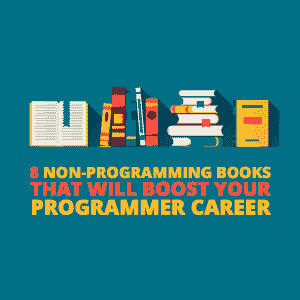
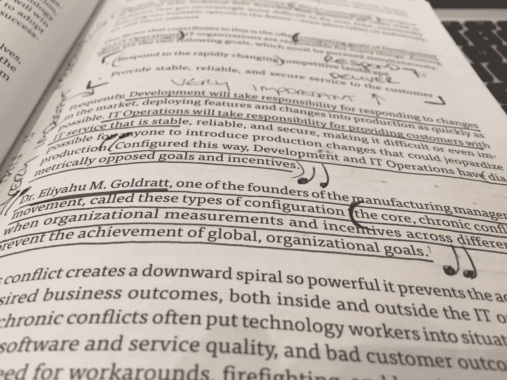

# 8 本非编程书籍将促进你的程序员职业生涯

> 原文：<https://simpleprogrammer.com/books-programming-career/>

There are [many lists of books about becoming a better programmer](https://simpleprogrammer.com/best-books-software-developers/). They likely include books like Refactoring, Code Complete, The Mythical Man Month, etc.

然而，在工作场所，我们程序员需要的不仅仅是编程知识。学习编程是我们工作中必不可少的一部分——但不是全部。

标志性编程书籍的作者有着非凡的职业生涯，但不仅仅是他们的编程知识让他们的职业生涯引人注目。他们是全面发展的专家，我们也应该努力学习他们的品质。

对于程序员来说重要的非编程书籍的困难在于，它们属于“我们不知道自己不知道什么”这种模糊的类别这些书不会象征性地把我们的名字写在上面。

相反，我们必须找到他们。通常，我们是通过信任的朋友的推荐找到这些书的。以下是我最喜欢的一些非编程书籍，它们对我的工作方式产生了巨大的影响。

它们究竟产生了怎样的影响？所有这些书都是关于从更高的角度看待你自己和你的工作。他们不会告诉你如何解决一个特定的问题；相反，他们会给你所需的工具，这样当你看到问题出现时，你就有所准备。温斯顿·丘吉尔说得好:

“每个人一生中都会有一个特殊的时刻，象征性地拍拍他们的肩膀，让他们有机会做一件非常特殊的事情，这对他们来说是独一无二的，符合他们的才能。如果那一刻发现他们没有准备好或没有资格迎接本可以是他们最美好的时光，那将是一场悲剧。”

我们希望为这些情况做好准备，所以让我们来看看你应该阅读的八本非编程书籍，以促进你的编程生涯。

**注意** —我不会推荐我不拥有也不使用的产品。[我拥有所有这些书](http://thedevcoach.co.uk/reading-list)，它们都覆盖着我自己的笔记。如果你选择买一个，我建议你也这样做。这些书不是读一遍就扔在一边的。

我没开玩笑。

## 1—[devo PS 手册](http://www.amazon.com/exec/obidos/ASIN/B01M9ASFQ3/makithecompsi-20)

DevOps 是一场运动，一种文化变革，一种心态。这不是明面上的。

《DevOps 手册》是凤凰计划的非虚构伴侣。Phoenix 项目是一部小说，讲述了一个 IT 组织如何分崩离析，然后通过 DevOps 实践重新组合在一起。

就我个人而言，我发现 Phoenix 项目的新颖格式既密集又迟钝，而 DevOps 手册要实用得多。DevOps 手册向你讲述了价值流的重要概念，价值流本质上是工作如何进出企业的完整流程。把它想象成一个科技企业的生产线。

作为一名程序员，我们处于这个价值流的核心——所以我们经常要对结果负责，结果通常是，但不总是，一个产品。

价值流的所有权不应该是程序员的工作。但这本身就是一篇完整的博文。不管谁应该正确地拥有价值流，程序员经常处于为其负责的尴尬境地。因此，我们不仅需要了解价值流是什么，还需要了解如何优化它。

DevOps 手册为您提供了许多优化价值流的不同方法，包括“价值流映射”(使价值流可见)和优化我们的部署流程。

## 2 — [Scrum:用一半的时间做两倍的工作的艺术](http://www.amazon.com/exec/obidos/ASIN/B00JI54HCU/makithecompsi-20)

Scrum 是在软件世界中被广泛采用的框架，这本书是对 Scrum 框架的一个很好的介绍。

大多数其他 Scrum 书籍直接深入到 Scrum 格式的工作机制中。另一方面，这本书花时间解释了框架的起源和背后的意义。

Scrum 的目的远比理解精确的角色、工件等更重要。

为什么？因为知道规则和体现规则是不一样的。不幸的是，许多程序员仍然没有理解 Scrum 框架的起源和目的就一头扎进了它。

这导致了混乱，因为实践者开始在不知道为什么我们首先需要 Scrum 的情况下，每天早上大声要求 15 分钟的会议。这个概念我已经在本文的[中详细解释过了。](https://simpleprogrammer.com/focus-basics-art-mastering-scrum/)

看完书，明白目的，做一个更好的实践者。

## 3 — [第五纪律](http://www.amazon.com/exec/obidos/ASIN/B000SEIFKK/makithecompsi-20)

我最喜欢的一句话，也是最能概括第五条纪律的一句话，是这样的:

"同一系统中不同的人会产生相似的结果."

我已经看过这句话很多次了，在读完《第五条戒律》之后。举个例子:当一个公司解雇了一个开发人员，然后又雇佣了一个新的开发人员到同一个团队和同一个业务中，有趣的是同样的结果又出现了。

在这一点上，你可能想知道为什么团队结构对你这个程序员如此重要。

因为如果不这样做，我们可能会陷入一个陷阱，认为自己只是一个大得多的机器中的一个小角色，而我们认为自己已经不受控制了。如果我们看不到更大的图景(系统)，也不能解决这个问题，那么我们的成果和影响将是有限的。我们可能是新员工，被带到一个新的团队，注定要失败——不管我们有多优秀。

解决办法？理解并能够交流复杂系统中出现的困难以及如何解决它们。培养一种系统思维，超越抱怨其他团队“没有做好他们的工作”，而是思考我们建立组织的方式是如何比我们意识到的更多地影响我们。

## 4 — [48 幂定律](http://www.amazon.com/exec/obidos/ASIN/B0024CEZR6/makithecompsi-20)

Every organisation has politics. It’s an irrefutable fact.

谈到政治，你有两个选择:你可以吃蓝色药丸，假装权力游戏不存在。或者，你可以服用红色药丸，潜入权力的世界，去了解它。

有趣的是，作者罗伯特·格林甚至认为否认权力游戏本身就是一种权力游戏。我让你考虑一下这个声明。

权力的 48 条法则展示了人们使用和运用权力的 48 种不同方式。格林用历史上的深度故事带你详细了解每一个故事，展示权力游戏。为了给每一章画上句号，格林以一个逆转结束，一个反对每一个权力游戏的论点。

诚然，在我第一次阅读时，我并没有真正“理解”然而，当我回来的时候(在一家公司工作了几年之后)，很多想法开始产生共鸣。我可以联想到不同的权力游戏，以及我在工作场所看到他们是如何表演的。所以在真正尝试之前不要放弃这本书。一旦成功，你就会明白我的意思。《权力的 48 条法则》不是一份报纸，也不是 Buzzfeed 上的一篇文章——它并不意味着容易阅读，但却值得一读。

纳西姆·尼古拉斯·塔勒布曾经说过“永远不要读你不想重读的书。”权力的 48 法则就属于这一类。它不能只读一次。出于这个原因，我建议买一份硬拷贝，并终生保存。当你每次重读它时，你会把不同的领域和你的新经历联系起来。

## 5 — [教练习惯](http://www.amazon.com/exec/obidos/ASIN/B01BUIBBZI/makithecompsi-20)

我相信最好的程序员[也是老师](https://simpleprogrammer.com/workplace-learning-culture/)。

这些程序员有一种富足的心态，而不是匮乏的心态。知道分享知识和帮助他人事实上会反过来帮助他们，而不是反对他们。

教练习惯是一个非常直接和实用的教练思想介绍。它将带您完成七个单独的问题，您可以在教练会议或更一般的对话中向另一位程序员提问。

这些问题包括:“你在想什么？”以及“你真正的问题是什么？”不要被愚弄，以为这些只是几个随意拼凑起来的问题。每个问题都是精心制作的，以确保你能对他人产生最大的影响。

这就像拥有绝地的思维能力一样。

《教练习惯》推荐给任何与人共事的人阅读(阅读:所有人)。如果你仍然不相信，我之前已经翻译了[指导问题](https://simpleprogrammer.com/coaching-programmers/)来展示它们对程序员的用处。

## 6 — [冲刺:如何在短短五天内解决大问题，测试新想法](http://www.amazon.com/exec/obidos/ASIN/B010MH1DAQ/makithecompsi-20)

Sprint 带你完成一套为期五天的练习，从头脑风暴的想法/功能开始，并对其中一个进行优先排序；然后，你将引出主要的想法，勾画它，设计它，原型它，并测试它。

这是一个非常实用和完整的框架。

当谈到我们的“工作方式”时，我们通常需要一些基本的结构，因为它可以防止我们无休止地争论和辩论。相反，你可以向你的团队提议:我们来个设计冲刺好吗？然后带着团队一步一步的通过这个方法。

无论你是否完整地运行这些类型的研讨会，这本书都可以作为如何联合利益相关者并得到一个有效产品的巨大灵感。

## 7 — [精益启动](http://www.amazon.com/exec/obidos/ASIN/B004J4XGN6/makithecompsi-20)

如果你不熟悉精益创业的理念，而你已经开始写代码，你可能已经犯了一个可怕的错误。

精益创业现在已经成为软件和产品领域的经典。它主张所有的想法都只是观点，直到被证明不是这样，这意味着我们需要在追求它们之前积极地测试我们的想法，以确保我们不会被错误的判断所蒙蔽，或者以自我为导向。

如果你认为你有确凿的证据证明你的产品或功能会成功，请三思。作者 Eric Ries 将挑战你，让你在开始构建产品之前，想出更快、更便宜的方法来验证你的产品。

为什么验证很重要？因为建筑产品可能非常昂贵。不仅如此，众所周知，代码一旦构建，就很难更改。因此，从一开始就构建正确的产品和功能是至关重要的。我们有很多方法可以不用写任何代码就能验证想法，比如:纸上原型、启动页面和游击式/走廊式用户测试。

你现在可能会想:持续验证的想法是否意味着公司将需要更少的程序员？

一点也不。

事实上，这意味着程序员的时间将更有效地花在创造性的活动上，并思考如何构建原型、演示和页面。这也意味着，到了构建的时候，业务每五分钟就会回到程序员那里重新工作，或者更糟糕的是，因为一个失败的产品而责备程序员的机会就更少了。

所有的新产品和新功能在被证明是成功的之前都只是观点。在你或任何和你一起工作的人开始写任何代码之前，请阅读这本书。

## 8 — [关键影响人物](http://www.amazon.com/exec/obidos/ASIN/B00XK4103Y/makithecompsi-20)

我展示的其他书籍更多的是关于我们工作的组织，而不是关于我们自己和我们的职业生涯。

《关键影响力人物》带你了解有影响力的人(有意或无意地)上升到他们的行业顶端的五个步骤。

Being at the top of an industry means getting better opportunities with less (or no) struggle and being rewarded appropriately. No more fighting with your employer for a raise or debating with your boss to showcase your value. With author Daniel Priestley's five steps, your value will become crystal clear to you, and then Priestley takes you through how you can then showcase this value to others.

Priestley 认为你已经“站在了价值的山上”迄今为止，你所有的经历、故事、想法和信息都比你意识到的更有价值。但是，你就是看不到山。为什么？因为你正站在上面！

到目前为止，这本书对我的职业生涯产生了巨大的影响。我相信这只是开始。读完这本书后，我意识到我没有采取最有效的措施来建立自己的事业。我一完成它，就把它放下，并制定了一个跨越我整个职业生涯的计划。我现在认为这本书是这个计划的支柱。所有其他的书似乎都与我围绕 Priestley 概述的五个步骤创建的计划吻合。

就像权力法则一样，你可以选择忽略书中的观点。但是，这本书的五个步骤符合任何行业中任何有影响力的人的职业历史。

忽视这本书，后果自负。

## 你最辉煌的时刻

你看，这是我迄今为止读过的与编写代码没有直接关系的最好的书。

小心不要落入陷阱，以为更多的编码知识是你所需要的。很有可能这些书中的一本书呈现了你甚至不知道你需要的突破。

无论是与权力的 48 条法则进行政治斗争，还是意识到你的组织有一个系统性的问题，并开始用第五条纪律和 DevOps 手册来解决它。或者与有影响力的关键人物一起为你的职业生涯制定一个宏伟的战略。

忽视书籍，尤其是这些书籍，可能会在短期内为你赢得一点时间，但如果你不小心的话，从长远来看，可能会被证明是毁灭性的代价。

如果你读了这些书，当你的象征性的一击到来时，你会准备好。

SaveSave

SaveSave

SaveSave

SaveSave

SaveSave

SaveSave