# 2017 年看的所有书

> 原文：<https://simpleprogrammer.com/books-read-2017/>

如果你是那种爱书的程序员，这篇文章就适合你！话虽如此，2017 年我读过的所有书的年度贴也该到了。

在过去的一年里，我总共读了 61 本书，没有 2016 年那么多。虽然我想让这个数字更大，但有几件事(比如皮姆斯勒课程)让我读的书比去年少了。

但是 61 本书还是很不错的，对吧？

所以，跟着我，我给你看我 2017 年读过的所有书。

别担心！如果你不是那种喜欢阅读的人，我还录了一段视频，你可以看看下面:

[//www.youtube.com/embed/cLRaxApwXCA?not_used=1](//www.youtube.com/embed/cLRaxApwXCA?not_used=1)

## 你可能会问，我是怎么做到的？

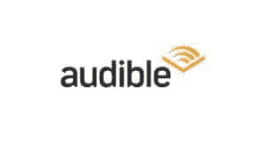

嗯，我听了他们的话——至少是他们中的许多人。

我用我的 Audible.com 账户来听这些书的音频版本，速度大多是 3 倍。(3 倍的速度对你来说似乎难以理解，但如果你慢慢增加速度并给予绝对的专注，你就可以逐步达到 3 倍的速度)

如果你还没有注册[Audible.com 订阅](https://simpleprogrammer.com/audible)，现在就注册吧——说真的，这将是你一生中做出的最好的决定之一。

每当我走路或开车的时候，我也会听看书。

当然，我几乎每天晚上都在 Kindle 上看书。

好了，不多说了，这些书在这里:

## [雷原理](http://www.amazon.com/exec/obidos/ASIN/1501124021/makithecompsi-20)

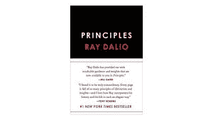

我刚刚完成这本书，它是艰难的。

我同意 Ray 谈到的大部分原则，但我不喜欢它，因为它太结构化和太死板了。

## [钉盖曼的墓地书](https://simpleprogrammer.com/thegraveyardbook)

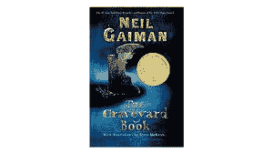

一个被鬼魂养大的男孩能面对活人和死人世界的奇迹和恐怖吗？

虽然这是一本强烈推荐的书，但我必须承认，这不是我选择的故事。我不喜欢它，也不喜欢它，但是如果你是科幻迷，不要拒绝尝试它。

## 斯科特·亚当斯大获全胜

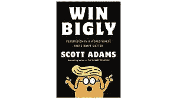

这本书完整地论述了唐纳德·特朗普(Donald Trump)的当选。基本上，这是一本斯科特预测现任总统赢得初选和大选的书。我喜欢它，因为我个人正在该频道制作视频，预测特朗普将从初选中赢得总统大选。

## 迈克尔·a·辛格的《不受束缚的灵魂》

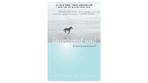

这是一本相当好的书，我强烈推荐它。试试这个观察你自己和你是谁的想法。基本上，它是一个帮助你从外面看自己的指南。

## 大卫·H·瓦格纳的《脊梁》

这是一本成人书。它清楚地说明了男性拥有同性朋友的重要性，因为他们之间可以形成信任和兄弟般的强大纽带。

## 默里·罗斯巴德的《为了新的自由》

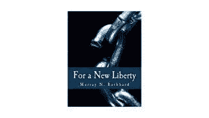

这本书让我决定成为一名完全的自由主义者。我知道你们中的许多人不喜欢这样，但是自由意志论者不同于共和党和民主党。它更像是一种哲学。读完这本书，让我知道。

## T Harv Eker 的《百万富翁思维的秘密》

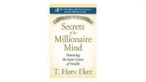

如果你被有钱或富有不好的想法所限制，这本书会帮助你。这本书解释了你思考金钱的方式会影响你周围的环境。

## 被凡妮莎·范·爱德华兹迷住

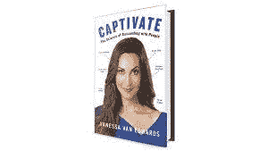

这本书是关于如何影响和成为一个善于交际的人。一开始，我并没有真正理解这本书的想法，我认为它更多的是关于外观，但它最终是别的东西。这本书基本上是关于人们如何工作以及如何与他们打交道和影响他们的科学。

## [丹·米尔曼《和平战士的神圣旅程》](https://simpleprogrammer.com/sacredwarrior)

这本书是关于我们在生活中建造的一切，在任何领域(我们的身体状况，赚钱，建造房子或任何其他场景)，只是一个带我们到另一边的交通工具。一旦我们到达了期望的地方，或者我们获得了预期的结果，我们就不需要那条船了，我们只要继续前进就可以继续实现目标。

## [艾利·M·高德拉特的进球](https://simpleprogrammer.com/thegoalbook)

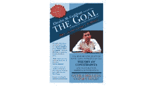

Eli Goldratt 的信念之一是，个人或组织的目标不应该用绝对的术语来定义。一个好的目标定义是让我们走上持续改进的道路。

这本书强烈推荐给正在做项目或有开发想法的人。

## [威尔·杜兰特的哲学故事 Kindle 版](https://simpleprogrammer.com/storyofphilosophy)

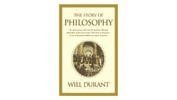

一个辉煌和简洁的生活和伟大的哲学家的思想的帐户-柏拉图，亚里士多德，培根，斯宾诺莎，伏尔泰，康德，叔本华，斯潘塞，尼采，柏格森，克罗齐，罗素，桑塔亚那，詹姆斯和杜威

## 整理改变生活的魔力:玛丽·近藤的日本整理艺术

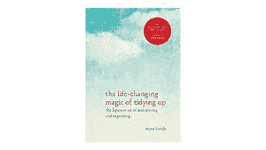

日本清洁顾问玛丽·近藤(Marie Kondo)将整理提升到了一个全新的水平，她承诺，如果你曾经适当地简化和整理过你的家，你就再也不用这样做了。

我真的认为这是一本非常好的书，非常有趣。如果你是极简主义者，这就是你的书。

## 打破做自己的习惯:如何失去理智并创造一个新的自我

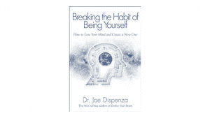

你不会被你的基因所注定，也不会在你的余生中被固定下来。一门新的科学正在兴起，它赋予全人类创造他们选择的现实的能力。

这是一本真正的好书，我强烈推荐它。这是关于心态，是关于你相信什么影响你的现实。这本书在量子物理学和神经科学的水平上教你。真的很有意思。

## 韦恩·w·戴尔博士的作品

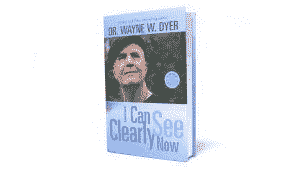

这是韦恩·戴尔博士写的一本书，我是在播客上听到的，我认为他是一个非常好的人。我读过很多关于这个角色的书，他有一种非常有趣的思维方式。尤其是这一部，讲述的是他的人生故事。

## [永恒的卖家:制作和营销工作的艺术](https://simpleprogrammer.com/perennialseller)

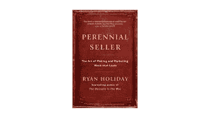

如果你打算做一个创意项目，甚至是写一本书，你应该遵循我的好朋友瑞安·霍利迪在这本书中分享的建议。我们认识有一段时间了，我有他的几本书。

## [如何不死:发现经科学证明可以预防和逆转疾病的食物，作者迈克尔·格雷格医学博士](https://simpleprogrammer.com/hownottodie)

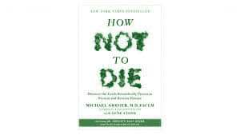

他有很多对你有很大帮助的建议。就我个人而言，我对这本书有点遥远的看法，以及有许多关于如何健康饮食的建议，许多信息是有偏见的。虽然我确实吃了更多的蔬菜，但唯一阻止我成为素食者的是我吃肉。

## [意大利语 Pimsleur 课程](https://simpleprogrammer.com/pimsleur)

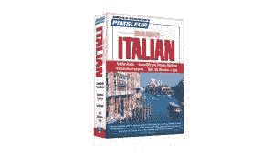

这是一门帮助你学习意大利语的课程，由 5 个单元组成。我花了 6 个月的时间来完成它，每天花 30 分钟到 1 小时。这导致我不再读更多的书，但我尽可能地利用了这一点。

## [巅峰表现:借助 Brad Stulberg 和 Steve Magness 的新成功科学，提升你的游戏水平，避免精疲力尽，茁壮成长](https://simpleprogrammer.com/peakperformance)

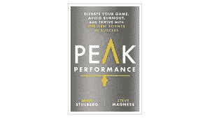

不管是在什么领域或手头的任务，都有一些共同的原则来推动绩效。无论某人是想获得奥运会参赛资格，在数学理论上有所突破，还是制作一件艺术杰作，许多导致巨大成功的实践都是相同的。在《巅峰表现》(Peak Performance)一书中，前麦肯锡(McKinsey)公司顾问兼作家布拉德·斯图伯格(Brad Stulberg)和史蒂夫·马格斯(Steve Magness)联手揭开了这些做法的神秘面纱，并展示了每个人如何才能做到最好。斯图伯格的报道涉及健康和人类表现科学。

## [如何获得并保持格兰特·卡尔多内的激励](http://www.amazon.com/exec/obidos/ASIN/B0718YFYJZ/makithecompsi-20)

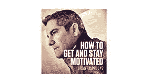

我真的很喜欢这本书，但它似乎非常重复，更像是他的任何其他作品。如果这是你第一次读这位作者的书，不要让这本书影响你对他的看法。

## [《肥胖密码:解开减肥的秘密》作者 Jason Fung 博士](https://simpleprogrammer.com/theobesitycode)

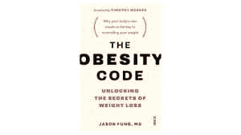

我认为这是一本好书。我已经改变了对禁食的看法，这是我多年来一直在做的事情。这本书讲述了胰岛素的过程和功能。我现在很清楚，我尝试或经历的许多事情对我没有帮助，但这本书给了我关于未来饮食变化的好主意。

## 门肯的《弗里德里希·尼采哲学》

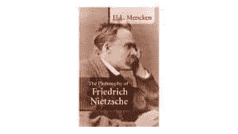

这是第一本用英语出版的关于尼采的书，传奇记者 H. L .门肯的这篇文章仍然是最有启发性的。

尼采被误解的超人概念，他的永恒轮回的概念，他对基督教的拒绝，以及他的基本理性主义和唯物主义都在这本书里进行了分析。

## 弗里德里希·尼采这样说查拉图斯特拉

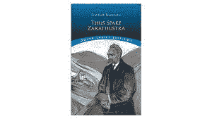

这本书把尼采确立为一个大胆而有独创性的思想家；这一声誉只会因后来的作品如《超越善恶》而得到提升。

如此说来，查拉图斯特拉有几个反复出现的主题，把主要人物——第一个一神教信仰的创造者——放在一个故事中，这个故事涉及到诸如“同一事物的永恒重现”,关于“上帝之死”的寓言，以及“先知的预言”。这种结合在哲学界被证明是强有力的，直到今天，这一文本仍在学术界热烈讨论。

## [适应力:来之不易的过上更好生活的智慧，作者 Eric Greitens，海豹突击队海军](https://simpleprogrammer.com/resiliencebook)

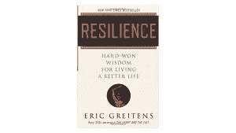

这真的是一本关于硬核的好书！你喜欢斗牛犬心态吗？你必须检查弹性。

埃里克的信件——汲取了他自己的经验和古今思想家的智慧——现在被收集和编辑成这本永恒的指南。格雷滕斯展示了我们如何建立目标、面对痛苦、实践同情、发展职业、找到导师、创造幸福等等。

## 自尊的六大支柱:纳撒尼尔·布兰登(Nathaniel Branden)在这一领域的先驱关于自尊的权威著作

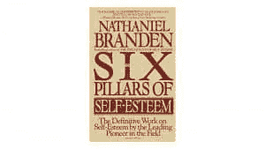

这是一本关于自尊的基础书籍。你如何看待自己将决定你如何行动。

这本书令人信服地证明了为什么自尊是心理健康、成就、个人幸福和积极关系的基础。

## 原始耐力:摆脱慢性心脏和碳水化合物依赖，成为一只燃烧脂肪的野兽！作者马克·西松

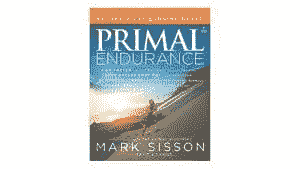

这是一本推荐给我的关于跑步的书，基本上是关于低碳水化合物跑步的。

我并不完全相信书中的训练计划，也许它对我不起作用，但是如果你没有低碳水化合物的计划，也许它对你有用。

## 布莱恩·克里斯蒂安的《赖以生存的算法:人类决策的计算机科学》

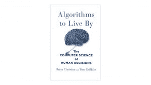

伙计，我喜欢这本书，它的主题很有趣。它是关于人工智能和你如何在现实生活中使用算法的。

我们所有的生活都受到有限的空间和时间的限制，这些限制会产生一系列特殊的问题。在一天或一生中，我们应该做什么，或不做什么？我们应该接受多大程度的混乱？什么样的新活动和熟悉的最爱的平衡是最有成就感的？这些似乎是人类独有的困境，但事实并非如此:计算机也面临同样的限制，因此计算机科学家几十年来一直在努力解决他们版本的此类问题。他们找到的解决方案有很多值得我们学习的地方。

## [斯科特·迈耶斯的魔法 2.0 系列](https://simpleprogrammer.com/cg59-magic)

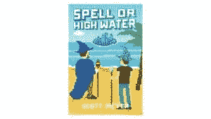

这是一系列的小说。前三卷很吸引人，但第四卷我一点也不喜欢，他的故事相当枯燥乏味。我感觉这第四部破坏了前三部的所有工作。

## 艾克哈特·托尔的《当下的力量:精神启蒙指南》

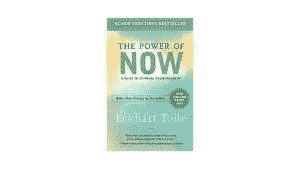

这是我最喜欢的书之一，这是我第二次读它。它有非常强大的内容，因为它可以改变你的思维方式。谈论活在当下有多重要。

## 布拉德·斯通的《百货店:杰夫·贝索斯和亚马逊时代》

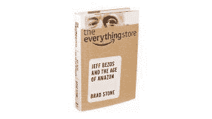

这本书讲述了亚马逊及其创始人的全部故事。他谈到为这家公司工作有多难，以及杰夫·贝索斯有多无情。

“万物商店”将是这家公司的一部揭示性的、权威性的传记，这家公司在互联网上下了第一笔也是最大一笔赌注，并永远改变了我们购物和阅读的方式。

## 安德斯·爱立信

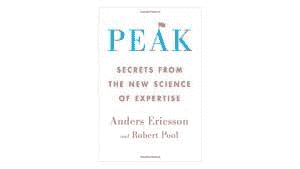

你是否曾经想学一门语言或拿起一件乐器，却被手头的任务吓住了？专家表演大师安德斯·埃里克森以研究国际象棋冠军、小提琴大师、明星运动员和记忆专家为职业。Peak 浓缩了三十年的原始研究，介绍了一种极其强大的学习方法，这种方法与人们传统上认为获得技能的方式有着根本的不同。

## 真相:尼尔·史特劳斯写的一本关于人际关系的不舒服的书

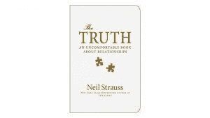

这真是一本有趣的书。如果你想读一些能稍微震撼你，触动你的内心，让你思考人生的东西，那么这就是这本书。

## 马克·曼森的《模特:用诚实吸引女人》

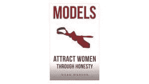

《模特》是第一本关于诱惑的男性约会书籍，这是一个纯粹的情感过程，而不是一个逻辑过程，一个与女性联系而不是打动她们的过程，一个自我表达而不是操纵的过程。这是关于男人如何吸引女人的最成熟和最诚实的指南，不需要假装行为，不需要撒谎，也不需要模仿别人。改变游戏规则的人。

## 阿诺德·施瓦辛格的《全面回忆:我难以置信的真实生活故事》

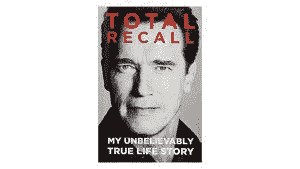

阿诺德·施瓦辛格标志性的夸张风格，《追忆似水年华》揭示了他辉煌、争议和真正独特的一生。

我们这个时代最伟大的移民成功故事。

他的故事是独一无二的，非常有趣，他在这几页中精彩地讲述了这个故事。

## [拿破仑·希尔的成功之钥:拿破仑·希尔的 17 项个人成就原则](https://simpleprogrammer.com/napoleonkeyssuccess)

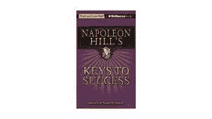

拿破仑·希尔的《成功之钥》是对希尔成功哲学和他个人成就的 17 条基本原则的完整探索。我觉得它不像他的其他书那么有用，可能是因为我习惯了这种思维模式，但你绝对应该去看看。

## 大卫·戴达的《启蒙、婚姻和黑暗面》

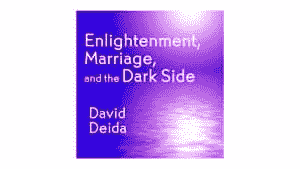

长久而充实的关系真正需要的是什么？在这个演讲中，大卫·戴达建议，学习如何重振性能量的整个光谱——包括光明和黑暗两个方面——以保持使伟大的性成为可能的“极性”是至关重要的。

## 斯科特·卡尼著

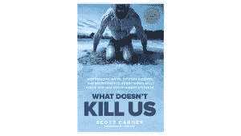

伙计，我怎么能不拿起一本叫《什么杀不死我们》的书呢？这是一个经历了耐寒训练的记者试图弄清楚这是不是扯淡…显然不是。

斯科特·卡尼(Scott Carney)接受挑战，寻找答案:我们能否侵入我们的身体，利用环境刺激我们的内在生物学？帮助他寻找答案的是荷兰健身大师维姆·霍夫，他在严寒中控制体温的能力引发了科学研究的旋风。

## 埃文·卡迈克尔的《你的一句话:创造重要事业和生活的强大秘密》

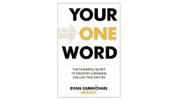

在这份大胆而赋能的指南中，企业家和社交媒体红人埃文·卡迈克尔分享了按照自己的方式加速你成功之路的秘密。通过发人深省的问题和鼓舞人心的、有教育意义的例子，你的一个词将帮助你确定你的个人座右铭——这个词抓住了你的目标和激情。掌握了这一经营理念，你将学会如何利用这一强大的工具来创造你梦想中的业务和未来。

在开始的时候，我不相信你真的可以用一个词来包围你的一生…但是现在，我的词是斗牛犬。

## 安妮·拉莫特的《一只鸟接一只鸟:关于写作和生活的一些指示》

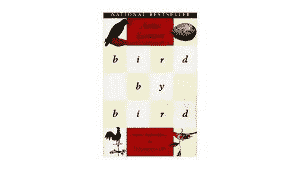

这是一本关于写作的书。你觉得你心里有本书吗？安妮·拉莫特不怕帮你发泄。她会帮助你找到你的激情和你的声音，从第一份非常糟糕的草稿到出版的特别失望。

## 从为什么开始:伟大的领导者如何激励每个人采取行动

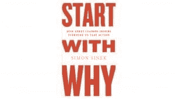

从“为什么”开始可以看出，世界上影响力最大的领导者都以同样的方式思考、行动和交流——而其他人的做法恰恰相反。Sinek 将这种强大的想法称为黄金圈，它提供了一个框架，在这个框架上可以建立组织，领导运动，激励人们。一切都从为什么开始。

## 迈克尔·马修斯的《超越更大、更瘦、更强:锻炼肌肉、保持苗条和变强的高级指南》

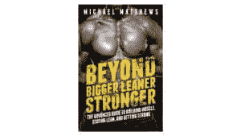

如果你想自然地尽可能多地锻炼肌肉…能够卧推、深蹲和硬拉巨大的重量…并全年保持强健的、适合海滩的体格…那么你应该读读这本书。

## 理查德·科赫的《明星原则》

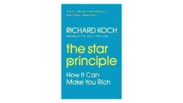

对于任何成长中的企业家或投资者来说，这都是一本至关重要的书。对于任何意识到为明星企业工作的好处的雄心勃勃的员工来说，这也是无价的——真正的责任、快速的个人发展、更高的薪酬、丰厚的奖金和有价值的股票期权。

无论你是谁，识别和投资明星将使你的生活在各方面都更加甜蜜和丰富。

## 导师部落:来自世界上最好的人的短暂人生建议

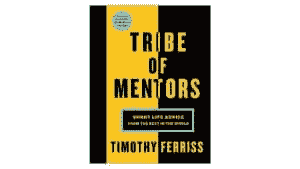

这是问名人的一堆问题，有些是智慧的金块，但大多数都是废话。

这只是需要记住的事情，肯定有很多好的建议，但你必须找到合适的。

## Ryan Holiday 的《每日禁欲主义:关于智慧、毅力和生活艺术的 366 次冥想》

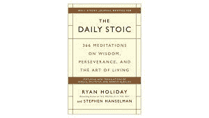

这是一本基于斯多葛派哲学的每日冥想书，我已经这样做了一整年，我将在年底完成，因为它是一天一本。

366 天的斯多葛派洞见和练习，包括皇帝马可·奥勒留、剧作家塞内卡或奴隶出身的哲学家爱比克泰德的全新翻译，以及芝诺、克里安提斯和鲁弗斯等不太知名的名人。

## 哈维·c·曼斯菲尔德的《男子气概》

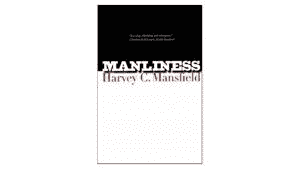

这本书很深奥，很难读懂。它邀请――不，要求――读者做出反应。不可能不被卷入哈维·曼斯菲尔德摆在我们面前的挑衅性(往往是有争议的)讨论。这是对男子气概的第一次全面研究，男子气概是一种好坏参半的品质，主要是男性，通常不宽容，不理性，有野心。我们的“性别中立社会”不喜欢它却无法摆脱它。

## 史蒂文·普莱斯菲尔德的《勇士精神》

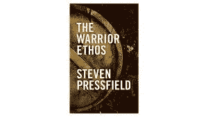

史蒂文·普莱斯菲尔德是我最喜欢的作家之一，他写了我最喜欢的书之一《艺术的战争》

这是一本很棒的非小说类书籍，也是一本励志书籍。如果你喜欢斯巴达人的一切，你绝对应该看看这个。

## 危险&游戏:迈克·塞尔诺维奇关于拥抱男子气概的文章

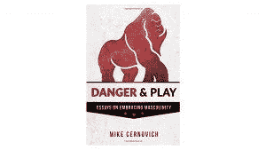

这本书是许多博客帖子的汇编。它的作者迈克·塞尔诺维奇是个坏蛋，我喜欢他的方式和他的思维方式，但这本书不是我所期待的。

## [尼古拉斯·斯帕克斯的真正信徒](http://www.amazon.com/exec/obidos/ASIN/0446618152/makithecompsi-20)

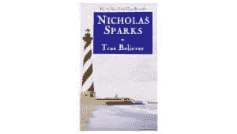

这是一本优秀的书。它谈论的是基于追随一个对政治、宗教等有很大影响的人的群众运动。

## 韦恩·w·戴尔的《你的误区:逃离消极思维陷阱、掌控自己生活的逐步建议》

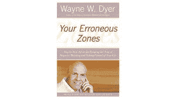

这是韦恩·戴尔的第一本书。它讲述了如何识别你的*错误*区，而不是你的性敏感区。特别是你生活中被你搞砸的地方。

## 约翰·艾维的《营养时机:运动营养的未来》

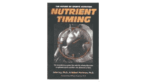

这是一本关于举重和最大化蛋白质效率的旧书。

利用领先的运动科学实验室的前沿研究，营养计时打破了关于如何为工作肌肉提供最佳营养的神话和误解。它表明，当在正确的时间提供正确的营养组合时，一个人可以激活他/她身体的肌肉机械，以增加肌肉力量，提高耐力和增加瘦肉量。

## 头脑强大:激活未开发的大脑能量以更聪明地工作和更快地思考的防弹计划——仅用两周时间

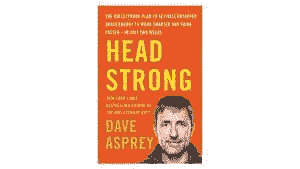

伙计，我不得不说，我不同意戴夫·阿斯普雷的观点，我完全赞同在生活中不要使用拐杖，增强你的力量、精神毅力和坚强的心态，而这个家伙却在没有建立基础的情况下谈论使用黑客来达到你想要实现的目标。

## 丹尼尔·吉尔伯特的《幸福的绊脚石》

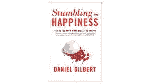

这本畅销书将心理学、认知神经科学、哲学和行为经济学的研究引入生命科学，揭示了科学家们发现的人类想象未来的独特能力，以及我们预测当我们到达未来时会有多喜欢它的能力。

## [出版:从空白页到钱德勒·博尔特出版的成熟路径](http://www.amazon.com/exec/obidos/ASIN/B01N2NYI1T/makithecompsi-20)

它是关于创作一本书，并使它可以自我出版，我在写我的书《软件开发人员职业指南》时用了很多。这是一本优秀的书，我强烈推荐它！

## [新书发布会:如何写作、营销&在不到三个月的时间里出版你的第一本畅销书，用它来开创和发展一个六位数的生意](https://simpleprogrammer.com/booklaunch)

无论你的写作水平或能力如何，无论你是否觉得自己没什么可写的，或者你没有追随者或影响力——要知道，通过遵循图书发布中的信息，你可以成功地写出一本畅销书。

最重要的是，你可以用你的畅销书来发展你的生意，赚更多的钱，帮助更多的人。

## 托尼·罗宾斯的《不可动摇:你的财务自由》

在采访了 50 位世界上最伟大的金融头脑并撰写了《纽约时报》畅销书《金钱:掌控游戏》之后，托尼·罗宾斯带着一本循序渐进的剧本回来了，带你踏上改变你的金融生活并加速你走向金融自由的旅程。无论你的薪水如何，你的人生阶段如何，或者你是何时开始的，这本书都会提供一些工具，帮助你以超乎想象的速度实现你的财务目标。

## 世俗智慧的艺术:巴尔塔萨·格雷西安的袖珍神谕

这本卓越的畅销书是一本失传已久、已有 300 年历史的智慧之书，讲述了如何在一个受利己主义支配的社会中成功而又负责任地生活。它像马基雅维利一样敏锐，但又像马可·奥勒留一样具有人文精神和一丝不苟的道德观。

## 埃利奥特·赫斯的《国王》

Elliot Hulse 启发了我创建我的 YouTube 频道。《国王》是一本好书，里面有很多关于健身和运动建议的内容。还有，灵性，心态，阳刚，阴柔。

## MJ·德马科的《无剧本:生命、自由和对企业家精神的追求》

MJ 德马科期待已久的国际畅销书《百万富翁浪子》的后续作品《无剧本》是摆脱世俗和平庸文化制约的决定性蓝图。学习如何利用企业家的力量创造令人敬畏的生活。无剧本不是你尝试的东西，是你生活的东西。

## 基督教灵知派作者 C·W·里德比特

这是我偶然发现的一本书，它是一部学术性的神学著作，所以我认为它不适合很多人。

我发现它非常有趣。如果你愿意花时间，你可以看看这本书。

## 梅尔·罗宾斯的《5 秒规则:用每天的勇气改变你的生活、工作和信心》

在你的一生中，你有父母、教练、老师、朋友和导师，他们推动你超越借口，超越恐惧。如果有信心和勇气充实你的生活和工作的秘密仅仅是知道如何鞭策自己呢？

梅尔·罗宾斯将利用习惯科学、引人入胜的故事以及历史、艺术和商业中一些最著名时刻的惊人事实，解释“推动时刻”的力量然后，她会给你一个简单的工具，让你成为最棒的自己。

## [John Sonmez 撰写的完整软件开发人员职业指南](https://simpleprogrammer.com/career-guide-yt)

现在是我出书的时候了！这本书我今年已经看了他妈的 5 遍了，因为它经历了所有的编辑！

再加上我听有声版本的次数，我强烈推荐这个！

## 约翰·桑梅兹
快速学习的 10 个步骤

对每一个浏览过黑客新闻和/r/编程并想到…

“我将如何跟上？”以下是如何将“信息压倒一切”转变为效率优势，从而快速提高您的收入，为您赢得团队中的“MVP”地位，并使您成为公司争相招募的热门开发人员。

就这样，我们结束了！快乐阅读！