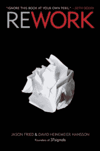
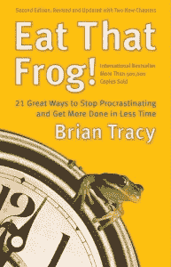
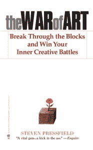
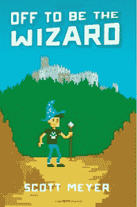

# 我今年看的所有书

> 原文：<https://simpleprogrammer.com/books-read-year/>

我每年都会阅读或听很多书的音频版本。

总是学习并尝试用新的想法拓展你的思维真的很重要。

由于我们已经接近年底，我想我应该写一篇文章，列出我今年读过的所有书籍，并给出我对每本书的一些想法。

我试图弄清楚所有的书是什么，但我可能漏掉了一些。我看了一下我的亚马逊数字历史和我的 Audible 帐户历史，得出了这个列表。

此外，每当我有机会遇到非常成功的人，我总是试图问他们会推荐我读哪一本书。这份清单上的许多书都来自于这个问题。事实上，许多书是由许多成功人士推荐的。

如果你通过阅读来快速学习概念和技能，那就看看我的课程:[快速学习的 10 个步骤](https://simpleprogrammer.com/store/products/learn-anything-quickly/)。

## 我怎么看了这么多书？

在我们进入列表之前，你可能会奇怪我是如何在一年内读完这么多书的。

事实上，这个列表并不是 100%准确的，因为大多数有声读物我至少听两遍，有些听三遍。

那么，在我做的所有其他事情中，我是如何在一年内找到时间阅读 30 多本书的呢？

我有两个主要的方法——下周找一个我发的关于这个话题的视频。

首先，我每天晚上在跑步机上走 45 分钟。我花了大部分时间在我喜欢的 Kindle Voyage 上阅读。

这让我可以燃烧大量额外的卡路里，同时毫不费力地完成一些阅读。

我做的另一件事是在举重、跑步或开车时听大量的有声读物。

我订了 Audible.com 的服务，我发现这是我每个月花的最划算的钱。你可以注册一个账户，每月支付一定数量的信用点数，每个月就可以用来购买图书的音频版本。最棒的是，如果你不喜欢一本书，你可以毫无疑问地把它退回去。

顺便说一下，我是 Audible 的会员。如果您有兴趣注册，我可以为您提供一个不错的注册交易:

下载一本有声读物只需 7.49 美元！AudibleListener 黄金会员计划的前 3 个月可享受 50%的优惠，并每月获得免费的有声读物积分。每月只需支付 7.49 美元，持续 3 个月，之后每月只需支付 14.95 美元，并继续每月获得 1 个有声读物积分！从超过 100，000 个标题中选择。

另一个听觉提示:我能听这么多书，因为我听的速度是 3 倍。做到这一点需要一些时间，但现在我可以很容易地以这种速度听下去，而且我不觉得我最终会错过任何东西。

## 那些书

排名不分先后:

**[新心理控制论](http://www.amazon.com/gp/product/B00F3KXN92/ref=as_li_tl?ie=UTF8&camp=1789&creative=390957&creativeASIN=B00F3KXN92&linkCode=as2&tag=makithecompsi-20&linkId=O77FSXKWL6MVLTXA)**

这本书很长，但它包含了大量有价值的信息，关于你的大脑如何工作，以及如何重新编程以获得成功。这个版本是丹·肯尼迪更新的新版本。这本书教会了我我们的自我形象是多么强大，以及如何改变自我形象以达到积极的结果。我强烈推荐这本书，它是我读过的最好的书之一。我一定会再读一遍。

**[《炼金术士——十周年纪念版](http://www.amazon.com/gp/product/B000FCKC4C/ref=as_li_tl?ie=UTF8&camp=1789&creative=390957&creativeASIN=B000FCKC4C&linkCode=as2&tag=makithecompsi-20&linkId=PQHP6VQUFLJPG54T)**

一个简短的阅读，但一个神奇和鼓舞人心的故事，将自助，动机，灵感和小说融为一体。我相信我是如此着迷于这本书，以至于我坐下来一口气读完了它。我简直爱不释手。从这本书里可以学到很多关于生活、成功和决心的东西。

**[返工](http://www.amazon.com/gp/product/B002MUAJ2A/ref=as_li_tl?ie=UTF8&camp=1789&creative=390957&creativeASIN=B002MUAJ2A&linkCode=as2&tag=makithecompsi-20&linkId=BQ7MLB53P622GZ24)**

一本讲述如何正确经营小企业的好书。它完全违背了传统的商业建议，但它并不是以一种空想的方式，而是以一种实用的方式。我发现自己在读这本书的时候一遍又一遍地点头——这看起来很奇怪，因为我大部分时间都坐在机场等待登机。也是非常快速的阅读。

**[现在的力量:精神启蒙指南](http://www.amazon.com/gp/product/B002361MLA/ref=as_li_tl?ie=UTF8&camp=1789&creative=390957&creativeASIN=B002361MLA&linkCode=as2&tag=makithecompsi-20&linkId=MN2O7X2IY43YSBPQ)**

这种书通常不是我喜欢的，但是有足够多的人推荐它，我认为我至少应该读一读。我可以诚实地说，这非常值得我花时间。这是一本有点奇怪的书，我并不同意书中的所有内容，但它确实让我思考我是如何不断失败地活在当下的。自从读了这本书，我可以诚实地说，我的生活中有了更多的快乐，只是通过应用书中的一些原则。再次，奇怪的书，但值得一读。

**[【习惯超人:成为最好的自己的指南，一次一个小习惯](http://www.amazon.com/gp/product/B00NGC8I9E/ref=as_li_tl?ie=UTF8&camp=1789&creative=390957&creativeASIN=B00NGC8I9E&linkCode=as2&tag=makithecompsi-20&linkId=7KIGQAME3F6N77EM)**

我关注这本书的作者已经有一段时间了。描述他的最佳方式是极其自律和睿智。这是一本很短的读物，不是传统出版的书，但这里的建议是黄金。当我读这本书的时候，我发现我已经做了很多泰南建议的事情——但是，我仍然从阅读中获得了很多。这可能是我读过的关于习惯的最好的书，因为它有很多实用的、可操作的建议。

**[《沉思录》:新译](http://www.amazon.com/gp/product/0812968255/ref=as_li_tl?ie=UTF8&camp=1789&creative=390957&creativeASIN=0812968255&linkCode=as2&tag=makithecompsi-20&linkId=7GWAZ7IU52FLVXSU)**

这本书不是真正的书，而是马可·奥勒留的个人作品。(确保你得到了这个翻译，因为其他的有点难读。)我真的很喜欢这本书，从中获益良多。这本书有点难读，因为有些部分是分散的，它的流动很像意识流，但如果你对斯多葛派感兴趣——你应该感兴趣，这是一本必读的书。马库斯是一个非常聪明的人，他的大部分智慧都包含在这些著作中。

**[一个斯多葛派的来信:书信莫拉莱斯 AD Lucilium(图文并茂。新修订的案文。包括图库+音频):全部三卷](http://www.amazon.com/gp/product/B00OVA77JW/ref=as_li_tl?ie=UTF8&camp=1789&creative=390957&creativeASIN=B00OVA77JW&linkCode=as2&tag=makithecompsi-20&linkId=WY3DME6CYNF67JAR)**

又一次，不是一本书，又是一个禁欲主义者写的，但这可能是我读过的最好的东西。说真的。如果你想增长智慧，读一读塞内卡的信。无论如何，这都不是一本容易读懂的书，但这里有太多的黄金，太多关于如何快乐生活并成为更好的自己的建议，以至于我甚至无法在这里写下公正的评价。我在免费维基网站上阅读了所有这些有旧版本翻译的信件，但我刚刚发现这本新书是上个月在亚马逊上发布的，所以现在我要再读一遍。非常非常非常好。我怎么说都不为过。如果你读到什么，看看这个。

请注意这本书的不同版本，它们只是精选的几个字母，而不是全部。我链接的那本书似乎是我发现的唯一一本书，里面包含了所有的内容。

**[【演示禅:演示设计与交付的简单思路(第二版)](http://www.amazon.com/gp/product/B006R4H5FG/ref=as_li_tl?ie=UTF8&camp=1789&creative=390957&creativeASIN=B006R4H5FG&linkCode=as2&tag=makithecompsi-20&linkId=B6H7KBG376J42Q5O)**

我不断有人推荐这本书，所以我最终决定去看看。许多关于如何创建引人入胜的演示的好建议。这本书粉碎了我关于演示和演讲应该如何组织的许多想法——尤其是关于 PowerPoint 幻灯片。书中也有很多很棒的例子。

**[吃那只青蛙！:21 种停止拖延并在更短时间内完成更多工作的好方法](http://www.amazon.com/gp/product/B001AFF25W/ref=as_li_tl?ie=UTF8&camp=1789&creative=390957&creativeASIN=B001AFF25W&linkCode=as2&tag=makithecompsi-20&linkId=NWH3OFV244OMKJXR)**

如果我写一本关于生产力的书，它看起来会和这本书非常相似。我从这本书中学到了一些新的东西，但这本书里的 21 条建议几乎都是我在多年与拖延症和高效斗争后想出来的。我希望我早很多年就读过这本书了。我本可以节省很多时间和麻烦。优秀的技巧，可靠的实用建议。如果你想有所收获，我会把这本书称为必读之作。

**[直拳、直拳、直拳、右勾拳:如何在嘈杂的社交世界里讲述你的故事](http://www.amazon.com/gp/product/B00BATNNZY/ref=as_li_tl?ie=UTF8&camp=1789&creative=390957&creativeASIN=B00BATNNZY&linkCode=as2&tag=makithecompsi-20&linkId=VLOPMX2TR7N4I5BC)**

我非常喜欢 Gary Vaynerchuck 的书:[粉碎它！](http://www.amazon.com/gp/product/B003WUYQSW/ref=as_li_tl?ie=UTF8&camp=1789&creative=390957&creativeASIN=B003WUYQSW&linkCode=as2&tag=makithecompsi-20&linkId=JMBV46VLW3Z5M6NW)，我听说了一些关于这本书的不错的东西，所以我决定试一试。我不得不承认，这本书里有一些好的东西——给予比索取多得多的整个概念，是我做营销的方式——但是，总的来说，我对这本书不像对《粉碎它》那样满意！我觉得有太多的例子不适合我。也就是说，为一个主要品牌经营社交媒体活动的人可能会从这本书里得到更多。

**[硼字母](http://www.amazon.com/gp/product/B00BMWEFR4/ref=as_li_tl?ie=UTF8&camp=1789&creative=390957&creativeASIN=B00BMWEFR4&linkCode=as2&tag=makithecompsi-20&linkId=RJMVHCWEB7GN2DVA)**

我想提高我的文案写作能力，所以我决定阅读这本由直销营销和文案写作大师推荐的书。这本书是加里·赫伯特在狱中写给他儿子的书信集。信中真正有趣的内容。非常必要的阅读学习文案写作。我从这本书中学到了很多，当然会推荐它。

科学广告

又一部经典文案书。我觉得这本书有点枯燥——但以“科学广告”为名，我还能指望什么呢？尽管如此，这本书里还是有很多有用的信息。这让我想到我们经常在没有真正衡量其效果的情况下做广告。

**[巴格万斯的传说](http://www.amazon.com/gp/product/B002MZUPYW/ref=as_li_tl?ie=UTF8&camp=1789&creative=390957&creativeASIN=B002MZUPYW&linkCode=as2&tag=makithecompsi-20&linkId=DBRWBFMLT2UZGTMC)**

什么？我看了一本小说吗？是的，我做到了。为什么是这个，当我甚至不打高尔夫的时候？嗯，因为这是史蒂文·普莱斯菲尔德写的。《艺术之战》是我有史以来最喜欢的书之一——不仅信息非常有用，而且可能是我读过的写得最好的书。我想我应该看看史蒂文的小说，所以我决定读这本书。这并不令人失望。这个故事真的很吸引你。绝对是一本好书。

**[兵法](http://www.amazon.com/gp/product/B007A4SDCG/ref=as_li_tl?ie=UTF8&camp=1789&creative=390957&creativeASIN=B007A4SDCG&linkCode=as2&tag=makithecompsi-20&linkId=64XBARYAJ3LPHNTA)**

我把这本书放在我的清单上，因为我已经听了这本书的音频版本大概 10 次或者更多。我第一次听是在去年，但今年我至少听了几次。我有史以来最好的书之一。绝对推荐这本书。如果你正在做任何一种创造性的工作，或者正在努力提高工作效率，这本书将会给你当头一棒。我推荐任何想征服拖延症的人阅读这本书。它也很短，非常有趣。

**[80/20 销售与营销:少劳多得的权威指南](http://www.amazon.com/gp/product/B00CGNRVHE/ref=as_li_tl?ie=UTF8&camp=1789&creative=390957&creativeASIN=B00CGNRVHE&linkCode=as2&tag=makithecompsi-20&linkId=OO7BKL33NHV667KQ)**

一篇简短但精彩的阅读。许多关于如何通过专注于给你 80%回报的 20%的东西来构建销售漏斗的信息。这本书充满了实用信息。我从这本书中学到了很多，将来当我尝试优化我的销售渠道时，我可能会重温这本书。

**[寰耸](http://www.amazon.com/gp/product/B003V8B5XO/ref=as_li_tl?ie=UTF8&camp=1789&creative=390957&creativeASIN=B003V8B5XO&linkCode=as2&tag=makithecompsi-20&linkId=5UZI3MJ73MEJ7LMJ)**

我认识的很多人都推荐了这本书，我听说这本书已经有一段时间了，所以我决定今年读完它。这本书很长。当我说长的时候，我的意思是，真的，真的很长——超过 1000 页长。但是，我很喜欢这本书。我知道有些人真的很讨厌这本书——我知道为什么——但是，我承认这是我有史以来最喜欢的书之一。尽管有一些枯燥的部分——包括一个长达 50 页的长篇演讲——我认为这本书本身是一个非常吸引人和有趣的故事，我同意许多关于一个人不应该为了另一个人的利益而工作的观点，除非他们选择这样做。读完这本书后，我觉得我们今天生活的世界与这本书的虚构世界出奇地相似——这有点可怕。

不管你听说过这本书，或者你对安·兰德有什么看法，如果你从未亲自读过这本书，这本书值得一读。你可能不同意书中的所有内容——这没关系——但是，这本书仍然有很多值得一提的地方。

**源头**

读完《阿特拉斯耸耸肩》后，我非常喜欢它，当然，我不得不读安·兰德的下一本最著名的书:《源泉》。这本书其实比《阿特拉斯耸耸肩》写得好多了。书中人物的深度令人惊叹。这是一个虚构的故事，关于一个年轻的建筑师与售罄的世界作斗争，并真正专注于他的工艺。我觉得这个故事非常吸引人。我不能放下这本书。强烈推荐。

**[伊卡洛斯骗局:你会飞多高？](http://www.amazon.com/gp/product/B0090UOLEW/ref=as_li_tl?ie=UTF8&camp=1789&creative=390957&creativeASIN=B0090UOLEW&linkCode=as2&tag=makithecompsi-20&linkId=W66CSN2LT4AO2QZR)T3】**

这本书讲的是有一份固定的工作可能不是生活中最安全的事情。如果我在为美国公司工作时读到这本书，这本书可能会对我产生更大的影响，但由于我已经独立了，当我听这本书的音频版本时，我真的只是点了点头。我觉得这本书不错，但不伟大。我仍然向任何想成为企业家的人推荐它。

**[不可抗拒的优惠:如何在 3 秒或更短时间内卖出你的产品或服务](http://www.amazon.com/gp/product/B0096CF0WG/ref=as_li_tl?ie=UTF8&camp=1789&creative=390957&creativeASIN=B0096CF0WG&linkCode=as2&tag=makithecompsi-20&linkId=2MHQK3D7GMLTPEVZ)**

另一本营销书，但确实是一本好书。这本书里有一些非常实用的建议，强调你提供的产品或服务对你的销售有多重要。这本书改变了我对营销的看法，因为它让我意识到，如果你没有一个好的报价，世界上所有好的副本都是毫无价值的，如果你想最成功地营销产品或服务，你需要真正专注于提供一个别人无法拒绝的报价。达美乐比萨长期以来提供的服务，是这本书给我留下深刻印象的事情之一:30 分钟或更短时间，否则免费。

**[【黄金三尺:在机遇中化障碍(思考致富)](http://www.amazon.com/gp/product/1402784791/ref=as_li_tl?ie=UTF8&camp=1789&creative=390957&creativeASIN=1402784791&linkCode=as2&tag=makithecompsi-20&linkId=RVMTEF45DF3BUURT)**

这本书本质上是一本关于一本书的书。我是拿破仑·希尔的经典著作[“思考并变得富有”](http://www.amazon.com/gp/product/B001NGN2D2/ref=as_li_tl?ie=UTF8&camp=1789&creative=390957&creativeASIN=B001NGN2D2&linkCode=as2&tag=makithecompsi-20&linkId=62F6SY5H6AR4B7X6)的忠实粉丝，这本书是对以虚构故事为背景的那本书的一种现代诠释。《思考致富》可能有点难读，概念也有点难理解，但是这本书用真实的例子展示了这些概念。这本书里有很多来自成功人士的非常好的建议。我绝对推荐。这是能改变你一生的书之一。

人类 2.0 工程阿尔法:虚幻生活的真实世界指南:打造更多肌肉。燃烧更多脂肪。多做爱 T3】

好吧，是的，我知道标题很俗气。最初几次看到这本书，我想“你在开玩笑吧？”但是，人们开始推荐它，我意识到阿诺德·施瓦辛格为它写了前言，所以我决定读一读。(我非常尊敬阿诺德。他一生中完成了许多许多人做梦也想不到的事情。说真的，看这个视频:)

https://www.youtube.com/watch?v=HIChFYu8I9Y

总之。这本书充满了大量的脏话和炒作。它在亚马逊上有很多差评，但如果你能忽略这些，我想你会找到很多有用的信息。老实说——尽管书中有很多垃圾内容——这确实是我读过的关于饮食和健身的最好的书之一。

**[积极思考的力量:取得最大成果的 10 个特质](http://www.amazon.com/gp/product/B000FC0SXM/ref=as_li_tl?ie=UTF8&camp=1789&creative=390957&creativeASIN=B000FC0SXM&linkCode=as2&tag=makithecompsi-20&linkId=XJWB2TQFGJGQ4ERQ)**

又一本强烈推荐，经典的书。我是一个非常乐观的人，我相信积极的思考，所以这本书很合我的胃口。我发现这本书真的很好，很有启发性。我认为这本书几乎适用于所有人，非常值得一读。

**[做工作](http://www.amazon.com/gp/product/B00NK0MJBK/ref=as_li_tl?ie=UTF8&camp=1789&creative=390957&creativeASIN=B00NK0MJBK&linkCode=as2&tag=makithecompsi-20&linkId=IUVPODHLPMWW6ZRP)**

既然我这么喜欢[【艺术的战争】](http://www.amazon.com/gp/product/B007A4SDCG/ref=as_li_tl?ie=UTF8&camp=1789&creative=390957&creativeASIN=B007A4SDCG&linkCode=as2&tag=makithecompsi-20&linkId=64XBARYAJ3LPHNTA)，我觉得我也应该读读这本书。但是，这本书没有《艺术之战》那么好。不要误会我的意思，这本书仍然是一本好书，但书中的许多概念与《艺术之战》中已经说过的相似。这本书确实更侧重于写一本小说的过程，所以如果你对写小说感兴趣，这本书将会有很大的帮助。我仍然强烈推荐它，但如果你必须在《艺术之战》和这部之间做出选择，那就选《艺术之战》

**[终极销售机器:通过持续关注 12 个关键战略来提升你的业务](http://www.amazon.com/gp/product/B000SMQGLC/ref=as_li_tl?ie=UTF8&camp=1789&creative=390957&creativeASIN=B000SMQGLC&linkCode=as2&tag=makithecompsi-20&linkId=BSGOOZX7NK3O5WBN)**

总的来说，这是一本优秀的书，但更适合大型企业，而不是创业公司。这本书里有一些非常好的概念，尤其是在培训销售团队方面。许多关于销售流程自动化的好建议，甚至还有一些关于生产力的建议。我强烈推荐这本书，尽管有些章节可能对你没什么用，除非你在管理一个销售团队。

意志力本能:自我控制是如何工作的，为什么它很重要，以及你能做些什么来获得更多的自我控制

一本关于意志力和自制力的奇妙的书。这本书的大部分内容引起了我的共鸣。我发现我已经在生活中做了很多事情，但是这本书用科学研究证明了它们为什么有效。我会向每个人推荐这本书，因为我们都可以使用更多的意志力和自制力。

**[思维的魔力大](http://www.amazon.com/gp/product/B00NGZIR92/ref=as_li_tl?ie=UTF8&camp=1789&creative=390957&creativeASIN=B00NGZIR92&linkCode=as2&tag=makithecompsi-20&linkId=FM76G3HFL7JTSYQN)**

这是一本可能会改变人生的书。然而，对我来说，我觉得我已经发现了这本书要说的很多东西。再说一次，我很想在 10 年前读完这本书。尽管如此，我仍然强烈推荐这本书。这是一本关于相信自己的力量的书，这是一个非常重要的概念。你会发现这份名单上的许多真正好的书都是关注思想信念在取得成功中有多么强大的书籍。

障碍是前进的道路:将考验转化为胜利的永恒艺术

这本书只有标题。我一直认为，生活中的障碍和挑战会让我们变得更强大，我们不应该回避它们，而是应该拥抱它们并努力克服它们。这本书绝对没有让人失望。这本书着重于许多斯多葛派的原则，这些原则在现代语言中表现出来，但也通过历史上许多经典的例子表现出来。这本书的音频版我居然听了三遍。我甚至在 YouTube 上做了一个评论，因为我非常喜欢这本书:

[https://www.youtube.com/embed/4oDN8uX4Ji0?feature=oembed](https://www.youtube.com/embed/4oDN8uX4Ji0?feature=oembed)

**[零比一:创业笔记，或者说如何打造未来](http://www.amazon.com/gp/product/B00J6YBOFQ/ref=as_li_tl?ie=UTF8&camp=1789&creative=390957&creativeASIN=B00J6YBOFQ&linkCode=as2&tag=makithecompsi-20&linkId=VKQVE7DVVZXKEUQ3)**

我非常喜欢这本书。作者彼得·泰尔是贝宝的创始人之一。在这本书中，他分享了自己的故事，以及他认为是什么让初创企业取得了成功。他真的提出了一个观点，即我们今天没有考虑足够大的想法，真正成功的方法不是跟随他人的成功，而是追求一个巨大的改变世界的目标。我会向任何对创业感兴趣的人强烈推荐这本书。

**[【脱去成为魔法师(魔法 2.0 第一册)](http://www.amazon.com/gp/product/B00EF8Z32I/ref=as_li_tl?ie=UTF8&camp=1789&creative=390957&creativeASIN=B00EF8Z32I&linkCode=as2&tag=makithecompsi-20&linkId=UFEL5ZKF3TDVUTRS)**

是的，另一本小说，但是这是一本给程序员看的小说——多酷啊？我承认，起初这本书开始有点奇怪，感觉它可能…嗯…很蹩脚。但是，我很快就被这本书吸引住了。我听了音频版本，角色的声音棒极了。我非常喜欢这本书。它有一个非常好的故事，技术方面很好也很有趣，这确实让我思考。期待着阅读该系列的其余书籍。

**[希腊思想大师:柏拉图、苏格拉底、亚里士多德](http://www.amazon.com/gp/product/B00DTO4KIW/ref=as_li_tl?ie=UTF8&camp=1789&creative=390957&creativeASIN=B00DTO4KIW&linkCode=as2&tag=makithecompsi-20&linkId=KO6F4MWJRPU5MHHJ)**

所以，这实际上不是一本书。它实际上是伟大课程系列中的一门课程。在学习了斯多葛派哲学和塞内卡之后，我也对希腊哲学产生了兴趣，并意识到我对这些著名的希腊哲学家并不了解，所以我决定学习这门课程的音频版本。我觉得这门课很吸引人。它很长(超过 18 个小时的内容)，但是包含了大量的历史信息。我觉得我现在对古希腊哲学有了很好的理解。我还觉得这不仅仅是一堂历史课，而且这门课也让我思考了一些生活中的深层问题。这些古代哲学家有许多实用的智慧可供运用。他们谈论的许多内容在今天和当时一样有现实意义。这也是一个很好的交易，因为你可以用你的 Audible 帐户购买这个通常是 30-60 美元的大球场。

**[紫牛，新版:通过卓越改变你的业务——包括新的奖金章节](http://www.amazon.com/gp/product/B00316UMS0/ref=as_li_tl?ie=UTF8&camp=1789&creative=390957&creativeASIN=B00316UMS0&linkCode=as2&tag=makithecompsi-20&linkId=KSSGXJLQDBUMCXDE)**

另一本赛斯·戈丁的书。相当快速的阅读。许多关于在市场中脱颖而出的好建议。也有一些非常好的公司创建自己的“紫牛”的例子总的来说，我认为这本书不错，但不算伟大。我觉得这本书的概念真的很好，但没有太多要说的，所以感觉有点牵强。

**[虚拟自由:如何与虚拟员工合作，以争取更多时间，提高工作效率，打造你梦想中的企业](http://www.amazon.com/gp/product/B00HZNSXHW/ref=as_li_tl?ie=UTF8&camp=1789&creative=390957&creativeASIN=B00HZNSXHW&linkCode=as2&tag=makithecompsi-20&linkId=5NALK6HHFMWJPCMU)**

在听了很多人的推荐，并且知道我自己需要停止在 Simple Programmer 做这么多工作之后，我终于抽出时间读了这本书。这本书肯定有一些很好的建议，并指出了我面临的一些问题。这是决定外包什么样的工作以及如何管理外包工作的非常好的信息。深入探讨管理和雇佣虚拟团队的方方面面。我觉得我从这本书中学到了很多，肯定会推荐它。

**[幸福假说:在古代智慧中寻找现代真理](http://www.amazon.com/gp/product/B003E749TE/ref=as_li_tl?ie=UTF8&camp=1789&creative=390957&creativeASIN=B003E749TE&linkCode=as2&tag=makithecompsi-20&linkId=DRKEIDGMCSR4YPAE)**

这本书的某些东西让我产生了误解。我认为它有一些好的建议，我喜欢历史的方法，但我不确定我是否同意整体的信息，在我看来，这些说法背后的一些科学似乎非常开放。我实际上在完成这本书后把它还给 Audible，因为我不同意作者的观点。

**[为什么斑马不会得溃疡:备受赞誉的压力、压力相关疾病和应对指南——现已修订更新](http://www.amazon.com/gp/product/B0037NX018/ref=as_li_tl?ie=UTF8&camp=1789&creative=390957&creativeASIN=B0037NX018&linkCode=as2&tag=makithecompsi-20&linkId=TQM2A62JHZQWNSKP)**

另一本书，我听完之后最终归还了。不要误解我，这本书有大量关于人体和我们压力管理系统的科学知识，但我觉得作者真的试图用这本书推进他的议程，试图让生活中的一切都变成一系列化学反应。不管你相信那是真的还是假的，我不认为它在现实生活中有很大的帮助。我不能说这是一本糟糕的书，因为它被很好地研究过，但它不是我非常喜欢的一本书。

**[战士饮食:开启你的生物发电站以获得高能量、爆发力和更瘦、更硬的身体](http://www.amazon.com/gp/product/B000VMBX5S/ref=as_li_tl?ie=UTF8&camp=1789&creative=390957&creativeASIN=B000VMBX5S&linkCode=as2&tag=makithecompsi-20&linkId=YRYKPXXEW55UKEEG)**

在听说我正在做的一天一餐的事情是别人已经发现的事情后，我对这本书感到兴奋，但总的来说，我觉得这本书很长，而且书中的一些事情是基于一些关于事物如何工作的相当大的假设。这本书的历史部分非常有趣，饮食的想法也很有意义，但我对这本书总体上不太确定。

## 为什么你的清单上没有软件开发书籍？

你可能想知道为什么我今年阅读的书单上没有任何软件开发或编程书籍。

最大的原因是，当我试图学习一项新技术时，我倾向于不读技术书籍。我的方法通常是在互联网上寻找例子或寻找文档，然后自己学习和实验。

这并不意味着这就是你的方法——有很多好的技术书籍可以帮助你学习技术。

好吧，希望你觉得这个列表很有帮助，也许它给了你一些下一步该读什么的想法。

如果你对我明年想读的书有什么建议，请写在下面的评论里。

如果你喜欢这篇文章，在这里注册，成为一名简单的程序员。你将获得大量免费资料和我的所有内容，直接发送到你的收件箱。