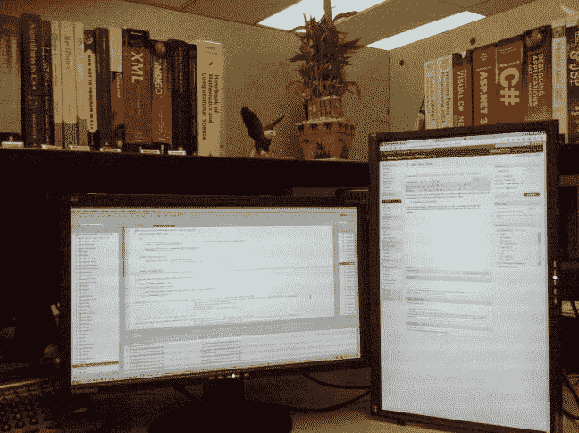

# 像素猪，我自己买的显示器

> 原文：<https://simpleprogrammer.com/bought-my-own-monitors/>

我现在工作的合同为我提供了一台工作站和两台显示器，但我刚刚用自己的钱买了两台显示器…为什么？

> 这都是像素的问题，宝贝

如果你使用小于 1920×1080 的双屏，你会降低自己的工作效率。显示器现在非常便宜，我可以用 270 美元买到两台 1920×1080 的显示器。

想想你工作时在显示器前花了多少时间。拥有更多屏幕空间真的不值得花 270 美元吗？但是接下来你会说，“我不应该把自己的钱花在能让我工作更有效率的东西上。”我说[“你购买并阅读软件开发书籍吗？”](https://simpleprogrammer.com/2009/12/08/great-developers-are-librarians/)。现在，我不是说雇主不应该[提供最好的工具。我想说的是，如果他们不愿意或者他们不理解额外 800 像素的价值，那么如果你不自己购买工具，你就是在欺骗自己。](http://www.joelonsoftware.com/articles/fog0000000043.html)

我承认我等了一段时间才真正自己去买。我曾考虑以每台 250 美元的价格购买两台 24 英寸、1900×1200 的显示器(我仍然认为这笔钱花得值)，但当我看到 270 美元的两台 1920x1080s 被售出时，我再也没有理由不采取行动了。

这是我目前的设置:

您可以在这里看到，我实际上已经将一台显示器翻转过来。我发现这种设置是最理想的，因为网页和文档通常在垂直方向上看效果最好，而其他媒体则受益于水平方向。如果你还没有试过把一个宽屏翻转过来，我强烈推荐你试一个星期，看看你是否喜欢它。不用向下滚动页面真是太好了。